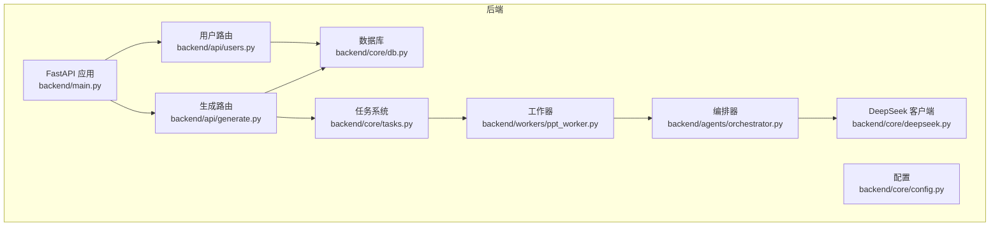
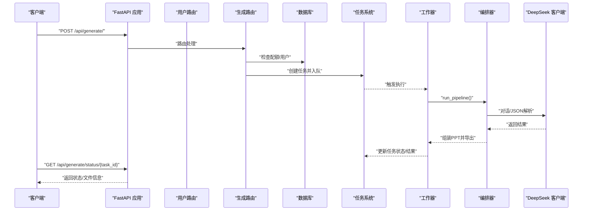
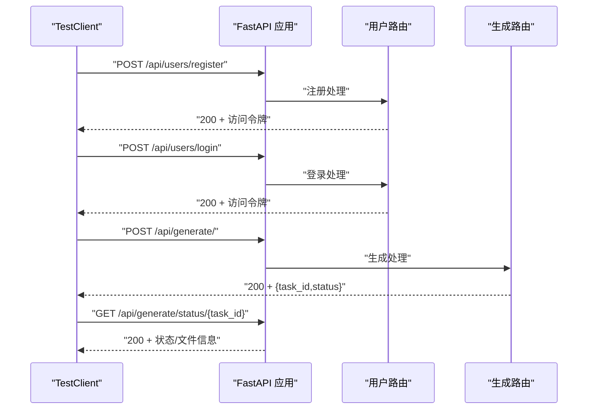
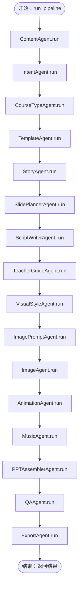
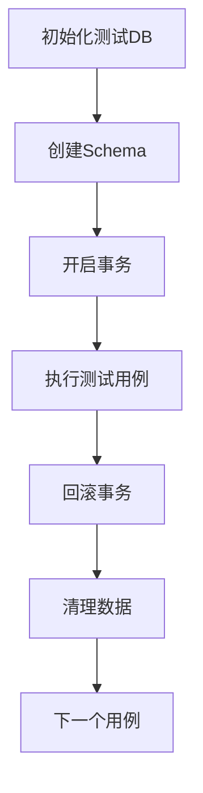
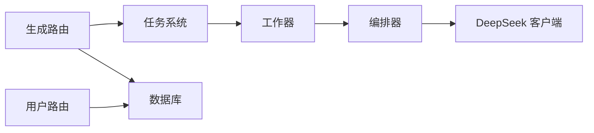

# 测试指南

<cite>
**本文引用的文件**
- [backend/main.py](file://backend/main.py)
- [backend/api/generate.py](file://backend/api/generate.py)
- [backend/api/users.py](file://backend/api/users.py)
- [backend/core/db.py](file://backend/core/db.py)
- [backend/core/config.py](file://backend/core/config.py)
- [backend/models/user.py](file://backend/models/user.py)
- [backend/core/deepseek.py](file://backend/core/deepseek.py)
- [backend/agents/orchestrator.py](file://backend/agents/orchestrator.py)
- [backend/core/tasks.py](file://backend/core/tasks.py)
- [backend/workers/ppt_worker.py](file://backend/workers/ppt_worker.py)
- [backend/requirements.txt](file://backend/requirements.txt)
</cite>

## 目录
1. [引言](#引言)
2. [项目结构](#项目结构)
3. [核心组件](#核心组件)
4. [架构总览](#架构总览)
5. [详细组件分析](#详细组件分析)
6. [依赖分析](#依赖分析)
7. [性能考虑](#性能考虑)
8. [故障排查指南](#故障排查指南)
9. [结论](#结论)
10. [附录](#附录)

## 引言
本测试指南面向AI-PPT项目的全栈测试实践，覆盖后端FastAPI应用、AI代理流水线、数据库与任务系统、以及前端组件测试策略。文档提供pytest与HTTP客户端测试方法、Mock与外部API模拟、异步函数与任务队列测试、数据库事务与数据清理、性能与负载测试、CI中的测试自动化配置建议，以及测试覆盖率与质量门禁标准。

## 项目结构
后端采用FastAPI + SQLAlchemy异步ORM + Redis/Celery任务队列（依赖项中可见）的分层架构；AI代理通过编排器串联多个子代理完成PPT生成；前端基于Vite + React，使用自定义API客户端进行交互。

图示来源
- [backend/main.py:16-40](file://backend/main.py#L16-L40)
- [backend/api/users.py:11-75](file://backend/api/users.py#L11-L75)
- [backend/api/generate.py:11-52](file://backend/api/generate.py#L11-L52)
- [backend/core/db.py:1-27](file://backend/core/db.py#L1-L27)
- [backend/core/tasks.py:1-33](file://backend/core/tasks.py#L1-L33)
- [backend/workers/ppt_worker.py:1-24](file://backend/workers/ppt_worker.py#L1-L24)
- [backend/agents/orchestrator.py:19-56](file://backend/agents/orchestrator.py#L19-L56)
- [backend/core/deepseek.py:1-40](file://backend/core/deepseek.py#L1-L40)

章节来源
- [backend/main.py:16-40](file://backend/main.py#L16-L40)
- [backend/requirements.txt:1-22](file://backend/requirements.txt#L1-L22)

## 核心组件
- FastAPI应用与生命周期：应用在启动时初始化数据库，并注册用户、账单、模板、生成、下载等路由。
- 用户认证与会话：用户注册/登录、JWT令牌签发、当前用户查询。
- 生成流程与任务系统：校验配额、创建任务、异步执行、状态轮询。
- 数据库与模型：异步引擎、会话管理、用户表结构。
- AI代理编排：内容、意图、课程类型、故事、幻灯片规划、脚本、教师指导、视觉风格、图片提示、图片、动画、音乐、拼装、QA与导出。
- 外部服务：DeepSeek对话与JSON解析。

章节来源
- [backend/main.py:10-40](file://backend/main.py#L10-L40)
- [backend/api/users.py:14-75](file://backend/api/users.py#L14-L75)
- [backend/api/generate.py:14-52](file://backend/api/generate.py#L14-L52)
- [backend/core/db.py:13-27](file://backend/core/db.py#L13-L27)
- [backend/models/user.py:6-21](file://backend/models/user.py#L6-L21)
- [backend/agents/orchestrator.py:19-56](file://backend/agents/orchestrator.py#L19-L56)
- [backend/core/deepseek.py:9-40](file://backend/core/deepseek.py#L9-L40)

## 架构总览
下图展示从HTTP请求到AI代理执行再到结果返回的关键路径，以及数据库与任务系统的交互。

图示来源
- [backend/api/generate.py:20-52](file://backend/api/generate.py#L20-L52)
- [backend/core/tasks.py:14-33](file://backend/core/tasks.py#L14-L33)
- [backend/workers/ppt_worker.py:5-24](file://backend/workers/ppt_worker.py#L5-L24)
- [backend/agents/orchestrator.py:19-56](file://backend/agents/orchestrator.py#L19-L56)
- [backend/core/deepseek.py:9-40](file://backend/core/deepseek.py#L9-L40)

## 详细组件分析

### 单元测试与pytest使用
- 测试组织
  - 使用pytest作为测试运行器，按功能模块划分测试目录（如tests/backend/test_api、tests/backend/test_agents）。
  - 使用conftest.py统一fixture（如数据库会话、认证头、测试配置）。
- 断言与参数化
  - 使用pytest.mark.parametrize对输入边界与异常场景进行参数化测试。
  - 使用assert与HTTP客户端响应断言（status_code、JSON键值、结构）。
- 异步测试
  - 在pytest中使用标记asyncio或直接在协程中编写测试，确保事件循环正确。
- Mock与外部依赖
  - 使用unittest.mock.patch或pytest-mock对HTTP客户端、数据库会话、任务存储进行替换。
  - 对外部API（DeepSeek）使用HTTPX的AsyncClient进行Mock或使用HTTP/HTTPS Mock服务器。

章节来源
- [backend/requirements.txt:1-22](file://backend/requirements.txt#L1-L22)

### API接口测试策略
- FastAPI应用测试
  - 使用TestClient加载应用，注入测试配置（如测试数据库URL），关闭生产敏感中间件。
  - 路由验证：对每个路由进行正向与负向用例（缺失字段、格式错误、权限不足、配额限制）。
  - 响应断言：断言状态码、响应体结构、JWT令牌有效性、任务ID格式。
- 用户路由测试要点
  - 注册：重复用户名/邮箱、弱口令、数据库冲突。
  - 登录：错误凭据、账户锁定状态（若扩展）。
  - 当前用户：未登录访问、过期令牌。
- 生成路由测试要点
  - 主题长度校验、模板ID/页数可选性。
  - 配额限制：免费/付费用户上限、重置逻辑。
  - 任务状态轮询：不存在的任务、未完成任务、完成后的下载标志。
- 健康检查
  - GET /api/health：返回应用名、版本、状态。

图示来源
- [backend/api/users.py:34-75](file://backend/api/users.py#L34-L75)
- [backend/api/generate.py:20-52](file://backend/api/generate.py#L20-L52)
- [backend/main.py:37-40](file://backend/main.py#L37-L40)

章节来源
- [backend/api/users.py:14-75](file://backend/api/users.py#L14-L75)
- [backend/api/generate.py:14-52](file://backend/api/generate.py#L14-L52)
- [backend/main.py:37-40](file://backend/main.py#L37-L40)

### AI代理模块测试方法
- 编排器测试
  - 使用Mock替换各子代理的run方法，控制返回值，验证编排器的顺序与组合逻辑。
  - 对异常分支进行测试：任一代理失败时的错误传播与返回结构。
- 异步函数测试
  - 使用pytest-asyncio标记，对run_pipeline与各代理的异步方法进行并发与顺序测试。
- 外部API调用模拟
  - Mock DeepSeek客户端，分别测试正常JSON回复、非JSON回复、超时与HTTP错误。
  - 验证JSON解析清理逻辑（去除代码块标记）与异常抛出。
- 错误处理测试
  - 模拟网络异常、空响应、无效JSON，验证上层捕获与降级策略。

图示来源
- [backend/agents/orchestrator.py:19-56](file://backend/agents/orchestrator.py#L19-L56)

章节来源
- [backend/agents/orchestrator.py:19-56](file://backend/agents/orchestrator.py#L19-L56)
- [backend/core/deepseek.py:9-40](file://backend/core/deepseek.py#L9-L40)

### 前端组件测试（React Testing Library）
- 组件渲染与交互
  - 使用render与screen断言DOM元素存在与文本内容；模拟用户点击、输入、选择等操作。
  - 对受控组件（表单）进行值变更与提交流程测试。
- 状态与副作用
  - 使用Mock拦截API客户端请求，断言请求参数与响应处理。
  - 测试加载态、错误态与成功态UI表现。
- 路由与导航
  - 使用MemoryRouter包装组件，验证路由变化与页面切换。
- 最佳实践
  - 避免测试实现细节，关注用户可见行为。
  - 将Mock集中于setup文件，减少重复。

（本节为通用测试方法说明，不直接分析具体源码文件）

### 数据库测试策略
- 测试数据库设置
  - 使用独立的测试数据库URL（例如SQLite内存库或专用测试库），在测试前初始化Schema。
- 事务回滚与隔离
  - 使用异步会话在每个测试用例前后回滚，保证用例间隔离。
  - 对批量插入与复杂查询，使用较小数据集与明确断言。
- 数据清理
  - 在fixture中清理测试数据，避免跨测试污染。
- 模型与依赖
  - 在测试中注入mock的数据库引擎与会话，避免真实连接。

图示来源
- [backend/core/db.py:21-27](file://backend/core/db.py#L21-L27)
- [backend/models/user.py:6-21](file://backend/models/user.py#L6-L21)

章节来源
- [backend/core/db.py:13-27](file://backend/core/db.py#L13-L27)
- [backend/models/user.py:6-21](file://backend/models/user.py#L6-L21)

### 性能测试与负载测试
- 接口性能
  - 使用locust或pytest-benchmark对生成接口进行并发请求，观察响应时间与错误率。
  - 关注任务队列吞吐量与工作器执行延迟。
- AI代理性能
  - 对DeepSeek调用进行限速与重试策略测试，评估整体生成耗时。
- 资源监控
  - 监控CPU、内存、数据库连接池与Redis队列长度。
- 基准与回归
  - 建立基准指标，纳入CI质量门禁。

（本节为通用测试方法说明，不直接分析具体源码文件）

### 持续集成中的测试自动化
- 测试环境
  - 在CI中使用独立的测试数据库与配置文件，避免污染主库。
- 运行策略
  - 并行执行单元测试与API测试；对前端组件测试单独阶段运行。
  - 对性能测试与负载测试在夜间或PR检查中选择性运行。
- 覆盖率与质量门禁
  - 设置覆盖率阈值（如语句/分支/函数/行≥80%），失败即阻断合并。
  - 对关键模块（API、编排器、任务系统）提升阈值。

（本节为通用测试方法说明，不直接分析具体源码文件）

## 依赖分析
- 外部依赖与测试相关性
  - FastAPI/SQLAlchemy/Pydantic：用于构建与测试API与模型。
  - httpx：用于外部HTTP调用的测试与Mock。
  - redis/celery：用于任务系统测试（可使用本地Redis或Mock）。
  - bcrypt/jwt：用于认证测试（生成/验证令牌）。
- 内部模块耦合
  - 生成路由依赖任务系统与订阅检查；任务系统依赖工作器；工作器依赖编排器；编排器依赖DeepSeek客户端。
  - 数据库会话通过依赖注入贯穿用户与生成路由。

图示来源
- [backend/api/generate.py:20-52](file://backend/api/generate.py#L20-L52)
- [backend/core/tasks.py:14-33](file://backend/core/tasks.py#L14-L33)
- [backend/workers/ppt_worker.py:5-24](file://backend/workers/ppt_worker.py#L5-L24)
- [backend/agents/orchestrator.py:19-56](file://backend/agents/orchestrator.py#L19-L56)
- [backend/core/deepseek.py:9-40](file://backend/core/deepseek.py#L9-L40)

章节来源
- [backend/requirements.txt:1-22](file://backend/requirements.txt#L1-L22)

## 性能考虑
- 异步I/O与并发
  - 使用异步数据库会话与HTTP客户端，避免阻塞；在测试中模拟慢响应以验证超时与重试。
- 任务队列与背压
  - 控制并发工作器数量，防止资源争用；对任务状态查询进行限流。
- 缓存与外部依赖
  - 对外部API增加缓存与指数退避；在测试中固定Mock响应以稳定性能指标。

（本节为通用测试方法说明，不直接分析具体源码文件）

## 故障排查指南
- 常见问题定位
  - 401/403：检查JWT生成与校验、依赖注入的当前用户。
  - 429：检查订阅配额与每日重置逻辑。
  - 404：检查任务ID是否正确传递与存储。
  - 5xx：检查工作器异常捕获与错误回传。
- 日志与追踪
  - 在工作器中打印异常堆栈，便于定位代理链路中的失败节点。
- 数据一致性
  - 在测试中验证数据库写入与会话刷新时机，避免读取脏数据。

章节来源
- [backend/api/generate.py:26-35](file://backend/api/generate.py#L26-L35)
- [backend/workers/ppt_worker.py:20-24](file://backend/workers/ppt_worker.py#L20-L24)

## 结论
本指南提供了从后端API、AI代理、数据库到前端组件的完整测试策略与实施建议。通过pytest与HTTP客户端测试、Mock与外部依赖模拟、异步与任务系统测试、数据库事务与清理、性能与负载测试，以及CI中的自动化与质量门禁，可有效保障AI-PPT系统的稳定性与可靠性。

## 附录
- 测试覆盖率与质量门禁建议
  - 语句覆盖率：≥80%，关键模块≥90%
  - 分支覆盖率：≥75%，关键模块≥85%
  - 函数/行覆盖率：≥80%
  - 门禁规则：低于阈值的PR需修复或获得例外批准

（本节为通用测试方法说明，不直接分析具体源码文件）