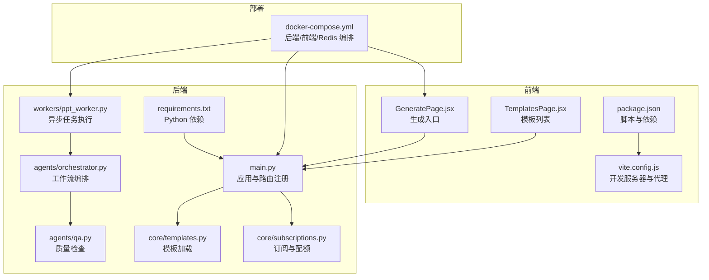
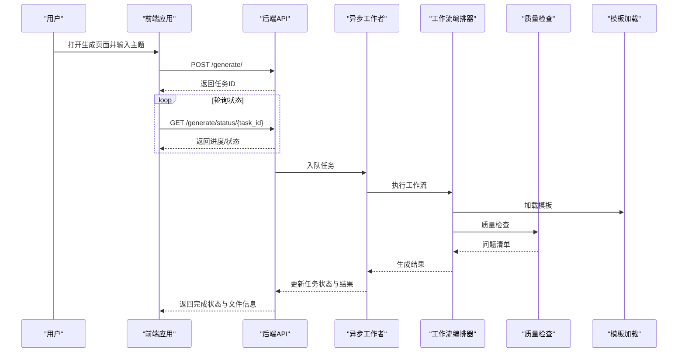
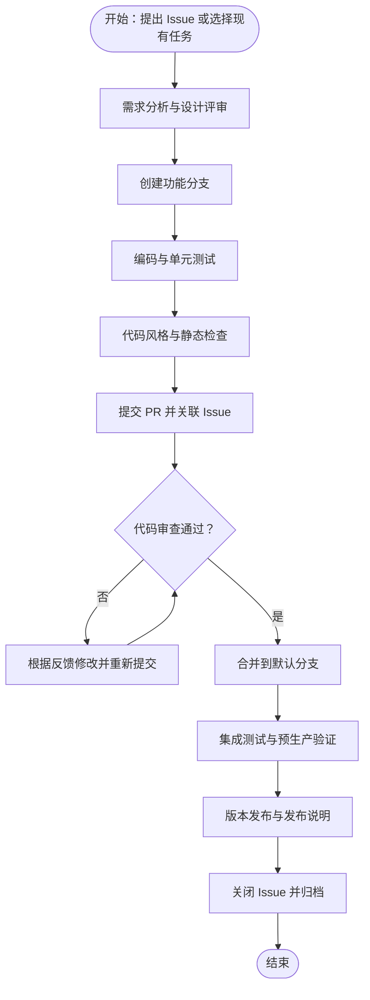
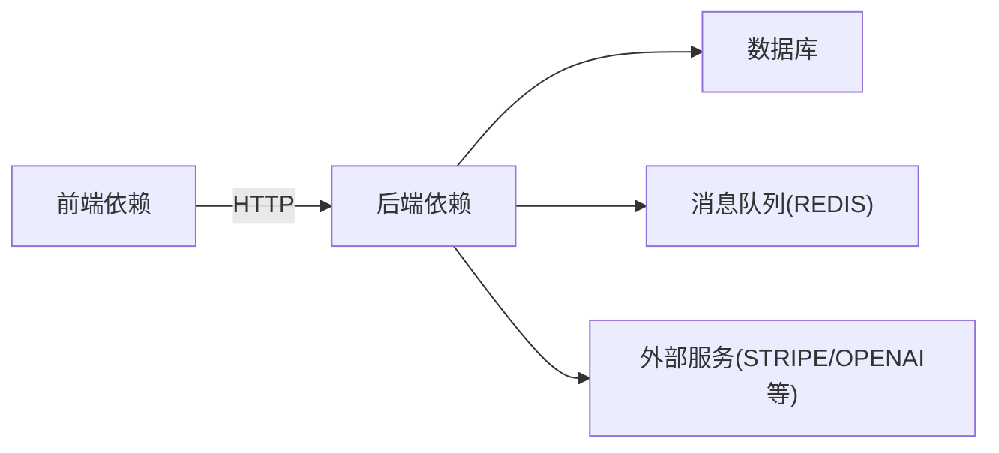

# 贡献流程

<cite>
**本文引用的文件**
- [backend/main.py](file://backend/main.py)
- [backend/requirements.txt](file://backend/requirements.txt)
- [frontend/package.json](file://frontend/package.json)
- [frontend/vite.config.js](file://frontend/vite.config.js)
- [deployment/docker-compose.yml](file://deployment/docker-compose.yml)
- [backend/agents/orchestrator.py](file://backend/agents/orchestrator.py)
- [backend/workers/ppt_worker.py](file://backend/workers/ppt_worker.py)
- [backend/agents/qa.py](file://backend/agents/qa.py)
- [backend/core/templates.py](file://backend/core/templates.py)
- [frontend/src/pages/GeneratePage.jsx](file://frontend/src/pages/GeneratePage.jsx)
- [frontend/src/pages/TemplatesPage.jsx](file://frontend/src/pages/TemplatesPage.jsx)
- [backend/core/subscriptions.py](file://backend/core/subscriptions.py)
</cite>

## 目录
1. 引言
2. 项目结构
3. 核心组件
4. 架构总览
5. 详细组件分析
6. 依赖分析
7. 性能考虑
8. 故障排查指南
9. 结论
10. 附录

## 引言
本指南面向所有希望参与 AI-PPT 项目的贡献者，系统化地定义从需求到代码合并的完整贡献生命周期，涵盖 Git 工作流、Fork/Pull Request 流程、Issue 报告规范、文档与版本发布流程、以及社区行为与沟通规范。本指南同时给出新成员入门建议与常见问题排查方法，帮助团队高效协作、保证质量与可维护性。

## 项目结构
AI-PPT 采用前后端分离架构：前端使用 React/Vite，后端基于 FastAPI，通过 Celery/Redis 进行异步任务编排，模板与资源通过 Docker Compose 统一编排部署。核心模块包括：
- 后端服务：FastAPI 应用、API 路由、数据库与配置、订阅与计费、模板加载、任务队列与导出
- 前端应用：React 页面组件、API 客户端、路由与构建配置
- 部署与运行：Docker Compose 编排后端、前端与 Redis

图表来源
- [backend/main.py:1-40](file://backend/main.py#L1-L40)
- [backend/requirements.txt:1-22](file://backend/requirements.txt#L1-L22)
- [frontend/package.json:1-26](file://frontend/package.json#L1-L26)
- [frontend/vite.config.js:1-9](file://frontend/vite.config.js#L1-L9)
- [deployment/docker-compose.yml:1-46](file://deployment/docker-compose.yml#L1-L46)
- [backend/agents/orchestrator.py:1-25](file://backend/agents/orchestrator.py#L1-L25)
- [backend/workers/ppt_worker.py:1-23](file://backend/workers/ppt_worker.py#L1-L23)
- [backend/agents/qa.py:1-27](file://backend/agents/qa.py#L1-L27)
- [backend/core/templates.py:1-19](file://backend/core/templates.py#L1-L19)
- [frontend/src/pages/GeneratePage.jsx:1-43](file://frontend/src/pages/GeneratePage.jsx#L1-L43)
- [frontend/src/pages/TemplatesPage.jsx:1-17](file://frontend/src/pages/TemplatesPage.jsx#L1-L17)
- [backend/core/subscriptions.py:1-57](file://backend/core/subscriptions.py#L1-L57)

章节来源
- [backend/main.py:1-40](file://backend/main.py#L1-L40)
- [backend/requirements.txt:1-22](file://backend/requirements.txt#L1-L22)
- [frontend/package.json:1-26](file://frontend/package.json#L1-L26)
- [frontend/vite.config.js:1-9](file://frontend/vite.config.js#L1-L9)
- [deployment/docker-compose.yml:1-46](file://deployment/docker-compose.yml#L1-L46)

## 核心组件
- 应用入口与路由
  - 后端通过 FastAPI 注册用户、账单、模板、生成与下载等路由，并在启动时初始化数据库。
  - 前端通过 Vite 提供开发服务器与代理，将 /api 请求转发至后端服务。
- 生成工作流
  - 生成页面触发后端任务，异步工作者执行工作流编排器，最终产出结果并通过轮询获取状态。
- 模板与订阅
  - 模板从本地 JSON 加载；订阅与每日配额控制访问权限与功能可用性。
- 质量检查
  - QA 智能体对生成的 PPT 数据进行结构与内容校验，输出问题清单。

章节来源
- [backend/main.py:1-40](file://backend/main.py#L1-L40)
- [frontend/vite.config.js:1-9](file://frontend/vite.config.js#L1-L9)
- [frontend/src/pages/GeneratePage.jsx:1-43](file://frontend/src/pages/GeneratePage.jsx#L1-L43)
- [backend/agents/orchestrator.py:1-25](file://backend/agents/orchestrator.py#L1-L25)
- [backend/workers/ppt_worker.py:1-23](file://backend/workers/ppt_worker.py#L1-L23)
- [backend/core/templates.py:1-19](file://backend/core/templates.py#L1-L19)
- [backend/core/subscriptions.py:1-57](file://backend/core/subscriptions.py#L1-L57)
- [backend/agents/qa.py:1-27](file://backend/agents/qa.py#L1-L27)

## 架构总览
下图展示从前端到后端、再到任务队列与资源的端到端交互：

图表来源
- [frontend/src/pages/GeneratePage.jsx:19-43](file://frontend/src/pages/GeneratePage.jsx#L19-L43)
- [backend/workers/ppt_worker.py:5-23](file://backend/workers/ppt_worker.py#L5-L23)
- [backend/agents/orchestrator.py:19-25](file://backend/agents/orchestrator.py#L19-L25)
- [backend/agents/qa.py:8-27](file://backend/agents/qa.py#L8-L27)
- [backend/core/templates.py:7-19](file://backend/core/templates.py#L7-L19)

## 详细组件分析

### Git 工作流与分支管理
- 分支命名规范
  - 功能开发：feature/模块名/简述
  - 修复缺陷：fix/模块名/简述
  - 文档更新：docs/模块名/简述
  - 热修复：hotfix/版本号/简述
  - 重构：refactor/模块名/简述
- 提交信息格式
  - 标题：类型(模块): 简要描述
  - 正文：动机、影响范围、兼容性说明
  - 关联 Issue：Closes #编号 或 Related to #编号
- 合并策略
  - 使用 Squash Merge 合并 Pull Request，确保提交历史整洁
  - 合并前必须通过 CI 与代码审查

### Fork 与 Pull Request 流程
- Fork 仓库到个人账户
- 在本地创建功能分支并提交
- 发起 PR 至主仓库默认分支，填写 PR 模板
- 代码审查至少一名维护者同意，无阻塞问题
- 合并后清理远程与本地分支

### 代码审查标准
- 可读性：变量与函数命名清晰，注释必要且准确
- 正确性：覆盖边界条件与异常路径
- 性能：避免不必要的计算与 I/O，关注并发与缓存
- 安全：输入校验、最小权限原则、敏感信息不硬编码
- 兼容性：接口变更需向后兼容或明确迁移指引

### Issue 报告规范
- Bug 报告
  - 复现步骤、期望结果、实际结果、环境信息（浏览器/Node/FastAPI 版本）
  - 截图或最小复现示例
- 功能请求
  - 背景与动机、预期行为、验收标准、优先级
- 讨论与追踪
  - 使用标签分类（bug/feature/enhancement/documentation），分配里程碑与负责人

### 代码贡献生命周期

### 文档更新要求
- README 更新：新增/变更功能需同步 README 的功能列表、安装与运行说明
- API 文档：后端新增/变更接口需补充 OpenAPI/Swagger 注解与示例
- 变更日志：记录重大变更、破坏性更新、安全修复与性能改进，按语义化版本维护

### 版本发布流程
- 标签创建：遵循语义化版本（MAJOR.MINOR.PATCH），在合并后的提交上打标签
- 版本号管理：MAJOR 表示破坏性变更，MINOR 表示新增兼容功能，PATCH 表示兼容修复
- 发布说明：列出主要特性、修复、已知问题与升级指引，附带链接到变更日志
- 部署：通过 Docker Compose 或 CI/CD 自动化部署到测试与生产环境

### 社区行为准则与沟通规范
- 尊重与包容：禁止歧视、骚扰与攻击性言论
- 建设性反馈：聚焦问题与解决方案，避免人身攻击
- 透明沟通：在 Issue/PR 中公开讨论，私有敏感信息另行沟通
- 快速响应：维护者及时处理反馈，贡献者保持积极协作

### 新成员入门指导
- 环境搭建：安装 Node、Python、Docker，克隆仓库，按 package.json 与 requirements.txt 安装依赖
- 开发运行：使用 Vite 启动前端，使用 uvicorn 启动后端，或使用 docker-compose 一键启动
- 调试技巧：利用浏览器开发者工具与后端日志，结合轮询接口调试生成流程
- 第一次贡献：从 good first issue 或 help wanted 标签的任务开始，遵循上述流程

章节来源
- [frontend/package.json:1-26](file://frontend/package.json#L1-L26)
- [backend/requirements.txt:1-22](file://backend/requirements.txt#L1-L22)
- [deployment/docker-compose.yml:1-46](file://deployment/docker-compose.yml#L1-L46)
- [frontend/vite.config.js:1-9](file://frontend/vite.config.js#L1-L9)
- [backend/main.py:1-40](file://backend/main.py#L1-L40)

## 依赖分析
- 前端依赖
  - React 生态与 Vite 构建工具链，Axios 用于 API 调用，TailwindCSS 与 PostCSS 用于样式
- 后端依赖
  - FastAPI/Uvicorn 提供 Web 服务，SQLAlchemy/Alembic 管理数据库，Celery/Redis 实现异步任务，Stripe 用于支付
- 部署依赖
  - Docker Compose 编排后端、前端与 Redis，共享卷存放输出与数据

图表来源
- [frontend/package.json:11-24](file://frontend/package.json#L11-L24)
- [backend/requirements.txt:1-22](file://backend/requirements.txt#L1-L22)

章节来源
- [frontend/package.json:1-26](file://frontend/package.json#L1-L26)
- [backend/requirements.txt:1-22](file://backend/requirements.txt#L1-L22)

## 性能考虑
- 异步任务：使用 Celery 与 Redis 解耦耗时操作，避免阻塞请求线程
- 轮询优化：前端轮询间隔应合理设置，避免过度请求；后端可考虑 SSE 或 WebSocket 降低延迟
- 模板与资源：模板与媒体资源尽量缓存，减少重复 I/O
- 数据库：合理索引与连接池配置，避免 N+1 查询
- 前端构建：生产构建开启压缩与 Tree Shaking，按需加载模块

## 故障排查指南
- 无法访问后端 API
  - 检查 Vite 代理配置是否指向正确的后端端口
  - 确认后端 CORS 设置允许前端源
- 生成任务未执行
  - 检查 Redis 是否正常运行，Celery worker 是否启动
  - 查看工作者日志与任务状态
- 模板加载失败
  - 确认模板 JSON 文件存在且格式正确
  - 检查模板 ID 是否匹配
- 订阅限制导致功能不可用
  - 核对用户层级与每日配额，确认计费状态
- 质量检查失败
  - 查看 QA 输出的问题清单，逐项修复

章节来源
- [frontend/vite.config.js:6](file://frontend/vite.config.js#L6)
- [backend/main.py:22-28](file://backend/main.py#L22-L28)
- [deployment/docker-compose.yml:31-39](file://deployment/docker-compose.yml#L31-L39)
- [backend/workers/ppt_worker.py:10-23](file://backend/workers/ppt_worker.py#L10-L23)
- [backend/core/templates.py:7-19](file://backend/core/templates.py#L7-L19)
- [backend/core/subscriptions.py:46-57](file://backend/core/subscriptions.py#L46-L57)
- [backend/agents/qa.py:8-27](file://backend/agents/qa.py#L8-L27)

## 结论
本指南提供了从需求到发布的完整贡献流程与最佳实践，强调规范化的工作流、严格的代码审查与完善的文档与发布流程。请所有贡献者严格遵循，共同提升项目质量与协作效率。

## 附录
- 快速检查清单
  - 提交前完成单元测试与本地集成测试
  - 更新相关文档与变更日志
  - 通过代码风格与静态检查
  - 在 PR 描述中明确变更动机与影响范围
- 常用命令参考
  - 前端：npm run dev/build/preview
  - 后端：uvicorn main:app --reload
  - 部署：docker-compose up -d