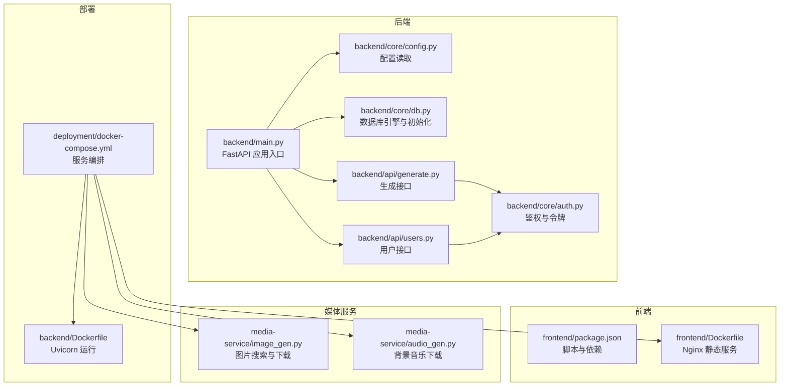
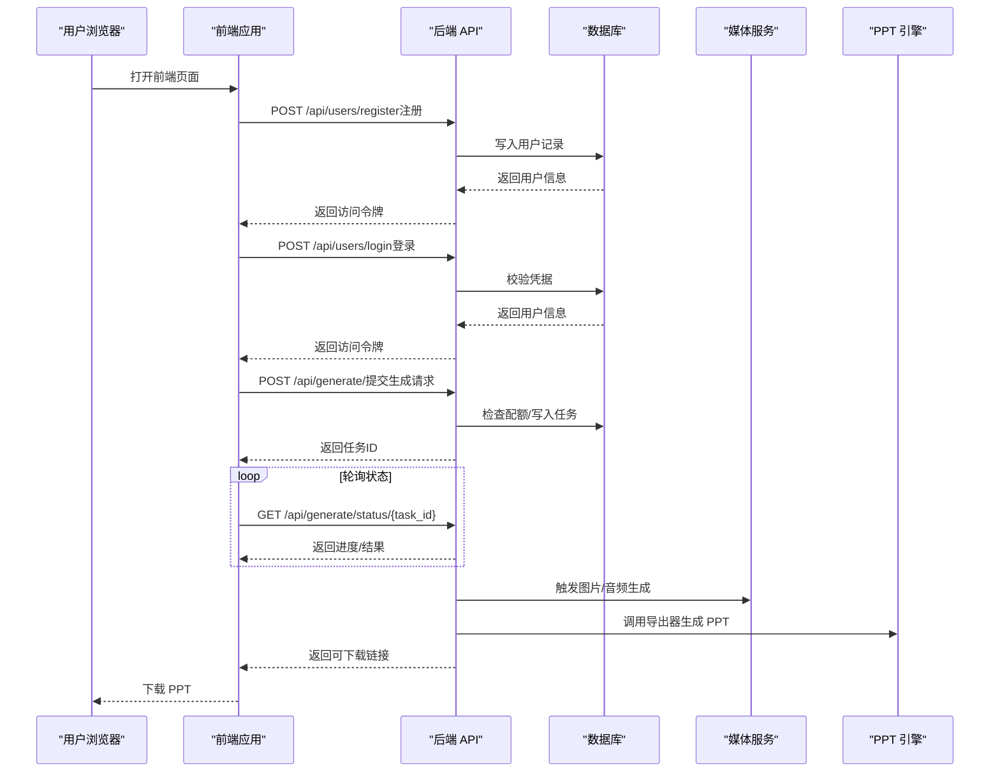
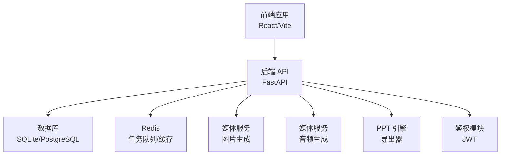
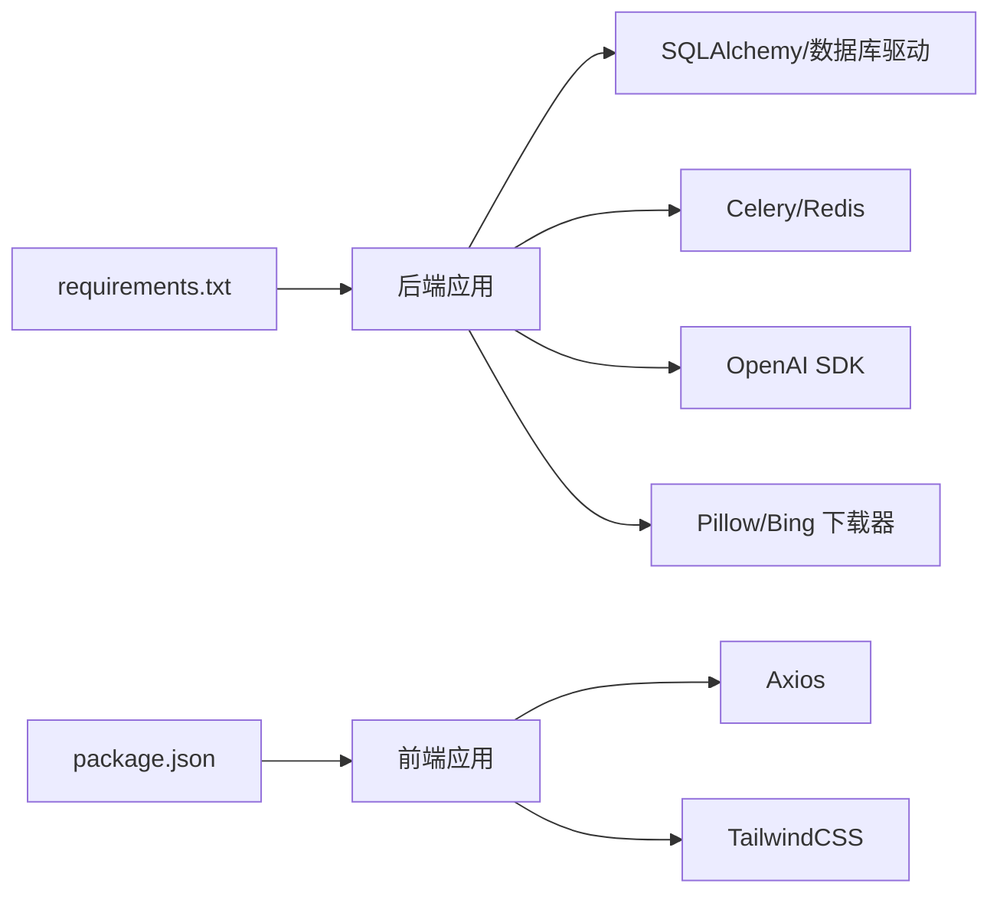

# 快速开始

<cite>
**本文引用的文件**
- [backend/main.py](file://backend/main.py)
- [backend/requirements.txt](file://backend/requirements.txt)
- [backend/core/config.py](file://backend/core/config.py)
- [backend/core/db.py](file://backend/core/db.py)
- [backend/Dockerfile](file://backend/Dockerfile)
- [deployment/docker-compose.yml](file://deployment/docker-compose.yml)
- [frontend/package.json](file://frontend/package.json)
- [frontend/Dockerfile](file://frontend/Dockerfile)
- [media-service/image_gen.py](file://media-service/image_gen.py)
- [media-service/audio_gen.py](file://media-service/audio_gen.py)
- [backend/api/generate.py](file://backend/api/generate.py)
- [backend/api/users.py](file://backend/api/users.py)
- [backend/core/auth.py](file://backend/core/auth.py)
</cite>

## 目录
1. [简介](#简介)
2. [项目结构](#项目结构)
3. [前置条件与环境准备](#前置条件与环境准备)
4. [克隆与依赖安装](#克隆与依赖安装)
5. [数据库初始化](#数据库初始化)
6. [配置文件设置](#配置文件设置)
7. [本地开发环境启动](#本地开发环境启动)
8. [首次使用全流程示例](#首次使用全流程示例)
9. [架构概览](#架构概览)
10. [组件详解](#组件详解)
11. [依赖关系分析](#依赖关系分析)
12. [性能与资源建议](#性能与资源建议)
13. [故障排除](#故障排除)
14. [结语](#结语)

## 简介
本指南面向首次接触 AI-PPT 的开发者与使用者，帮助你在本地快速完成环境搭建、依赖安装、数据库初始化与服务启动，并提供从用户注册到生成第一个 PPT 的完整操作流程。同时涵盖配置项说明、常见问题排查以及系统架构概览，便于你理解各模块职责与数据流转。

## 项目结构
AI-PPT 采用前后端分离与容器化部署思路：后端为 FastAPI 应用，负责认证、业务逻辑与任务调度；前端为 React/Vite 应用，提供可视化界面；媒体服务负责图片与背景音乐的生成；工程通过 Docker Compose 统一编排运行。

图表来源
- [backend/main.py:1-40](file://backend/main.py#L1-L40)
- [backend/core/config.py:1-34](file://backend/core/config.py#L1-L34)
- [backend/core/db.py:1-27](file://backend/core/db.py#L1-L27)
- [backend/api/generate.py:1-52](file://backend/api/generate.py#L1-L52)
- [backend/api/users.py:1-75](file://backend/api/users.py#L1-L75)
- [backend/core/auth.py:1-57](file://backend/core/auth.py#L1-L57)
- [deployment/docker-compose.yml:1-46](file://deployment/docker-compose.yml#L1-L46)
- [backend/Dockerfile:1-15](file://backend/Dockerfile#L1-L15)
- [frontend/Dockerfile:1-13](file://frontend/Dockerfile#L1-L13)
- [media-service/image_gen.py:1-26](file://media-service/image_gen.py#L1-L26)
- [media-service/audio_gen.py:1-34](file://media-service/audio_gen.py#L1-L34)

章节来源
- [backend/main.py:1-40](file://backend/main.py#L1-L40)
- [deployment/docker-compose.yml:1-46](file://deployment/docker-compose.yml#L1-L46)

## 前置条件与环境准备
- Python 3.9+：用于后端开发与运行。推荐使用 3.12（后端镜像已采用该版本）。  
  参考路径：[backend/Dockerfile:1](file://backend/Dockerfile#L1)
- Node.js 18+：用于前端构建与开发。  
  参考路径：[frontend/package.json:1-26](file://frontend/package.json#L1-L26)
- Docker 与 Docker Compose：用于一键编排后端、前端与 Redis。  
  参考路径：[deployment/docker-compose.yml:1-46](file://deployment/docker-compose.yml#L1-L46)
- Git：用于克隆仓库。  

章节来源
- [backend/Dockerfile:1-15](file://backend/Dockerfile#L1-L15)
- [frontend/package.json:1-26](file://frontend/package.json#L1-L26)
- [deployment/docker-compose.yml:1-46](file://deployment/docker-compose.yml#L1-L46)

## 克隆与依赖安装
- 克隆仓库  
  使用 Git 将项目克隆到本地目录。  
  参考路径：[deployment/docker-compose.yml:1-46](file://deployment/docker-compose.yml#L1-L46)
- 安装后端依赖  
  在后端根目录执行安装命令以拉取 Python 依赖。  
  参考路径：[backend/requirements.txt:1-22](file://backend/requirements.txt#L1-L22)
- 安装前端依赖  
  在前端根目录执行安装命令以拉取 Node 依赖。  
  参考路径：[frontend/package.json:1-26](file://frontend/package.json#L1-L26)

章节来源
- [backend/requirements.txt:1-22](file://backend/requirements.txt#L1-L22)
- [frontend/package.json:1-26](file://frontend/package.json#L1-L26)

## 数据库初始化
- 使用异步 SQLAlchemy 引擎创建数据库表结构。  
  初始化函数会在应用生命周期启动时调用，自动创建用户、PPT 记录与订阅相关表。  
  参考路径：[backend/core/db.py:21-27](file://backend/core/db.py#L21-L27)  
  启动入口会触发初始化流程。  
  参考路径：[backend/main.py:10-14](file://backend/main.py#L10-L14)

章节来源
- [backend/core/db.py:21-27](file://backend/core/db.py#L21-L27)
- [backend/main.py:10-14](file://backend/main.py#L10-L14)

## 配置文件设置
- 环境变量文件 .env（由配置类加载）  
  配置类会从 .env 文件读取键值，覆盖默认值。  
  参考路径：[backend/core/config.py:29-31](file://backend/core/config.py#L29-L31)
- 关键配置项说明  
  - API 密钥：DeepSeek 与 OpenAI 的 API Key（用于内容生成与图像检索）。  
    参考路径：[backend/core/config.py:8-9](file://backend/core/config.py#L8-L9)
  - 数据库连接：支持 SQLite/PostgreSQL，默认使用 SQLite 路径。  
    参考路径：[backend/core/config.py:11](file://backend/core/config.py#L11)
  - Redis 连接：Celery 与任务队列依赖。  
    参考路径：[backend/core/config.py:12](file://backend/core/config.py#L12)
  - JWT 密钥与过期时间：令牌签发与校验。  
    参考路径：[backend/core/config.py:14-16](file://backend/core/config.py#L14-L16)
  - Stripe 收费相关：可选配置，用于订阅计费。  
    参考路径：[backend/core/config.py:18-19](file://backend/core/config.py#L18-L19)
  - 输出与上传目录：PPT 输出与媒体资源存放路径。  
    参考路径：[backend/core/config.py:25-26](file://backend/core/config.py#L25-L26)
  - 代理地址：网络代理配置（如需）。  
    参考路径：[backend/core/config.py:27](file://backend/core/config.py#L27)

章节来源
- [backend/core/config.py:1-34](file://backend/core/config.py#L1-L34)

## 本地开发环境启动
- 方式一：使用 Docker Compose（推荐）  
  通过编排文件一键启动后端、前端与 Redis，并挂载输出与数据卷。  
  参考路径：[deployment/docker-compose.yml:1-46](file://deployment/docker-compose.yml#L1-L46)  
  - 后端服务：监听 8000 端口，使用 Uvicorn 运行 FastAPI 应用。  
    参考路径：[backend/Dockerfile:14](file://backend/Dockerfile#L14)
  - 前端服务：基于 Nginx 提供静态页面，监听 3000 端口。  
    参考路径：[frontend/Dockerfile:1-13](file://frontend/Dockerfile#L1-L13)
  - Redis：缓存与任务队列依赖。  
    参考路径：[deployment/docker-compose.yml:31-39](file://deployment/docker-compose.yml#L31-L39)
- 方式二：本地分别启动  
  - 启动后端 API 服务（FastAPI + Uvicorn）  
    参考路径：[backend/main.py:16-20](file://backend/main.py#L16-L20)  
    参考路径：[backend/Dockerfile:14](file://backend/Dockerfile#L14)
  - 启动前端开发服务器（Vite）  
    参考路径：[frontend/package.json:6-10](file://frontend/package.json#L6-L10)
  - 启动 Redis（任务队列与缓存）  
    参考路径：[deployment/docker-compose.yml:31-39](file://deployment/docker-compose.yml#L31-L39)

章节来源
- [deployment/docker-compose.yml:1-46](file://deployment/docker-compose.yml#L1-L46)
- [backend/Dockerfile:1-15](file://backend/Dockerfile#L1-L15)
- [frontend/Dockerfile:1-13](file://frontend/Dockerfile#L1-L13)
- [frontend/package.json:1-26](file://frontend/package.json#L1-L26)

## 首次使用全流程示例
以下流程从零开始，带你完成注册、登录、生成 PPT 并下载结果的全过程。

图表来源
- [backend/api/users.py:34-61](file://backend/api/users.py#L34-L61)
- [backend/api/generate.py:20-35](file://backend/api/generate.py#L20-L35)
- [backend/api/generate.py:38-51](file://backend/api/generate.py#L38-L51)
- [media-service/image_gen.py:19-26](file://media-service/image_gen.py#L19-L26)
- [media-service/audio_gen.py:12-34](file://media-service/audio_gen.py#L12-L34)

章节来源
- [backend/api/users.py:1-75](file://backend/api/users.py#L1-L75)
- [backend/api/generate.py:1-52](file://backend/api/generate.py#L1-L52)
- [media-service/image_gen.py:1-26](file://media-service/image_gen.py#L1-L26)
- [media-service/audio_gen.py:1-34](file://media-service/audio_gen.py#L1-L34)

## 架构概览
系统采用“前端 + 后端 + 媒体服务 + 缓存/队列”的分层设计。后端负责用户认证、生成任务调度与状态查询；媒体服务负责图片与音频素材准备；Redis 作为任务中间件；SQLite 存储用户与使用记录。

图表来源
- [backend/main.py:16-20](file://backend/main.py#L16-L20)
- [backend/core/db.py:5-6](file://backend/core/db.py#L5-L6)
- [backend/core/config.py:11-12](file://backend/core/config.py#L11-L12)
- [media-service/image_gen.py:19-26](file://media-service/image_gen.py#L19-L26)
- [media-service/audio_gen.py:12-34](file://media-service/audio_gen.py#L12-L34)

## 组件详解

### 用户与认证
- 注册与登录接口：接收用户名、邮箱与密码，返回访问令牌。  
  参考路径：[backend/api/users.py:34-61](file://backend/api/users.py#L34-L61)
- 密码哈希与校验：使用 bcrypt。  
  参考路径：[backend/core/auth.py:16-21](file://backend/core/auth.py#L16-L21)
- JWT 令牌签发与解码：配置算法与过期时间。  
  参考路径：[backend/core/auth.py:24-44](file://backend/core/auth.py#L24-L44)

章节来源
- [backend/api/users.py:1-75](file://backend/api/users.py#L1-L75)
- [backend/core/auth.py:1-57](file://backend/core/auth.py#L1-L57)

### 生成任务与状态轮询
- 提交生成请求：校验主题长度与配额，创建任务并返回任务 ID。  
  参考路径：[backend/api/generate.py:20-35](file://backend/api/generate.py#L20-L35)
- 查询任务状态：返回状态、文件名、下载标记与进度。  
  参考路径：[backend/api/generate.py:38-51](file://backend/api/generate.py#L38-L51)

章节来源
- [backend/api/generate.py:1-52](file://backend/api/generate.py#L1-L52)

### 媒体服务
- 图片生成：按幻灯片关键词调用下载器，批量异步抓取图片。  
  参考路径：[media-service/image_gen.py:6-26](file://media-service/image_gen.py#L6-L26)
- 背景音乐：随机选择曲目并下载至指定目录。  
  参考路径：[media-service/audio_gen.py:12-34](file://media-service/audio_gen.py#L12-L34)

章节来源
- [media-service/image_gen.py:1-26](file://media-service/image_gen.py#L1-L26)
- [media-service/audio_gen.py:1-34](file://media-service/audio_gen.py#L1-L34)

## 依赖关系分析
- 后端依赖：FastAPI、SQLAlchemy、asyncpg/aiosqlite、Celery/Redis、OpenAI、Pillow、Stripe 等。  
  参考路径：[backend/requirements.txt:1-22](file://backend/requirements.txt#L1-L22)
- 前端依赖：React、Axios、TailwindCSS、Vite 等。  
  参考路径：[frontend/package.json:11-24](file://frontend/package.json#L11-L24)

图表来源
- [backend/requirements.txt:1-22](file://backend/requirements.txt#L1-L22)
- [frontend/package.json:11-24](file://frontend/package.json#L11-L24)

章节来源
- [backend/requirements.txt:1-22](file://backend/requirements.txt#L1-L22)
- [frontend/package.json:1-26](file://frontend/package.json#L1-L26)

## 性能与资源建议
- 推荐使用 8GB+ 内存与多核 CPU，以便并发处理多个生成任务。
- Redis 与数据库应独立部署或使用云服务以提升稳定性。
- 图片与音频下载可能受网络影响，建议配置代理或 CDN。
- 生产环境请替换默认 JWT 密钥与数据库连接字符串。

## 故障排除
- 后端无法连接数据库  
  - 检查数据库 URL 与驱动是否匹配（SQLite/PostgreSQL）。  
    参考路径：[backend/core/config.py:11](file://backend/core/config.py#L11)
  - 确认初始化函数已执行。  
    参考路径：[backend/core/db.py:21-27](file://backend/core/db.py#L21-L27)
- Redis 连接失败  
  - 确认 Redis 服务已启动且端口映射正确。  
    参考路径：[deployment/docker-compose.yml:31-39](file://deployment/docker-compose.yml#L31-L39)
- 前端无法访问后端接口（跨域）  
  - CORS 已允许所有来源，若仍失败检查代理与反向代理配置。  
    参考路径：[backend/main.py:22-28](file://backend/main.py#L22-L28)
- 生成任务无响应  
  - 检查 Celery/Redis 是否正常，确认任务队列消费者已启动。  
    参考路径：[backend/core/config.py:12](file://backend/core/config.py#L12)
- 图片/音频下载失败  
  - 检查网络与代理设置，确保可访问外部资源。  
    参考路径：[backend/core/config.py:27](file://backend/core/config.py#L27)
- 登录失败或令牌无效  
  - 核对 JWT 密钥与算法配置，确保前后端一致。  
    参考路径：[backend/core/config.py:14-16](file://backend/core/config.py#L14-L16)

章节来源
- [backend/core/config.py:11-27](file://backend/core/config.py#L11-L27)
- [backend/core/db.py:21-27](file://backend/core/db.py#L21-L27)
- [backend/main.py:22-28](file://backend/main.py#L22-L28)
- [deployment/docker-compose.yml:31-39](file://deployment/docker-compose.yml#L31-L39)

## 结语
至此，你已完成 AI-PPT 的环境搭建、依赖安装、数据库初始化与服务启动，并掌握了从注册到生成 PPT 的完整流程。建议在生产环境中完善安全配置（如更换密钥、启用 HTTPS、限制 CORS），并结合监控与日志体系持续优化体验。