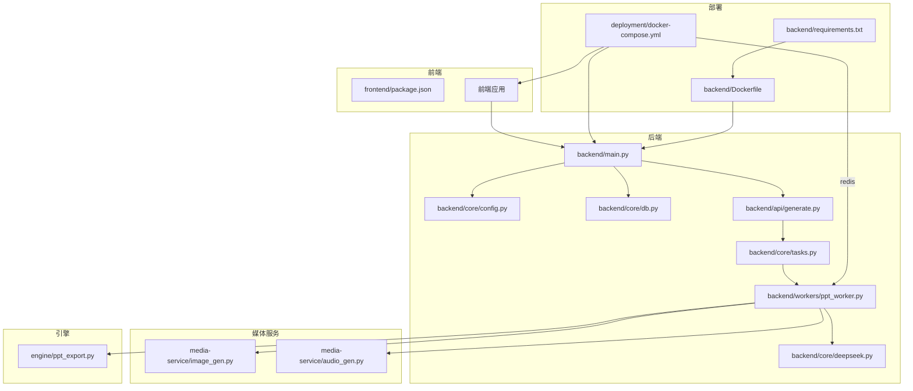
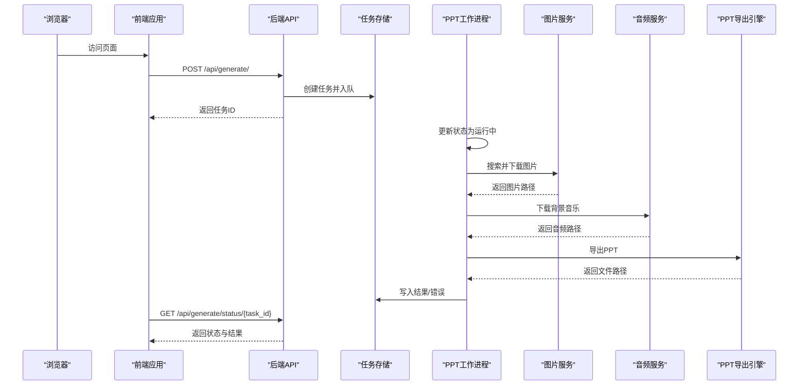
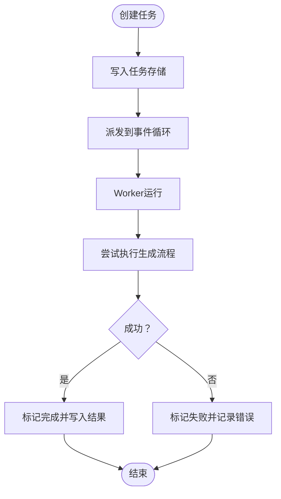
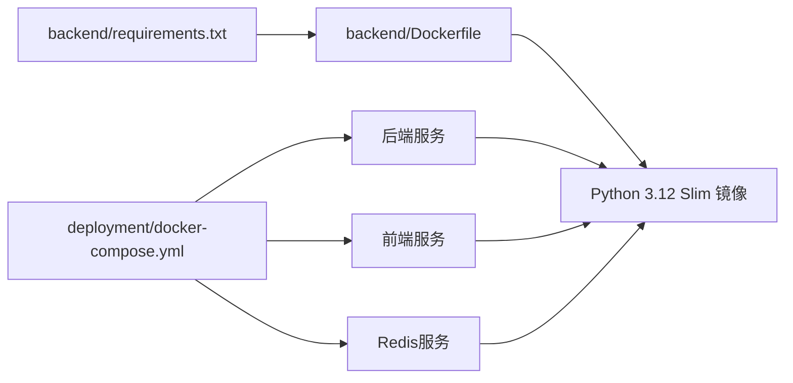

# 故障排除与FAQ

<cite>
**本文引用的文件**
- [backend/main.py](file://backend/main.py)
- [backend/core/config.py](file://backend/core/config.py)
- [backend/core/db.py](file://backend/core/db.py)
- [backend/core/tasks.py](file://backend/core/tasks.py)
- [backend/Dockerfile](file://backend/Dockerfile)
- [deployment/docker-compose.yml](file://deployment/docker-compose.yml)
- [backend/requirements.txt](file://backend/requirements.txt)
- [backend/workers/ppt_worker.py](file://backend/workers/ppt_worker.py)
- [backend/api/generate.py](file://backend/api/generate.py)
- [backend/core/deepseek.py](file://backend/core/deepseek.py)
- [media-service/image_gen.py](file://media-service/image_gen.py)
- [media-service/audio_gen.py](file://media-service/audio_gen.py)
- [engine/ppt_export.py](file://engine/ppt_export.py)
- [frontend/package.json](file://frontend/package.json)
</cite>

## 目录
1. [简介](#简介)
2. [项目结构](#项目结构)
3. [核心组件](#核心组件)
4. [架构总览](#架构总览)
5. [详细组件分析](#详细组件分析)
6. [依赖关系分析](#依赖关系分析)
7. [性能考虑](#性能考虑)
8. [故障排除指南](#故障排除指南)
9. [结论](#结论)
10. [附录](#附录)

## 简介
本文件面向AI-PPT项目的运维与开发人员，提供系统化的故障排除与常见问题解答（FAQ）。内容覆盖安装与配置、环境变量与依赖冲突、运行时错误与日志分析、API与网络问题、数据库与文件权限、Celery与Redis、Docker容器异常、性能优化与资源监控等。所有建议均基于仓库中的实际代码与配置进行归纳总结。

## 项目结构
AI-PPT采用前后端分离架构：后端使用FastAPI提供API服务，前端使用React/Vite构建，媒体服务负责图片与音频素材下载，引擎层负责PPT导出，部署通过Docker Compose编排后端、前端与Redis服务。

**图示来源**
- [backend/main.py:1-40](file://backend/main.py#L1-L40)
- [backend/core/config.py:1-34](file://backend/core/config.py#L1-L34)
- [backend/core/db.py:1-27](file://backend/core/db.py#L1-L27)
- [backend/core/tasks.py:1-33](file://backend/core/tasks.py#L1-L33)
- [backend/workers/ppt_worker.py:1-24](file://backend/workers/ppt_worker.py#L1-L24)
- [backend/api/generate.py:1-52](file://backend/api/generate.py#L1-L52)
- [backend/core/deepseek.py:1-40](file://backend/core/deepseek.py#L1-L40)
- [media-service/image_gen.py:1-26](file://media-service/image_gen.py#L1-L26)
- [media-service/audio_gen.py:1-34](file://media-service/audio_gen.py#L1-L34)
- [engine/ppt_export.py:1-257](file://engine/ppt_export.py#L1-L257)
- [deployment/docker-compose.yml:1-46](file://deployment/docker-compose.yml#L1-L46)
- [backend/Dockerfile:1-15](file://backend/Dockerfile#L1-L15)
- [backend/requirements.txt:1-22](file://backend/requirements.txt#L1-L22)

**章节来源**
- [backend/main.py:1-40](file://backend/main.py#L1-L40)
- [deployment/docker-compose.yml:1-46](file://deployment/docker-compose.yml#L1-L46)

## 核心组件
- 应用入口与生命周期：后端通过FastAPI应用注册路由、中间件与健康检查接口，并在生命周期中初始化数据库。
- 配置管理：统一读取环境变量与默认值，支持数据库、Redis、JWT、Stripe、输出目录等配置项。
- 数据库与会话：异步SQLAlchemy引擎与会话工厂，提供数据库初始化与依赖注入。
- 任务调度：本地内存任务存储与事件循环派发，Worker异步执行生成流程。
- 媒体服务：图片搜索与下载、背景音乐下载，具备重试与降级逻辑。
- 引擎导出：Windows平台PPT导出，线程+事件循环封装，异步等待完成。
- 前端依赖：React/Vite生态，Axios用于HTTP请求。

**章节来源**
- [backend/main.py:10-40](file://backend/main.py#L10-L40)
- [backend/core/config.py:4-34](file://backend/core/config.py#L4-L34)
- [backend/core/db.py:1-27](file://backend/core/db.py#L1-L27)
- [backend/core/tasks.py:1-33](file://backend/core/tasks.py#L1-L33)
- [backend/workers/ppt_worker.py:1-24](file://backend/workers/ppt_worker.py#L1-L24)
- [media-service/image_gen.py:1-26](file://media-service/image_gen.py#L1-L26)
- [media-service/audio_gen.py:1-34](file://media-service/audio_gen.py#L1-L34)
- [engine/ppt_export.py:1-257](file://engine/ppt_export.py#L1-L257)
- [frontend/package.json:1-26](file://frontend/package.json#L1-L26)

## 架构总览
下图展示从浏览器到后端API、任务队列、媒体服务与PPT引擎的整体调用链路。

**图示来源**
- [backend/api/generate.py:20-52](file://backend/api/generate.py#L20-L52)
- [backend/core/tasks.py:8-28](file://backend/core/tasks.py#L8-L28)
- [backend/workers/ppt_worker.py:5-24](file://backend/workers/ppt_worker.py#L5-L24)
- [media-service/image_gen.py:6-25](file://media-service/image_gen.py#L6-L25)
- [media-service/audio_gen.py:12-33](file://media-service/audio_gen.py#L12-L33)
- [engine/ppt_export.py:245-257](file://engine/ppt_export.py#L245-L257)

## 详细组件分析

### 后端应用与健康检查
- 入口与生命周期：应用在启动时初始化数据库；提供统一健康检查接口。
- 跨域与路由：全局CORS允许任意来源；包含用户、账单、模板、生成、下载等路由。
- 健康检查：返回应用名称、版本与状态。

**章节来源**
- [backend/main.py:10-40](file://backend/main.py#L10-L40)

### 配置与环境变量
- 关键配置项：数据库URL、Redis URL、JWT密钥与算法、Stripe密钥、输出目录、上传目录、代理地址等。
- 默认值与覆盖：通过.env文件覆盖默认值；生产环境需替换默认密钥与目录。
- 安全建议：JWT密钥、API密钥不得硬编码于代码或提交至仓库。

**章节来源**
- [backend/core/config.py:4-34](file://backend/core/config.py#L4-L34)

### 数据库与会话
- 异步引擎：基于SQLAlchemy异步引擎与会话工厂。
- 初始化：启动时创建所有模型表。
- 依赖注入：通过异步上下文提供数据库会话。

**章节来源**
- [backend/core/db.py:1-27](file://backend/core/db.py#L1-L27)

### 任务系统与Worker
- 任务存储：内存字典保存任务状态、参数与结果。
- 创建任务：生成UUID，写入初始状态并派发到事件循环。
- Worker执行：捕获异常并记录错误，打印堆栈便于调试。

**图示来源**
- [backend/core/tasks.py:14-28](file://backend/core/tasks.py#L14-L28)
- [backend/workers/ppt_worker.py:5-24](file://backend/workers/ppt_worker.py#L5-L24)

**章节来源**
- [backend/core/tasks.py:1-33](file://backend/core/tasks.py#L1-L33)
- [backend/workers/ppt_worker.py:1-24](file://backend/workers/ppt_worker.py#L1-L24)

### 生成API与状态查询
- 请求校验：主题长度校验、配额限制。
- 任务创建：调用任务系统创建任务并返回任务ID。
- 状态查询：返回任务状态、文件名、下载标记与错误信息。

**章节来源**
- [backend/api/generate.py:14-52](file://backend/api/generate.py#L14-L52)

### 大模型调用（DeepSeek）
- 必要条件：必须配置API密钥，否则抛出异常。
- 超时与连接：统一超时与连接超时设置。
- JSON解析：自动去除代码块包裹并解析JSON。

**章节来源**
- [backend/core/deepseek.py:9-40](file://backend/core/deepseek.py#L9-L40)

### 媒体服务（图片与音频）
- 图片：基于Bing图片下载器按关键词批量下载，去重与容错。
- 音频：随机选择SoundHelix曲目下载，存在则直接复用，失败返回None。

**章节来源**
- [media-service/image_gen.py:6-25](file://media-service/image_gen.py#L6-L25)
- [media-service/audio_gen.py:12-33](file://media-service/audio_gen.py#L12-L33)

### PPT导出引擎
- 平台：Windows平台，使用win32com调用PowerPoint。
- 流程：下载图片与音频、遍历幻灯片布局、添加形状与动画、保存文件。
- 异步：通过线程+事件循环封装，异步等待导出完成。

**章节来源**
- [engine/ppt_export.py:92-257](file://engine/ppt_export.py#L92-L257)

### 前端依赖与构建
- 依赖：React、Vite、Axios、TailwindCSS等。
- 开发与构建脚本：dev/build/preview命令。

**章节来源**
- [frontend/package.json:1-26](file://frontend/package.json#L1-L26)

## 依赖关系分析
- Python依赖：FastAPI、Uvicorn、SQLAlchemy、Pydantic、Celery、Redis、OpenAI、Pillow等。
- Docker镜像：Python 3.12 Slim，安装gcc与libffi以支持某些C扩展。
- Compose编排：后端、前端、Redis三服务，共享网络与卷映射。

**图示来源**
- [backend/requirements.txt:1-22](file://backend/requirements.txt#L1-L22)
- [backend/Dockerfile:1-15](file://backend/Dockerfile#L1-L15)
- [deployment/docker-compose.yml:1-46](file://deployment/docker-compose.yml#L1-L46)

**章节来源**
- [backend/requirements.txt:1-22](file://backend/requirements.txt#L1-L22)
- [backend/Dockerfile:1-15](file://backend/Dockerfile#L1-L15)
- [deployment/docker-compose.yml:1-46](file://deployment/docker-compose.yml#L1-L46)

## 性能考虑
- 任务并发：当前任务存储为内存字典，适合单实例；多实例需替换为Redis或数据库持久化。
- I/O密集：图片与音频下载、PPT导出均为I/O密集操作，建议使用异步客户端与线程池。
- 资源隔离：导出过程可能占用CPU与内存，建议限制并发数与超时时间。
- 缓存策略：重复素材可复用，避免重复下载。
- 日志与指标：开启调试模式有助于定位瓶颈，生产环境建议接入结构化日志与监控。

[本节为通用指导，无需特定文件来源]

## 故障排除指南

### 安装与环境配置
- Python版本不匹配
  - 症状：pip安装失败或运行时报错。
  - 排查：确认使用Python 3.12；Docker镜像已固定版本。
  - 解决：使用官方镜像或在本地安装对应版本。
  - 参考
    - [backend/Dockerfile:1-15](file://backend/Dockerfile#L1-L15)
- 依赖冲突
  - 症状：安装阶段报错或运行时导入失败。
  - 排查：核对requirements.txt与系统库；确保gcc与libffi可用。
  - 解决：清理缓存后重新安装；必要时锁定版本。
  - 参考
    - [backend/requirements.txt:1-22](file://backend/requirements.txt#L1-L22)
    - [backend/Dockerfile:5-8](file://backend/Dockerfile#L5-L8)
- 环境变量未生效
  - 症状：数据库连接失败、API密钥未识别。
  - 排查：确认.env文件存在且路径正确；检查键名大小写。
  - 解决：在compose中使用env_file；重启服务使变更生效。
  - 参考
    - [backend/core/config.py:29-31](file://backend/core/config.py#L29-L31)
    - [deployment/docker-compose.yml:10-11](file://deployment/docker-compose.yml#L10-L11)

**章节来源**
- [backend/Dockerfile:1-15](file://backend/Dockerfile#L1-L15)
- [backend/requirements.txt:1-22](file://backend/requirements.txt#L1-L22)
- [backend/core/config.py:29-31](file://backend/core/config.py#L29-L31)
- [deployment/docker-compose.yml:10-11](file://deployment/docker-compose.yml#L10-L11)

### 运行时错误与日志
- 任务执行失败
  - 症状：任务状态为failed并携带错误信息。
  - 排查：查看Worker日志与堆栈；检查任务参数与依赖。
  - 解决：修复上游依赖（如图片/音频下载）；增加重试与降级。
  - 参考
    - [backend/workers/ppt_worker.py:20-24](file://backend/workers/ppt_worker.py#L20-L24)
- 数据库连接异常
  - 症状：启动即报数据库错误。
  - 排查：确认数据库URL格式与可达性；检查驱动是否安装。
  - 解决：修正URL；安装对应驱动（如asyncpg/aiosqlite）。
  - 参考
    - [backend/core/db.py:5-6](file://backend/core/db.py#L5-L6)
    - [backend/requirements.txt:9-10](file://backend/requirements.txt#L9-L10)
- 健康检查失败
  - 症状：/api/health返回异常。
  - 排查：检查数据库初始化是否成功；确认中间件配置。
  - 解决：修复数据库初始化；恢复CORS配置。
  - 参考
    - [backend/main.py:37-40](file://backend/main.py#L37-L40)
    - [backend/core/db.py:21-27](file://backend/core/db.py#L21-L27)

**章节来源**
- [backend/workers/ppt_worker.py:20-24](file://backend/workers/ppt_worker.py#L20-L24)
- [backend/core/db.py:5-6](file://backend/core/db.py#L5-L6)
- [backend/requirements.txt:9-10](file://backend/requirements.txt#L9-L10)
- [backend/main.py:37-40](file://backend/main.py#L37-L40)

### API调用与网络问题
- 429配额限制
  - 症状：生成接口返回配额耗尽。
  - 排查：检查订阅状态与使用记录。
  - 解决：升级套餐或等待重置。
  - 参考
    - [backend/api/generate.py:26-30](file://backend/api/generate.py#L26-L30)
- 400参数无效
  - 症状：主题过短或为空。
  - 排查：检查请求体字段。
  - 解决：完善前端校验与提示。
  - 参考
    - [backend/api/generate.py:31-33](file://backend/api/generate.py#L31-L33)
- 大模型调用失败
  - 症状：抛出密钥未配置异常。
  - 排查：确认DEEPSEEK_API_KEY已设置。
  - 解决：在.env中配置密钥并重启服务。
  - 参考
    - [backend/core/deepseek.py:15-16](file://backend/core/deepseek.py#L15-L16)
- 网络超时/连接失败
  - 症状：外部API调用超时或失败。
  - 排查：检查代理、防火墙与DNS；调整超时参数。
  - 解决：配置代理；增加重试与熔断。
  - 参考
    - [backend/core/deepseek.py:18-33](file://backend/core/deepseek.py#L18-L33)

**章节来源**
- [backend/api/generate.py:26-33](file://backend/api/generate.py#L26-L33)
- [backend/core/deepseek.py:15-16](file://backend/core/deepseek.py#L15-L16)
- [backend/core/deepseek.py:18-33](file://backend/core/deepseek.py#L18-L33)

### 认证与授权
- JWT相关
  - 症状：登录后无法访问受保护接口。
  - 排查：确认JWT密钥与算法一致；检查Token有效期。
  - 解决：更换安全密钥；调整过期时间。
  - 参考
    - [backend/core/config.py:14-16](file://backend/core/config.py#L14-L16)
- CORS跨域
  - 症状：前端跨域请求被拒绝。
  - 排查：确认CORS配置允许来源与凭证。
  - 解决：根据部署环境调整allow_origins。
  - 参考
    - [backend/main.py:22-28](file://backend/main.py#L22-L28)

**章节来源**
- [backend/core/config.py:14-16](file://backend/core/config.py#L14-L16)
- [backend/main.py:22-28](file://backend/main.py#L22-L28)

### 数据库与文件权限
- 表未创建
  - 症状：首次启动无表。
  - 排查：确认init_db调用与权限。
  - 解决：检查数据库URL与目录权限。
  - 参考
    - [backend/core/db.py:21-27](file://backend/core/db.py#L21-L27)
- 输出/上传目录不可写
  - 症状：导出失败或上传失败。
  - 排查：确认目录存在且有写权限；Docker中检查卷挂载。
  - 解决：修改目录权限或挂载路径。
  - 参考
    - [backend/core/config.py:25-27](file://backend/core/config.py#L25-L27)
    - [deployment/docker-compose.yml:12-14](file://deployment/docker-compose.yml#L12-L14)

**章节来源**
- [backend/core/db.py:21-27](file://backend/core/db.py#L21-L27)
- [backend/core/config.py:25-27](file://backend/core/config.py#L25-L27)
- [deployment/docker-compose.yml:12-14](file://deployment/docker-compose.yml#L12-L14)

### Celery与Redis
- 当前实现
  - 系统使用内存任务存储与事件循环派发，非分布式队列。
  - Redis用于消息队列与缓存，但未在代码中直接使用。
- 建议
  - 如需分布式任务：引入Celery与Redis，替换内存任务存储。
  - 参考
    - [backend/requirements.txt:19-20](file://backend/requirements.txt#L19-L20)
    - [deployment/docker-compose.yml:31-39](file://deployment/docker-compose.yml#L31-L39)

**章节来源**
- [backend/core/tasks.py:1-33](file://backend/core/tasks.py#L1-L33)
- [backend/requirements.txt:19-20](file://backend/requirements.txt#L19-L20)
- [deployment/docker-compose.yml:31-39](file://deployment/docker-compose.yml#L31-L39)

### Docker容器启动异常
- 端口冲突
  - 症状：容器启动后端口占用。
  - 排查：检查宿主机端口映射。
  - 解决：修改映射或释放端口。
  - 参考
    - [deployment/docker-compose.yml:8-9](file://deployment/docker-compose.yml#L8-L9)
    - [deployment/docker-compose.yml:23-25](file://deployment/docker-compose.yml#L23-L25)
    - [backend/Dockerfile:12-14](file://backend/Dockerfile#L12-L14)
- 依赖缺失
  - 症状：容器内导入C扩展失败。
  - 排查：确认apt安装了gcc与libffi。
  - 解决：重建镜像。
  - 参考
    - [backend/Dockerfile:5-8](file://backend/Dockerfile#L5-L8)
- 卷挂载权限
  - 症状：容器内无法写入挂载目录。
  - 排查：检查宿主机目录权限与SELinux/AppArmor。
  - 解决：调整权限或使用合适的用户映射。
  - 参考
    - [deployment/docker-compose.yml:12-14](file://deployment/docker-compose.yml#L12-L14)

**章节来源**
- [deployment/docker-compose.yml:8-9](file://deployment/docker-compose.yml#L8-L9)
- [deployment/docker-compose.yml:23-25](file://deployment/docker-compose.yml#L23-L25)
- [backend/Dockerfile:5-8](file://backend/Dockerfile#L5-L8)
- [deployment/docker-compose.yml:12-14](file://deployment/docker-compose.yml#L12-L14)

### 媒体服务与导出问题
- 图片下载失败
  - 症状：图片为空或部分为空。
  - 排查：检查关键词、网络与下载器可用性。
  - 解决：增加重试与降级方案（使用默认占位图）。
  - 参考
    - [media-service/image_gen.py:6-16](file://media-service/image_gen.py#L6-L16)
- 音频下载失败
  - 症状：音频为空。
  - 排查：检查URL可用性与网络。
  - 解决：回退到本地静态资源或空音频。
  - 参考
    - [media-service/audio_gen.py:26-33](file://media-service/audio_gen.py#L26-L33)
- Windows导出失败
  - 症状：PowerPoint未安装或COM组件不可用。
  - 排查：确认Windows环境与Office安装。
  - 解决：在Linux上改用其他导出方案或虚拟化。
  - 参考
    - [engine/ppt_export.py:92-98](file://engine/ppt_export.py#L92-L98)

**章节来源**
- [media-service/image_gen.py:6-16](file://media-service/image_gen.py#L6-L16)
- [media-service/audio_gen.py:26-33](file://media-service/audio_gen.py#L26-L33)
- [engine/ppt_export.py:92-98](file://engine/ppt_export.py#L92-L98)

### 性能优化与监控
- 任务并发控制
  - 建议：限制同时运行的任务数量，避免资源争用。
- I/O优化
  - 建议：启用连接池、复用下载与导出资源。
- 日志与指标
  - 建议：接入结构化日志与APM；记录关键指标（响应时间、错误率、队列长度）。
- 内存与磁盘
  - 建议：定期清理临时文件与旧输出；监控磁盘空间。

[本节为通用指导，无需特定文件来源]

## 结论
本指南基于仓库中的实际代码与配置，提供了从安装、配置、运行到故障排除与性能优化的完整路径。对于分布式任务与生产部署，建议引入Celery/Redis与更完善的监控体系；对于跨平台兼容性，需评估导出引擎的平台限制并制定替代方案。

## 附录

### 常见错误码与含义
- 400：请求参数无效（如主题过短）。
- 404：任务不存在。
- 429：超出生成配额。
- 5xx：服务器内部错误（数据库、网络、导出异常等）。

**章节来源**
- [backend/api/generate.py:26-33](file://backend/api/generate.py#L26-L33)
- [backend/api/generate.py:40-43](file://backend/api/generate.py#L40-L43)

### 建议的排查清单
- 环境与依赖：Python版本、系统库、pip安装。
- 配置与密钥：.env文件、数据库URL、API密钥、JWT密钥。
- 网络与代理：外网连通性、代理设置、超时配置。
- 存储与权限：输出/上传目录、卷挂载权限。
- 服务依赖：Redis、数据库、PowerPoint（Windows）。
- 日志与监控：调试开关、错误堆栈、性能指标。

[本节为通用指导，无需特定文件来源]