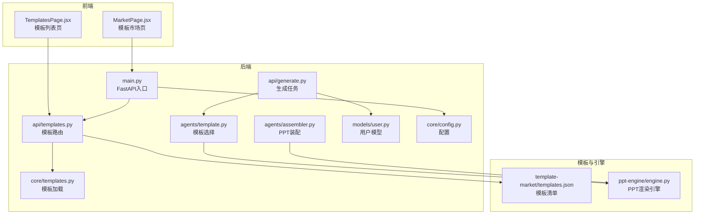
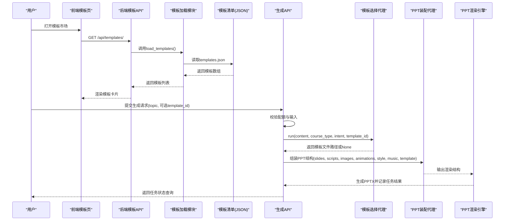
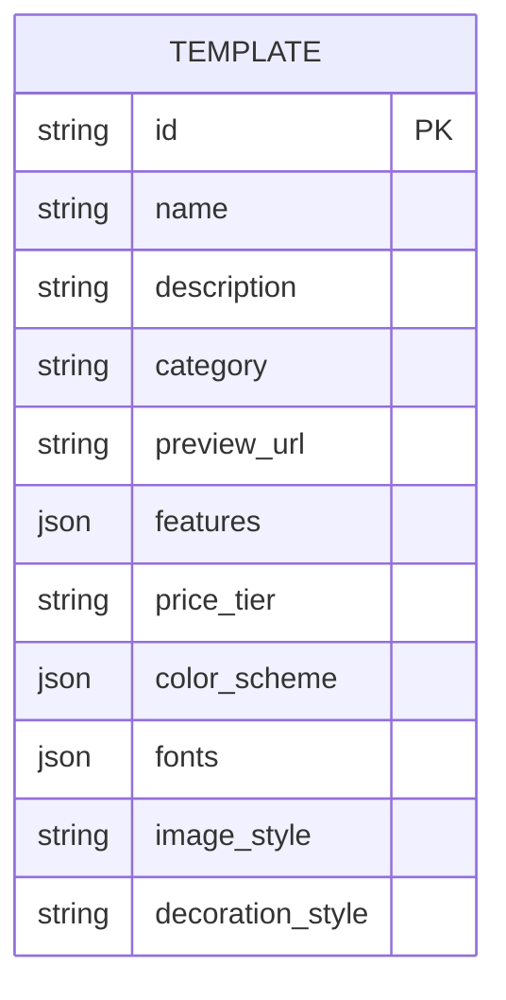
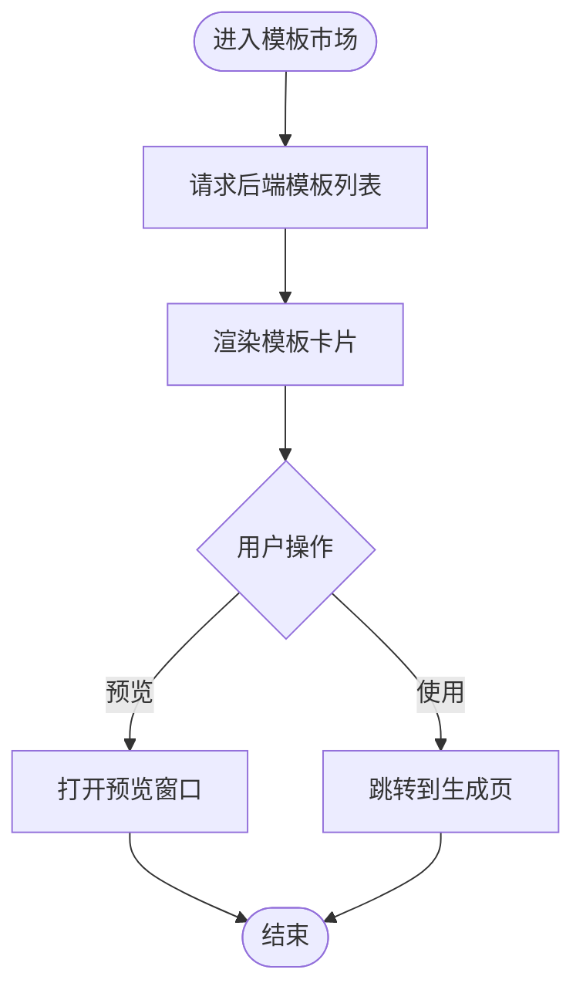
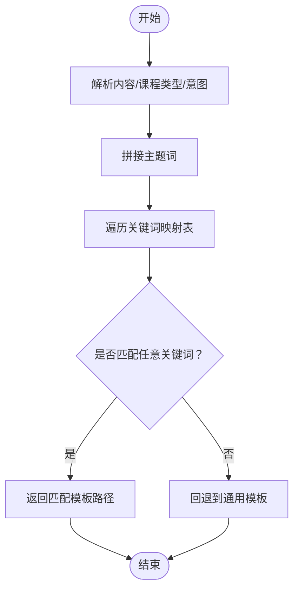
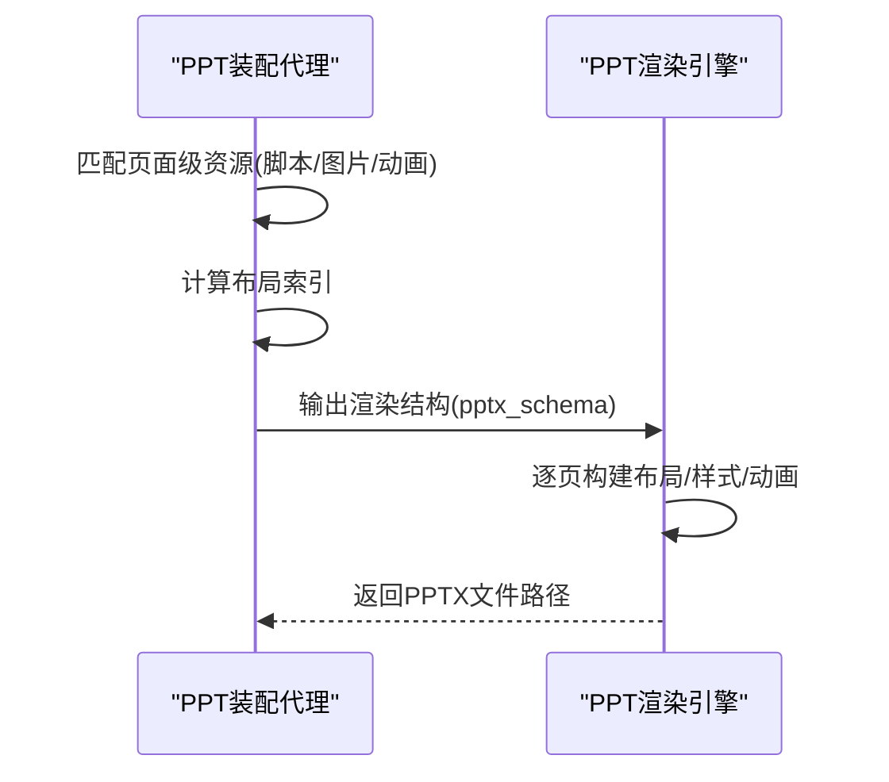
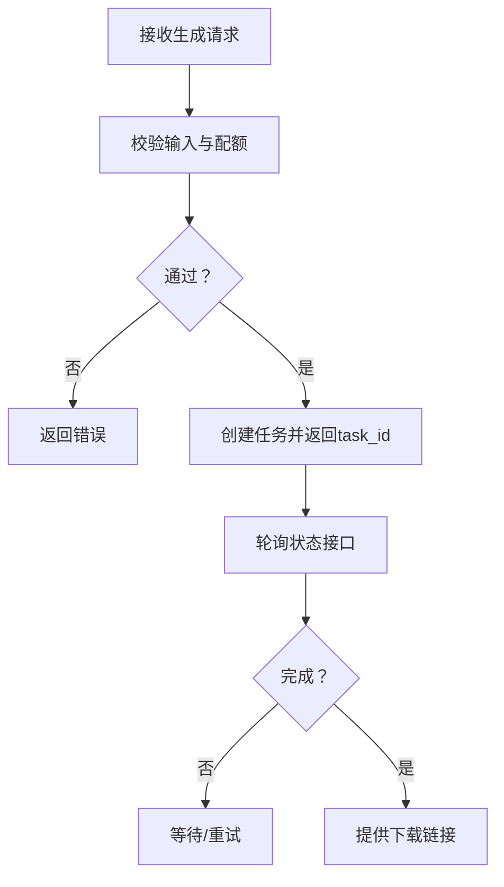
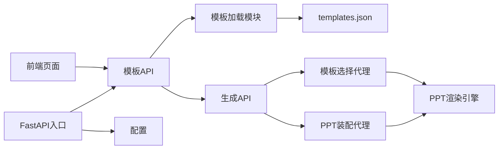

# 模板市场

<cite>
**本文引用的文件**
- [backend/core/templates.py](file://backend/core/templates.py)
- [backend/api/templates.py](file://backend/api/templates.py)
- [template-market/templates.json](file://template-market/templates.json)
- [backend/main.py](file://backend/main.py)
- [frontend/src/pages/MarketPage.jsx](file://frontend/src/pages/MarketPage.jsx)
- [frontend/src/pages/TemplatesPage.jsx](file://frontend/src/pages/TemplatesPage.jsx)
- [backend/api/generate.py](file://backend/api/generate.py)
- [backend/agents/template.py](file://backend/agents/template.py)
- [backend/agents/assembler.py](file://backend/agents/assembler.py)
- [ppt-engine/engine.py](file://ppt-engine/engine.py)
- [backend/models/user.py](file://backend/models/user.py)
- [backend/core/config.py](file://backend/core/config.py)
</cite>

## 目录
1. [简介](#简介)
2. [项目结构](#项目结构)
3. [核心组件](#核心组件)
4. [架构总览](#架构总览)
5. [详细组件分析](#详细组件分析)
6. [依赖关系分析](#依赖关系分析)
7. [性能考虑](#性能考虑)
8. [故障排查指南](#故障排查指南)
9. [结论](#结论)
10. [附录](#附录)

## 简介
本技术文档面向“模板市场系统”，系统围绕模板的发现、展示、选择与应用展开，覆盖模板数据模型、前端市场页面、后端模板API、模板选择与装配流程、PPT引擎渲染以及与AI代理系统的集成。文档同时给出模板开发规范、格式约定、性能优化建议与常见问题排查方法。

## 项目结构
系统采用前后端分离架构：前端负责模板市场页面与交互；后端提供REST API、模板加载与调度、任务队列状态查询；模板数据以JSON形式集中管理；PPT引擎负责将结构化数据渲染为PPTX文件。

图表来源
- [backend/main.py:1-40](file://backend/main.py#L1-L40)
- [backend/api/templates.py:1-20](file://backend/api/templates.py#L1-L20)
- [backend/core/templates.py:1-20](file://backend/core/templates.py#L1-L20)
- [template-market/templates.json:1-55](file://template-market/templates.json#L1-L55)
- [backend/api/generate.py:1-52](file://backend/api/generate.py#L1-L52)
- [backend/agents/template.py:1-33](file://backend/agents/template.py#L1-L33)
- [backend/agents/assembler.py:1-89](file://backend/agents/assembler.py#L1-L89)
- [ppt-engine/engine.py:1-166](file://ppt-engine/engine.py#L1-L166)
- [backend/models/user.py:1-21](file://backend/models/user.py#L1-L21)
- [backend/core/config.py:1-34](file://backend/core/config.py#L1-L34)

章节来源
- [backend/main.py:1-40](file://backend/main.py#L1-L40)
- [frontend/src/pages/MarketPage.jsx:1-57](file://frontend/src/pages/MarketPage.jsx#L1-L57)
- [frontend/src/pages/TemplatesPage.jsx:1-53](file://frontend/src/pages/TemplatesPage.jsx#L1-L53)

## 核心组件
- 模板数据层
  - 后端通过统一路径读取模板清单JSON，提供模板列表与详情查询。
  - 前端模板市场页与模板列表页分别展示模板卡片与特性标签。
- 生成与任务流
  - 生成接口校验用户配额与输入有效性，创建异步任务并返回任务状态查询入口。
- 模板选择与装配
  - 模板选择代理根据内容关键词匹配模板目录中的PPTX文件。
  - PPT装配代理将多源数据（脚本、图片、动画、样式）整合为PPT渲染结构。
- 渲染引擎
  - 引擎按布局构建幻灯片，应用样式、颜色与动画，并输出PPTX文件。

章节来源
- [backend/core/templates.py:1-20](file://backend/core/templates.py#L1-L20)
- [backend/api/templates.py:1-20](file://backend/api/templates.py#L1-L20)
- [template-market/templates.json:1-55](file://template-market/templates.json#L1-L55)
- [frontend/src/pages/MarketPage.jsx:1-57](file://frontend/src/pages/MarketPage.jsx#L1-L57)
- [frontend/src/pages/TemplatesPage.jsx:1-53](file://frontend/src/pages/TemplatesPage.jsx#L1-L53)
- [backend/api/generate.py:1-52](file://backend/api/generate.py#L1-L52)
- [backend/agents/template.py:1-33](file://backend/agents/template.py#L1-L33)
- [backend/agents/assembler.py:1-89](file://backend/agents/assembler.py#L1-L89)
- [ppt-engine/engine.py:1-166](file://ppt-engine/engine.py#L1-L166)

## 架构总览
系统采用“前端展示 + 后端服务 + 模板与引擎”的分层设计。前端通过模板API获取模板清单，用户在模板市场中浏览与选择；生成请求进入后端，由模板选择代理与PPT装配代理协同工作，最终由渲染引擎生成PPTX文件。

图表来源
- [backend/api/templates.py:1-20](file://backend/api/templates.py#L1-L20)
- [backend/core/templates.py:1-20](file://backend/core/templates.py#L1-L20)
- [template-market/templates.json:1-55](file://template-market/templates.json#L1-L55)
- [backend/api/generate.py:1-52](file://backend/api/generate.py#L1-L52)
- [backend/agents/template.py:1-33](file://backend/agents/template.py#L1-L33)
- [backend/agents/assembler.py:1-89](file://backend/agents/assembler.py#L1-L89)
- [ppt-engine/engine.py:1-166](file://ppt-engine/engine.py#L1-L166)

## 详细组件分析

### 模板数据模型与存储
- 存储位置与格式
  - 模板清单位于 template-market/templates.json，采用数组格式，每条模板包含基础信息、分类、预览地址、特性标签、价格等级、样式参数等。
- 加载与查询
  - 后端通过统一路径读取该JSON，提供列表与按ID查询的接口。
- 元数据与版本控制
  - 当前版本未见显式版本字段；如需版本控制，可在模板对象中新增版本号字段并在加载时进行版本校验。

图表来源
- [template-market/templates.json:1-55](file://template-market/templates.json#L1-L55)

章节来源
- [backend/core/templates.py:1-20](file://backend/core/templates.py#L1-L20)
- [backend/api/templates.py:1-20](file://backend/api/templates.py#L1-L20)
- [template-market/templates.json:1-55](file://template-market/templates.json#L1-L55)

### 模板市场前端页面
- MarketPage.jsx
  - 展示静态占位模板卡片，包含名称、价格、评分、销量与预览占位图。
- TemplatesPage.jsx
  - 通过HTTP客户端拉取后端模板列表，渲染模板卡片并显示特性标签与价格等级。
  - 支持点击“使用此模板”跳转到生成页。

图表来源
- [frontend/src/pages/MarketPage.jsx:1-57](file://frontend/src/pages/MarketPage.jsx#L1-L57)
- [frontend/src/pages/TemplatesPage.jsx:1-53](file://frontend/src/pages/TemplatesPage.jsx#L1-L53)

章节来源
- [frontend/src/pages/MarketPage.jsx:1-57](file://frontend/src/pages/MarketPage.jsx#L1-L57)
- [frontend/src/pages/TemplatesPage.jsx:1-53](file://frontend/src/pages/TemplatesPage.jsx#L1-L53)

### 模板选择算法（AI代理）
- 关键词映射
  - 按学科关键词集合映射到具体模板路径，优先匹配成功即返回对应PPTX文件。
- 回退策略
  - 若无匹配关键词，则回退到通用讲稿模板。
- 可扩展点
  - 可引入意图识别与课程类型参数，结合模板元数据进行更精细的匹配。

图表来源
- [backend/agents/template.py:1-33](file://backend/agents/template.py#L1-L33)

章节来源
- [backend/agents/template.py:1-33](file://backend/agents/template.py#L1-L33)

### PPT装配与渲染
- 装配流程
  - 将脚本、图片、动画、样式等数据按页面号匹配，组装为标准PPT渲染结构。
- 渲染引擎
  - 根据布局函数构建封面、章节、文本、图文、左右分割、总结等页面。
  - 应用样式（颜色方案、字体）、图片与过渡动画，保存为PPTX。

图表来源
- [backend/agents/assembler.py:1-89](file://backend/agents/assembler.py#L1-L89)
- [ppt-engine/engine.py:1-166](file://ppt-engine/engine.py#L1-L166)

章节来源
- [backend/agents/assembler.py:1-89](file://backend/agents/assembler.py#L1-L89)
- [ppt-engine/engine.py:1-166](file://ppt-engine/engine.py#L1-L166)

### 生成任务与配额控制
- 输入校验
  - 校验主题长度与必填项，防止无效请求。
- 配额检查
  - 基于用户层级限制每日生成次数，超限返回错误。
- 任务状态
  - 创建任务后返回任务ID，支持轮询查询状态、下载链接与进度。

图表来源
- [backend/api/generate.py:1-52](file://backend/api/generate.py#L1-L52)
- [backend/models/user.py:1-21](file://backend/models/user.py#L1-L21)

章节来源
- [backend/api/generate.py:1-52](file://backend/api/generate.py#L1-L52)
- [backend/models/user.py:1-21](file://backend/models/user.py#L1-L21)

### API 接口定义
- 模板相关
  - GET /api/templates/：获取模板列表
  - GET /api/templates/{template_id}：获取模板详情（未找到返回错误）
- 生成相关
  - POST /api/generate/：提交生成请求，返回任务ID
  - GET /api/generate/status/{task_id}：查询任务状态与结果

章节来源
- [backend/api/templates.py:1-20](file://backend/api/templates.py#L1-L20)
- [backend/api/generate.py:1-52](file://backend/api/generate.py#L1-L52)

## 依赖关系分析
- 模块耦合
  - 前端仅依赖后端模板API；后端模板API依赖模板加载模块与模板清单JSON。
  - 生成流程串联模板选择代理、PPT装配代理与渲染引擎。
- 外部依赖
  - FastAPI、SQLAlchemy、Pillow、python-pptx等（从requirements.txt可见）。
- 配置与环境
  - 配置类集中管理数据库、Redis、密钥、价格与输出目录等。

图表来源
- [backend/main.py:1-40](file://backend/main.py#L1-L40)
- [backend/api/templates.py:1-20](file://backend/api/templates.py#L1-L20)
- [backend/core/templates.py:1-20](file://backend/core/templates.py#L1-L20)
- [template-market/templates.json:1-55](file://template-market/templates.json#L1-L55)
- [backend/api/generate.py:1-52](file://backend/api/generate.py#L1-L52)
- [backend/agents/template.py:1-33](file://backend/agents/template.py#L1-L33)
- [backend/agents/assembler.py:1-89](file://backend/agents/assembler.py#L1-L89)
- [ppt-engine/engine.py:1-166](file://ppt-engine/engine.py#L1-L166)
- [backend/core/config.py:1-34](file://backend/core/config.py#L1-L34)

章节来源
- [backend/main.py:1-40](file://backend/main.py#L1-L40)
- [backend/core/config.py:1-34](file://backend/core/config.py#L1-L34)

## 性能考虑
- 模板加载
  - 模板清单为小体量JSON，建议缓存至内存或Redis，减少磁盘IO。
- 渲染性能
  - 图片写入与PPTX保存为I/O密集型，可并发生成多个任务并限制单机并发度。
- 前端渲染
  - 预览图建议懒加载与CDN加速；模板列表分页或虚拟滚动提升大列表体验。
- 任务队列
  - 结合Redis/消息队列实现异步生成，避免阻塞请求线程。

## 故障排查指南
- 模板未找到
  - 检查模板ID是否正确，确认templates.json中存在对应条目。
- 生成失败
  - 查看任务状态接口返回的错误字段；核对用户配额与输入参数。
- 渲染异常
  - 确认模板文件存在且路径正确；检查PPT引擎日志与异常捕获。
- CORS与静态资源
  - 确保CORS允许跨域访问；静态文件挂载路径正确。

章节来源
- [backend/api/templates.py:1-20](file://backend/api/templates.py#L1-L20)
- [backend/api/generate.py:1-52](file://backend/api/generate.py#L1-L52)
- [backend/main.py:1-40](file://backend/main.py#L1-L40)

## 结论
模板市场系统以简洁的数据模型与清晰的职责划分实现了从模板发现到PPT生成的闭环。当前版本聚焦于模板清单与基础生成流程，后续可在模板版本控制、个性化推荐、模板定制与样式编辑等方面进一步增强。

## 附录

### 模板开发指南与格式规范
- 模板清单字段
  - 必填：id、name、description、category、preview_url、price_tier
  - 建议：features、color_scheme、fonts、image_style、decoration_style
- 分类与特性
  - 分类用于筛选与排序；特性用于功能标识（如动画、图像生成、音乐等）。
- 预览与下载
  - 预览URL指向静态资源；模板文件应放置在模板引擎可访问的目录中。

章节来源
- [template-market/templates.json:1-55](file://template-market/templates.json#L1-L55)

### 个性化推荐与用户偏好处理（建议）
- 用户偏好
  - 基于历史使用模板、收藏与评分建立偏好画像。
- 推荐策略
  - 协同过滤或基于内容的相似度计算，结合模板特性与用户层级进行排序。
- 排序机制
  - 综合评分、销量、价格等级与用户偏好权重进行加权排序。

### 模板定制与样式修改（建议）
- 样式参数
  - 在模板元数据中扩展样式参数，渲染时动态替换颜色、字体与装饰风格。
- 内容调整
  - 通过脚本与图片资源的页面级映射，支持局部内容替换与增删。

### 与AI代理系统的集成（建议）
- 模板选择
  - 将课程类型、教学目标与模板元数据关联，提高匹配精度。
- 内容生成
  - 将AI生成的脚本、图片与动画注入装配代理，形成完整的PPT渲染结构。