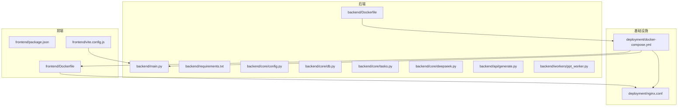
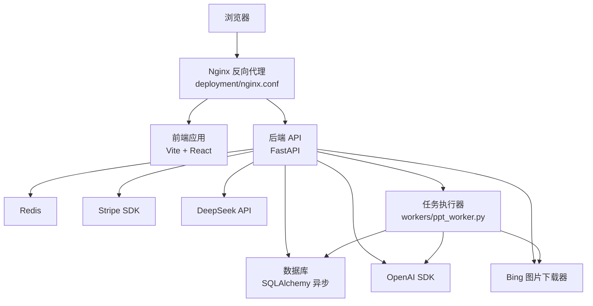
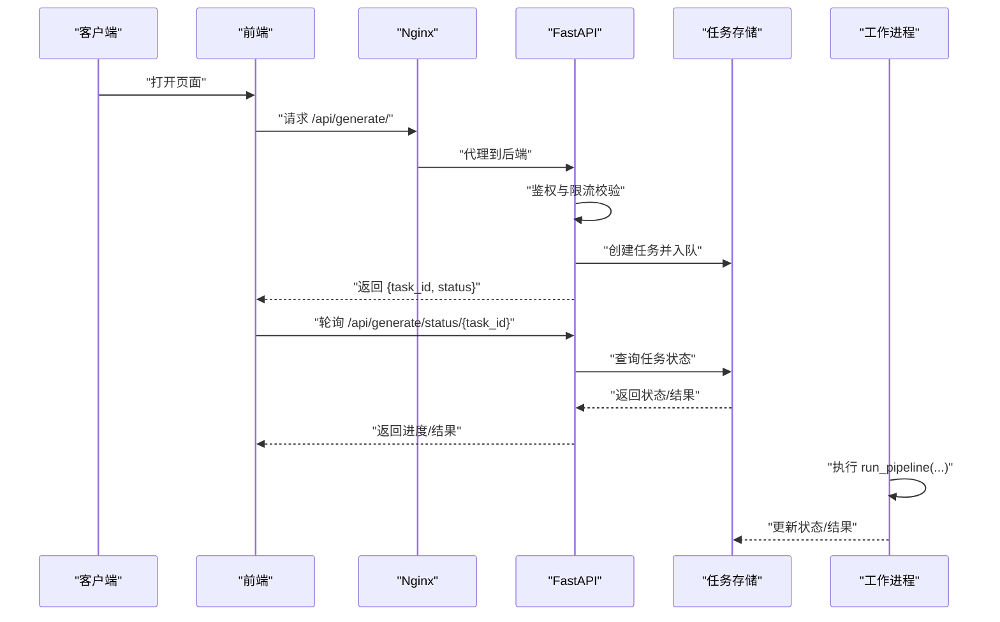
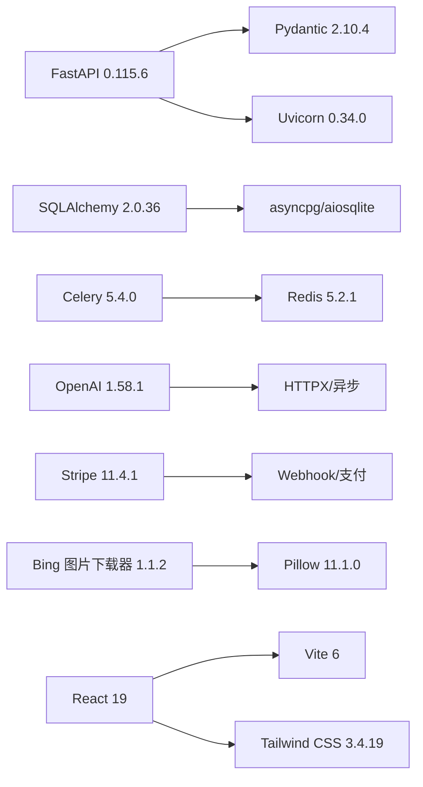

# 技术栈说明

<cite>
**本文引用的文件**
- [backend/main.py](file://backend/main.py)
- [backend/requirements.txt](file://backend/requirements.txt)
- [backend/core/config.py](file://backend/core/config.py)
- [backend/core/db.py](file://backend/core/db.py)
- [backend/core/tasks.py](file://backend/core/tasks.py)
- [backend/core/deepseek.py](file://backend/core/deepseek.py)
- [backend/api/generate.py](file://backend/api/generate.py)
- [backend/workers/ppt_worker.py](file://backend/workers/ppt_worker.py)
- [backend/Dockerfile](file://backend/Dockerfile)
- [frontend/package.json](file://frontend/package.json)
- [frontend/vite.config.js](file://frontend/vite.config.js)
- [frontend/Dockerfile](file://frontend/Dockerfile)
- [deployment/docker-compose.yml](file://deployment/docker-compose.yml)
- [deployment/nginx.conf](file://deployment/nginx.conf)
- [backend/models/user.py](file://backend/models/user.py)
</cite>

## 目录
1. [引言](#引言)
2. [项目结构](#项目结构)
3. [核心组件](#核心组件)
4. [架构总览](#架构总览)
5. [详细组件分析](#详细组件分析)
6. [依赖分析](#依赖分析)
7. [性能考虑](#性能考虑)
8. [故障排查指南](#故障排查指南)
9. [结论](#结论)
10. [附录：技术栈版本矩阵与升级路径](#附录技术栈版本矩阵与升级路径)

## 引言
本文件系统性梳理并说明本项目的全栈技术栈，包括后端（FastAPI、SQLAlchemy、Celery、Redis）、前端（React、Vite、Tailwind CSS）、基础设施（Docker、Nginx），以及第三方服务集成（OpenAI、Stripe、Bing图片搜索）。文档从技术选型动机、版本兼容性、性能特征、部署与运行时配置、错误处理与优化策略等方面进行深入解析，并提供可操作的升级路径建议。

## 项目结构
项目采用前后端分离与容器化部署架构：
- 后端使用 FastAPI 提供异步 API，通过 SQLAlchemy 2.x 进行数据库访问，使用 Celery + Redis 实现任务队列与异步执行，集成 OpenAI、DeepSeek、Stripe、Bing 图片搜索等第三方服务。
- 前端基于 React 19、Vite 6、Tailwind CSS 构建，开发环境通过代理转发到后端 API。
- 基础设施通过 Docker Compose 编排，Nginx 作为反向代理统一入口，暴露前端静态资源与后端 API。

图示来源
- [deployment/docker-compose.yml:1-46](file://deployment/docker-compose.yml#L1-L46)
- [deployment/nginx.conf:1-26](file://deployment/nginx.conf#L1-L26)
- [backend/Dockerfile:1-15](file://backend/Dockerfile#L1-L15)
- [frontend/Dockerfile:1-13](file://frontend/Dockerfile#L1-L13)
- [backend/main.py:1-40](file://backend/main.py#L1-L40)
- [frontend/vite.config.js:1-9](file://frontend/vite.config.js#L1-L9)

章节来源
- [deployment/docker-compose.yml:1-46](file://deployment/docker-compose.yml#L1-L46)
- [deployment/nginx.conf:1-26](file://deployment/nginx.conf#L1-L26)
- [backend/Dockerfile:1-15](file://backend/Dockerfile#L1-L15)
- [frontend/Dockerfile:1-13](file://frontend/Dockerfile#L1-L13)
- [backend/main.py:1-40](file://backend/main.py#L1-L40)
- [frontend/vite.config.js:1-9](file://frontend/vite.config.js#L1-L9)

## 核心组件
- 后端框架与路由：FastAPI 应用在主程序中初始化，注册 CORS 中间件与多个业务路由；健康检查接口提供应用名称与版本信息。
- 数据层：SQLAlchemy 2.x 异步引擎连接 SQLite/PostgreSQL，提供会话管理与初始化脚本。
- 任务系统：本地内存任务存储 + 异步工作协程，配合 Celery/Redis 可扩展为分布式队列。
- 第三方服务：DeepSeek 对话接口、OpenAI SDK、Stripe 支付、Bing 图片下载器。
- 前端构建：Vite 开发服务器与生产构建，Tailwind CSS 样式工具，React 组件化页面。
- 基础设施：Docker 镜像构建与 Nginx 反向代理，docker-compose 统一编排。

章节来源
- [backend/main.py:1-40](file://backend/main.py#L1-L40)
- [backend/core/db.py:1-27](file://backend/core/db.py#L1-L27)
- [backend/core/tasks.py:1-33](file://backend/core/tasks.py#L1-L33)
- [backend/requirements.txt:1-22](file://backend/requirements.txt#L1-L22)
- [frontend/package.json:1-26](file://frontend/package.json#L1-L26)
- [frontend/vite.config.js:1-9](file://frontend/vite.config.js#L1-L9)
- [deployment/docker-compose.yml:1-46](file://deployment/docker-compose.yml#L1-L46)
- [deployment/nginx.conf:1-26](file://deployment/nginx.conf#L1-L26)

## 架构总览
整体架构由前端、后端、任务队列与数据库组成，Nginx 作为统一入口，docker-compose 管理多容器协作。

图示来源
- [deployment/nginx.conf:1-26](file://deployment/nginx.conf#L1-L26)
- [backend/main.py:1-40](file://backend/main.py#L1-L40)
- [backend/core/db.py:1-27](file://backend/core/db.py#L1-L27)
- [backend/core/deepseek.py:1-40](file://backend/core/deepseek.py#L1-L40)
- [backend/workers/ppt_worker.py:1-24](file://backend/workers/ppt_worker.py#L1-L24)
- [backend/requirements.txt:1-22](file://backend/requirements.txt#L1-L22)

## 详细组件分析

### 后端技术栈

#### FastAPI
- 选型原因：高性能异步 Web 框架，自动生成 OpenAPI 文档，类型安全与 Pydantic 集成良好。
- 版本与兼容性：当前使用 0.115.6；与 Pydantic 2.x、Uvicorn 0.34.0 兼容。
- 性能特点：异步 I/O、自动参数校验、中间件与生命周期钩子支持良好。
- 关键实现位置：
  - 应用初始化与路由注册：[backend/main.py:16-34](file://backend/main.py#L16-L34)
  - 健康检查接口：[backend/main.py:37-39](file://backend/main.py#L37-L39)

章节来源
- [backend/main.py:1-40](file://backend/main.py#L1-L40)

#### SQLAlchemy 2.x
- 选型原因：现代化 ORM，异步引擎与类型安全模型定义，适合高并发场景。
- 版本与兼容性：当前使用 2.0.36；与 asyncpg/aiosqlite 共存以适配不同数据库后端。
- 性能特点：异步连接池、延迟回话关闭、metadata 自动创建。
- 关键实现位置：
  - 异步引擎与会话工厂：[backend/core/db.py:1-18](file://backend/core/db.py#L1-L18)
  - 初始化元数据：[backend/core/db.py:21-27](file://backend/core/db.py#L21-L27)
  - 用户模型示例：[backend/models/user.py:1-21](file://backend/models/user.py#L1-L21)

章节来源
- [backend/core/db.py:1-27](file://backend/core/db.py#L1-L27)
- [backend/models/user.py:1-21](file://backend/models/user.py#L1-L21)

#### Celery 与 Redis
- 选型原因：异步任务队列与分布式任务调度，结合 Redis 作为消息代理与结果后端。
- 版本与兼容性：当前使用 Celery 5.4.0、Redis 5.2.1；与 Python 异步生态兼容。
- 性能特点：任务分发、重试、结果存储；Redis 内存型缓存与持久化卷结合。
- 关键实现位置：
  - 本地任务存储与调度：[backend/core/tasks.py:1-33](file://backend/core/tasks.py#L1-L33)
  - 工作进程执行流程：[backend/workers/ppt_worker.py:1-24](file://backend/workers/ppt_worker.py#L1-L24)
  - Compose 服务定义：[deployment/docker-compose.yml:31-39](file://deployment/docker-compose.yml#L31-L39)

章节来源
- [backend/core/tasks.py:1-33](file://backend/core/tasks.py#L1-L33)
- [backend/workers/ppt_worker.py:1-24](file://backend/workers/ppt_worker.py#L1-L24)
- [deployment/docker-compose.yml:31-39](file://deployment/docker-compose.yml#L31-L39)

#### 第三方服务集成

- OpenAI
  - 用途：AI 能力调用（如提示词工程、内容生成）。
  - 版本与集成：当前使用 openai==1.58.1；通过配置项注入密钥。
  - 关键实现位置：[backend/requirements.txt](file://backend/requirements.txt#L18)
  - 配置位置：[backend/core/config.py](file://backend/core/config.py#L9)

- Stripe
  - 用途：订阅与计费 webhook 处理。
  - 版本与集成：当前使用 stripe>=11.4.1；需要密钥与 webhook 密钥。
  - 关键实现位置：[backend/requirements.txt](file://backend/requirements.txt#L13)
  - 配置位置：[backend/core/config.py:18-19](file://backend/core/config.py#L18-L19)

- Bing 图片搜索
  - 用途：图片素材检索与下载。
  - 版本与集成：当前使用 bing-image-downloader==1.1.2。
  - 关键实现位置：[backend/requirements.txt](file://backend/requirements.txt#L16)

- DeepSeek
  - 用途：对话与 JSON 结果抽取。
  - 实现位置：[backend/core/deepseek.py:1-40](file://backend/core/deepseek.py#L1-L40)
  - 配置位置：[backend/core/config.py](file://backend/core/config.py#L8)

章节来源
- [backend/requirements.txt:1-22](file://backend/requirements.txt#L1-L22)
- [backend/core/config.py:1-34](file://backend/core/config.py#L1-L34)
- [backend/core/deepseek.py:1-40](file://backend/core/deepseek.py#L1-L40)

#### API 与任务流

图示来源
- [deployment/nginx.conf:12-20](file://deployment/nginx.conf#L12-L20)
- [backend/api/generate.py:20-51](file://backend/api/generate.py#L20-L51)
- [backend/core/tasks.py:14-28](file://backend/core/tasks.py#L14-L28)
- [backend/workers/ppt_worker.py:5-24](file://backend/workers/ppt_worker.py#L5-L24)

章节来源
- [backend/api/generate.py:1-52](file://backend/api/generate.py#L1-L52)
- [backend/core/tasks.py:1-33](file://backend/core/tasks.py#L1-L33)
- [backend/workers/ppt_worker.py:1-24](file://backend/workers/ppt_worker.py#L1-L24)
- [deployment/nginx.conf:1-26](file://deployment/nginx.conf#L1-L26)

### 前端技术栈

- React 19
  - 选型原因：函数式组件与并发特性，生态成熟，性能优秀。
  - 版本与集成：当前使用 react@^19.0.0、react-dom@^19.0.0。
  - 关键实现位置：[frontend/package.json:11-17](file://frontend/package.json#L11-L17)

- Vite 6
  - 选型原因：快速冷启动与热更新，现代化打包工具链。
  - 版本与集成：当前使用 vite@^6.0.0；开发代理指向后端。
  - 关键实现位置：[frontend/vite.config.js:1-9](file://frontend/vite.config.js#L1-L9)

- Tailwind CSS
  - 选型原因：原子化样式，快速原型与主题一致性。
  - 版本与集成：当前使用 tailwindcss@^3.4.19；与 autoprefixer、postcss 协同。
  - 关键实现位置：[frontend/package.json:19-24](file://frontend/package.json#L19-L24)

- 构建与镜像
  - 生产构建输出至 dist；Nginx 静态托管。
  - 关键实现位置：[frontend/Dockerfile:1-13](file://frontend/Dockerfile#L1-L13)

章节来源
- [frontend/package.json:1-26](file://frontend/package.json#L1-L26)
- [frontend/vite.config.js:1-9](file://frontend/vite.config.js#L1-L9)
- [frontend/Dockerfile:1-13](file://frontend/Dockerfile#L1-L13)

### 基础设施技术栈

- Docker
  - 后端镜像：Python 3.12 slim，安装编译依赖，复制依赖与源码，暴露 8000 端口。
    - [backend/Dockerfile:1-15](file://backend/Dockerfile#L1-L15)
  - 前端镜像：Node 22 Alpine 构建产物，Nginx Alpine 静态托管，复制 Nginx 配置。
    - [frontend/Dockerfile:1-13](file://frontend/Dockerfile#L1-L13)

- docker-compose
  - 编排后端、前端、Redis 服务，挂载输出与数据目录，网络隔离。
  - [deployment/docker-compose.yml:1-46](file://deployment/docker-compose.yml#L1-L46)

- Nginx
  - 反向代理 /api/ 到后端，静态资源托管前端，启用 gzip。
  - [deployment/nginx.conf:1-26](file://deployment/nginx.conf#L1-L26)

章节来源
- [backend/Dockerfile:1-15](file://backend/Dockerfile#L1-L15)
- [frontend/Dockerfile:1-13](file://frontend/Dockerfile#L1-L13)
- [deployment/docker-compose.yml:1-46](file://deployment/docker-compose.yml#L1-L46)
- [deployment/nginx.conf:1-26](file://deployment/nginx.conf#L1-L26)

## 依赖分析

图示来源
- [backend/requirements.txt:1-22](file://backend/requirements.txt#L1-L22)
- [frontend/package.json:1-26](file://frontend/package.json#L1-L26)

章节来源
- [backend/requirements.txt:1-22](file://backend/requirements.txt#L1-L22)
- [frontend/package.json:1-26](file://frontend/package.json#L1-L26)

## 性能考虑
- 异步优先：后端使用 FastAPI 异步路由与 SQLAlchemy 异步引擎，减少阻塞；前端 Vite 开发模式热更新提升迭代效率。
- 缓存与压缩：Nginx 启用 gzip，降低传输体积；Redis 作为任务队列与缓存介质，需合理设置过期与淘汰策略。
- 数据库连接：异步连接池与延迟关闭，避免长事务；SQLite 适合开发/小规模，生产建议 PostgreSQL 并配合连接池。
- 任务执行：本地内存任务存储便于演示，生产建议 Redis/Celery 分布式队列，开启重试与死信队列。
- 第三方调用：对 OpenAI/DeepSeek/Bing 的请求应设置超时与重试，避免阻塞主线程。

## 故障排查指南
- 健康检查
  - 接口：GET /api/health
  - 返回字段：status/app/version
  - 位置：[backend/main.py:37-39](file://backend/main.py#L37-L39)

- 任务状态查询
  - 接口：GET /api/generate/status/{task_id}
  - 返回字段：status/file_url/file_name/download/result/progress/error
  - 位置：[backend/api/generate.py:38-51](file://backend/api/generate.py#L38-L51)

- 认证与限流
  - 生成 PPT 前需登录并通过每日额度校验
  - 位置：[backend/api/generate.py:20-35](file://backend/api/generate.py#L20-L35)

- 代理与跨域
  - 前端开发代理：/api -> http://localhost:8001
  - 后端 CORS：允许任意来源
  - 位置：[frontend/vite.config.js](file://frontend/vite.config.js#L6)，[backend/main.py:22-28](file://backend/main.py#L22-L28)

- 容器与日志
  - docker-compose 编排后端/前端/Redis，查看各容器日志定位问题
  - 位置：[deployment/docker-compose.yml:1-46](file://deployment/docker-compose.yml#L1-L46)

章节来源
- [backend/main.py:37-39](file://backend/main.py#L37-L39)
- [backend/api/generate.py:20-51](file://backend/api/generate.py#L20-L51)
- [frontend/vite.config.js](file://frontend/vite.config.js#L6)
- [deployment/docker-compose.yml:1-46](file://deployment/docker-compose.yml#L1-L46)

## 结论
本项目采用现代全栈技术栈：后端以 FastAPI + SQLAlchemy 2.x + Celery/Redis 为核心，前端以 React/Vite/Tailwind 为基础，基础设施通过 Docker/Nginx 完整编排。第三方服务（OpenAI、Stripe、Bing）按需集成，满足 AI PPT 生成的核心能力。建议在生产环境中替换 SQLite、完善 Redis/Celery 分布式队列、强化鉴权与限流策略，并持续关注各组件的安全与性能更新。

## 附录：技术栈版本矩阵与升级路径

- 版本矩阵（当前）
  - 后端
    - FastAPI: 0.115.6
    - Uvicorn: 0.34.0
    - Pydantic: 2.10.4
    - SQLAlchemy: 2.0.36
    - asyncpg/aiosqlite: 0.30.0/0.20.0
    - Celery: 5.4.0
    - Redis: 5.2.1
    - OpenAI: 1.58.1
    - Stripe: 11.4.1
    - Bing 图片下载器: 1.1.2
  - 前端
    - React: 19.0.0
    - React DOM: 19.0.0
    - Vite: 6.0.0
    - Tailwind CSS: 3.4.19
    - Axios: 1.7.9
    - React Router: 7.1.0

- 升级路径建议
  - 后端
    - FastAPI/Pydantic：遵循语义化版本，先在测试环境验证依赖兼容性，再灰度发布。
    - SQLAlchemy：保持与 asyncpg/aiosqlite 同步，注意异步 API 变更。
    - Celery/Redis：生产迁移前评估任务幂等性与重试策略，确保结果后端一致性。
    - OpenAI/Stripe：关注 SDK 的弃用通知与新特性，逐步替换旧接口。
  - 前端
    - React/Vite：关注 React 19 的并发特性与 Vite 6 的插件生态变化，逐步升级。
    - Tailwind CSS：留意原子类变更与新功能，建议在 CI 中加入样式回归检查。
  - 基础设施
    - Docker：固定基础镜像标签（如 python:3.12-slim），避免漂移；使用多阶段构建优化镜像大小。
    - Nginx：定期更新 alpine 版本，关注安全补丁。

章节来源
- [backend/requirements.txt:1-22](file://backend/requirements.txt#L1-L22)
- [frontend/package.json:1-26](file://frontend/package.json#L1-L26)