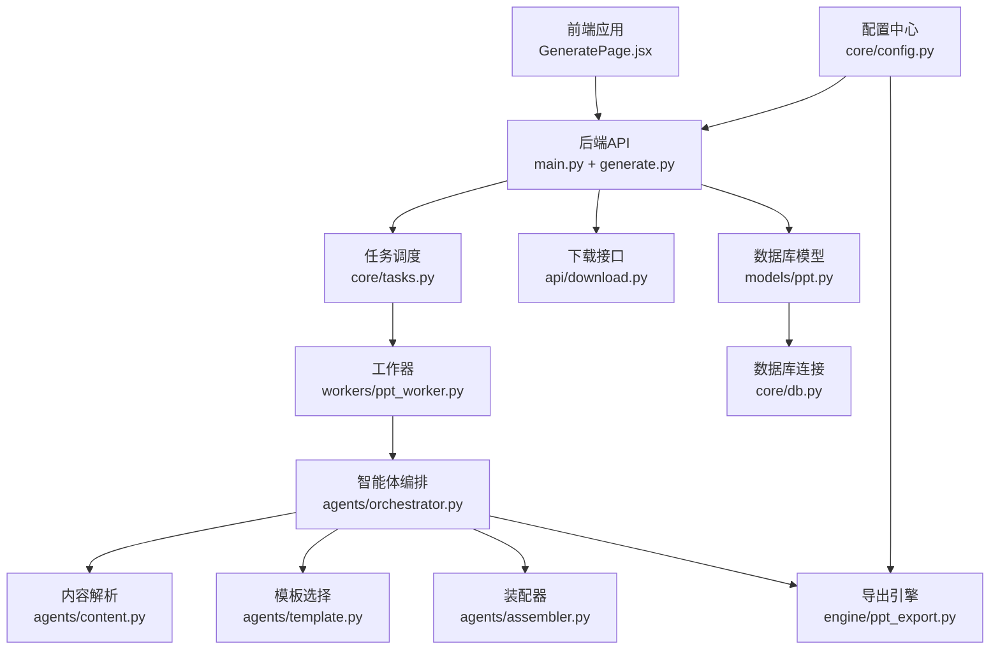
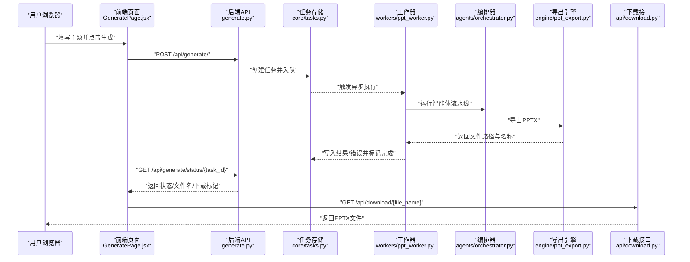
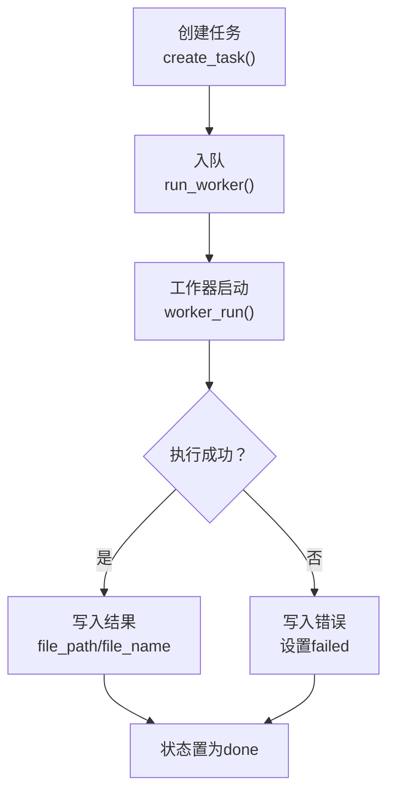
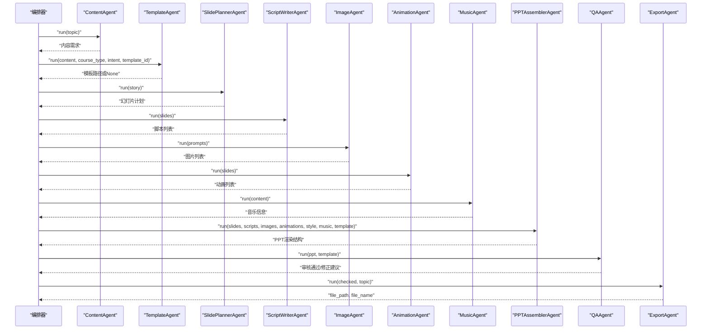
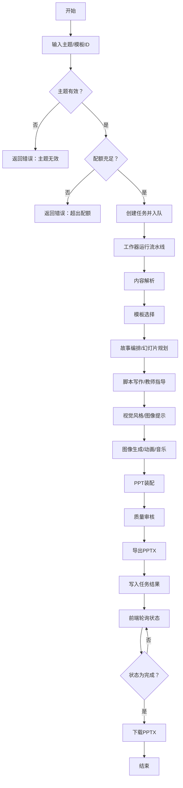
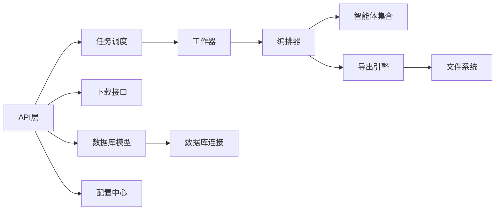

# 数据流分析

<cite>
**本文引用的文件**
- [backend/main.py](file://backend/main.py)
- [backend/api/generate.py](file://backend/api/generate.py)
- [backend/api/download.py](file://backend/api/download.py)
- [backend/core/tasks.py](file://backend/core/tasks.py)
- [backend/workers/ppt_worker.py](file://backend/workers/ppt_worker.py)
- [backend/agents/orchestrator.py](file://backend/agents/orchestrator.py)
- [backend/agents/content.py](file://backend/agents/content.py)
- [backend/agents/template.py](file://backend/agents/template.py)
- [backend/agents/assembler.py](file://backend/agents/assembler.py)
- [engine/ppt_export.py](file://engine/ppt_export.py)
- [backend/models/ppt.py](file://backend/models/ppt.py)
- [backend/core/db.py](file://backend/core/db.py)
- [backend/core/config.py](file://backend/core/config.py)
- [frontend/src/pages/GeneratePage.jsx](file://frontend/src/pages/GeneratePage.jsx)
</cite>

## 目录
1. [引言](#引言)
2. [项目结构](#项目结构)
3. [核心组件](#核心组件)
4. [架构总览](#架构总览)
5. [详细组件分析](#详细组件分析)
6. [依赖关系分析](#依赖关系分析)
7. [性能考量](#性能考量)
8. [故障排查指南](#故障排查指南)
9. [结论](#结论)
10. [附录](#附录)

## 引言
本文件面向“从用户请求到最终PPT输出”的完整数据流进行系统性分析，覆盖以下方面：
- 请求入口与路由分发
- 异步任务处理机制（队列、执行、状态存储）
- 中间状态存储与持久化
- 数据在各组件间的转换格式、序列化与传输协议
- 数据验证规则、完整性检查与一致性保障
- 关键业务场景下的数据流图与状态转换图

## 项目结构
后端采用FastAPI框架，前端使用React，引擎负责PPT导出，数据库通过SQLAlchemy ORM管理。整体采用“API网关 + 异步工作器 + 多智能体流水线”的分层架构。

图表来源
- [backend/main.py:16-39](file://backend/main.py#L16-L39)
- [backend/api/generate.py:20-51](file://backend/api/generate.py#L20-L51)
- [backend/core/tasks.py:14-32](file://backend/core/tasks.py#L14-L32)
- [backend/workers/ppt_worker.py:5-24](file://backend/workers/ppt_worker.py#L5-L24)
- [backend/agents/orchestrator.py:19-55](file://backend/agents/orchestrator.py#L19-L55)
- [backend/agents/content.py:7-21](file://backend/agents/content.py#L7-L21)
- [backend/agents/template.py:8-33](file://backend/agents/template.py#L8-L33)
- [backend/agents/assembler.py:16-89](file://backend/agents/assembler.py#L16-L89)
- [engine/ppt_export.py:245-257](file://engine/ppt_export.py#L245-L257)
- [backend/api/download.py:9-14](file://backend/api/download.py#L9-L14)
- [backend/models/ppt.py:6-18](file://backend/models/ppt.py#L6-L18)
- [backend/core/db.py:13-27](file://backend/core/db.py#L13-L27)
- [backend/core/config.py:4-34](file://backend/core/config.py#L4-L34)

章节来源
- [backend/main.py:1-40](file://backend/main.py#L1-L40)
- [backend/api/generate.py:1-52](file://backend/api/generate.py#L1-L52)
- [backend/core/tasks.py:1-33](file://backend/core/tasks.py#L1-L33)
- [backend/workers/ppt_worker.py:1-24](file://backend/workers/ppt_worker.py#L1-L24)
- [backend/agents/orchestrator.py:1-56](file://backend/agents/orchestrator.py#L1-L56)
- [backend/agents/content.py:1-21](file://backend/agents/content.py#L1-L21)
- [backend/agents/template.py:1-33](file://backend/agents/template.py#L1-L33)
- [backend/agents/assembler.py:1-89](file://backend/agents/assembler.py#L1-L89)
- [engine/ppt_export.py:1-257](file://engine/ppt_export.py#L1-L257)
- [backend/api/download.py:1-15](file://backend/api/download.py#L1-L15)
- [backend/models/ppt.py:1-18](file://backend/models/ppt.py#L1-L18)
- [backend/core/db.py:1-27](file://backend/core/db.py#L1-L27)
- [backend/core/config.py:1-34](file://backend/core/config.py#L1-L34)
- [frontend/src/pages/GeneratePage.jsx:1-133](file://frontend/src/pages/GeneratePage.jsx#L1-L133)

## 核心组件
- API层：提供生成与状态查询接口，负责参数校验与配额控制；提供下载接口。
- 任务调度：维护内存中的任务字典，触发异步执行。
- 工作器：拉取任务、更新状态、调用智能体流水线。
- 智能体流水线：按顺序执行内容解析、模板选择、故事编排、幻灯片规划、脚本写作、教师指导、视觉风格、图像提示、图像生成、动画与音乐、装配与质量审核、导出。
- 导出引擎：生成PPTX文件，清理临时资源。
- 数据库：记录PPT生成记录，支持后续审计与统计。
- 前端：轮询任务状态，展示进度与结果，并提供下载链接。

章节来源
- [backend/api/generate.py:20-51](file://backend/api/generate.py#L20-L51)
- [backend/core/tasks.py:14-32](file://backend/core/tasks.py#L14-L32)
- [backend/workers/ppt_worker.py:5-24](file://backend/workers/ppt_worker.py#L5-L24)
- [backend/agents/orchestrator.py:19-55](file://backend/agents/orchestrator.py#L19-L55)
- [engine/ppt_export.py:245-257](file://engine/ppt_export.py#L245-L257)
- [backend/models/ppt.py:6-18](file://backend/models/ppt.py#L6-L18)
- [frontend/src/pages/GeneratePage.jsx:19-68](file://frontend/src/pages/GeneratePage.jsx#L19-L68)

## 架构总览
下图展示了从用户提交到PPT下载的端到端数据流：

图表来源
- [frontend/src/pages/GeneratePage.jsx:34-59](file://frontend/src/pages/GeneratePage.jsx#L34-L59)
- [backend/api/generate.py:20-51](file://backend/api/generate.py#L20-L51)
- [backend/core/tasks.py:14-28](file://backend/core/tasks.py#L14-L28)
- [backend/workers/ppt_worker.py:5-24](file://backend/workers/ppt_worker.py#L5-L24)
- [backend/agents/orchestrator.py:19-55](file://backend/agents/orchestrator.py#L19-L55)
- [engine/ppt_export.py:245-257](file://engine/ppt_export.py#L245-L257)
- [backend/api/download.py:9-14](file://backend/api/download.py#L9-L14)

## 详细组件分析

### 1) 用户请求与API层
- 输入参数：主题、模板ID、页数（可选）。
- 参数校验：主题长度与空值检查；配额检查（当日生成次数上限）。
- 输出：返回任务ID与初始状态（排队）。
- 状态查询：根据任务ID返回状态、文件路径、文件名、是否可下载、进度、错误信息等。

章节来源
- [backend/api/generate.py:14-51](file://backend/api/generate.py#L14-L51)
- [frontend/src/pages/GeneratePage.jsx:34-68](file://frontend/src/pages/GeneratePage.jsx#L34-L68)

### 2) 任务调度与异步执行
- 任务存储：内存字典，键为任务ID，值包含状态、主题、用户ID、模板ID、页数、结果、错误等。
- 入队：创建任务后立即触发异步执行。
- 执行：工作器将任务状态置为“运行”，捕获异常并回写错误信息。
- 查询：通过任务ID读取状态与结果。

图表来源
- [backend/core/tasks.py:14-32](file://backend/core/tasks.py#L14-L32)
- [backend/workers/ppt_worker.py:5-24](file://backend/workers/ppt_worker.py#L5-L24)

章节来源
- [backend/core/tasks.py:1-33](file://backend/core/tasks.py#L1-L33)
- [backend/workers/ppt_worker.py:1-24](file://backend/workers/ppt_worker.py#L1-L24)

### 3) 智能体流水线与数据转换
- 编排器按序调用多个智能体，每个智能体接收上一步输出并产出下一步所需数据。
- 关键转换点：
  - 内容解析：将主题解析为结构化内容需求。
  - 模板选择：基于主题与类型匹配模板文件路径。
  - 装配器：将多源数据（脚本、图片、动画、风格、音乐）整合为PPT渲染结构。
  - 质量审核：对装配后的PPT进行一致性与完整性检查（由QA智能体负责）。
  - 导出：将渲染结构转为PPTX文件。

图表来源
- [backend/agents/orchestrator.py:19-55](file://backend/agents/orchestrator.py#L19-L55)
- [backend/agents/content.py:7-21](file://backend/agents/content.py#L7-L21)
- [backend/agents/template.py:8-33](file://backend/agents/template.py#L8-L33)
- [backend/agents/assembler.py:16-89](file://backend/agents/assembler.py#L16-L89)

章节来源
- [backend/agents/orchestrator.py:1-56](file://backend/agents/orchestrator.py#L1-L56)
- [backend/agents/content.py:1-21](file://backend/agents/content.py#L1-L21)
- [backend/agents/template.py:1-33](file://backend/agents/template.py#L1-L33)
- [backend/agents/assembler.py:1-89](file://backend/agents/assembler.py#L1-L89)

### 4) 导出引擎与文件落盘
- 导出函数以异步方式启动线程执行Windows PowerPoint自动化操作，生成PPTX文件。
- 清理临时目录与音频文件，确保资源回收。
- 返回文件绝对路径与文件名，供工作器写入任务结果。

章节来源
- [engine/ppt_export.py:245-257](file://engine/ppt_export.py#L245-L257)

### 5) 数据验证与完整性检查
- 请求级校验：主题非空且长度足够；配额限制。
- 任务级校验：状态查询时若任务不存在则返回404。
- 进度与结果：前端轮询时根据状态字段决定UI反馈；当状态为“完成”时允许下载。
- 完整性与一致性：由质量审核智能体负责，确保PPT结构、内容与模板一致。

章节来源
- [backend/api/generate.py:26-32](file://backend/api/generate.py#L26-L32)
- [backend/api/generate.py:40-51](file://backend/api/generate.py#L40-L51)
- [frontend/src/pages/GeneratePage.jsx:38-59](file://frontend/src/pages/GeneratePage.jsx#L38-L59)

### 6) 中间状态存储与数据缓存策略
- 任务状态存储：内存字典（全局变量），键为任务ID，值包含状态、结果、错误等。
- 文件缓存：导出引擎生成PPTX后，前端通过下载接口直接读取输出目录文件。
- 数据库持久化：PPT记录模型用于持久化元数据（用户ID、主题、页数、文件名、状态等），可用于审计与统计。

章节来源
- [backend/core/tasks.py:5](file://backend/core/tasks.py#L5)
- [backend/api/download.py:9-14](file://backend/api/download.py#L9-L14)
- [backend/models/ppt.py:6-18](file://backend/models/ppt.py#L6-L18)

### 7) 序列化与传输协议
- 请求/响应：HTTP JSON；Pydantic模型定义请求体。
- 任务状态：内存字典键值对，前端轮询获取。
- 文件传输：下载接口返回二进制PPTX文件，媒体类型为标准Office Presentation类型。

章节来源
- [backend/api/generate.py:14-18](file://backend/api/generate.py#L14-L18)
- [backend/api/generate.py:38-51](file://backend/api/generate.py#L38-L51)
- [backend/api/download.py:9-14](file://backend/api/download.py#L9-L14)

### 8) 端到端数据流图（关键场景）
以下图示化了“生成PPT”这一关键业务场景的完整数据流：

图表来源
- [backend/api/generate.py:20-51](file://backend/api/generate.py#L20-L51)
- [backend/core/tasks.py:14-28](file://backend/core/tasks.py#L14-L28)
- [backend/workers/ppt_worker.py:5-24](file://backend/workers/ppt_worker.py#L5-L24)
- [backend/agents/orchestrator.py:19-55](file://backend/agents/orchestrator.py#L19-L55)
- [engine/ppt_export.py:245-257](file://engine/ppt_export.py#L245-L257)
- [frontend/src/pages/GeneratePage.jsx:38-68](file://frontend/src/pages/GeneratePage.jsx#L38-L68)

## 依赖关系分析
- 组件耦合：
  - API层依赖任务调度与下载接口。
  - 工作器依赖编排器与导出引擎。
  - 编排器依赖多个智能体模块。
  - 导出引擎依赖系统PowerPoint COM组件（仅Windows）。
- 外部依赖：
  - 数据库：SQLAlchemy异步引擎。
  - 配置：Pydantic Settings集中管理。
  - 文件系统：输出目录与上传目录。

图表来源
- [backend/api/generate.py:20-51](file://backend/api/generate.py#L20-L51)
- [backend/core/tasks.py:14-32](file://backend/core/tasks.py#L14-L32)
- [backend/workers/ppt_worker.py:5-24](file://backend/workers/ppt_worker.py#L5-L24)
- [backend/agents/orchestrator.py:19-55](file://backend/agents/orchestrator.py#L19-L55)
- [engine/ppt_export.py:245-257](file://engine/ppt_export.py#L245-L257)
- [backend/api/download.py:9-14](file://backend/api/download.py#L9-L14)
- [backend/models/ppt.py:6-18](file://backend/models/ppt.py#L6-L18)
- [backend/core/db.py:13-27](file://backend/core/db.py#L13-L27)
- [backend/core/config.py:4-34](file://backend/core/config.py#L4-L34)

章节来源
- [backend/core/db.py:1-27](file://backend/core/db.py#L1-L27)
- [backend/core/config.py:1-34](file://backend/core/config.py#L1-L34)

## 性能考量
- 异步执行：任务通过事件循环异步触发，避免阻塞主线程。
- 线程化导出：导出过程在独立线程执行，避免阻塞事件循环。
- 资源清理：导出完成后删除临时目录与音频文件，降低磁盘占用。
- 前端轮询：采用固定间隔轮询，可根据实际负载调整轮询频率以平衡实时性与服务器压力。

## 故障排查指南
- 任务不存在：状态查询返回404，需确认任务ID正确性。
- 生成失败：工作器捕获异常并写入错误信息，前端显示失败原因。
- 配额不足：提交时返回429，提示升级套餐。
- 文件不存在：下载接口返回404，确认导出已完成且文件存在于输出目录。
- 数据库问题：初始化数据库时创建表，如出现异常检查连接字符串与权限。

章节来源
- [backend/api/generate.py:26-32](file://backend/api/generate.py#L26-L32)
- [backend/api/generate.py:40-51](file://backend/api/generate.py#L40-L51)
- [backend/workers/ppt_worker.py:20-23](file://backend/workers/ppt_worker.py#L20-L23)
- [backend/api/download.py:11-14](file://backend/api/download.py#L11-L14)
- [backend/core/db.py:21-27](file://backend/core/db.py#L21-L27)

## 结论
该系统通过“API + 任务调度 + 异步工作器 + 智能体流水线 + 导出引擎”的架构，实现了从用户请求到PPTX文件的完整数据流闭环。内存任务存储提供了低延迟的状态管理，前端轮询确保了良好的用户体验；导出引擎负责最终产物生成与资源回收。建议在生产环境中引入持久化任务存储与分布式队列，以提升可靠性与扩展性。

## 附录
- 配置项概览（节选）：数据库URL、输出目录、代理地址、免费配额等。
- 数据库模型：PPT记录表包含用户ID、主题、页数、文件路径、文件名、状态、创建时间等字段。

章节来源
- [backend/core/config.py:4-34](file://backend/core/config.py#L4-L34)
- [backend/models/ppt.py:6-18](file://backend/models/ppt.py#L6-L18)