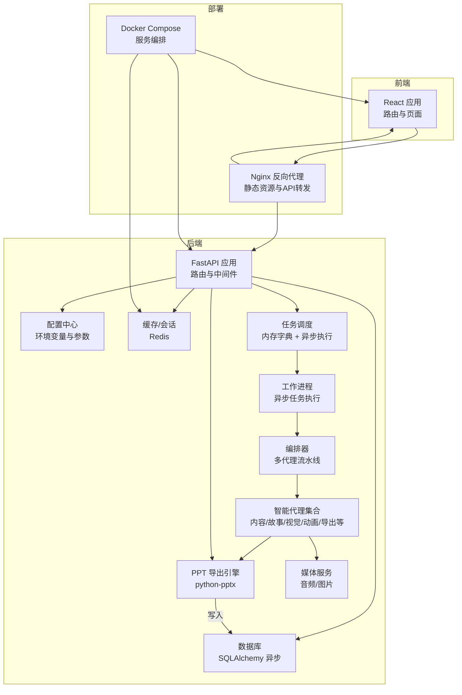
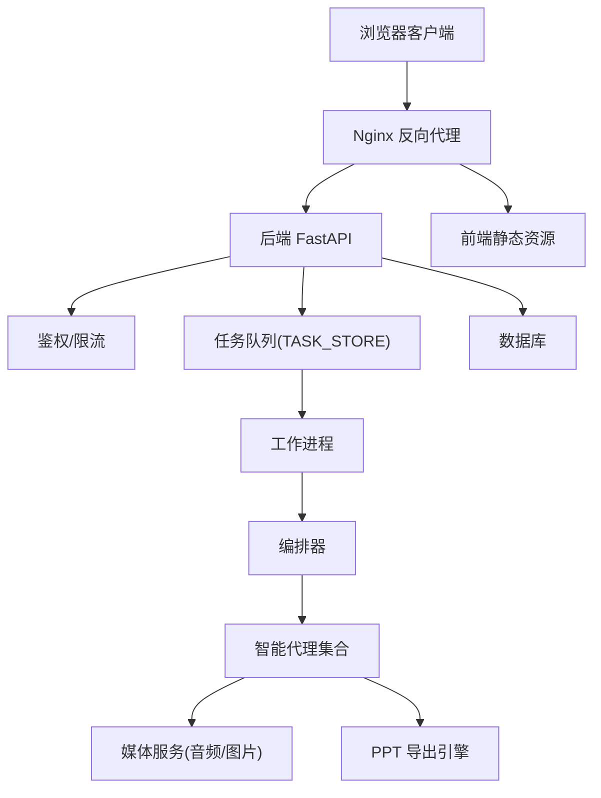
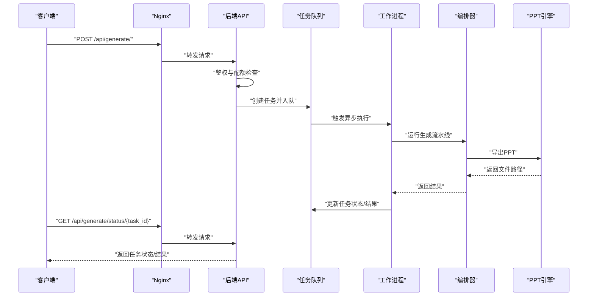
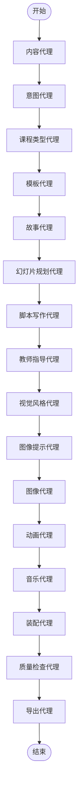
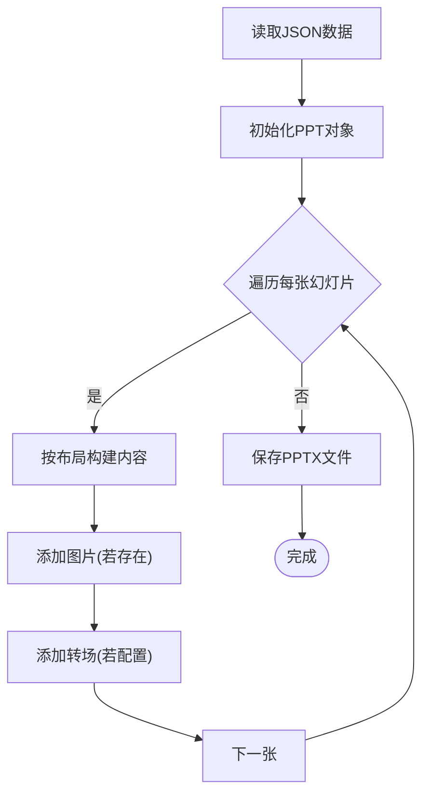
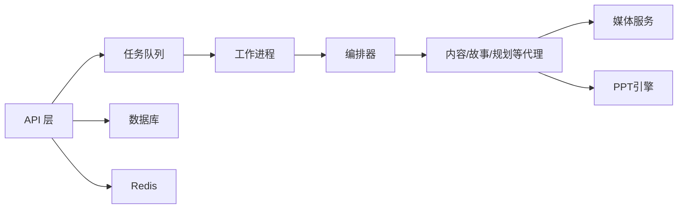
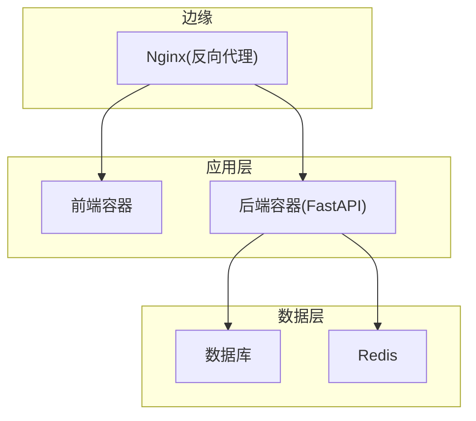

# 整体架构设计

<cite>
**本文引用的文件**
- [backend/main.py](file://backend/main.py)
- [backend/core/config.py](file://backend/core/config.py)
- [backend/core/db.py](file://backend/core/db.py)
- [backend/core/tasks.py](file://backend/core/tasks.py)
- [backend/core/deepseek.py](file://backend/core/deepseek.py)
- [backend/api/generate.py](file://backend/api/generate.py)
- [backend/agents/orchestrator.py](file://backend/agents/orchestrator.py)
- [backend/workers/ppt_worker.py](file://backend/workers/ppt_worker.py)
- [backend/models/ppt.py](file://backend/models/ppt.py)
- [frontend/src/App.jsx](file://frontend/src/App.jsx)
- [deployment/docker-compose.yml](file://deployment/docker-compose.yml)
- [deployment/nginx.conf](file://deployment/nginx.conf)
- [media-service/audio_gen.py](file://media-service/audio_gen.py)
- [media-service/image_gen.py](file://media-service/image_gen.py)
- [ppt-engine/engine.py](file://ppt-engine/engine.py)
</cite>

## 目录
1. [引言](#引言)
2. [项目结构](#项目结构)
3. [核心组件](#核心组件)
4. [架构总览](#架构总览)
5. [详细组件分析](#详细组件分析)
6. [依赖关系分析](#依赖关系分析)
7. [性能与可扩展性](#性能与可扩展性)
8. [高可用与容错](#高可用与容错)
9. [部署拓扑与网络架构](#部署拓扑与网络架构)
10. [故障排查指南](#故障排查指南)
11. [结论](#结论)

## 引言
本设计文档面向“AI-PPT系统”，系统采用前后端分离与轻量微服务化（以容器编排为核心）的分层架构：前端负责用户交互与路由；后端提供REST API与异步任务编排；智能生成流程由“代理编排器”驱动；媒体资源与PPT引擎分别作为独立模块协作；数据库与Redis用于持久化与缓存；Nginx作为反向代理与静态资源服务。系统通过Docker Compose进行本地开发与部署，具备良好的可扩展性与容错能力。

## 项目结构
系统采用按功能域划分的目录组织方式：
- backend：后端服务，FastAPI应用、API路由、核心配置、数据库、任务队列、代理编排与工作进程等
- frontend：React单页应用，页面路由与组件
- media-service：媒体资源生成（背景音乐、图片）
- ppt-engine：PPT导出引擎（基于python-pptx）
- deployment：容器编排与Nginx配置
- 其他：模板市场、输出目录等

图表来源
- [backend/main.py:16-40](file://backend/main.py#L16-L40)
- [backend/core/config.py:4-34](file://backend/core/config.py#L4-L34)
- [backend/core/db.py:1-27](file://backend/core/db.py#L1-L27)
- [backend/core/tasks.py:1-33](file://backend/core/tasks.py#L1-L33)
- [backend/agents/orchestrator.py:19-56](file://backend/agents/orchestrator.py#L19-L56)
- [backend/workers/ppt_worker.py:5-24](file://backend/workers/ppt_worker.py#L5-L24)
- [ppt-engine/engine.py:124-166](file://ppt-engine/engine.py#L124-L166)
- [media-service/audio_gen.py:12-34](file://media-service/audio_gen.py#L12-L34)
- [media-service/image_gen.py:6-26](file://media-service/image_gen.py#L6-L26)
- [deployment/docker-compose.yml:3-46](file://deployment/docker-compose.yml#L3-L46)
- [deployment/nginx.conf:12-20](file://deployment/nginx.conf#L12-L20)

章节来源
- [backend/main.py:16-40](file://backend/main.py#L16-L40)
- [frontend/src/App.jsx:14-34](file://frontend/src/App.jsx#L14-L34)
- [deployment/docker-compose.yml:3-46](file://deployment/docker-compose.yml#L3-L46)

## 核心组件
- 表现层（前端）
  - 基于React路由管理页面，负责用户交互与状态展示
  - 路由覆盖首页、认证、仪表盘、生成、市场、分析、课堂、模板、账单等页面
- 业务层（后端）
  - FastAPI应用，统一注册用户、计费、模板、生成、下载等路由
  - 提供健康检查接口与CORS跨域支持
  - 集成配置中心、数据库连接、任务队列与鉴权
- 数据层
  - 异步SQLAlchemy模型定义与初始化
  - 用户、PPT记录、订阅与用量记录等表结构
- 智能生成流水线
  - 编排器串联内容、意图、课程类型、故事、幻灯片规划、脚本、教师指导、视觉风格、图像提示、图像、动画、音乐、装配与导出等代理
  - 工作进程异步执行生成任务，维护任务状态与结果
- 媒体与引擎
  - 媒体服务：背景音乐下载与图片搜索下载
  - PPT引擎：根据布局构建幻灯片、添加文本框与转场效果、保存PPT文件

章节来源
- [frontend/src/App.jsx:14-34](file://frontend/src/App.jsx#L14-L34)
- [backend/main.py:16-40](file://backend/main.py#L16-L40)
- [backend/core/db.py:9-27](file://backend/core/db.py#L9-L27)
- [backend/models/ppt.py:6-18](file://backend/models/ppt.py#L6-L18)
- [backend/agents/orchestrator.py:19-56](file://backend/agents/orchestrator.py#L19-L56)
- [backend/workers/ppt_worker.py:5-24](file://backend/workers/ppt_worker.py#L5-L24)
- [media-service/audio_gen.py:12-34](file://media-service/audio_gen.py#L12-L34)
- [media-service/image_gen.py:19-26](file://media-service/image_gen.py#L19-L26)
- [ppt-engine/engine.py:124-166](file://ppt-engine/engine.py#L124-L166)

## 架构总览
系统采用“前端 + 后端API + 任务编排 + 媒体服务 + PPT引擎”的分层架构：
- 前端通过Nginx暴露的域名访问，静态资源由Nginx直接提供
- Nginx将/api/请求转发至后端服务
- 后端提供REST接口，处理鉴权、限流、任务创建与查询
- 任务通过内存字典存储，异步工作进程执行生成流水线
- 媒体服务与PPT引擎在流水线中被调用，最终产物落盘并记录到数据库

图表来源
- [deployment/nginx.conf:12-20](file://deployment/nginx.conf#L12-L20)
- [backend/main.py:30-34](file://backend/main.py#L30-L34)
- [backend/core/tasks.py:14-28](file://backend/core/tasks.py#L14-L28)
- [backend/workers/ppt_worker.py:5-24](file://backend/workers/ppt_worker.py#L5-L24)
- [backend/agents/orchestrator.py:19-56](file://backend/agents/orchestrator.py#L19-L56)
- [ppt-engine/engine.py:124-166](file://ppt-engine/engine.py#L124-L166)
- [media-service/audio_gen.py:12-34](file://media-service/audio_gen.py#L12-L34)
- [media-service/image_gen.py:19-26](file://media-service/image_gen.py#L19-L26)

## 详细组件分析

### 组件A：生成API与任务编排
- 功能职责
  - 接收生成请求，校验主题有效性与使用配额
  - 创建任务并返回任务ID，轮询查询任务状态与结果
- 关键流程
  - 请求进入后端路由，鉴权后检查使用配额
  - 创建任务并启动异步工作进程
  - 工作进程调用编排器，串行执行多代理步骤
  - 最终导出PPT并回填任务状态与结果

图表来源
- [backend/api/generate.py:20-52](file://backend/api/generate.py#L20-L52)
- [backend/core/tasks.py:14-28](file://backend/core/tasks.py#L14-L28)
- [backend/workers/ppt_worker.py:5-24](file://backend/workers/ppt_worker.py#L5-L24)
- [backend/agents/orchestrator.py:19-56](file://backend/agents/orchestrator.py#L19-L56)
- [ppt-engine/engine.py:124-166](file://ppt-engine/engine.py#L124-L166)

章节来源
- [backend/api/generate.py:20-52](file://backend/api/generate.py#L20-L52)
- [backend/core/tasks.py:14-28](file://backend/core/tasks.py#L14-L28)
- [backend/workers/ppt_worker.py:5-24](file://backend/workers/ppt_worker.py#L5-L24)
- [backend/agents/orchestrator.py:19-56](file://backend/agents/orchestrator.py#L19-L56)

### 组件B：智能代理编排器
- 设计要点
  - 将复杂生成过程拆分为多个专业代理，职责清晰
  - 通过编排器顺序调用，确保数据在代理间正确传递
  - 支持模板选择、故事构建、脚本写作、教师指导、视觉风格、图像生成、动画与音乐等模块
- 处理逻辑
  - 输入主题与可选模板ID
  - 输出标准化的PPT数据结构，随后进行质量检查与导出

图表来源
- [backend/agents/orchestrator.py:19-56](file://backend/agents/orchestrator.py#L19-L56)

章节来源
- [backend/agents/orchestrator.py:19-56](file://backend/agents/orchestrator.py#L19-L56)

### 组件C：PPT导出引擎
- 功能职责
  - 根据布局类型构建幻灯片，添加文本框、颜色与对齐
  - 支持多种布局（封面、章节、纯文本、图文、左右分割、总结）
  - 添加转场动画（可选），保存为PPTX文件
- 性能与复杂度
  - 单次导出时间与幻灯片数量近似线性相关
  - 文本框与图片绘制为O(n)，转场设置为O(1)

图表来源
- [ppt-engine/engine.py:124-166](file://ppt-engine/engine.py#L124-L166)

章节来源
- [ppt-engine/engine.py:124-166](file://ppt-engine/engine.py#L124-L166)

### 组件D：媒体服务
- 图像服务
  - 使用外部图片搜索工具批量下载，按页号归档
  - 并发拉取提升效率，异常时返回None
- 音频服务
  - 从公开音源随机或指定下载背景音乐
  - 支持缓存避免重复下载

章节来源
- [media-service/image_gen.py:6-26](file://media-service/image_gen.py#L6-L26)
- [media-service/audio_gen.py:12-34](file://media-service/audio_gen.py#L12-L34)

## 依赖关系分析
- 组件耦合
  - API层仅依赖任务队列与鉴权，低耦合
  - 工作进程与编排器强依赖，但通过接口隔离
  - 媒体服务与引擎模块与业务解耦，便于替换
- 外部依赖
  - HTTP客户端用于第三方大模型与媒体服务
  - 数据库与Redis用于持久化与缓存
- 潜在风险
  - 内存任务存储不具备持久化，重启丢失
  - 无显式重试与死信队列，失败恢复需增强

图表来源
- [backend/core/tasks.py:14-28](file://backend/core/tasks.py#L14-L28)
- [backend/workers/ppt_worker.py:5-24](file://backend/workers/ppt_worker.py#L5-L24)
- [backend/agents/orchestrator.py:19-56](file://backend/agents/orchestrator.py#L19-L56)
- [media-service/audio_gen.py:12-34](file://media-service/audio_gen.py#L12-L34)
- [media-service/image_gen.py:19-26](file://media-service/image_gen.py#L19-L26)
- [ppt-engine/engine.py:124-166](file://ppt-engine/engine.py#L124-L166)

章节来源
- [backend/core/tasks.py:14-28](file://backend/core/tasks.py#L14-L28)
- [backend/workers/ppt_worker.py:5-24](file://backend/workers/ppt_worker.py#L5-L24)
- [backend/agents/orchestrator.py:19-56](file://backend/agents/orchestrator.py#L19-L56)

## 性能与可扩展性
- 性能特性
  - 生成流程为CPU密集型与I/O混合，图片与音频下载为瓶颈
  - 并发下载与异步任务提升吞吐
- 扩展建议
  - 任务队列持久化：引入消息队列（如RabbitMQ/Kafka）与数据库存储
  - 垂直扩展：增加工作进程副本，按任务ID分片
  - 水平扩展：将媒体服务与PPT引擎拆分为独立服务，通过RPC或消息通信
  - 缓存优化：热点模板与生成中间结果缓存至Redis
  - CDN加速：静态资源与导出文件通过CDN分发

## 高可用与容错
- 容错机制
  - 任务状态机：排队/运行/完成/失败，失败时记录错误信息
  - 异常捕获：工作进程捕获异常并标记失败，保留traceback
- 可用性设计
  - Docker Compose默认重启策略：unless-stopped
  - Nginx超时与gzip压缩提升稳定性与性能
- 建议改进
  - 增加重试与退避策略
  - 引入健康检查与自动恢复
  - 多副本与负载均衡（Nginx上游多实例）

章节来源
- [backend/workers/ppt_worker.py:20-24](file://backend/workers/ppt_worker.py#L20-L24)
- [deployment/docker-compose.yml:15-17](file://deployment/docker-compose.yml#L15-L17)
- [deployment/nginx.conf:18-20](file://deployment/nginx.conf#L18-L20)

## 部署拓扑与网络架构
- 本地开发拓扑
  - 前端容器：Vite开发服务器或Nginx静态托管
  - 后端容器：FastAPI监听8000端口
  - Redis容器：缓存与会话
  - Nginx容器：反向代理与静态资源
- 网络架构
  - 前端通过Nginx访问后端API
  - 后端内部组件通过容器网络互通
  - 外部依赖：DeepSeek大模型API、媒体服务URL

图表来源
- [deployment/docker-compose.yml:3-46](file://deployment/docker-compose.yml#L3-L46)
- [deployment/nginx.conf:12-20](file://deployment/nginx.conf#L12-L20)

章节来源
- [deployment/docker-compose.yml:3-46](file://deployment/docker-compose.yml#L3-L46)
- [deployment/nginx.conf:12-20](file://deployment/nginx.conf#L12-L20)

## 故障排查指南
- 常见问题定位
  - 生成接口报错：检查任务是否存在、是否超过配额、工作进程是否正常
  - 媒体下载失败：检查网络代理、目标URL可达性与磁盘权限
  - PPT导出异常：确认模板与图片路径存在、字体与颜色配置合法
- 关键日志与状态
  - 任务状态：排队/运行/完成/失败
  - 错误信息：失败时记录在任务对象中
- 建议操作
  - 查看后端日志与工作进程异常堆栈
  - 清理临时目录与缓存，重试任务
  - 校验配置项（API密钥、输出目录、代理地址）

章节来源
- [backend/api/generate.py:38-52](file://backend/api/generate.py#L38-L52)
- [backend/workers/ppt_worker.py:20-24](file://backend/workers/ppt_worker.py#L20-L24)
- [backend/core/config.py:25-27](file://backend/core/config.py#L25-L27)

## 结论
本系统以“前端 + 后端API + 任务编排 + 媒体服务 + PPT引擎”的分层架构实现AI-PPT自动生成。通过容器化与Nginx反向代理，系统具备清晰的组件边界与良好的可扩展性。当前版本以内存任务队列与同步代理为主，建议后续引入消息队列、重试与监控体系，进一步提升高可用与可观测性。