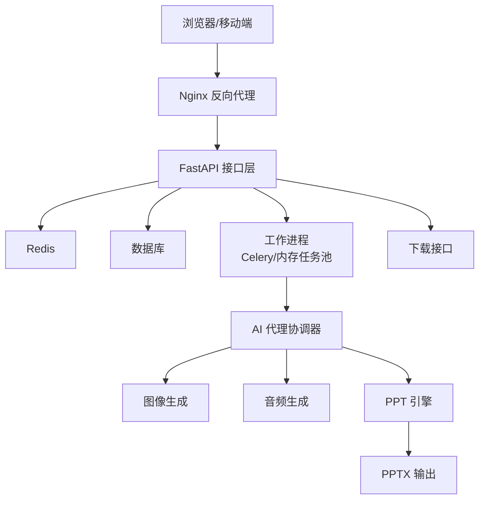
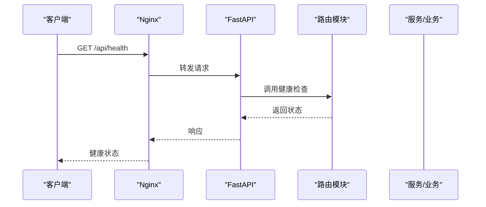
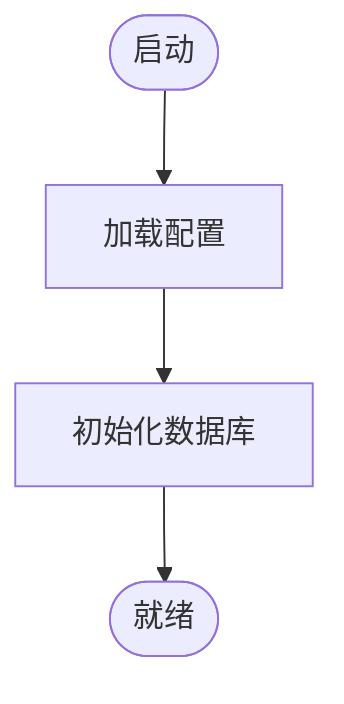
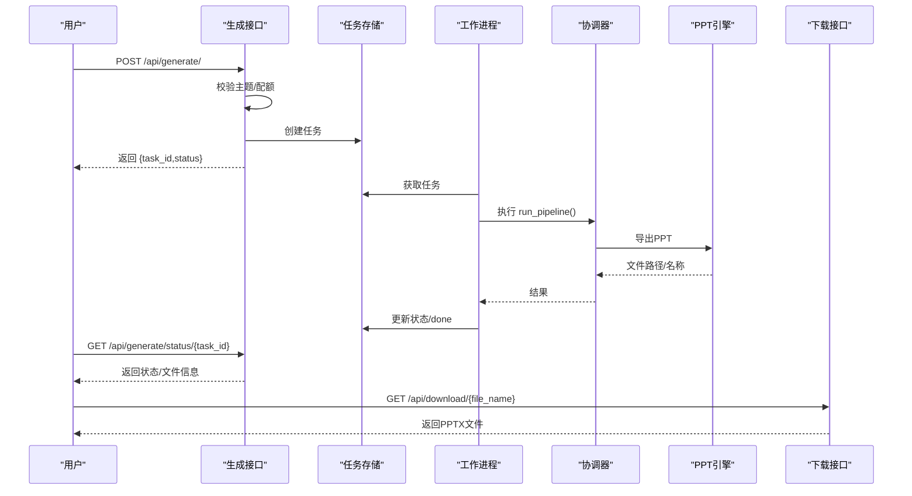
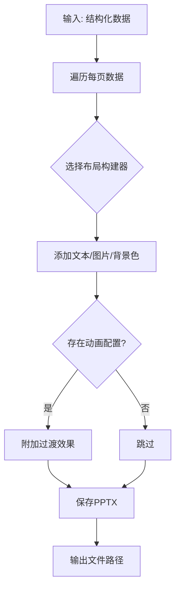
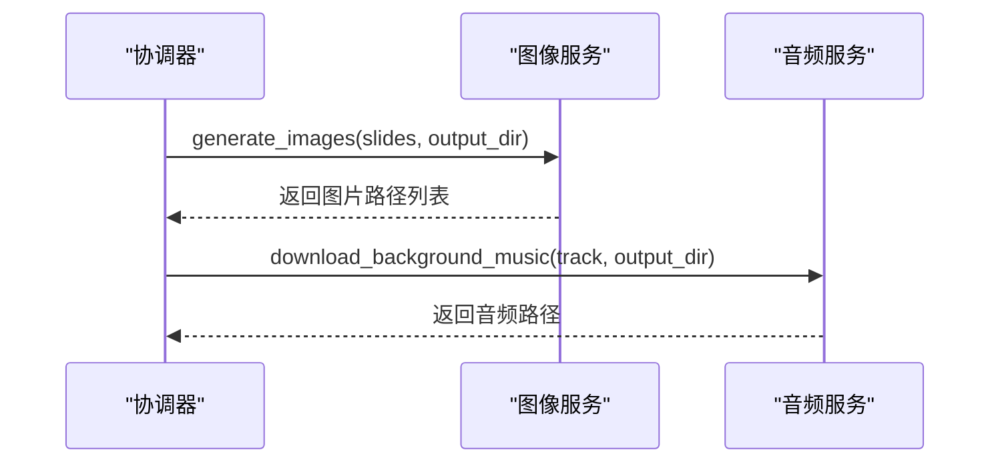
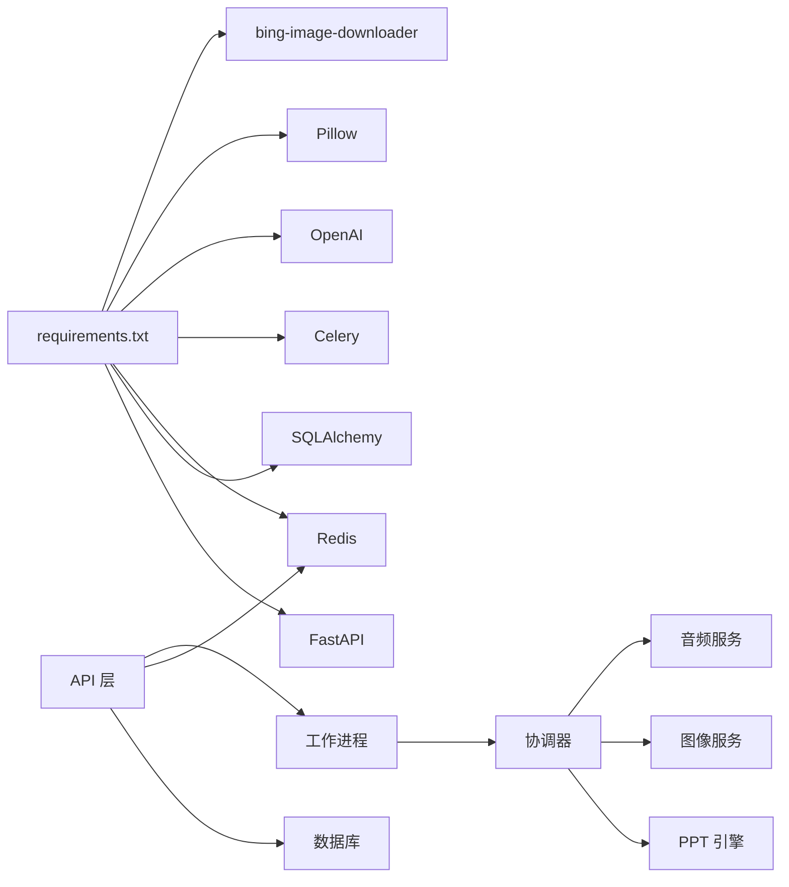
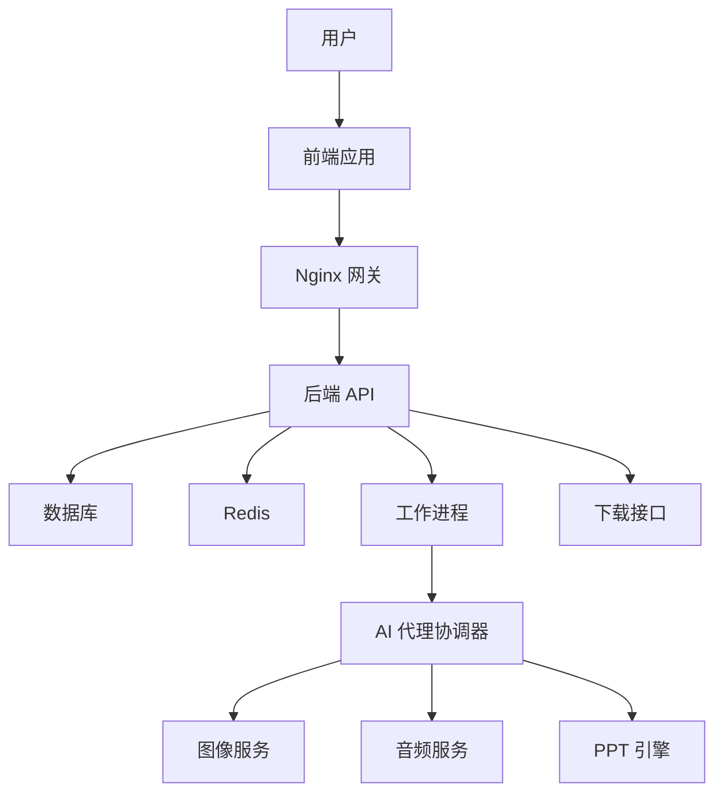

# 系统架构

<cite>
**本文引用的文件**
- [backend/main.py](file://backend/main.py)
- [backend/Dockerfile](file://backend/Dockerfile)
- [deployment/docker-compose.yml](file://deployment/docker-compose.yml)
- [deployment/nginx.conf](file://deployment/nginx.conf)
- [backend/core/config.py](file://backend/core/config.py)
- [backend/core/db.py](file://backend/core/db.py)
- [backend/api/generate.py](file://backend/api/generate.py)
- [backend/api/download.py](file://backend/api/download.py)
- [backend/requirements.txt](file://backend/requirements.txt)
- [backend/agents/orchestrator.py](file://backend/agents/orchestrator.py)
- [backend/workers/ppt_worker.py](file://backend/workers/ppt_worker.py)
- [ppt-engine/engine.py](file://ppt-engine/engine.py)
- [media-service/image_gen.py](file://media-service/image_gen.py)
- [media-service/audio_gen.py](file://media-service/audio_gen.py)
- [backend/demo_local.py](file://backend/demo_local.py)
</cite>

## 目录
1. [引言](#引言)
2. [项目结构](#项目结构)
3. [核心组件](#核心组件)
4. [架构总览](#架构总览)
5. [详细组件分析](#详细组件分析)
6. [依赖关系分析](#依赖关系分析)
7. [性能与可扩展性](#性能与可扩展性)
8. [故障排查指南](#故障排查指南)
9. [结论](#结论)
10. [附录](#附录)

## 引言
本架构文档面向AI-PPT系统（AI PPT OS V3），聚焦于微服务化后端、前端与外部服务的协同，以及AI代理协调器、PPT引擎与媒体服务之间的协作机制。文档从系统边界、组件交互、数据流、集成模式、技术决策与约束、基础设施与部署拓扑、安全与监控、灾难恢复等方面进行系统化阐述，并给出可视化图示以帮助不同背景读者快速理解。

## 项目结构
系统采用前后端分离与容器化部署策略：
- 后端：FastAPI应用，提供用户、计费、模板、生成与下载等接口；使用异步数据库连接与任务队列驱动生成流程。
- 前端：Vite构建的单页应用，通过Nginx反向代理访问后端API。
- 媒体服务：独立的图像与音频生成模块，支持异步批量处理。
- PPT引擎：独立的PPT渲染与导出模块，负责将结构化数据转换为PPTX文件。
- 部署：Docker Compose编排后端、前端与Redis；Nginx作为入口网关与静态资源服务。

```mermaid
graph TB
subgraph "客户端"
FE["前端应用<br/>Vite + React"]
end
subgraph "边缘与网关"
NGINX["Nginx 反向代理<br/>/api/ 转发到后端"]
end
subgraph "后端服务"
FASTAPI["FastAPI 应用<br/>路由: 用户/计费/模板/生成/下载"]
REDIS["Redis 缓存/任务状态"]
end
subgraph "AI与内容服务"
ORCH["AI 代理协调器<br/>orchestrator.py"]
MEDIA_IMG["媒体服务-图像<br/>image_gen.py"]
MEDIA_AUD["媒体服务-音频<br/>audio_gen.py"]
end
subgraph "渲染与导出"
PPTENG["PPT 引擎<br/>engine.py"]
end
subgraph "数据存储"
DB["SQLite/PostgreSQL<br/>SQLAlchemy 异步"]
end
FE --> NGINX --> FASTAPI
FASTAPI <- --> REDIS
FASTAPI --> ORCH
ORCH --> MEDIA_IMG
ORCH --> MEDIA_AUD
ORCH --> PPTENG
FASTAPI --> DB
```

图表来源
- [deployment/docker-compose.yml:1-46](file://deployment/docker-compose.yml#L1-L46)
- [deployment/nginx.conf:1-26](file://deployment/nginx.conf#L1-L26)
- [backend/main.py:1-40](file://backend/main.py#L1-L40)
- [backend/agents/orchestrator.py:1-56](file://backend/agents/orchestrator.py#L1-L56)
- [ppt-engine/engine.py:1-166](file://ppt-engine/engine.py#L1-L166)
- [media-service/image_gen.py:1-26](file://media-service/image_gen.py#L1-L26)
- [media-service/audio_gen.py:1-34](file://media-service/audio_gen.py#L1-L34)
- [backend/core/db.py:1-27](file://backend/core/db.py#L1-L27)

章节来源
- [deployment/docker-compose.yml:1-46](file://deployment/docker-compose.yml#L1-L46)
- [deployment/nginx.conf:1-26](file://deployment/nginx.conf#L1-L26)
- [backend/main.py:1-40](file://backend/main.py#L1-L40)

## 核心组件
- 后端主程序与生命周期管理：初始化数据库、注册路由、健康检查端点。
- 配置中心：集中管理数据库、缓存、鉴权、支付、输出目录、代理等配置。
- 数据层：异步SQLAlchemy引擎与会话管理，支持SQLite/PostgreSQL。
- API层：生成请求校验、配额检查、任务创建与状态查询；下载接口提供PPTX文件。
- AI代理协调器：串联内容、意图、课程类型、故事、幻灯片规划、脚本、教师指导、视觉风格、图片提示、图片、动画、音乐、装配、质量检查与导出。
- 工作进程：基于内存的任务存储，异步执行生成流水线。
- PPT引擎：根据布局构建幻灯片、添加文本与图片、设置颜色与字体、保存PPTX。
- 媒体服务：图像搜索与下载、背景音乐下载。
- 部署与运行时：Docker镜像、Compose编排、Nginx网关。

章节来源
- [backend/main.py:1-40](file://backend/main.py#L1-L40)
- [backend/core/config.py:1-34](file://backend/core/config.py#L1-L34)
- [backend/core/db.py:1-27](file://backend/core/db.py#L1-L27)
- [backend/api/generate.py:1-52](file://backend/api/generate.py#L1-L52)
- [backend/api/download.py:1-15](file://backend/api/download.py#L1-L15)
- [backend/agents/orchestrator.py:1-56](file://backend/agents/orchestrator.py#L1-L56)
- [backend/workers/ppt_worker.py:1-24](file://backend/workers/ppt_worker.py#L1-L24)
- [ppt-engine/engine.py:1-166](file://ppt-engine/engine.py#L1-L166)
- [media-service/image_gen.py:1-26](file://media-service/image_gen.py#L1-L26)
- [media-service/audio_gen.py:1-34](file://media-service/audio_gen.py#L1-L34)
- [backend/Dockerfile:1-15](file://backend/Dockerfile#L1-L15)

## 架构总览
系统采用“API网关 + 微服务后端 + 外部媒体服务 + 渲染引擎”的分层架构。后端通过任务队列异步执行AI生成流程，前端通过Nginx统一接入，Redis用于任务状态与缓存，数据库持久化用户、订阅与生成记录。



图表来源
- [deployment/nginx.conf:12-20](file://deployment/nginx.conf#L12-L20)
- [backend/api/generate.py:20-35](file://backend/api/generate.py#L20-L35)
- [backend/workers/ppt_worker.py:5-24](file://backend/workers/ppt_worker.py#L5-L24)
- [backend/agents/orchestrator.py:19-56](file://backend/agents/orchestrator.py#L19-L56)
- [ppt-engine/engine.py:124-147](file://ppt-engine/engine.py#L124-L147)
- [backend/api/download.py:9-14](file://backend/api/download.py#L9-L14)

## 详细组件分析

### 后端主程序与路由
- 生命周期：启动时初始化数据库，提供健康检查端点。
- 中间件：启用CORS，便于跨域访问。
- 路由：用户、计费、模板、生成、下载模块注册。



图表来源
- [backend/main.py:10-20](file://backend/main.py#L10-L20)
- [backend/main.py:37-40](file://backend/main.py#L37-L40)

章节来源
- [backend/main.py:1-40](file://backend/main.py#L1-L40)

### 配置与数据库
- 配置：集中读取环境变量，覆盖应用名、数据库URL、Redis地址、JWT密钥、Stripe密钥、配额与价格、输出/上传目录、代理等。
- 数据库：异步引擎与会话工厂，启动时创建表。



图表来源
- [backend/core/config.py:4-34](file://backend/core/config.py#L4-L34)
- [backend/core/db.py:21-27](file://backend/core/db.py#L21-L27)

章节来源
- [backend/core/config.py:1-34](file://backend/core/config.py#L1-L34)
- [backend/core/db.py:1-27](file://backend/core/db.py#L1-L27)

### 生成流程与任务系统
- 请求校验：主题必填且长度有效；检查配额。
- 任务创建：写入任务存储，返回任务ID与状态。
- 状态查询：根据任务ID返回进度、结果、错误信息与下载链接。
- 工作进程：更新任务状态，调用AI协调器执行流水线，捕获异常并标记失败。



图表来源
- [backend/api/generate.py:20-52](file://backend/api/generate.py#L20-L52)
- [backend/workers/ppt_worker.py:5-24](file://backend/workers/ppt_worker.py#L5-L24)
- [backend/agents/orchestrator.py:19-56](file://backend/agents/orchestrator.py#L19-L56)
- [ppt-engine/engine.py:124-147](file://ppt-engine/engine.py#L124-L147)
- [backend/api/download.py:9-14](file://backend/api/download.py#L9-L14)

章节来源
- [backend/api/generate.py:1-52](file://backend/api/generate.py#L1-L52)
- [backend/workers/ppt_worker.py:1-24](file://backend/workers/ppt_worker.py#L1-L24)

### AI代理协调器
- 协调器按顺序调用多个代理：内容、意图、课程类型、模板、故事、幻灯片规划、脚本、教师指导、视觉风格、图片提示、图片、动画、音乐、装配、QA与导出。
- 每个代理专注单一职责，便于替换与扩展。

```mermaid
classDiagram
class Orchestrator {
+run_pipeline(topic, user_id, template_id) dict
}
class ContentAgent
class IntentAgent
class CourseTypeAgent
class TemplateAgent
class StoryAgent
class SlidePlannerAgent
class ScriptWriterAgent
class TeacherGuideAgent
class VisualStyleAgent
class ImagePromptAgent
class ImageAgent
class AnimationAgent
class MusicAgent
class PPTAssemblerAgent
class QAAgent
class ExportAgent
Orchestrator --> ContentAgent
Orchestrator --> IntentAgent
Orchestrator --> CourseTypeAgent
Orchestrator --> TemplateAgent
Orchestrator --> StoryAgent
Orchestrator --> SlidePlannerAgent
Orchestrator --> ScriptWriterAgent
Orchestrator --> TeacherGuideAgent
Orchestrator --> VisualStyleAgent
Orchestrator --> ImagePromptAgent
Orchestrator --> ImageAgent
Orchestrator --> AnimationAgent
Orchestrator --> MusicAgent
Orchestrator --> PPTAssemblerAgent
Orchestrator --> QAAgent
Orchestrator --> ExportAgent
```



图表来源
- [backend/agents/orchestrator.py:1-56](file://backend/agents/orchestrator.py#L1-L56)

章节来源
- [backend/agents/orchestrator.py:1-56](file://backend/agents/orchestrator.py#L1-L56)

### PPT引擎
- 支持封面、章节、纯文本、图文、左右分割、总结等布局。
- 提供颜色、字体、对齐、图片插入与过渡效果设置。
- 将结构化数据序列化为PPTX文件。



图表来源
- [ppt-engine/engine.py:124-147](file://ppt-engine/engine.py#L124-L147)
- [ppt-engine/engine.py:15-22](file://ppt-engine/engine.py#L15-L22)
- [ppt-engine/engine.py:46-122](file://ppt-engine/engine.py#L46-L122)

章节来源
- [ppt-engine/engine.py:1-166](file://ppt-engine/engine.py#L1-L166)

### 媒体服务
- 图像服务：基于关键词批量下载图片，按页面编号组织输出。
- 音频服务：随机或指定曲目下载背景音乐至本地缓存。



图表来源
- [backend/agents/orchestrator.py:32-35](file://backend/agents/orchestrator.py#L32-L35)
- [media-service/image_gen.py:19-26](file://media-service/image_gen.py#L19-L26)
- [media-service/audio_gen.py:12-34](file://media-service/audio_gen.py#L12-L34)

章节来源
- [media-service/image_gen.py:1-26](file://media-service/image_gen.py#L1-L26)
- [media-service/audio_gen.py:1-34](file://media-service/audio_gen.py#L1-L34)

### 下载与静态资源
- 下载接口：根据文件名返回PPTX文件。
- Nginx：静态资源与反向代理，转发/api/到后端，设置超时与压缩。

章节来源
- [backend/api/download.py:1-15](file://backend/api/download.py#L1-L15)
- [deployment/nginx.conf:1-26](file://deployment/nginx.conf#L1-L26)

## 依赖关系分析
- 技术栈与版本：FastAPI、Uvicorn、Pydantic、SQLAlchemy、asyncpg/aiosqlite、Redis、Celery、Jinja2、OpenAI、Pillow、Bing图片下载器等。
- 组件耦合：API层依赖配置与数据库；生成流程依赖任务存储与协调器；协调器依赖媒体服务与PPT引擎；前端通过Nginx访问后端。



图表来源
- [backend/requirements.txt:1-22](file://backend/requirements.txt#L1-L22)

章节来源
- [backend/requirements.txt:1-22](file://backend/requirements.txt#L1-L22)

## 性能与可扩展性
- 异步化：数据库与HTTP客户端均采用异步实现，降低I/O阻塞。
- 并发与批处理：媒体服务使用异步并发下载，提升图片与音频获取效率。
- 缓存与队列：Redis用于任务状态与缓存，Celery用于分布式任务队列（当前使用内存任务池）。
- 存储与I/O：PPT引擎直接写入磁盘，建议在生产环境挂载高性能卷并开启SSD。
- 网关与反向代理：Nginx提供静态资源与反向代理，建议启用gzip与合理超时。
- 扩展方向：后端可水平扩展；媒体服务可拆分为独立微服务；PPT引擎可容器化并按需扩缩容。

## 故障排查指南
- 健康检查：访问后端健康端点确认服务可用。
- 任务状态：通过状态查询接口确认任务是否完成或失败。
- 日志与错误：工作进程捕获异常并记录堆栈，便于定位问题。
- 文件下载：确认输出目录映射正确，文件存在且未被清理。
- 网关与路由：检查Nginx代理规则与后端端口映射。

章节来源
- [backend/main.py:37-40](file://backend/main.py#L37-L40)
- [backend/api/generate.py:38-52](file://backend/api/generate.py#L38-L52)
- [backend/workers/ppt_worker.py:20-24](file://backend/workers/ppt_worker.py#L20-L24)
- [backend/api/download.py:10-14](file://backend/api/download.py#L10-L14)
- [deployment/docker-compose.yml:12-14](file://deployment/docker-compose.yml#L12-L14)

## 结论
本系统通过清晰的分层与模块化设计，实现了从AI内容生成到PPT导出的完整链路。后端以FastAPI为核心，配合异步数据库与任务队列，前端通过Nginx统一接入，媒体服务与PPT引擎分别承担多媒体与渲染职责。该架构具备良好的可维护性与扩展性，适合在生产环境中进一步引入分布式任务队列、独立媒体服务与容器编排平台以提升稳定性与吞吐量。

## 附录

### 系统上下文图


图表来源
- [deployment/nginx.conf:1-26](file://deployment/nginx.conf#L1-L26)
- [backend/main.py:1-40](file://backend/main.py#L1-L40)
- [backend/api/generate.py:1-52](file://backend/api/generate.py#L1-L52)
- [backend/workers/ppt_worker.py:1-24](file://backend/workers/ppt_worker.py#L1-L24)
- [backend/agents/orchestrator.py:1-56](file://backend/agents/orchestrator.py#L1-L56)
- [ppt-engine/engine.py:1-166](file://ppt-engine/engine.py#L1-L166)
- [media-service/image_gen.py:1-26](file://media-service/image_gen.py#L1-L26)
- [media-service/audio_gen.py:1-34](file://media-service/audio_gen.py#L1-L34)

### 部署拓扑与基础设施
- 容器编排：后端、前端、Redis通过Docker Compose编排，共享自定义网络。
- 端口映射：后端8000、前端3000、Redis6379。
- 卷挂载：输出目录与数据目录映射到宿主机，便于持久化与调试。
- 网关：Nginx监听3000端口，反向代理/api/到后端，启用gzip压缩。

章节来源
- [deployment/docker-compose.yml:1-46](file://deployment/docker-compose.yml#L1-L46)
- [deployment/nginx.conf:1-26](file://deployment/nginx.conf#L1-L26)
- [backend/Dockerfile:1-15](file://backend/Dockerfile#L1-L15)

### 安全与合规
- CORS：后端启用CORS中间件，便于开发与测试阶段跨域访问。
- JWT：配置中包含JWT密钥与算法，建议在生产环境更换默认密钥并启用HTTPS。
- Stripe：提供密钥与Webhook密钥字段，建议在生产环境配置安全的密钥管理与审计日志。
- 代理：支持配置代理URL，便于内网或受限网络环境下的外部服务访问。

章节来源
- [backend/main.py:22-28](file://backend/main.py#L22-L28)
- [backend/core/config.py:14-27](file://backend/core/config.py#L14-L27)

### 监控与可观测性
- 健康检查：后端提供健康端点，便于Kubernetes/容器编排平台探活。
- 日志：工作进程捕获异常堆栈，建议结合集中式日志收集系统。
- 指标：建议引入指标采集（如Prometheus）与告警（如Grafana），监控任务队列长度、PPT生成耗时与资源占用。

章节来源
- [backend/main.py:37-40](file://backend/main.py#L37-L40)
- [backend/workers/ppt_worker.py:20-24](file://backend/workers/ppt_worker.py#L20-L24)

### 灾难恢复
- 数据备份：数据库与输出目录定期备份，确保PPT文件与用户数据可恢复。
- 缓存与任务：Redis持久化配置与任务重试策略，避免任务丢失。
- 网关与前端：Nginx与静态资源可快速回滚与切换，保证服务连续性。

章节来源
- [backend/core/db.py:21-27](file://backend/core/db.py#L21-L27)
- [deployment/docker-compose.yml:41-46](file://deployment/docker-compose.yml#L41-L46)

### 开发与演示
- 本地演示：提供本地脚本直接调用PPT引擎生成演示文件，便于验证渲染逻辑。

章节来源
- [backend/demo_local.py:1-24](file://backend/demo_local.py#L1-L24)