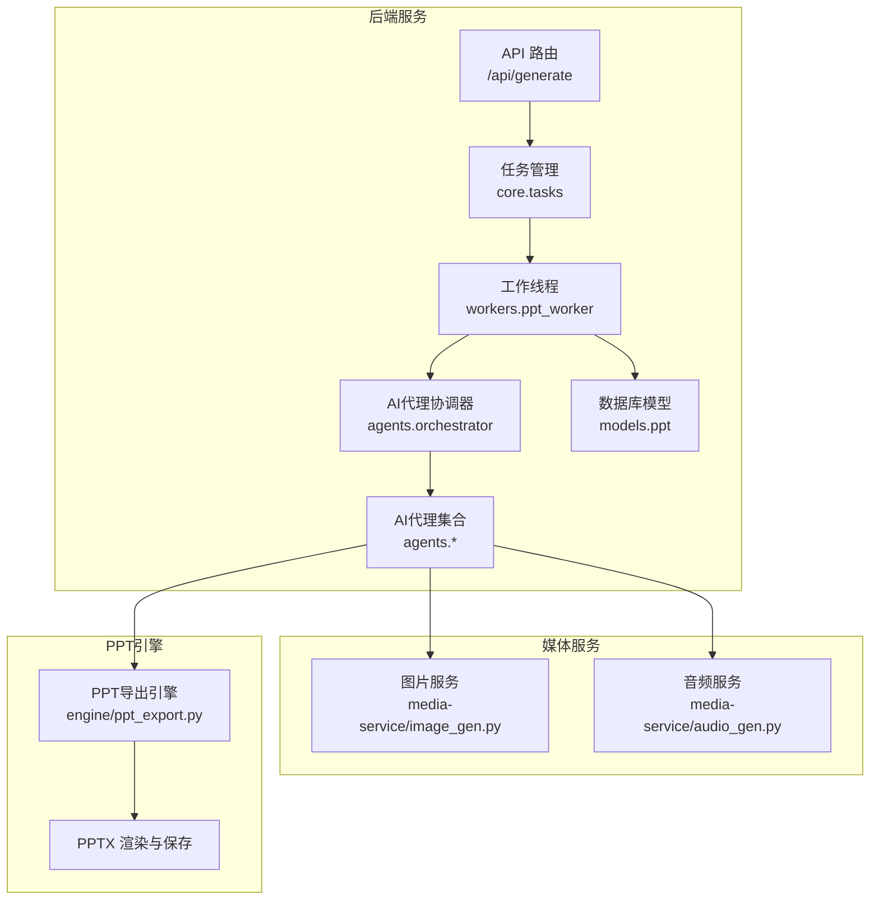
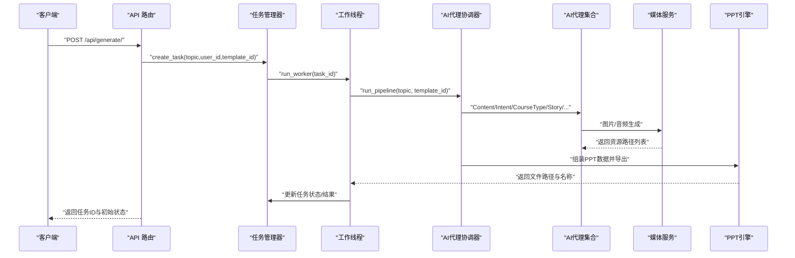
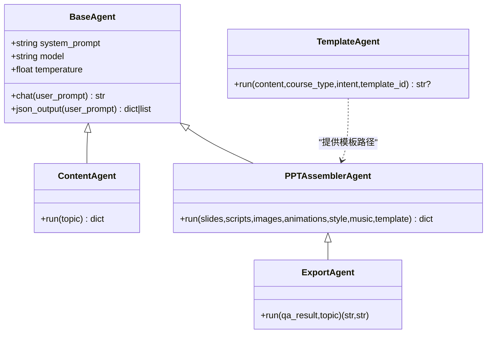
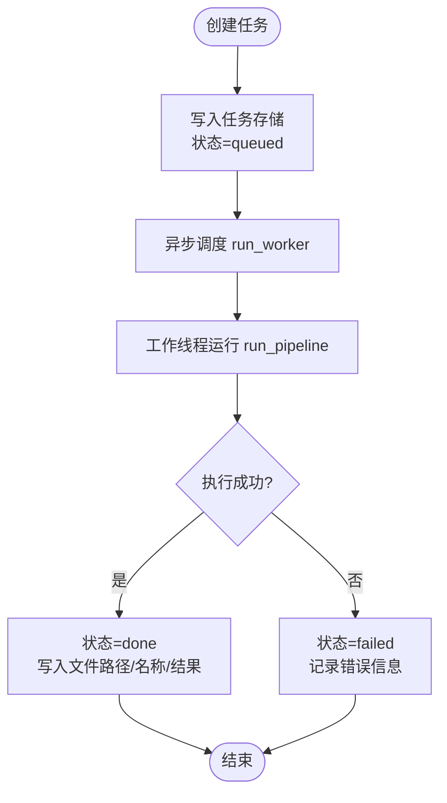
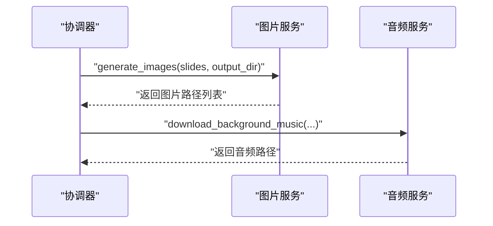
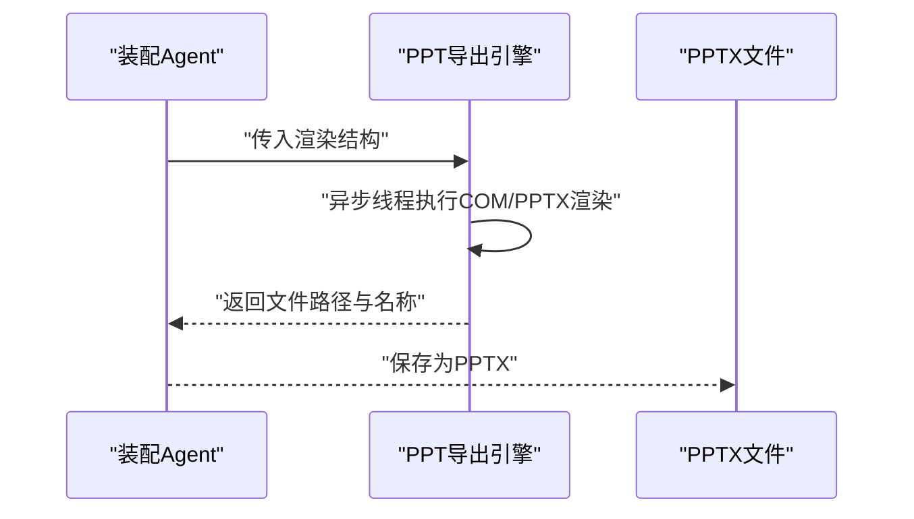
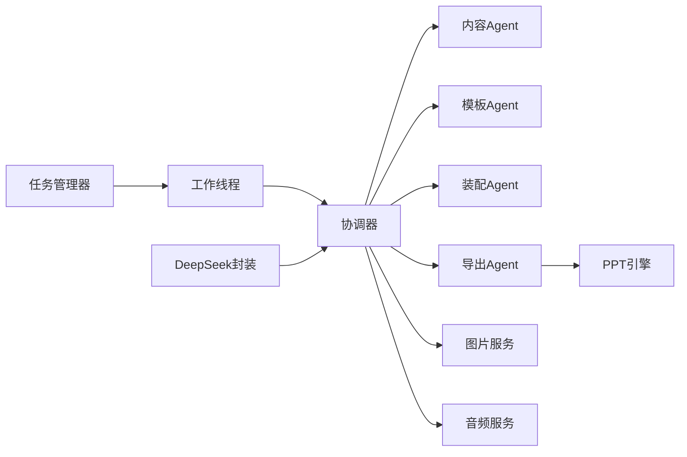

# 组件交互关系

<cite>
**本文引用的文件**
- [backend/main.py](file://backend/main.py)
- [backend/agents/orchestrator.py](file://backend/agents/orchestrator.py)
- [backend/agents/base.py](file://backend/agents/base.py)
- [backend/core/deepseek.py](file://backend/core/deepseek.py)
- [backend/workers/ppt_worker.py](file://backend/workers/ppt_worker.py)
- [backend/core/tasks.py](file://backend/core/tasks.py)
- [backend/api/generate.py](file://backend/api/generate.py)
- [backend/models/ppt.py](file://backend/models/ppt.py)
- [engine/ppt_export.py](file://engine/ppt_export.py)
- [media-service/image_gen.py](file://media-service/image_gen.py)
- [media-service/audio_gen.py](file://media-service/audio_gen.py)
- [backend/agents/content.py](file://backend/agents/content.py)
- [backend/agents/template.py](file://backend/agents/template.py)
- [backend/agents/assembler.py](file://backend/agents/assembler.py)
- [backend/agents/export.py](file://backend/agents/export.py)
</cite>

## 目录
1. [引言](#引言)
2. [项目结构](#项目结构)
3. [核心组件](#核心组件)
4. [架构总览](#架构总览)
5. [详细组件分析](#详细组件分析)
6. [依赖分析](#依赖分析)
7. [性能考虑](#性能考虑)
8. [故障排查指南](#故障排查指南)
9. [结论](#结论)
10. [附录](#附录)

## 引言
本文件聚焦于AI PPT生成系统的组件交互关系，围绕“AI代理协调器”“PPT引擎”“媒体服务”“任务队列”等核心模块，系统梳理其调用链路、消息传递与状态同步机制；同时给出生命周期管理、错误传播与异常处理策略，并通过时序图展示典型业务流程。

## 项目结构
系统采用前后端分离与多子工程协同的组织方式：
- 后端（FastAPI）：负责API路由、任务编排、AI代理调度与持久化
- AI代理层：按职责拆分多个Agent，完成内容规划、模板选择、装配与导出
- 媒体服务：图片与音频资源的异步生成与下载
- PPT引擎：基于Python-PPTX的PPT渲染与保存
- 任务队列：内存态的任务存储与异步执行调度

图表来源
- [backend/api/generate.py:1-52](file://backend/api/generate.py#L1-L52)
- [backend/core/tasks.py:1-33](file://backend/core/tasks.py#L1-L33)
- [backend/workers/ppt_worker.py:1-24](file://backend/workers/ppt_worker.py#L1-L24)
- [backend/agents/orchestrator.py:1-56](file://backend/agents/orchestrator.py#L1-L56)
- [backend/agents/base.py:1-24](file://backend/agents/base.py#L1-L24)
- [media-service/image_gen.py:1-26](file://media-service/image_gen.py#L1-L26)
- [media-service/audio_gen.py:1-34](file://media-service/audio_gen.py#L1-L34)
- [engine/ppt_export.py:1-257](file://engine/ppt_export.py#L1-L257)
- [backend/models/ppt.py:1-18](file://backend/models/ppt.py#L1-L18)

章节来源
- [backend/main.py:1-40](file://backend/main.py#L1-L40)
- [backend/api/generate.py:1-52](file://backend/api/generate.py#L1-L52)
- [backend/core/tasks.py:1-33](file://backend/core/tasks.py#L1-L33)

## 核心组件
- AI代理协调器：串联内容、意图、课程类型、故事、幻灯片规划、脚本、教师指南、视觉风格、图像提示、图像、动画、音乐、模板与装配、质量检查与导出等环节
- 任务队列与工作线程：以内存字典作为任务存储，异步调度执行，维护状态与结果
- 媒体服务：图片与音频的异步下载与缓存，支持并发批量生成
- PPT引擎：基于Python-PPTX的PPT渲染与保存，兼容模板与布局
- API网关：对外暴露生成与状态查询接口，进行鉴权与配额校验

章节来源
- [backend/agents/orchestrator.py:19-56](file://backend/agents/orchestrator.py#L19-L56)
- [backend/workers/ppt_worker.py:5-24](file://backend/workers/ppt_worker.py#L5-L24)
- [backend/core/tasks.py:8-33](file://backend/core/tasks.py#L8-L33)
- [media-service/image_gen.py:19-26](file://media-service/image_gen.py#L19-L26)
- [media-service/audio_gen.py:12-34](file://media-service/audio_gen.py#L12-L34)
- [engine/ppt_export.py:245-257](file://engine/ppt_export.py#L245-L257)
- [backend/api/generate.py:20-52](file://backend/api/generate.py#L20-L52)

## 架构总览
系统采用“请求驱动 + 协调器 + 多Agent + 媒体服务 + 引擎”的分层架构：
- 入口层：FastAPI路由接收请求，鉴权与配额校验后创建任务
- 控制层：任务管理器将任务投递到工作线程，工作线程调用AI代理协调器
- 执行层：各Agent按顺序产出中间数据，媒体服务异步生成资源，最终由引擎渲染PPT
- 状态层：内存态任务存储承载状态流转，供前端轮询查询

图表来源
- [backend/api/generate.py:20-52](file://backend/api/generate.py#L20-L52)
- [backend/core/tasks.py:14-28](file://backend/core/tasks.py#L14-L28)
- [backend/workers/ppt_worker.py:5-24](file://backend/workers/ppt_worker.py#L5-L24)
- [backend/agents/orchestrator.py:19-56](file://backend/agents/orchestrator.py#L19-L56)
- [media-service/image_gen.py:19-26](file://media-service/image_gen.py#L19-L26)
- [media-service/audio_gen.py:12-34](file://media-service/audio_gen.py#L12-L34)
- [engine/ppt_export.py:245-257](file://engine/ppt_export.py#L245-L257)

## 详细组件分析

### AI代理协调器与Agent体系
- 协调器负责严格顺序的流水线式调用，确保上一步产物作为下一步输入
- Agent基类统一了大模型调用能力（文本与JSON），便于扩展新Agent
- 关键Agent职责：
  - 内容Agent：解析主题，抽取类型、受众、要点、页数等
  - 模板Agent：根据主题关键词匹配模板路径
  - 装配Agent：将各源数据整合为PPT渲染结构
  - 导出Agent：使用Python-PPTX生成PPTX文件

图表来源
- [backend/agents/base.py:5-24](file://backend/agents/base.py#L5-L24)
- [backend/agents/content.py:4-21](file://backend/agents/content.py#L4-L21)
- [backend/agents/template.py:7-33](file://backend/agents/template.py#L7-L33)
- [backend/agents/assembler.py:4-89](file://backend/agents/assembler.py#L4-L89)
- [backend/agents/export.py:10-65](file://backend/agents/export.py#L10-L65)

章节来源
- [backend/agents/orchestrator.py:19-56](file://backend/agents/orchestrator.py#L19-L56)
- [backend/agents/base.py:10-24](file://backend/agents/base.py#L10-L24)
- [backend/agents/content.py:7-21](file://backend/agents/content.py#L7-L21)
- [backend/agents/template.py:8-33](file://backend/agents/template.py#L8-L33)
- [backend/agents/assembler.py:16-89](file://backend/agents/assembler.py#L16-L89)
- [backend/agents/export.py:11-65](file://backend/agents/export.py#L11-L65)

### 任务队列与工作线程
- 任务存储：全局字典，键为UUID，值包含状态、参数、结果与错误
- 创建任务：生成UUID，写入初始状态并触发异步执行
- 执行流程：工作线程从存储读取任务，调用协调器，捕获异常并回填状态
- 查询接口：根据任务ID返回状态、文件URL、进度与错误

图表来源
- [backend/core/tasks.py:14-28](file://backend/core/tasks.py#L14-L28)
- [backend/workers/ppt_worker.py:5-24](file://backend/workers/ppt_worker.py#L5-L24)
- [backend/api/generate.py:38-52](file://backend/api/generate.py#L38-L52)

章节来源
- [backend/core/tasks.py:1-33](file://backend/core/tasks.py#L1-L33)
- [backend/workers/ppt_worker.py:1-24](file://backend/workers/ppt_worker.py#L1-L24)
- [backend/api/generate.py:20-52](file://backend/api/generate.py#L20-L52)

### 媒体服务（图片与音频）
- 图片服务：对每页幻灯片并发发起搜索，使用下载器生成本地路径
- 音频服务：随机或指定曲目下载背景音乐，支持缓存复用
- 二者均采用异步并发，提升整体吞吐

图表来源
- [media-service/image_gen.py:19-26](file://media-service/image_gen.py#L19-L26)
- [media-service/audio_gen.py:12-34](file://media-service/audio_gen.py#L12-L34)

章节来源
- [media-service/image_gen.py:1-26](file://media-service/image_gen.py#L1-L26)
- [media-service/audio_gen.py:1-34](file://media-service/audio_gen.py#L1-L34)

### PPT引擎与导出
- 引擎支持Windows平台COM对象调用与图片/音频下载，异步线程执行，避免阻塞事件循环
- 导出Agent使用Python-PPTX加载模板或默认布局，逐页渲染标题、内容占位符，最终保存为PPTX

图表来源
- [backend/agents/assembler.py:16-89](file://backend/agents/assembler.py#L16-L89)
- [engine/ppt_export.py:245-257](file://engine/ppt_export.py#L245-L257)
- [backend/agents/export.py:11-65](file://backend/agents/export.py#L11-L65)

章节来源
- [engine/ppt_export.py:1-257](file://engine/ppt_export.py#L1-L257)
- [backend/agents/export.py:1-65](file://backend/agents/export.py#L1-L65)

### API与鉴权、配额控制
- 生成接口：鉴权后校验主题有效性，检查配额，创建任务并返回任务ID
- 状态查询：返回当前状态、可下载链接、进度与错误信息

章节来源
- [backend/api/generate.py:20-52](file://backend/api/generate.py#L20-L52)

## 依赖分析
- 组件内聚与耦合
  - 协调器与Agent之间为顺序耦合，职责清晰，便于扩展新Agent
  - 媒体服务与引擎对Agent透明，仅依赖约定的数据结构
  - 任务管理器与工作线程通过共享存储解耦，利于横向扩展
- 外部依赖
  - 大模型：DeepSeek API，统一在核心模块封装
  - PPT引擎：依赖win32com（Windows）与python-pptx
  - 媒体下载：依赖外部下载器与HTTP服务

图表来源
- [backend/agents/orchestrator.py:1-56](file://backend/agents/orchestrator.py#L1-L56)
- [backend/core/deepseek.py:9-40](file://backend/core/deepseek.py#L9-L40)
- [backend/core/tasks.py:1-33](file://backend/core/tasks.py#L1-L33)
- [backend/workers/ppt_worker.py:1-24](file://backend/workers/ppt_worker.py#L1-L24)
- [media-service/image_gen.py:1-26](file://media-service/image_gen.py#L1-L26)
- [media-service/audio_gen.py:1-34](file://media-service/audio_gen.py#L1-L34)
- [engine/ppt_export.py:1-257](file://engine/ppt_export.py#L1-L257)

## 性能考虑
- 并发与异步
  - 媒体服务使用异步并发生成图片与音频，显著降低I/O等待
  - 引擎在独立线程中执行，避免阻塞主事件循环
- 缓存与复用
  - 音频下载具备缓存判断，减少重复网络请求
- 可扩展性
  - 任务存储与工作线程解耦，便于水平扩展
  - Agent接口统一，新增Agent无需修改协调器

## 故障排查指南
- 常见问题定位
  - 任务状态长期为“排队/运行”：检查任务存储是否被清理、工作线程是否存活
  - 导出失败：检查PPT引擎线程是否抛错、模板路径是否存在、权限是否允许COM访问
  - 媒体资源缺失：确认下载器可用性、网络连通性与关键字拼接逻辑
- 错误传播与异常处理
  - 工作线程捕获异常并回填错误信息，API层返回状态与错误字段
  - 大模型调用异常在封装处统一处理，避免泄露密钥与细节

章节来源
- [backend/workers/ppt_worker.py:10-24](file://backend/workers/ppt_worker.py#L10-L24)
- [backend/api/generate.py:38-52](file://backend/api/generate.py#L38-L52)
- [backend/core/deepseek.py:15-33](file://backend/core/deepseek.py#L15-L33)

## 结论
该系统通过“协调器+多Agent+媒体服务+引擎”的分层设计实现了高内聚、低耦合的组件交互。任务队列与异步执行保障了吞吐与稳定性，统一的大模型封装与数据契约降低了集成成本。建议后续引入持久化任务存储、分布式工作线程池与更细粒度的可观测性指标以进一步增强可靠性与可运维性。

## 附录
- 数据模型（PPT记录）
  - 字段：用户ID、主题、页数、文件路径、文件名、状态、幻灯片JSON、创建时间
  - 用途：持久化生成结果，支撑下载与统计

章节来源
- [backend/models/ppt.py:6-18](file://backend/models/ppt.py#L6-L18)