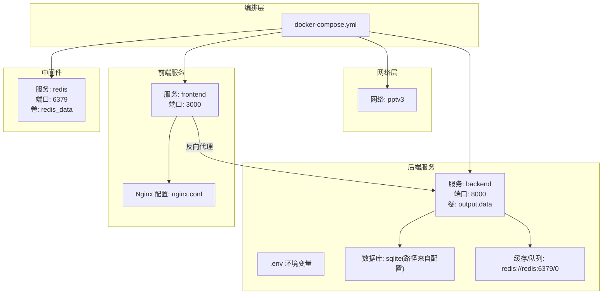
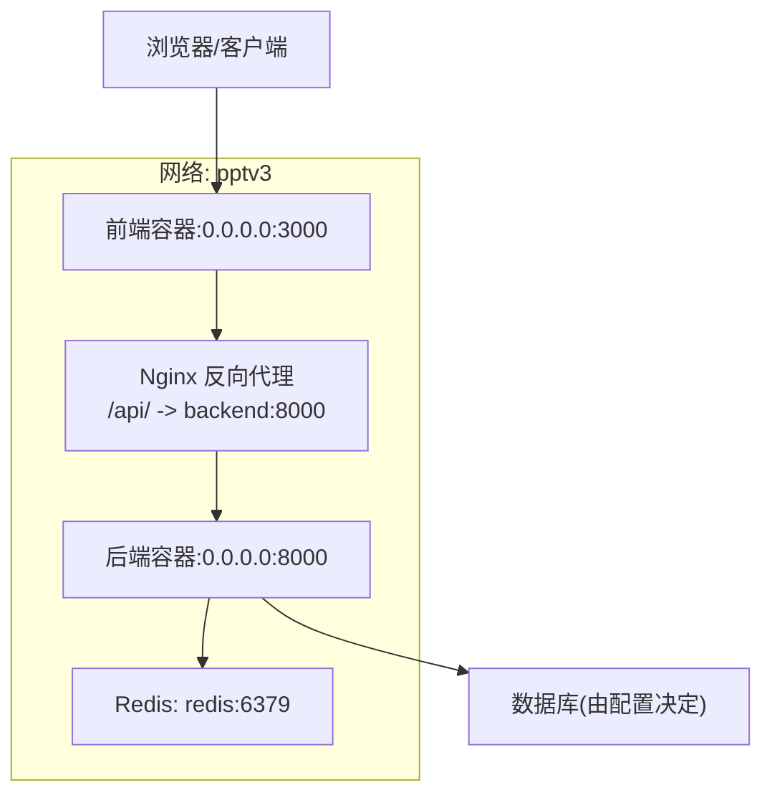
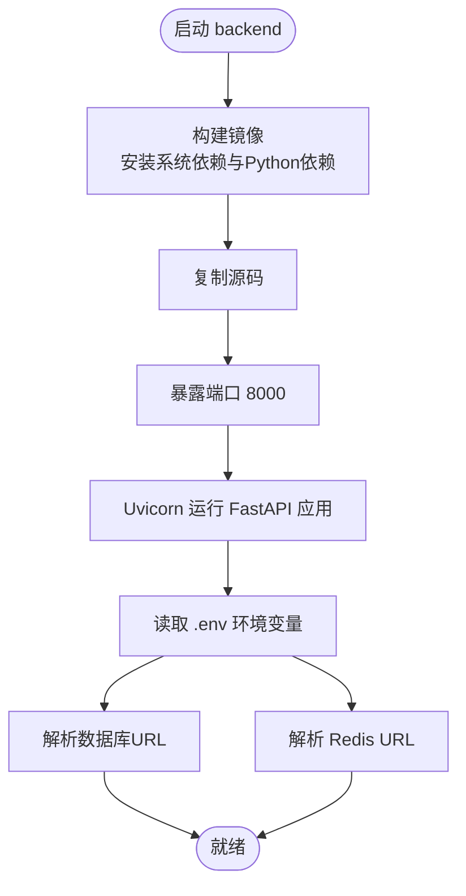
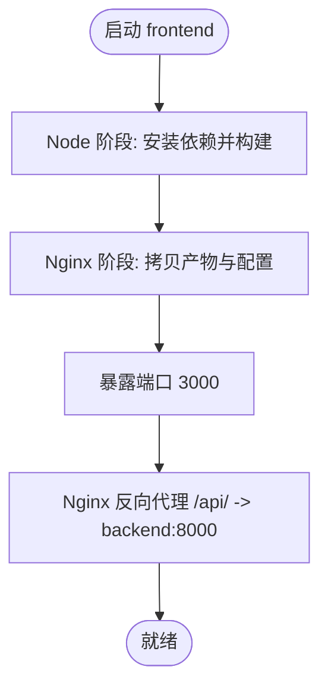
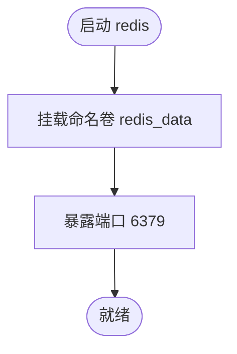
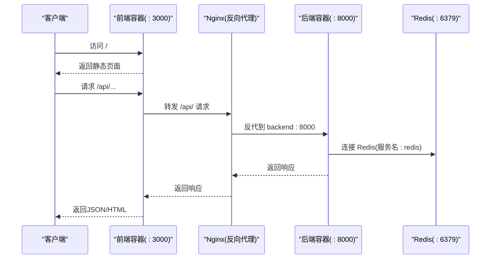
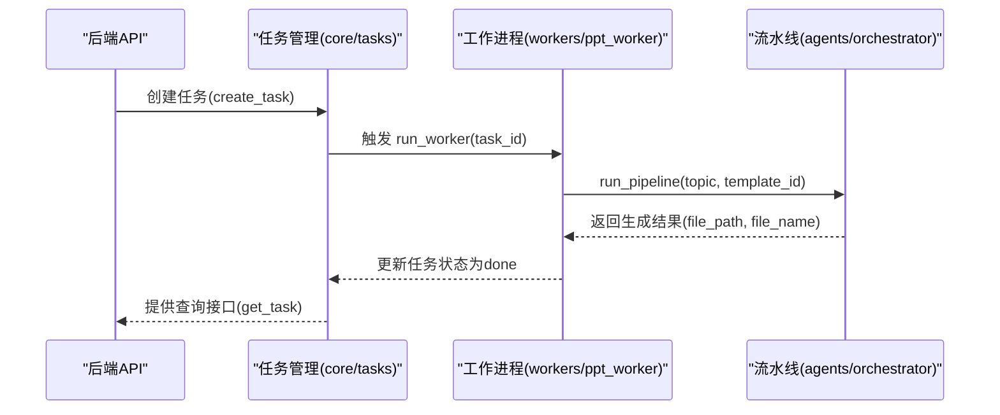
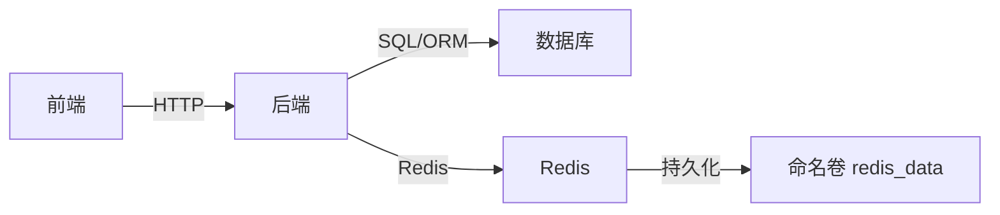

# Docker容器化

<cite>
**本文引用的文件**
- [docker-compose.yml](file://deployment/docker-compose.yml)
- [backend/Dockerfile](file://backend/Dockerfile)
- [frontend/Dockerfile](file://frontend/Dockerfile)
- [nginx.conf](file://deployment/nginx.conf)
- [backend/main.py](file://backend/main.py)
- [backend/core/config.py](file://backend/core/config.py)
- [backend/core/db.py](file://backend/core/db.py)
- [backend/requirements.txt](file://backend/requirements.txt)
- [frontend/package.json](file://frontend/package.json)
- [backend/core/tasks.py](file://backend/core/tasks.py)
- [backend/workers/ppt_worker.py](file://backend/workers/ppt_worker.py)
- [backend/agents/orchestrator.py](file://backend/agents/orchestrator.py)
</cite>

## 目录
1. [简介](#简介)
2. [项目结构](#项目结构)
3. [核心组件](#核心组件)
4. [架构总览](#架构总览)
5. [详细组件分析](#详细组件分析)
6. [依赖关系分析](#依赖关系分析)
7. [性能与资源考虑](#性能与资源考虑)
8. [故障排查指南](#故障排查指南)
9. [结论](#结论)
10. [附录](#附录)

## 简介
本文件面向AI-PPT项目的Docker容器化落地，围绕docker-compose.yml的服务编排、网络与卷挂载策略展开；同时详解后端FastAPI服务与前端Vite+Nginx服务的Dockerfile构建流程、依赖安装与运行时配置，并对Redis服务进行容器化部署、数据持久化与健康检查建议说明。文档还涵盖容器间通信（通过自定义网络）、端口映射、环境变量传递、启动顺序控制、重启策略、资源限制建议、输出与数据卷挂载的最佳实践，以及调试、日志查看与常见问题排查方法。

## 项目结构
- 后端：基于Python 3.12 Slim镜像，使用Uvicorn运行FastAPI应用，依赖requirements.txt安装。
- 前端：基于Node 22 Alpine构建产物，使用Nginx Alpine作为静态服务镜像，暴露3000端口。
- 编排：docker-compose.yml定义三个服务（backend、frontend、redis），统一加入自定义网络pptv3，使用命名卷redis_data持久化Redis数据。
- 配置：后端通过.env文件加载运行时配置，nginx.conf实现静态资源与后端API代理。

图表来源
- [docker-compose.yml:1-46](file://deployment/docker-compose.yml#L1-L46)
- [nginx.conf:1-26](file://deployment/nginx.conf#L1-L26)
- [backend/core/config.py:11-12](file://backend/core/config.py#L11-L12)

章节来源
- [docker-compose.yml:1-46](file://deployment/docker-compose.yml#L1-L46)
- [backend/Dockerfile:1-15](file://backend/Dockerfile#L1-L15)
- [frontend/Dockerfile:1-13](file://frontend/Dockerfile#L1-L13)
- [nginx.conf:1-26](file://deployment/nginx.conf#L1-L26)

## 核心组件
- 后端服务（backend）
  - 基于Python 3.12 Slim镜像，安装编译依赖后一次性安装requirements.txt，复制源码，暴露8000端口，使用Uvicorn以0.0.0.0监听。
  - 通过env_file引入后端/.env环境变量，挂载output与data目录至/app/output与/app/data。
  - 重启策略：unless-stopped。
- 前端服务（frontend）
  - 多阶段构建：第一阶段使用Node 22 Alpine安装依赖并打包；第二阶段使用Nginx Alpine，拷贝构建产物与nginx.conf，暴露3000端口。
  - 依赖：React 19、Axios、TailwindCSS、Vite等，见package.json。
  - 依赖于backend服务启动后再启动（depends_on）。
  - 重启策略：unless-stopped。
- Redis服务（redis）
  - 使用官方redis:7-alpine镜像，端口映射6379:6379，使用命名卷redis_data持久化数据，重启策略unless-stopped。
  - 当前未配置健康检查，建议后续增加。
- 自定义网络与卷
  - 所有服务加入自定义网络pptv3，便于服务发现与隔离。
  - 命名卷redis_data用于Redis持久化。

章节来源
- [docker-compose.yml:3-46](file://deployment/docker-compose.yml#L3-L46)
- [backend/Dockerfile:1-15](file://backend/Dockerfile#L1-L15)
- [frontend/Dockerfile:1-13](file://frontend/Dockerfile#L1-L13)
- [backend/requirements.txt:1-22](file://backend/requirements.txt#L1-L22)
- [frontend/package.json:1-26](file://frontend/package.json#L1-L26)

## 架构总览
容器间通信与端口映射如下：
- 前端容器通过Nginx将/api/请求代理到backend:8000。
- 后端容器通过.env配置访问数据库与Redis，其中Redis默认连接地址指向redis:6379。
- 输出与数据目录分别挂载到宿主机的output与data目录，便于生成物与上传文件持久化。

图表来源
- [nginx.conf:12-20](file://deployment/nginx.conf#L12-L20)
- [backend/core/config.py:11-12](file://backend/core/config.py#L11-L12)
- [docker-compose.yml:16-39](file://deployment/docker-compose.yml#L16-L39)

## 详细组件分析

### 后端服务（backend）
- 构建与运行
  - 基础镜像：python:3.12-slim。
  - 安装编译依赖（gcc、libffi-dev）后安装requirements.txt，随后复制源码。
  - 暴露8000端口，使用Uvicorn在0.0.0.0上监听。
- 环境变量与配置
  - 通过env_file引入后端/.env文件。
  - 配置类Settings中定义了数据库URL与Redis URL，默认Redis地址为redis:6379/0，适配compose网络。
- 卷挂载
  - 将宿主机output与data目录挂载到/app/output与/app/data，确保生成物与上传文件持久化。
- 重启策略
  - unless-stopped，保证非人为停止时自动恢复。
- 健康检查
  - 当前未配置健康检查，可在生产环境增加HTTP健康探针（如GET /api/health）。

图表来源
- [backend/Dockerfile:1-15](file://backend/Dockerfile#L1-L15)
- [backend/core/config.py:11-12](file://backend/core/config.py#L11-L12)
- [backend/main.py:37-39](file://backend/main.py#L37-L39)

章节来源
- [backend/Dockerfile:1-15](file://backend/Dockerfile#L1-L15)
- [backend/core/config.py:11-12](file://backend/core/config.py#L11-L12)
- [backend/main.py:37-39](file://backend/main.py#L37-L39)
- [docker-compose.yml:8-17](file://deployment/docker-compose.yml#L8-L17)

### 前端服务（frontend）
- 构建流程
  - 第一阶段：Node 22 Alpine安装依赖并执行构建脚本。
  - 第二阶段：Nginx Alpine，拷贝构建产物与nginx.conf，暴露3000端口。
- 依赖与工具链
  - React 19、Axios、TailwindCSS、Vite等，见package.json。
- 服务依赖
  - 通过depends_on等待backend启动后再启动，避免首次访问时的连接错误。
- 重启策略
  - unless-stopped。

图表来源
- [frontend/Dockerfile:1-13](file://frontend/Dockerfile#L1-L13)
- [frontend/package.json:1-26](file://frontend/package.json#L1-L26)
- [nginx.conf:8-20](file://deployment/nginx.conf#L8-L20)

章节来源
- [frontend/Dockerfile:1-13](file://frontend/Dockerfile#L1-L13)
- [frontend/package.json:1-26](file://frontend/package.json#L1-L26)
- [nginx.conf:1-26](file://deployment/nginx.conf#L1-L26)
- [docker-compose.yml:19-29](file://deployment/docker-compose.yml#L19-L29)

### Redis服务（redis）
- 镜像与端口
  - 使用redis:7-alpine，端口映射6379:6379。
- 数据持久化
  - 使用命名卷redis_data挂载到容器内/data，确保重启后数据不丢失。
- 健康检查
  - 当前未配置健康检查，建议在生产环境增加READINESS/HEALTHY探针。
- 重启策略
  - unless-stopped。

图表来源
- [docker-compose.yml:31-39](file://deployment/docker-compose.yml#L31-L39)

章节来源
- [docker-compose.yml:31-39](file://deployment/docker-compose.yml#L31-L39)

### 容器间通信与网络
- 自定义网络pptv3
  - backend、frontend、redis均加入该网络，容器可通过服务名相互访问。
- DNS与服务发现
  - 后端通过redis:6379访问Redis；前端通过Nginx代理访问backend:8000。
- 端口映射
  - backend: 8000 → 8000；frontend: 3000 → 3000；redis: 6379 → 6379。

图表来源
- [nginx.conf:12-20](file://deployment/nginx.conf#L12-L20)
- [backend/core/config.py](file://backend/core/config.py#L12)
- [docker-compose.yml:16-39](file://deployment/docker-compose.yml#L16-L39)

章节来源
- [docker-compose.yml:44-46](file://deployment/docker-compose.yml#L44-L46)
- [nginx.conf:1-26](file://deployment/nginx.conf#L1-L26)
- [backend/core/config.py:11-12](file://backend/core/config.py#L11-L12)

### 卷挂载策略与最佳实践
- output目录
  - 作用：存放生成的PPT等输出文件，便于宿主机直接访问与备份。
  - 挂载方式：backend将../output映射到/app/output。
- data目录
  - 作用：存放上传文件、数据库文件等数据。
  - 挂载方式：backend将../data映射到/app/data。
- 最佳实践
  - 在生产环境建议使用独立的命名卷或持久化存储，避免直接映射到宿主机根目录。
  - 对敏感数据（如数据库文件）应设置合适的权限与备份策略。
  - Redis数据卷redis_data需定期备份。

章节来源
- [docker-compose.yml:12-14](file://deployment/docker-compose.yml#L12-L14)
- [backend/core/config.py:25-26](file://backend/core/config.py#L25-L26)

### 任务队列与工作流（Celery与异步任务）
- 任务存储
  - 后端维护内存级任务字典，用于记录任务状态与结果。
- 工作进程
  - 异步工作函数调用orchestrator.run_pipeline执行PPT生成流水线。
- 依赖关系
  - orchestrator串联多个Agent完成内容生成、图片、动画、音乐等处理，并最终导出PPT。

图表来源
- [backend/core/tasks.py:14-28](file://backend/core/tasks.py#L14-L28)
- [backend/workers/ppt_worker.py:5-23](file://backend/workers/ppt_worker.py#L5-L23)
- [backend/agents/orchestrator.py:19-55](file://backend/agents/orchestrator.py#L19-L55)

章节来源
- [backend/core/tasks.py:1-33](file://backend/core/tasks.py#L1-L33)
- [backend/workers/ppt_worker.py:1-24](file://backend/workers/ppt_worker.py#L1-L24)
- [backend/agents/orchestrator.py:1-56](file://backend/agents/orchestrator.py#L1-L56)

## 依赖关系分析
- 组件耦合
  - 前端依赖后端API；后端依赖数据库与Redis；Redis被后端与可能的任务队列组件共享。
- 外部依赖
  - 后端依赖：FastAPI、Uvicorn、SQLAlchemy、asyncpg/aiosqlite、Redis、Celery等。
  - 前端依赖：React、Axios、TailwindCSS、Vite等。
- 网络与卷
  - 通过自定义网络实现服务发现；通过命名卷实现Redis持久化。

图表来源
- [backend/requirements.txt:1-22](file://backend/requirements.txt#L1-L22)
- [frontend/package.json:11-24](file://frontend/package.json#L11-L24)
- [docker-compose.yml:41-42](file://deployment/docker-compose.yml#L41-L42)

章节来源
- [backend/requirements.txt:1-22](file://backend/requirements.txt#L1-L22)
- [frontend/package.json:1-26](file://frontend/package.json#L1-L26)
- [docker-compose.yml:41-46](file://deployment/docker-compose.yml#L41-L46)

## 性能与资源考虑
- 端口与网络
  - 合理规划端口映射，避免冲突；使用自定义网络提升隔离性与可维护性。
- 重启策略
  - unless-stopped适合大多数场景，但需结合监控与日志进行健康检查。
- 资源限制
  - 建议在生产环境中为各容器设置CPU/内存限制，防止资源争抢。
- 存储与I/O
  - output与data目录挂载应选择高性能磁盘；Redis数据卷需定期快照备份。
- 并发与队列
  - 若任务量大，建议引入消息队列（如RabbitMQ/Redis Streams）与多worker实例，而非仅依赖内存任务字典。

[本节为通用指导，无需列出具体文件来源]

## 故障排查指南
- 健康检查
  - 后端健康端点：GET /api/health，返回应用名称与版本，可用于Kubernetes/Compose健康检查。
- 日志查看
  - 查看容器日志：docker compose logs -f backend/frontend/redis。
- 端口与网络
  - 确认端口映射是否冲突；确认容器已加入pptv3网络且服务名可解析。
- 环境变量
  - 确认后端/.env存在且包含必要键值；核对数据库URL与Redis URL。
- 卷挂载
  - 确认output与data目录存在且权限正确；确认redis_data卷已创建。
- 代理与跨域
  - 前端Nginx配置需正确转发/api/到backend:8000；后端CORS已允许所有来源，便于开发调试。
- 常见问题
  - 前端无法访问后端：检查Nginx代理配置与后端容器连通性。
  - 生成失败或任务卡住：检查后端日志与任务状态；确认Redis可用。
  - 数据库异常：核对数据库URL与驱动（aiosqlite/sqlite路径）。

章节来源
- [backend/main.py:37-39](file://backend/main.py#L37-L39)
- [nginx.conf:12-20](file://deployment/nginx.conf#L12-L20)
- [docker-compose.yml:10-14](file://deployment/docker-compose.yml#L10-L14)

## 结论
本容器化方案通过docker-compose将后端、前端与Redis服务整合在同一网络下，借助命名卷实现Redis与数据持久化，利用Nginx实现静态资源与API代理。后端与前端分别采用多阶段构建，具备清晰的依赖与运行时配置。建议在生产环境中补充Redis健康检查、资源限制与备份策略，并考虑引入外部消息队列与多worker扩展任务处理能力。

[本节为总结性内容，无需列出具体文件来源]

## 附录
- 环境变量与配置要点
  - 后端配置类Settings从.env加载，包含数据库URL、Redis URL、JWT密钥、输出目录等。
  - 建议在生产环境替换默认密钥与路径，启用HTTPS与更严格的CORS策略。
- 启动顺序与依赖
  - frontend通过depends_on依赖backend，确保首次访问时后端已就绪。
- 数据库初始化
  - 应用生命周期中初始化数据库表结构，确保首次运行时自动建模。

章节来源
- [backend/core/config.py:1-34](file://backend/core/config.py#L1-L34)
- [backend/core/db.py:21-27](file://backend/core/db.py#L21-L27)
- [docker-compose.yml:25-26](file://deployment/docker-compose.yml#L25-L26)