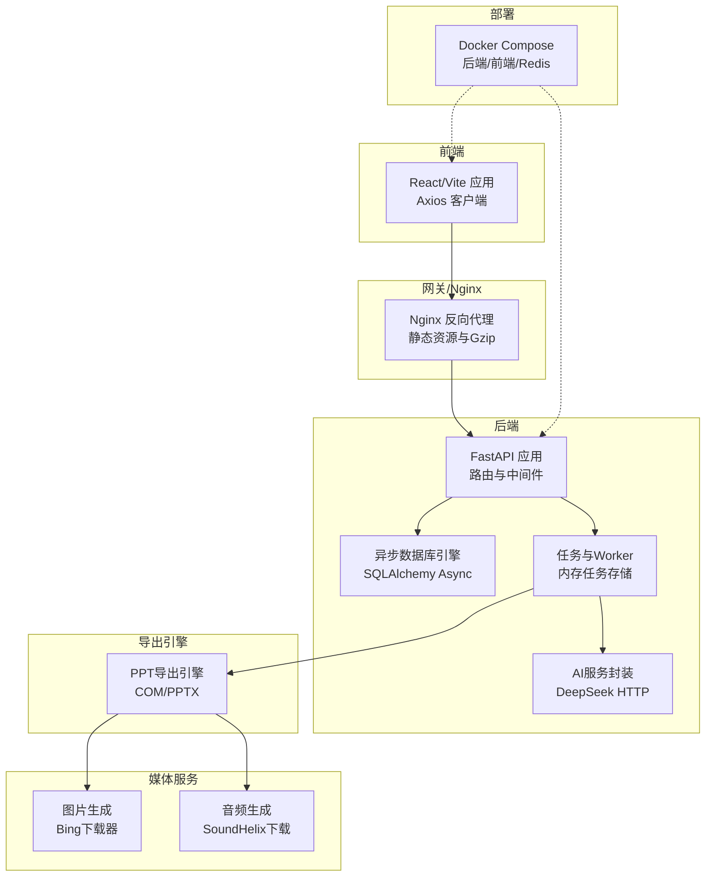
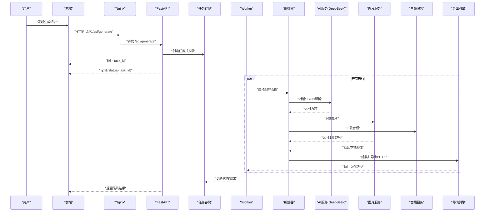
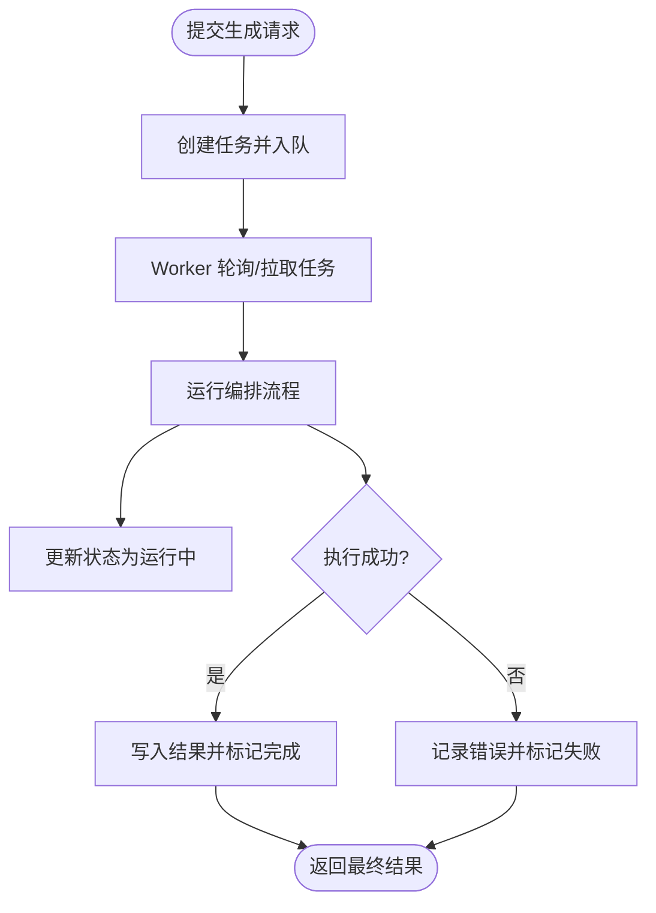
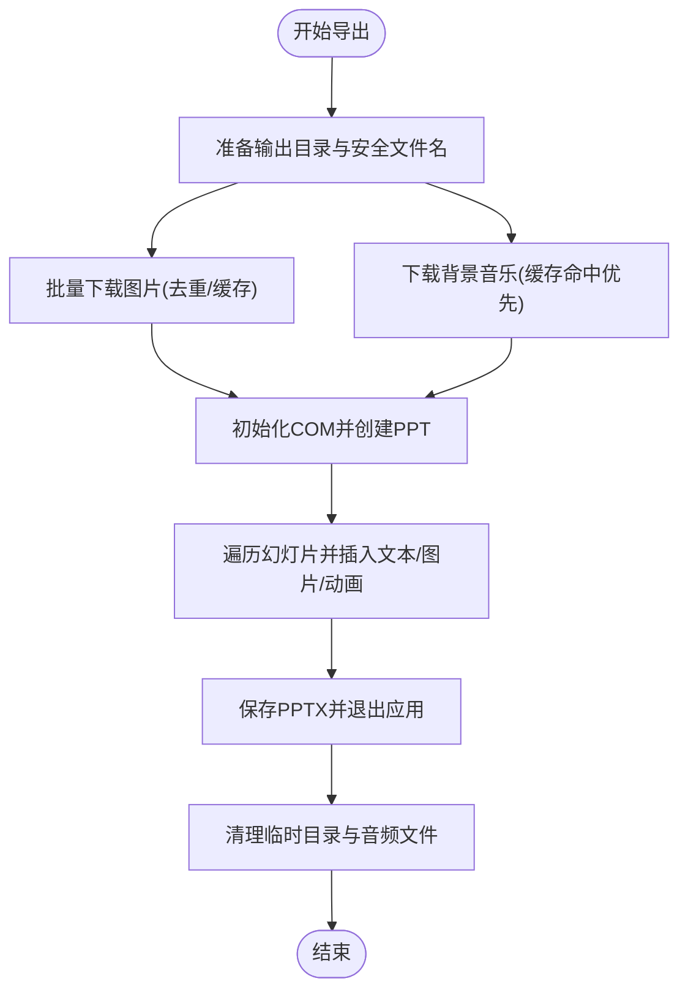
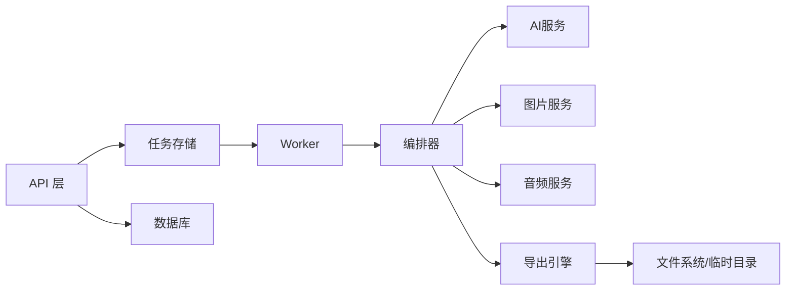

# 性能优化

<cite>
**本文引用的文件**
- [backend/main.py](file://backend/main.py)
- [backend/core/db.py](file://backend/core/db.py)
- [backend/core/tasks.py](file://backend/core/tasks.py)
- [backend/workers/ppt_worker.py](file://backend/workers/ppt_worker.py)
- [backend/api/generate.py](file://backend/api/generate.py)
- [backend/agents/orchestrator.py](file://backend/agents/orchestrator.py)
- [backend/core/deepseek.py](file://backend/core/deepseek.py)
- [engine/ppt_export.py](file://engine/ppt_export.py)
- [media-service/image_gen.py](file://media-service/image_gen.py)
- [media-service/audio_gen.py](file://media-service/audio_gen.py)
- [deployment/docker-compose.yml](file://deployment/docker-compose.yml)
- [deployment/nginx.conf](file://deployment/nginx.conf)
- [frontend/src/api/client.js](file://frontend/src/api/client.js)
- [frontend/vite.config.js](file://frontend/vite.config.js)
- [backend/requirements.txt](file://backend/requirements.txt)
</cite>

## 目录
1. [简介](#简介)
2. [项目结构](#项目结构)
3. [核心组件](#核心组件)
4. [架构总览](#架构总览)
5. [详细组件分析](#详细组件分析)
6. [依赖分析](#依赖分析)
7. [性能考量](#性能考量)
8. [故障排查指南](#故障排查指南)
9. [结论](#结论)
10. [附录](#附录)

## 简介
本指南面向AI-PPT项目的性能优化，覆盖后端AI服务调用、并发与资源利用、PPT生成引擎瓶颈与内存管理、媒体服务缓存与异步优化、数据库查询与连接池、前端资源与CDN、容器资源与网络优化、以及性能测试与成本优化策略。文档以仓库现有实现为依据，结合可落地的改进建议，帮助在不改变业务逻辑的前提下显著提升吞吐与稳定性。

## 项目结构
- 后端采用FastAPI + 异步SQLAlchemy，提供生成任务接口与健康检查；任务通过内存字典存储与异步worker执行；AI服务调用通过HTTP客户端封装。
- 媒体服务独立模块，负责图片搜索下载与背景音乐下载，使用异步HTTP客户端与本地磁盘缓存。
- PPT导出引擎基于Windows COM（pywin32）在Windows环境下生成PPTX，同时进行临时资源清理。
- 前端使用Vite + React，Axios客户端默认超时较长，Nginx作为反向代理与静态资源服务。
- 部署使用Docker Compose，包含后端、前端与Redis服务。

图表来源
- [backend/main.py:1-40](file://backend/main.py#L1-L40)
- [backend/core/db.py:1-27](file://backend/core/db.py#L1-L27)
- [backend/core/tasks.py:1-33](file://backend/core/tasks.py#L1-L33)
- [backend/workers/ppt_worker.py:1-24](file://backend/workers/ppt_worker.py#L1-L24)
- [backend/core/deepseek.py:1-40](file://backend/core/deepseek.py#L1-L40)
- [engine/ppt_export.py:1-257](file://engine/ppt_export.py#L1-L257)
- [media-service/image_gen.py:1-26](file://media-service/image_gen.py#L1-L26)
- [media-service/audio_gen.py:1-34](file://media-service/audio_gen.py#L1-L34)
- [deployment/docker-compose.yml:1-46](file://deployment/docker-compose.yml#L1-L46)
- [deployment/nginx.conf:1-26](file://deployment/nginx.conf#L1-L26)

章节来源
- [backend/main.py:1-40](file://backend/main.py#L1-L40)
- [deployment/docker-compose.yml:1-46](file://deployment/docker-compose.yml#L1-L46)

## 核心组件
- 任务与并发：内存级任务存储与异步worker，适合轻量并发；高并发需持久化队列与外部消息中间件。
- 数据访问：异步SQLAlchemy连接池，支持高并发I/O；需配合连接池参数与索引优化。
- AI服务：DeepSeek封装，统一超时与鉴权头；可引入重试、熔断与缓存。
- 导出引擎：Windows COM路径，线程+事件循环桥接；注意临时文件清理与异常回滚。
- 媒体服务：异步HTTP下载，本地磁盘缓存；可扩展为分布式缓存或CDN。
- 前端：Axios长超时，Nginx Gzip压缩；可结合CDN与静态资源缓存策略。

章节来源
- [backend/core/tasks.py:1-33](file://backend/core/tasks.py#L1-L33)
- [backend/workers/ppt_worker.py:1-24](file://backend/workers/ppt_worker.py#L1-L24)
- [backend/core/db.py:1-27](file://backend/core/db.py#L1-L27)
- [backend/core/deepseek.py:1-40](file://backend/core/deepseek.py#L1-L40)
- [engine/ppt_export.py:1-257](file://engine/ppt_export.py#L1-L257)
- [media-service/image_gen.py:1-26](file://media-service/image_gen.py#L1-L26)
- [media-service/audio_gen.py:1-34](file://media-service/audio_gen.py#L1-L34)
- [frontend/src/api/client.js:1-28](file://frontend/src/api/client.js#L1-L28)
- [deployment/nginx.conf:1-26](file://deployment/nginx.conf#L1-L26)

## 架构总览
下图展示从用户请求到PPT生成完成的关键流程，包括任务提交、异步执行、AI服务调用、媒体下载与PPT导出。

图表来源
- [backend/api/generate.py:1-52](file://backend/api/generate.py#L1-L52)
- [backend/core/tasks.py:1-33](file://backend/core/tasks.py#L1-L33)
- [backend/workers/ppt_worker.py:1-24](file://backend/workers/ppt_worker.py#L1-L24)
- [backend/agents/orchestrator.py:1-56](file://backend/agents/orchestrator.py#L1-L56)
- [backend/core/deepseek.py:1-40](file://backend/core/deepseek.py#L1-L40)
- [media-service/image_gen.py:1-26](file://media-service/image_gen.py#L1-L26)
- [media-service/audio_gen.py:1-34](file://media-service/audio_gen.py#L1-L34)
- [engine/ppt_export.py:1-257](file://engine/ppt_export.py#L1-L257)

## 详细组件分析

### 任务与并发处理
- 现状：内存字典存储任务，异步worker创建任务协程；适合低并发场景。
- 潜在瓶颈：内存任务表易丢失、无持久化队列、无速率限制与重试机制。
- 优化建议：
  - 引入Redis/Celery等持久化队列，实现任务持久化与多实例扩展。
  - 为任务添加重试、超时与失败告警；对高频任务增加限流与排队长度控制。
  - 将任务状态迁移至数据库或Redis，避免进程重启丢失。

图表来源
- [backend/core/tasks.py:1-33](file://backend/core/tasks.py#L1-L33)
- [backend/workers/ppt_worker.py:1-24](file://backend/workers/ppt_worker.py#L1-L24)

章节来源
- [backend/core/tasks.py:1-33](file://backend/core/tasks.py#L1-L33)
- [backend/workers/ppt_worker.py:1-24](file://backend/workers/ppt_worker.py#L1-L24)

### AI服务调用优化（DeepSeek）
- 现状：统一HTTP封装，设置连接与读取超时；未实现重试、熔断与缓存。
- 潜在瓶颈：网络抖动导致请求失败、大模型响应慢影响整体时延。
- 优化建议：
  - 引入指数退避重试与超时上限；对重复输入启用请求级缓存（如LRU）。
  - 对JSON解析失败与非标准响应做幂等与降级处理。
  - 在网关层或边缘节点前置缓存热点对话片段。

章节来源
- [backend/core/deepseek.py:1-40](file://backend/core/deepseek.py#L1-L40)

### PPT生成引擎性能分析
- 现状：Windows COM路径，主线程阻塞风险；导出过程涉及图片与音频下载、COM操作与文件IO。
- 潜在瓶颈：COM线程模型、磁盘IO、图片/音频下载阻塞、临时目录清理。
- 优化建议：
  - 将导出过程放入子线程并绑定事件循环，避免阻塞主事件循环。
  - 批量下载图片/音频，减少网络往返；对已存在文件跳过下载。
  - 使用内存映射或分块写入降低磁盘压力；确保异常路径清理临时文件。
  - 对PPTX模板与媒体资源进行预热与缓存，缩短首次生成时延。

图表来源
- [engine/ppt_export.py:1-257](file://engine/ppt_export.py#L1-L257)
- [media-service/image_gen.py:1-26](file://media-service/image_gen.py#L1-L26)
- [media-service/audio_gen.py:1-34](file://media-service/audio_gen.py#L1-L34)

章节来源
- [engine/ppt_export.py:1-257](file://engine/ppt_export.py#L1-L257)

### 媒体服务缓存与异步优化
- 现状：图片与音频均通过异步HTTP下载，本地磁盘缓存；图片下载器按关键词生成目录。
- 潜在瓶颈：网络不稳定、重复请求、磁盘空间占用。
- 优化建议：
  - 引入分布式缓存（Redis/MinIO）或CDN，减少重复下载与跨地域延迟。
  - 对图片/音频路径建立哈希索引，命中即返回；未命中再触发下载。
  - 批量下载时设置并发上限与超时，避免资源争用。

章节来源
- [media-service/image_gen.py:1-26](file://media-service/image_gen.py#L1-L26)
- [media-service/audio_gen.py:1-34](file://media-service/audio_gen.py#L1-L34)

### 数据库查询优化与连接池调优
- 现状：异步SQLAlchemy引擎与会话工厂；未见显式连接池参数与索引定义。
- 潜在瓶颈：高并发下的连接数不足、慢查询未优化。
- 优化建议：
  - 显式配置连接池大小、最大溢出、空闲回收时间；根据QPS与峰值并发调整。
  - 为常用查询字段（如用户ID、生成记录）建立复合索引；避免SELECT *。
  - 使用只读事务与批量写入；对频繁读取的数据引入Redis缓存。

章节来源
- [backend/core/db.py:1-27](file://backend/core/db.py#L1-L27)

### 前端资源优化与CDN加速
- 现状：Axios默认较长超时；Nginx开启Gzip与静态资源代理。
- 潜在瓶颈：首屏加载慢、重复请求、跨域与缓存策略不当。
- 优化建议：
  - 构建产物启用长期缓存与版本号；对第三方库使用CDN。
  - Nginx配置ETag/Last-Modified与缓存头；对API设置合理缓存策略。
  - 前端引入懒加载与骨架屏，改善感知性能。

章节来源
- [frontend/src/api/client.js:1-28](file://frontend/src/api/client.js#L1-L28)
- [deployment/nginx.conf:1-26](file://deployment/nginx.conf#L1-L26)
- [frontend/vite.config.js:1-9](file://frontend/vite.config.js#L1-L9)

### 容器资源限制与网络优化
- 现状：Docker Compose定义后端/前端/Redis服务；未见资源限制与CPU亲和性配置。
- 优化建议：
  - 为后端服务设置CPU/内存限制与重启策略；前端静态资源由Nginx承载。
  - 对数据库与Redis单独扩缩容；后端多副本水平扩展。
  - 使用服务网格或Ingress控制器优化内部网络延迟。

章节来源
- [deployment/docker-compose.yml:1-46](file://deployment/docker-compose.yml#L1-L46)

## 依赖分析
- 组件耦合：API层依赖任务存储与数据库；worker依赖编排器与导出引擎；导出引擎依赖媒体服务与系统COM。
- 外部依赖：AI服务（DeepSeek）、图片下载器、音频源、数据库驱动、Redis/Celery（建议引入）。
- 潜在环路：当前未发现直接环路，但异步链路较长，需关注错误传播与超时控制。

图表来源
- [backend/api/generate.py:1-52](file://backend/api/generate.py#L1-L52)
- [backend/core/tasks.py:1-33](file://backend/core/tasks.py#L1-L33)
- [backend/workers/ppt_worker.py:1-24](file://backend/workers/ppt_worker.py#L1-L24)
- [backend/agents/orchestrator.py:1-56](file://backend/agents/orchestrator.py#L1-L56)
- [engine/ppt_export.py:1-257](file://engine/ppt_export.py#L1-L257)

章节来源
- [backend/api/generate.py:1-52](file://backend/api/generate.py#L1-L52)
- [backend/core/tasks.py:1-33](file://backend/core/tasks.py#L1-L33)
- [backend/workers/ppt_worker.py:1-24](file://backend/workers/ppt_worker.py#L1-L24)
- [backend/agents/orchestrator.py:1-56](file://backend/agents/orchestrator.py#L1-L56)
- [engine/ppt_export.py:1-257](file://engine/ppt_export.py#L1-L257)

## 性能考量
- 并发与吞吐
  - 后端：使用异步框架与异步数据库，结合连接池参数；对外部服务引入连接池与超时上限。
  - 任务：从内存迁移到Redis/Celery，支持多实例扩展与失败重试。
- 内存与磁盘
  - 导出阶段严格清理临时目录与音频文件；对大文件采用分块写入与流式处理。
  - 缓存热点图片/音频，避免重复下载；对PPT模板与字体资源预热。
- 网络与带宽
  - CDN与边缘缓存；对AI服务与媒体源设置合理的超时与重试；启用HTTP/2与TLS优化。
- 成本与弹性
  - 按流量与峰值调整容器副本数；数据库与Redis独立扩缩容；监控CPU/内存/IO使用率。

[本节为通用指导，无需列出具体文件来源]

## 故障排查指南
- 任务状态异常
  - 检查任务存储是否被意外清空；确认worker是否正常运行；查看编排器日志与异常堆栈。
- AI服务失败
  - 核对API密钥与网络连通性；检查超时与重试策略；观察响应格式是否符合预期。
- 导出失败
  - 确认COM可用性与权限；检查临时目录权限与磁盘空间；验证图片/音频下载是否成功。
- 数据库慢查询
  - 分析慢查询日志；为高频查询字段加索引；调整连接池参数与事务隔离级别。
- 前端加载慢
  - 检查Nginx缓存头与Gzip配置；确认CDN生效；分析网络面板与资源体积。

章节来源
- [backend/workers/ppt_worker.py:1-24](file://backend/workers/ppt_worker.py#L1-L24)
- [backend/core/deepseek.py:1-40](file://backend/core/deepseek.py#L1-L40)
- [engine/ppt_export.py:1-257](file://engine/ppt_export.py#L1-L257)
- [backend/core/db.py:1-27](file://backend/core/db.py#L1-L27)
- [deployment/nginx.conf:1-26](file://deployment/nginx.conf#L1-L26)

## 结论
通过将内存任务迁移到持久化队列、引入缓存与CDN、优化数据库索引与连接池、强化AI服务与导出引擎的异步与资源管理，并结合前端与网关的性能优化，可在不改变业务逻辑的前提下显著提升AI-PPT系统的吞吐、稳定性和用户体验。建议优先实施任务持久化与缓存策略，随后逐步完善数据库与网络层面的优化。

[本节为总结，无需列出具体文件来源]

## 附录
- 性能测试方法
  - 基准测试：固定主题与模板，测量单次生成时延与内存峰值。
  - 压力测试：逐步提高并发与任务规模，观察队列积压、错误率与资源使用。
  - A/B对比：在引入缓存/队列前后对比指标变化。
- 关键指标
  - P95/P99生成时延、并发任务数、队列长度、数据库连接池使用率、CPU/内存/IO占用、CDN命中率。
- 工具与依赖参考
  - 后端依赖清单可作为性能相关组件的版本依据。

章节来源
- [backend/requirements.txt:1-22](file://backend/requirements.txt#L1-L22)