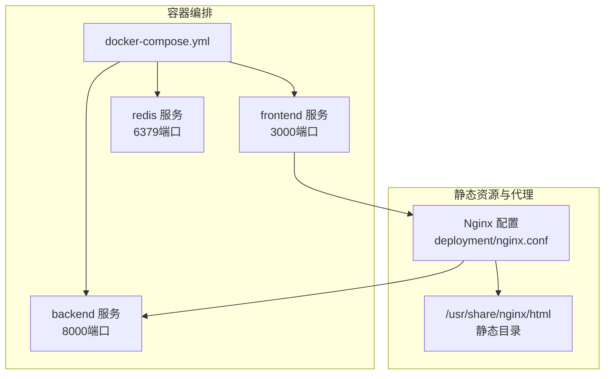
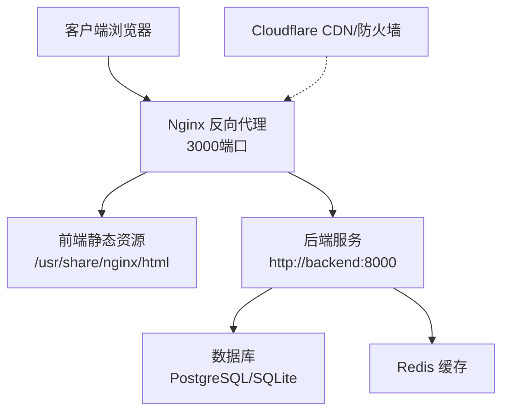
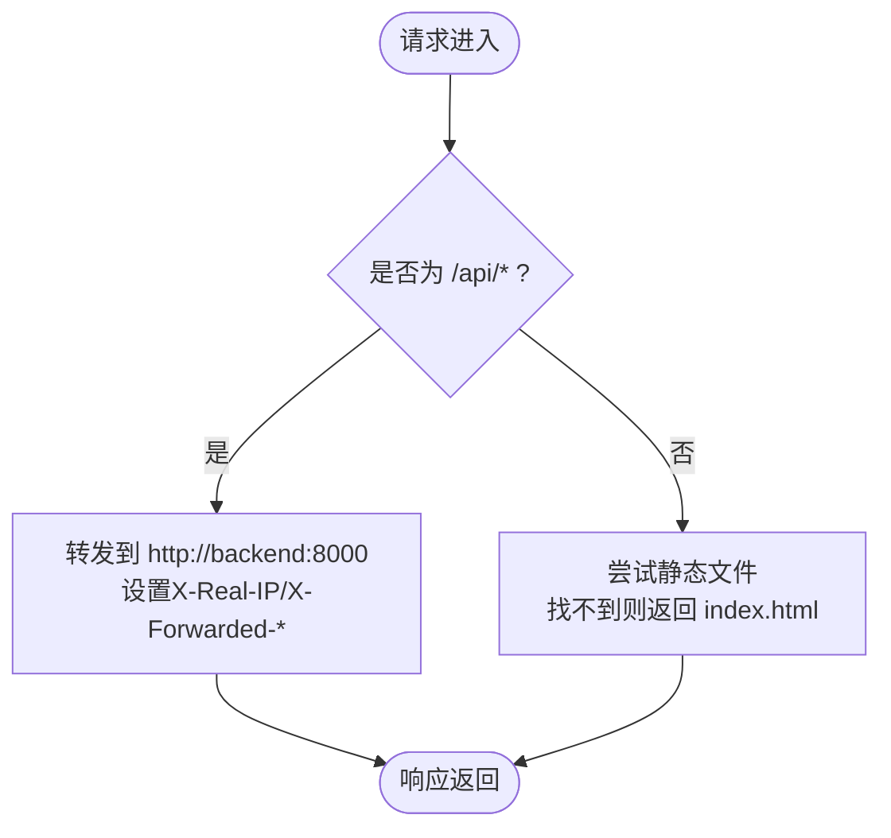
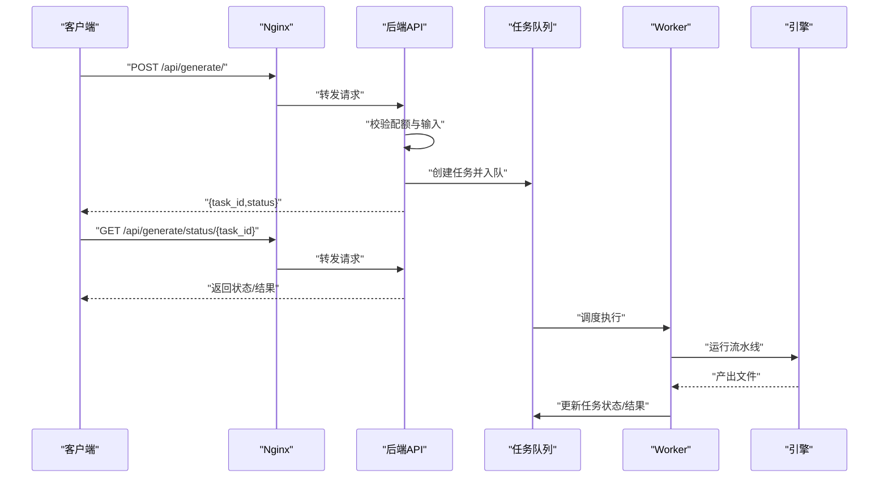
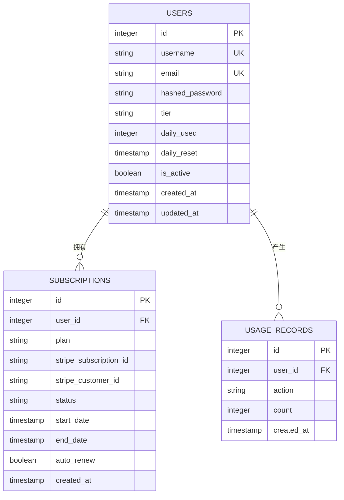
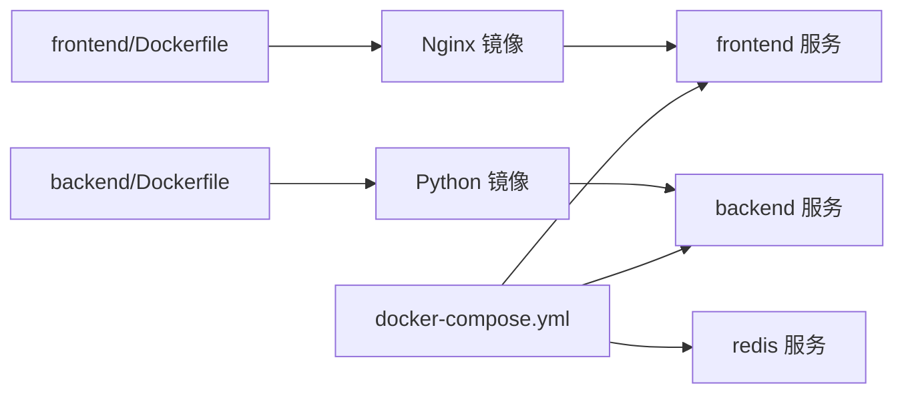

# 生产环境部署

<cite>
**本文引用的文件**
- [deployment/nginx.conf](file://deployment/nginx.conf)
- [deployment/docker-compose.yml](file://deployment/docker-compose.yml)
- [deployment/cloudflare.toml](file://deployment/cloudflare.toml)
- [backend/main.py](file://backend/main.py)
- [backend/core/config.py](file://backend/core/config.py)
- [backend/core/db.py](file://backend/core/db.py)
- [backend/Dockerfile](file://backend/Dockerfile)
- [frontend/Dockerfile](file://frontend/Dockerfile)
- [backend/requirements.txt](file://backend/requirements.txt)
- [frontend/package.json](file://frontend/package.json)
- [backend/api/generate.py](file://backend/api/generate.py)
- [backend/workers/ppt_worker.py](file://backend/workers/ppt_worker.py)
- [backend/core/tasks.py](file://backend/core/tasks.py)
- [backend/models/user.py](file://backend/models/user.py)
- [backend/models/subscription.py](file://backend/models/subscription.py)
- [frontend/vite.err](file://frontend/vite.err)
</cite>

## 目录
1. [简介](#简介)
2. [项目结构](#项目结构)
3. [核心组件](#核心组件)
4. [架构总览](#架构总览)
5. [详细组件分析](#详细组件分析)
6. [依赖关系分析](#依赖关系分析)
7. [性能考量](#性能考量)
8. [故障排查指南](#故障排查指南)
9. [结论](#结论)
10. [附录](#附录)

## 简介
本指南面向AI-PPT项目的生产环境部署，围绕以下目标展开：Nginx反向代理与静态资源服务、HTTPS重定向、Cloudflare集成与CDN缓存策略、DDoS防护、环境变量与敏感信息管理、域名与SSL证书申请及自动续期、负载均衡与健康检查、数据库连接池与缓存策略、会话管理、备份与灾难恢复、数据迁移、部署前检查清单、回滚策略与版本管理最佳实践。

## 项目结构
- 后端采用FastAPI + Uvicorn，通过Dockerfile构建镜像并暴露8000端口。
- 前端使用Vite构建，Dockerfile内嵌Nginx提供静态资源服务，并挂载Nginx配置。
- 部署编排使用docker-compose，定义后端、前端、Redis三类服务，统一网络与卷。
- Cloudflare Pages用于前端托管（如需），提供基础安全头配置。

图表来源
- [deployment/docker-compose.yml:1-46](file://deployment/docker-compose.yml#L1-L46)
- [frontend/Dockerfile:1-13](file://frontend/Dockerfile#L1-L13)
- [deployment/nginx.conf:1-26](file://deployment/nginx.conf#L1-L26)

章节来源
- [deployment/docker-compose.yml:1-46](file://deployment/docker-compose.yml#L1-L46)
- [frontend/Dockerfile:1-13](file://frontend/Dockerfile#L1-L13)
- [deployment/nginx.conf:1-26](file://deployment/nginx.conf#L1-L26)

## 核心组件
- 反向代理与静态资源
  - Nginx监听3000端口，根目录指向静态资源路径，对/api/请求转发至后端8000端口；启用gzip压缩。
- 应用服务
  - 后端FastAPI应用，注册路由与CORS中间件，提供健康检查接口。
  - 前端Nginx容器内置构建产物，直接提供静态页面。
- 缓存与任务
  - Redis作为缓存与会话存储（当前未在后端显式使用，可按需启用）。
  - 异步任务队列基于内存字典存储，配合worker执行生成任务。
- 数据持久化
  - 使用SQLAlchemy异步引擎，默认SQLite（开发/演示），生产建议替换为PostgreSQL并配置连接池。

章节来源
- [deployment/nginx.conf:1-26](file://deployment/nginx.conf#L1-L26)
- [backend/main.py:16-40](file://backend/main.py#L16-L40)
- [frontend/Dockerfile:8-12](file://frontend/Dockerfile#L8-L12)
- [backend/core/tasks.py:1-33](file://backend/core/tasks.py#L1-L33)

## 架构总览
下图展示生产环境典型拓扑：客户端经Nginx反向代理访问前端静态资源，/api/路径转发到后端；后端访问数据库与Redis；Cloudflare提供CDN与安全防护。

图表来源
- [deployment/nginx.conf:12-20](file://deployment/nginx.conf#L12-L20)
- [backend/main.py:37-39](file://backend/main.py#L37-L39)
- [backend/core/db.py:1-26](file://backend/core/db.py#L1-L26)
- [deployment/cloudflare.toml:14-20](file://deployment/cloudflare.toml#L14-L20)

## 详细组件分析

### Nginx反向代理与静态文件服务
- 监听与域名
  - 监听3000端口，server_name配置为示例域名，生产中应替换为实际域名。
- 静态资源
  - root指向/usr/share/nginx/html，index为index.html；location /使用try_files回退到单页应用路由。
- API代理
  - location /api/代理到http://backend:8000，设置真实IP与协议头，超时参数合理。
- 压缩
  - 开启gzip并指定类型与最小长度，提升传输效率。

图表来源
- [deployment/nginx.conf:8-20](file://deployment/nginx.conf#L8-L20)

章节来源
- [deployment/nginx.conf:1-26](file://deployment/nginx.conf#L1-L26)

### HTTPS重定向与证书管理
- 当前Nginx配置仅监听HTTP（3000端口）。生产需启用HTTPS并进行重定向。
- 建议在边缘层（如Cloudflare或专用LB）终止TLS，再将明文转发至后端。
- 证书申请与自动续期可通过Let’s Encrypt（ACME）自动化，结合边缘CA或反向代理自动续期脚本。

[本节为通用指导，不直接分析具体文件]

### Cloudflare集成、CDN缓存与DDoS防护
- Pages配置
  - cloudflare.toml定义了前端构建命令、输出目录与安全头（X-Frame-Options、X-Content-Type-Options、Referrer-Policy）。
- CDN与缓存
  - 在Cloudflare DNS中将域名解析到Pages或边缘IP；在Cloudflare缓存规则中针对静态资源设置长缓存，API路径避免缓存。
- DDoS防护
  - 启用Railgun/HTTP/2优化；开启WAF与挑战页面；限制请求速率与并发连接数。

章节来源
- [deployment/cloudflare.toml:1-20](file://deployment/cloudflare.toml#L1-L20)

### 环境变量与敏感信息管理
- 配置来源
  - 后端Settings通过.env文件加载，包含API密钥、数据库URL、Redis地址、JWT密钥、Stripe密钥等。
- 安全加固
  - 将.env置于受控位置，仅授予必要权限；在CI/CD中以密文形式注入；禁止将敏感信息提交到仓库。
  - JWT密钥与Stripe密钥必须在生产中随机且保密，定期轮换。

章节来源
- [backend/core/config.py:4-33](file://backend/core/config.py#L4-L33)

### 域名配置与SSL证书
- 域名解析
  - 将主域名与子域指向Cloudflare或边缘IP；确保A/AAAA记录生效。
- 证书
  - 若由边缘终止TLS，可在Cloudflare上启用免费证书或上传自有证书；若由Nginx终止，使用acme.sh或certbot自动化续期。

[本节为通用指导，不直接分析具体文件]

### 负载均衡、健康检查与故障转移
- 负载均衡
  - 多实例后端：启动多个后端容器或Pod，由Nginx或云LB分发；保持无状态设计。
- 健康检查
  - /api/health用于存活探针；可扩展就绪探针检查数据库与缓存连通性。
- 故障转移
  - LB配置多可用区；后端失败时自动切换；前端静态资源可由CDN就近分发。

章节来源
- [backend/main.py:37-39](file://backend/main.py#L37-L39)

### 数据库连接池、缓存与会话管理
- 连接池
  - 默认使用SQLite（开发用途），生产建议迁移到PostgreSQL并配置连接池（最大连接数、空闲数、超时）。
- 缓存
  - 当前未在后端显式使用Redis缓存；可利用Redis存储会话、限流令牌与热点数据。
- 会话
  - JWT用于无状态认证；可选将会话存储于Redis实现集中式登出与黑名单。

章节来源
- [backend/core/db.py:1-26](file://backend/core/db.py#L1-L26)
- [backend/core/config.py:11-12](file://backend/core/config.py#L11-L12)

### 任务队列与生成流水线
- 任务模型
  - 内存字典存储任务状态，创建任务后异步调度worker执行。
- Worker执行
  - worker调用引擎运行完整流水线，更新任务状态与结果。
- API交互
  - 生成接口校验配额与输入，返回任务ID；状态查询接口返回进度与下载链接。

图表来源
- [backend/api/generate.py:20-52](file://backend/api/generate.py#L20-L52)
- [backend/core/tasks.py:14-28](file://backend/core/tasks.py#L14-L28)
- [backend/workers/ppt_worker.py:5-24](file://backend/workers/ppt_worker.py#L5-L24)

章节来源
- [backend/api/generate.py:1-52](file://backend/api/generate.py#L1-L52)
- [backend/core/tasks.py:1-33](file://backend/core/tasks.py#L1-L33)
- [backend/workers/ppt_worker.py:1-24](file://backend/workers/ppt_worker.py#L1-L24)

### 用户与订阅模型
- 用户表
  - 包含用户名、邮箱、密码哈希、等级、每日用量与重置时间等字段。
- 订阅与用量
  - 订阅表记录计划、状态、起止时间；用量表记录操作与时间。

图表来源
- [backend/models/user.py:1-20](file://backend/models/user.py#L1-L20)
- [backend/models/subscription.py:1-28](file://backend/models/subscription.py#L1-L28)

章节来源
- [backend/models/user.py:1-20](file://backend/models/user.py#L1-L20)
- [backend/models/subscription.py:1-28](file://backend/models/subscription.py#L1-L28)

## 依赖关系分析
- 组件耦合
  - 前端静态资源由Nginx提供，API请求经Nginx转发至后端；后端依赖数据库与可选Redis。
- 外部依赖
  - 后端依赖Stripe支付、OpenAI/DeepSeek等外部服务；需在环境变量中配置密钥。
- 版本与构建
  - 后端使用Python 3.12，前端使用Node 22；Dockerfile分别构建并暴露端口。

图表来源
- [frontend/Dockerfile:1-13](file://frontend/Dockerfile#L1-L13)
- [backend/Dockerfile:1-15](file://backend/Dockerfile#L1-L15)
- [deployment/docker-compose.yml:3-46](file://deployment/docker-compose.yml#L3-L46)

章节来源
- [backend/requirements.txt:1-22](file://backend/requirements.txt#L1-L22)
- [frontend/package.json:1-26](file://frontend/package.json#L1-L26)
- [deployment/docker-compose.yml:1-46](file://deployment/docker-compose.yml#L1-L46)

## 性能考量
- 反向代理
  - 合理设置proxy_read_timeout与proxy_connect_timeout，避免慢请求占用连接。
  - 对静态资源启用长期缓存与压缩，减少带宽与延迟。
- 应用层
  - 后端使用异步SQLAlchemy，建议在生产中启用连接池参数；对高频接口增加缓存。
- 任务与并发
  - 生成任务为IO密集型，注意worker数量与并发度平衡；对大文件导出考虑分块或流式写入。

[本节为通用指导，不直接分析具体文件]

## 故障排查指南
- 常见问题定位
  - 前端Vite代理错误：当后端未就绪或端口映射异常时会出现连接被拒绝错误。
  - Nginx代理失败：确认后端容器名称与端口一致，代理头设置正确。
- 健康检查
  - 访问后端健康接口验证服务状态。
- 日志与监控
  - 后端日志输出到标准输出，便于容器编排平台采集；前端静态资源由Nginx日志记录。

章节来源
- [frontend/vite.err:1-4](file://frontend/vite.err#L1-L4)
- [backend/main.py:37-39](file://backend/main.py#L37-L39)

## 结论
本指南提供了从Nginx反代、静态资源、HTTPS重定向到Cloudflare集成与DDoS防护的生产部署要点；明确了环境变量与敏感信息管理、数据库与缓存策略、任务队列与会话管理；并给出了备份、灾难恢复与数据迁移的实施思路。建议在正式上线前完成部署前检查清单与回滚策略演练，确保变更可控与快速恢复。

[本节为总结性内容，不直接分析具体文件]

## 附录

### 部署前检查清单
- 域名与DNS解析生效
- SSL证书申请与自动续期流程验证
- Nginx配置（反代、静态、gzip、超时）
- 环境变量与密钥注入（.env、CI/CD机密）
- 数据库与Redis连通性测试
- 健康检查与探针配置
- 负载均衡与故障转移测试
- CDN缓存策略与DDoS防护开关
- 备份与灾难恢复演练

[本节为通用指导，不直接分析具体文件]

### 回滚策略与版本管理最佳实践
- 版本标签与镜像命名规范
- 滚动更新与灰度发布
- 快速回滚到上一个稳定版本
- 配置热更新与灰度开关
- 数据库迁移脚本与回滚点

[本节为通用指导，不直接分析具体文件]