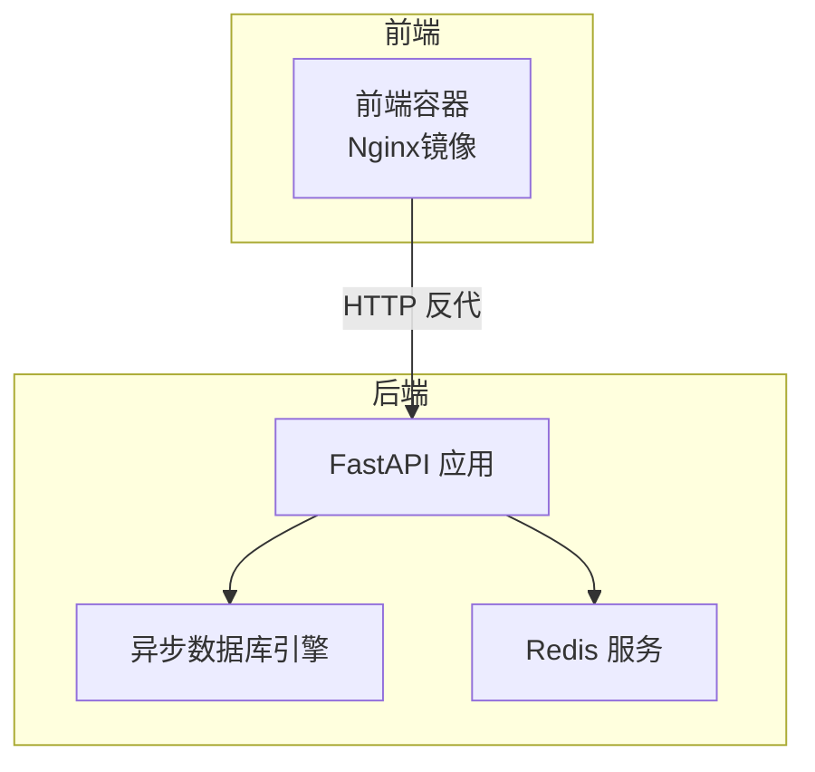
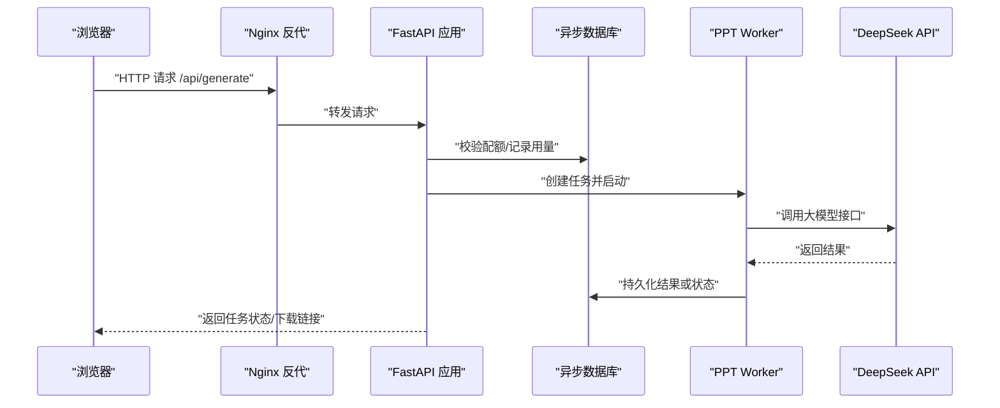
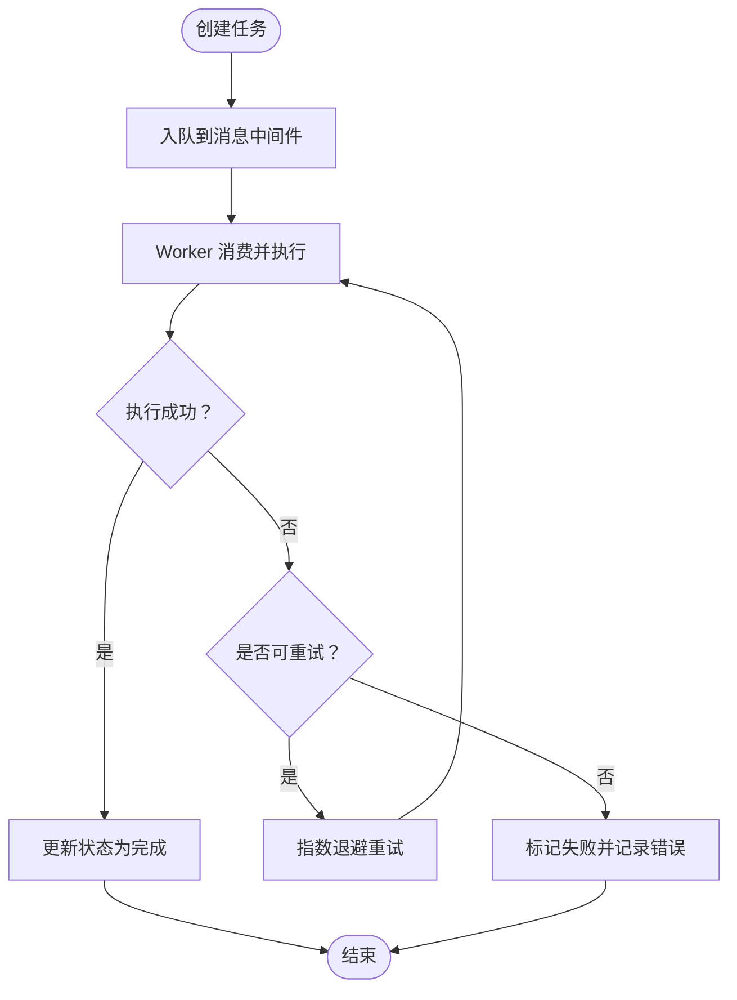
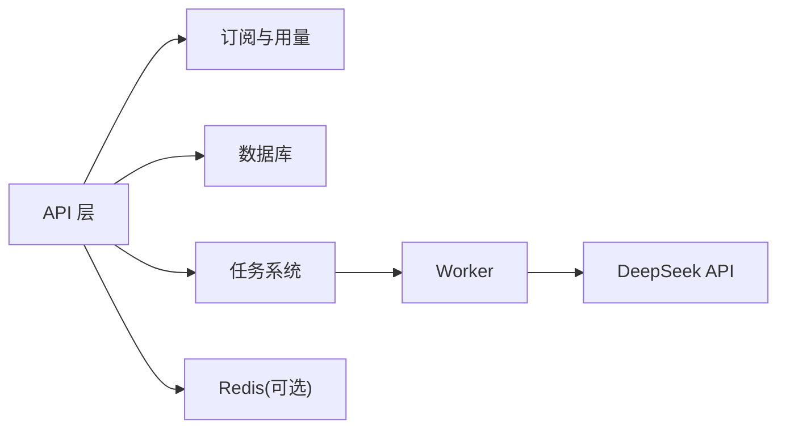

# 监控与日志

<cite>
**本文引用的文件**
- [backend/main.py](file://backend/main.py)
- [backend/core/config.py](file://backend/core/config.py)
- [backend/core/db.py](file://backend/core/db.py)
- [backend/core/tasks.py](file://backend/core/tasks.py)
- [backend/workers/ppt_worker.py](file://backend/workers/ppt_worker.py)
- [backend/api/generate.py](file://backend/api/generate.py)
- [backend/agents/orchestrator.py](file://backend/agents/orchestrator.py)
- [backend/core/deepseek.py](file://backend/core/deepseek.py)
- [backend/core/subscriptions.py](file://backend/core/subscriptions.py)
- [backend/models/subscription.py](file://backend/models/subscription.py)
- [deployment/docker-compose.yml](file://deployment/docker-compose.yml)
- [deployment/nginx.conf](file://deployment/nginx.conf)
- [frontend/Dockerfile](file://frontend/Dockerfile)
</cite>

## 目录
1. [简介](#简介)
2. [项目结构](#项目结构)
3. [核心组件](#核心组件)
4. [架构总览](#架构总览)
5. [详细组件分析](#详细组件分析)
6. [依赖分析](#依赖分析)
7. [性能考量](#性能考量)
8. [故障排查指南](#故障排查指南)
9. [结论](#结论)
10. [附录](#附录)

## 简介
本文件面向AI-PPT项目的运维与开发团队，系统化梳理监控与日志管理方案。内容覆盖应用性能监控指标、系统资源使用、业务指标跟踪；日志级别配置、日志格式标准化与轮转策略；Celery任务队列（当前实现为内存态任务）的监控与重试；数据库连接池监控、慢查询分析与瓶颈定位；告警规则与通知渠道；APM工具集成建议、分布式追踪与错误监控；用户行为分析、使用统计与趋势预测；以及监控仪表板配置、报告与可视化方案。

## 项目结构
后端采用FastAPI框架，通过异步SQLAlchemy进行数据库访问；任务调度采用内存级任务存储与异步worker运行；前端通过Nginx反向代理到后端服务；Redis作为消息中间件在编排文件中定义但未在代码中直接使用。整体结构清晰，便于扩展监控与日志能力。

图示来源
- [deployment/docker-compose.yml:31-39](file://deployment/docker-compose.yml#L31-L39)
- [deployment/nginx.conf:12-20](file://deployment/nginx.conf#L12-L20)
- [frontend/Dockerfile:8-12](file://frontend/Dockerfile#L8-L12)

章节来源
- [deployment/docker-compose.yml:1-46](file://deployment/docker-compose.yml#L1-L46)
- [deployment/nginx.conf:1-26](file://deployment/nginx.conf#L1-L26)
- [frontend/Dockerfile:1-12](file://frontend/Dockerfile#L1-L12)

## 核心组件
- 应用入口与生命周期：FastAPI应用初始化、CORS中间件、路由注册、健康检查端点。
- 配置中心：集中管理应用名称、调试开关、数据库URL、Redis地址、密钥、配额与目录等。
- 数据库层：异步引擎与会话管理，初始化元数据表。
- 任务系统：内存级任务存储与异步worker执行，支持任务状态更新与异常记录。
- 生成API：校验用户配额、触发任务、查询任务状态。
- 代理与大模型调用：统一的DeepSeek调用封装，支持超时与鉴权。
- 订阅与用量：按等级限制每日生成次数，并记录用量明细。

章节来源
- [backend/main.py:10-40](file://backend/main.py#L10-L40)
- [backend/core/config.py:4-34](file://backend/core/config.py#L4-L34)
- [backend/core/db.py:1-27](file://backend/core/db.py#L1-L27)
- [backend/core/tasks.py:1-33](file://backend/core/tasks.py#L1-L33)
- [backend/api/generate.py:1-52](file://backend/api/generate.py#L1-L52)
- [backend/core/deepseek.py:1-40](file://backend/core/deepseek.py#L1-L40)
- [backend/core/subscriptions.py:1-58](file://backend/core/subscriptions.py#L1-L58)

## 架构总览
下图展示从浏览器到后端API、数据库与外部大模型服务的整体链路，以及任务执行路径。

图示来源
- [deployment/nginx.conf:12-20](file://deployment/nginx.conf#L12-L20)
- [backend/api/generate.py:20-52](file://backend/api/generate.py#L20-L52)
- [backend/core/db.py:13-18](file://backend/core/db.py#L13-L18)
- [backend/workers/ppt_worker.py:5-24](file://backend/workers/ppt_worker.py#L5-L24)
- [backend/core/deepseek.py:9-33](file://backend/core/deepseek.py#L9-L33)

## 详细组件分析

### 日志与监控现状与建议
- 现状
  - 后端未引入专用日志库或日志配置文件，仅在worker中打印异常堆栈。
  - 健康检查端点返回基础信息，可用于存活探针。
- 建议
  - 引入结构化日志（如structlog或标准logging），统一格式与字段。
  - 设置多级别日志（DEBUG/INFO/WARN/ERROR），生产环境默认INFO以上。
  - 使用日志轮转（按大小/时间），保留7-30天滚动日志。
  - 在API层记录请求ID、用户ID、耗时、状态码等关键指标。
  - 在任务执行前后记录开始/结束事件，便于追踪与告警。

章节来源
- [backend/workers/ppt_worker.py:20-24](file://backend/workers/ppt_worker.py#L20-L24)
- [backend/main.py:37-40](file://backend/main.py#L37-L40)

### Celery任务队列监控（当前实现为内存任务）
- 现状
  - 使用内存字典作为任务存储，任务状态在进程内可见。
  - 通过异步任务创建与状态更新实现基本的任务生命周期管理。
- 建议
  - 切换至Redis或RabbitMQ作为消息中间件，配合Celery实现分布式任务。
  - 使用Flower或自带的Celery监控界面查看任务队列长度、成功率、失败原因。
  - 实现幂等性与去重（基于任务ID），避免重复执行。
  - 失败重试：指数退避重试（最大重试次数、最大等待时间），区分可重试与不可重试异常。
  - 对长耗时任务增加心跳与进度上报，便于前端轮询展示。

图示来源
- [backend/core/tasks.py:14-28](file://backend/core/tasks.py#L14-L28)
- [backend/workers/ppt_worker.py:5-24](file://backend/workers/ppt_worker.py#L5-L24)

章节来源
- [backend/core/tasks.py:1-33](file://backend/core/tasks.py#L1-L33)
- [backend/workers/ppt_worker.py:1-24](file://backend/workers/ppt_worker.py#L1-L24)

### 数据库连接池监控与慢查询分析
- 连接池监控
  - 通过SQLAlchemy事件监听连接获取/归还、超时、复用情况。
  - 关注活跃连接数、空闲连接数、等待队列长度、连接超时次数。
- 慢查询分析
  - 开启SQL日志（生产环境谨慎开启），结合慢查询阈值筛选。
  - 分析高频慢SQL，优化索引、拆分查询或引入缓存。
- 瓶颈识别
  - 结合ORM查询计数与总耗时，定位热点接口与实体。
  - 使用数据库性能分析工具（如EXPLAIN/ANALYZE）评估执行计划。

章节来源
- [backend/core/db.py:1-27](file://backend/core/db.py#L1-L27)

### 业务指标跟踪
- 生成任务指标
  - 任务创建数、执行成功数、失败数、平均耗时、P95/P99耗时。
  - 任务排队时延、并发度、队列长度。
- 用户行为指标
  - 日/月活跃用户、付费转化率、免费/付费用户生成次数分布。
  - 平均每用户生成次数、模板使用偏好、导出成功率。
- 资源指标
  - CPU使用率、内存占用、磁盘IO、网络带宽、数据库连接池利用率。

章节来源
- [backend/api/generate.py:20-52](file://backend/api/generate.py#L20-L52)
- [backend/core/subscriptions.py:46-58](file://backend/core/subscriptions.py#L46-L58)

### APM工具集成与分布式追踪
- 推荐方案
  - OpenTelemetry SDK（Python）接入，自动采集Traces/Metrics/Logs。
  - 为每个FastAPI请求生成Trace ID，贯穿到数据库、外部API调用。
  - 将日志结构化并注入Trace ID/Span ID，实现三元合一。
- 错误监控
  - 自动捕获未处理异常，上报错误事件与堆栈。
  - 区分业务异常与系统异常，设置不同告警级别。

章节来源
- [backend/main.py:16-20](file://backend/main.py#L16-L20)
- [backend/core/deepseek.py:18-33](file://backend/core/deepseek.py#L18-L33)

### 健康检查与可用性保障
- 健康端点
  - 使用现有健康检查接口作为Kubernetes/容器编排的存活/就绪探针。
- Nginx代理
  - 配置合理的超时与缓冲参数，避免上游不稳定影响用户体验。
- 容器编排
  - 使用docker-compose定义服务与网络，确保后端、前端、Redis稳定互通。

章节来源
- [backend/main.py:37-40](file://backend/main.py#L37-L40)
- [deployment/nginx.conf:12-20](file://deployment/nginx.conf#L12-L20)
- [deployment/docker-compose.yml:31-39](file://deployment/docker-compose.yml#L31-L39)

### 前端监控与性能
- Nginx静态资源与gzip压缩提升首屏加载速度。
- 建议在前端埋点收集页面停留时长、交互点击、错误上报。
- 与后端协同：对关键API添加瀑布图与错误率监控。

章节来源
- [deployment/nginx.conf:22-25](file://deployment/nginx.conf#L22-L25)
- [frontend/Dockerfile:8-12](file://frontend/Dockerfile#L8-L12)

## 依赖分析
- 组件耦合
  - API层依赖认证、订阅与数据库；任务层依赖worker与配置；worker依赖代理与大模型服务。
- 外部依赖
  - Redis用于消息队列（当前未启用），数据库为SQLite（开发环境），Nginx用于反向代理。
- 潜在风险
  - 内存任务存储不具备持久化与跨进程共享能力，需迁移至消息中间件。
  - 缺少统一日志与指标采集，建议引入APM与监控平台。

图示来源
- [backend/api/generate.py:1-52](file://backend/api/generate.py#L1-L52)
- [backend/core/subscriptions.py:1-58](file://backend/core/subscriptions.py#L1-L58)
- [backend/core/db.py:1-27](file://backend/core/db.py#L1-L27)
- [backend/core/tasks.py:1-33](file://backend/core/tasks.py#L1-L33)
- [backend/workers/ppt_worker.py:1-24](file://backend/workers/ppt_worker.py#L1-L24)
- [backend/core/deepseek.py:1-40](file://backend/core/deepseek.py#L1-L40)

章节来源
- [backend/api/generate.py:1-52](file://backend/api/generate.py#L1-L52)
- [backend/core/tasks.py:1-33](file://backend/core/tasks.py#L1-L33)
- [backend/workers/ppt_worker.py:1-24](file://backend/workers/ppt_worker.py#L1-L24)
- [backend/core/deepseek.py:1-40](file://backend/core/deepseek.py#L1-L40)

## 性能考量
- I/O密集型
  - 大模型调用与文件导出为主要耗时环节，建议异步化与并发控制。
- 数据库
  - 控制事务粒度，批量写入，避免长事务锁竞争。
- 缓存
  - 对热点模板与用户配置引入缓存，降低重复计算与I/O。
- 资源限制
  - 为容器设置CPU/内存限制，结合HPA实现弹性伸缩。

## 故障排查指南
- 常见问题
  - 任务长时间处于“运行中”：检查worker日志与异常堆栈，确认是否有阻塞操作。
  - 生成失败：查看任务错误字段与大模型返回状态，确认API Key与网络连通性。
  - 配额不足：确认用户等级与用量记录是否正确更新。
- 快速定位
  - 使用Trace ID关联日志、指标与分布式追踪。
  - 通过健康端点与容器日志判断服务可用性。
- 应急响应
  - 降级非核心功能（如音乐/动画），优先保证导出主流程。
  - 临时提高重试上限与超时阈值，观察系统恢复。

章节来源
- [backend/workers/ppt_worker.py:20-24](file://backend/workers/ppt_worker.py#L20-L24)
- [backend/api/generate.py:26-35](file://backend/api/generate.py#L26-L35)
- [backend/core/subscriptions.py:53-58](file://backend/core/subscriptions.py#L53-L58)

## 结论
当前项目具备清晰的后端架构与基础监控入口（健康检查、内存任务）。建议尽快引入统一日志与APM、迁移到消息中间件实现分布式任务、完善数据库与外部API的可观测性，并建立完善的告警与应急流程，以支撑业务持续增长与稳定性保障。

## 附录

### 告警规则与通知渠道（建议）
- 规则示例
  - API错误率（5分钟窗口）> 3%
  - 任务失败率（5分钟窗口）> 5%
  - 数据库连接池空闲率 < 10%
  - 大模型调用P95 > 10秒
- 通知渠道
  - 钉钉/企业微信机器人、邮件、PagerDuty（生产）

### 监控仪表板与报告（建议）
- 仪表板维度
  - 业务看板：生成量、成功率、TOP模板、用户留存
  - 技术看板：CPU/内存/IO、数据库连接池、队列长度、延迟
  - 运维看板：健康状态、日志错误、告警趋势
- 报告周期
  - 日报、周报、月报，包含趋势与同比/环比分析