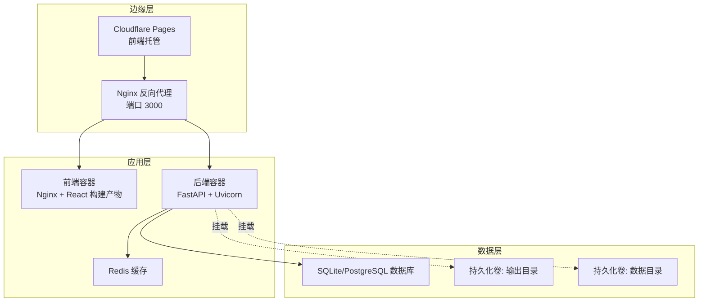
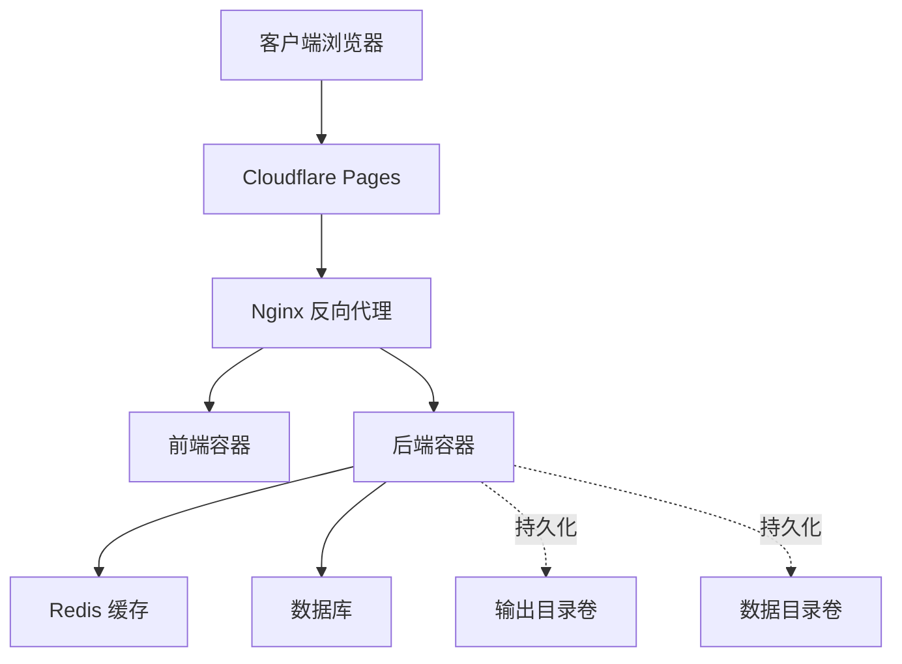
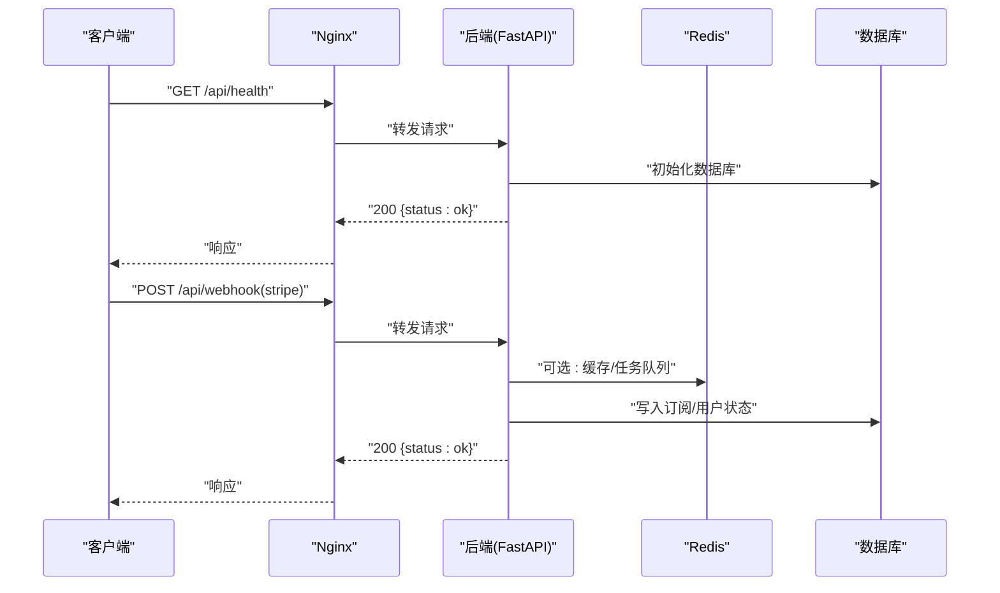
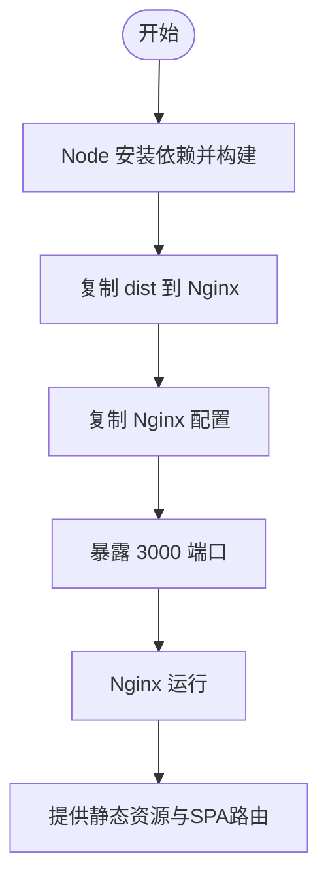
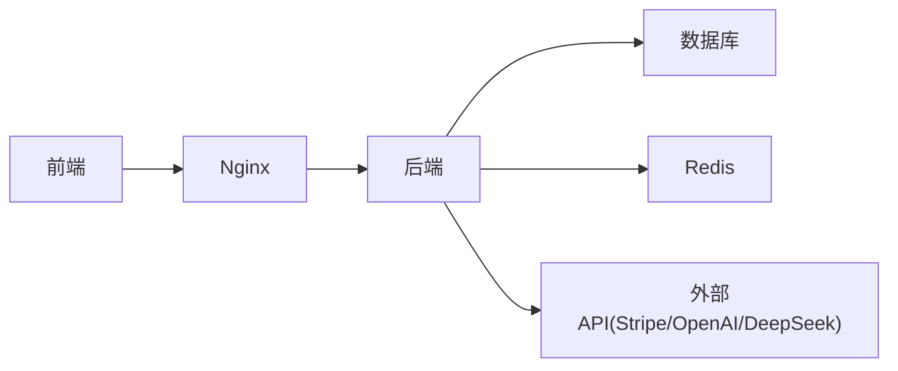

# 部署与运维

<cite>
**本文引用的文件**
- [docker-compose.yml](file://deployment/docker-compose.yml)
- [nginx.conf](file://deployment/nginx.conf)
- [cloudflare.toml](file://deployment/cloudflare.toml)
- [backend/Dockerfile](file://backend/Dockerfile)
- [frontend/Dockerfile](file://frontend/Dockerfile)
- [backend/main.py](file://backend/main.py)
- [backend/core/config.py](file://backend/core/config.py)
- [backend/requirements.txt](file://backend/requirements.txt)
- [frontend/package.json](file://frontend/package.json)
- [backend/core/db.py](file://backend/core/db.py)
- [backend/models/user.py](file://backend/models/user.py)
- [backend/models/subscription.py](file://backend/models/subscription.py)
- [backend/workers/ppt_worker.py](file://backend/workers/ppt_worker.py)
- [backend/agents/orchestrator.py](file://backend/agents/orchestrator.py)
- [backend/api/billing.py](file://backend/api/billing.py)
- [backend/api/users.py](file://backend/api/users.py)
</cite>

## 目录
1. [简介](#简介)
2. [项目结构](#项目结构)
3. [核心组件](#核心组件)
4. [架构总览](#架构总览)
5. [详细组件分析](#详细组件分析)
6. [依赖关系分析](#依赖关系分析)
7. [性能考量](#性能考量)
8. [故障排除指南](#故障排除指南)
9. [结论](#结论)
10. [附录](#附录)

## 简介
本文件面向AI-PPT项目的部署与运维团队，系统化说明容器化与多容器编排、生产环境部署流程、环境变量与安全配置、Nginx反向代理与负载均衡、SSL与CDN（Cloudflare）集成、监控与日志最佳实践、数据库备份与迁移、CI/CD流水线与自动化测试，以及故障排除、性能优化与扩展性建议。

## 项目结构
- 后端服务：基于FastAPI，使用异步数据库连接与任务队列，提供用户、计费、模板与生成等接口，并通过健康检查端点暴露运行状态。
- 前端应用：React/Vite构建，采用Nginx作为静态资源服务器，统一由Nginx反向代理后端API。
- 编排与网络：使用Docker Compose在自定义网络中编排后端、前端与Redis缓存；持久化卷用于输出与数据目录。
- 反向代理：Nginx监听3000端口，将/api/请求转发至后端服务，同时启用gzip压缩。
- 边缘与CDN：Cloudflare Pages用于前端托管，提供安全头部与兼容性配置。

图表来源
- [docker-compose.yml:1-46](file://deployment/docker-compose.yml#L1-L46)
- [nginx.conf:1-26](file://deployment/nginx.conf#L1-L26)
- [backend/Dockerfile:1-15](file://backend/Dockerfile#L1-L15)
- [frontend/Dockerfile:1-13](file://frontend/Dockerfile#L1-L13)

章节来源
- [docker-compose.yml:1-46](file://deployment/docker-compose.yml#L1-L46)
- [nginx.conf:1-26](file://deployment/nginx.conf#L1-L26)
- [cloudflare.toml:1-20](file://deployment/cloudflare.toml#L1-L20)

## 核心组件
- 容器编排与网络
  - 使用Docker Compose在自定义网络中编排后端、前端与Redis，确保服务间通信与隔离。
  - 后端映射8000端口，前端映射3000端口；通过持久化卷挂载输出与数据目录。
- 反向代理与静态资源
  - Nginx监听3000端口，根路径返回前端静态页面；/api/前缀转发到后端8000端口，设置真实IP与协议头，开启超时与gzip压缩。
- 应用入口与健康检查
  - 后端FastAPI应用在启动时初始化数据库并注册路由，提供/api/health健康检查端点。
- 配置与环境变量
  - 后端通过Pydantic Settings从.env文件加载配置，包括数据库URL、Redis地址、JWT密钥、Stripe密钥与价格策略等。
- 前端构建与发布
  - 前端Dockerfile采用多阶段构建：Node安装依赖并打包，Nginx容器复制dist并注入Nginx配置；默认暴露3000端口。

章节来源
- [docker-compose.yml:3-46](file://deployment/docker-compose.yml#L3-L46)
- [nginx.conf:1-26](file://deployment/nginx.conf#L1-L26)
- [backend/main.py:1-40](file://backend/main.py#L1-L40)
- [backend/core/config.py:1-34](file://backend/core/config.py#L1-L34)
- [backend/Dockerfile:1-15](file://backend/Dockerfile#L1-L15)
- [frontend/Dockerfile:1-13](file://frontend/Dockerfile#L1-L13)

## 架构总览
下图展示生产环境典型拓扑：Cloudflare Pages承载前端静态资源，Nginx作为反向代理与边缘缓存，后端FastAPI处理业务逻辑并通过Redis进行任务与会话缓存，数据库存储用户、订阅与使用记录。

图表来源
- [nginx.conf:1-26](file://deployment/nginx.conf#L1-L26)
- [backend/main.py:37-40](file://backend/main.py#L37-L40)
- [backend/core/config.py:11-12](file://backend/core/config.py#L11-L12)
- [docker-compose.yml:12-14](file://deployment/docker-compose.yml#L12-L14)

## 详细组件分析

### 后端服务（FastAPI）
- 启动与生命周期
  - 应用在启动时初始化数据库，注册用户、计费、模板、生成与下载路由，并提供健康检查端点。
- 安全与跨域
  - 允许所有来源的CORS配置，便于开发与跨域访问；生产环境建议收紧允许来源。
- 计费与Webhook
  - Stripe webhook解析并根据事件更新订阅状态与用户等级，需正确配置secret与webhook secret。
- 数据模型
  - 用户表含等级、日使用量与重置时间；订阅表支持多种计划与自动续费；使用记录表追踪动作与计数。

图表来源
- [backend/main.py:10-40](file://backend/main.py#L10-L40)
- [backend/api/billing.py:45-79](file://backend/api/billing.py#L45-L79)
- [backend/core/db.py:21-26](file://backend/core/db.py#L21-L26)

章节来源
- [backend/main.py:1-40](file://backend/main.py#L1-L40)
- [backend/api/billing.py:45-79](file://backend/api/billing.py#L45-L79)
- [backend/core/db.py:1-26](file://backend/core/db.py#L1-L26)
- [backend/models/user.py:1-20](file://backend/models/user.py#L1-L20)
- [backend/models/subscription.py:1-28](file://backend/models/subscription.py#L1-L28)

### 前端服务（React + Nginx）
- 构建与分发
  - 多阶段构建：第一阶段安装依赖并打包，第二阶段将dist复制到Nginx容器，注入Nginx配置，暴露3000端口。
- 静态资源与路由
  - Nginx根目录指向dist，启用try_files回退至index.html，适配SPA路由。
- Cloudflare Pages
  - 通过cloudflare.toml定义构建命令与输出目录，设置安全头部以提升安全性。

图表来源
- [frontend/Dockerfile:1-13](file://frontend/Dockerfile#L1-L13)
- [nginx.conf:5-10](file://deployment/nginx.conf#L5-L10)
- [cloudflare.toml:7-9](file://deployment/cloudflare.toml#L7-L9)

章节来源
- [frontend/Dockerfile:1-13](file://frontend/Dockerfile#L1-L13)
- [nginx.conf:1-26](file://deployment/nginx.conf#L1-L26)
- [cloudflare.toml:1-20](file://deployment/cloudflare.toml#L1-L20)
- [frontend/package.json:1-26](file://frontend/package.json#L1-L26)

### 缓存与任务（Redis）
- 缓存用途
  - 用于会话、任务状态与临时数据缓存，提升并发与响应速度。
- 卷与持久化
  - 使用命名卷redis_data实现Redis数据持久化，避免容器重启丢失。

章节来源
- [docker-compose.yml:31-42](file://deployment/docker-compose.yml#L31-L42)

### 数据库与持久化
- 数据库初始化
  - 应用启动时创建用户、PPT记录、订阅与使用记录等表。
- 目录挂载
  - 后端容器挂载输出与数据目录，确保生成文件与上传内容持久化。

章节来源
- [backend/core/db.py:21-26](file://backend/core/db.py#L21-L26)
- [docker-compose.yml:12-14](file://deployment/docker-compose.yml#L12-L14)

### 生成引擎与工作流
- 任务执行
  - 工作流通过任务存储读取任务并调用编排器执行内容、脚本、视觉与导出等子流程。
- 异常处理
  - 将异常信息写入任务状态，便于前端轮询与日志追踪。

章节来源
- [backend/workers/ppt_worker.py:1-23](file://backend/workers/ppt_worker.py#L1-L23)
- [backend/agents/orchestrator.py:1-25](file://backend/agents/orchestrator.py#L1-L25)

## 依赖关系分析
- 组件耦合
  - 前端通过Nginx访问后端API；后端依赖数据库与Redis；生成流程依赖各智能体模块。
- 外部依赖
  - Stripe用于订阅与计费；OpenAI/DeepSeek等外部API用于内容生成（需在配置中注入密钥）。
- 环境变量
  - 关键配置项来自.env文件，包括数据库URL、Redis地址、JWT密钥、Stripe密钥与Webhook密钥、输出与上传目录、代理地址等。

图表来源
- [backend/core/config.py:8-19](file://backend/core/config.py#L8-L19)
- [backend/requirements.txt:1-22](file://backend/requirements.txt#L1-L22)

章节来源
- [backend/core/config.py:1-34](file://backend/core/config.py#L1-L34)
- [backend/requirements.txt:1-22](file://backend/requirements.txt#L1-L22)

## 性能考量
- 反向代理优化
  - 启用gzip压缩与合理的超时参数，减少传输体积与连接等待。
- 缓存策略
  - 对热点接口与静态资源利用Redis缓存；对生成结果进行短期缓存以降低重复计算。
- 并发与资源
  - 后端Uvicorn进程数与worker数应结合CPU核数与内存容量调优；前端Nginx worker数与连接数按QPS估算配置。
- 存储与I/O
  - 输出与数据目录挂载至高性能磁盘；数据库使用异步驱动以提升并发能力。
- CDN与边缘
  - 使用Cloudflare Pages与边缘节点就近分发静态资源，缩短首包延迟。

章节来源
- [nginx.conf:22-24](file://deployment/nginx.conf#L22-L24)
- [docker-compose.yml:12-14](file://deployment/docker-compose.yml#L12-L14)

## 故障排除指南
- 健康检查失败
  - 访问/api/health确认后端存活；若失败，检查数据库初始化是否成功与依赖服务连通性。
- CORS问题
  - 生产环境建议限制allow_origins为可信域名，避免宽泛允许导致安全风险。
- 计费回调异常
  - 核对Stripe webhook签名与webhook secret配置，确保事件类型与用户等级更新逻辑正确。
- 生成任务失败
  - 查看任务状态与错误字段，定位具体Agent环节；检查外部API密钥与网络代理配置。
- 静态资源无法加载
  - 确认Nginx配置与dist目录挂载；检查SPA路由回退逻辑与缓存清理。

章节来源
- [backend/main.py:37-40](file://backend/main.py#L37-L40)
- [backend/api/billing.py:45-79](file://backend/api/billing.py#L45-L79)
- [backend/workers/ppt_worker.py:1-23](file://backend/workers/ppt_worker.py#L1-L23)
- [nginx.conf:5-10](file://deployment/nginx.conf#L5-L10)

## 结论
本部署方案以Docker容器化为基础，结合Nginx反向代理与Cloudflare边缘网络，形成高可用、可扩展的应用架构。通过合理的环境变量管理、安全配置与监控日志体系，可在生产环境中稳定运行。建议后续完善CI/CD流水线、数据库备份与迁移策略、性能压测与容量规划，持续优化用户体验与系统韧性。

## 附录

### A. 生产环境部署清单
- 环境变量
  - 必填项：数据库URL、Redis地址、JWT密钥、Stripe密钥与Webhook密钥、外部API密钥（OpenAI/DeepSeek）、输出与上传目录、代理地址。
- 安全加固
  - 限制CORS来源、启用HTTPS与HSTS、定期轮换JWT密钥、严格控制卷权限。
- 负载均衡与高可用
  - 多实例部署后端与前端，使用Nginx或云负载均衡器分发流量；Redis使用哨兵或集群模式。
- SSL与CDN
  - 在Nginx或边缘层配置SSL证书；Cloudflare Pages提供安全头部与全球加速。
- 监控与日志
  - 收集Nginx访问日志、后端应用日志与数据库慢查询；设置关键指标告警（错误率、P95/P99、队列长度、缓存命中率）。

章节来源
- [backend/core/config.py:8-27](file://backend/core/config.py#L8-L27)
- [backend/main.py:22-28](file://backend/main.py#L22-L28)
- [cloudflare.toml:14-20](file://deployment/cloudflare.toml#L14-L20)

### B. 数据库备份与恢复
- 备份策略
  - SQLite：定期复制数据库文件；PostgreSQL：使用pg_dump或逻辑备份工具。
- 恢复流程
  - 停止写入 -> 恢复备份 -> 校验完整性 -> 启动服务。
- 迁移方案
  - 使用Alembic进行版本化迁移；先在测试环境验证，再灰度发布。

章节来源
- [backend/core/db.py:21-26](file://backend/core/db.py#L21-L26)
- [backend/requirements.txt:8-8](file://backend/requirements.txt#L8-L8)

### C. CI/CD流水线建议
- 触发条件
  - push到主分支触发构建；PR触发单元测试与代码扫描。
- 步骤建议
  - 安装依赖 -> 单元测试 -> 构建镜像 -> 推送镜像 -> 编排部署 -> 健康检查 -> 回滚策略。
- 自动化测试
  - 后端：pytest + 异步数据库测试；前端：Vitest + E2E测试。
- 发布策略
  - 蓝绿/金丝雀发布，结合健康检查与熔断降级。

[本节为通用实践建议，不直接分析具体文件]

### D. 监控与日志最佳实践
- 指标采集
  - 应用：请求速率、错误率、响应时间、并发连接数；数据库：连接数、锁等待、慢查询；Redis：内存使用、命中率、阻塞命令。
- 日志管理
  - 标准输出采集，结构化日志格式；按天切割与保留策略；敏感信息脱敏。
- 告警配置
  - 基于阈值与趋势的规则告警；聚合多指标的复合告警；短信/邮件通知与值班联动。

[本节为通用实践建议，不直接分析具体文件]