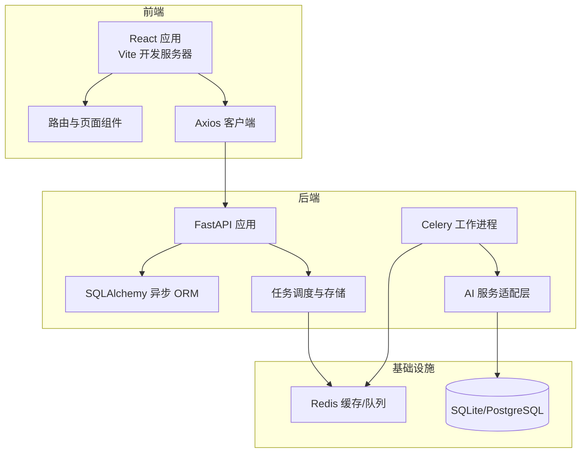
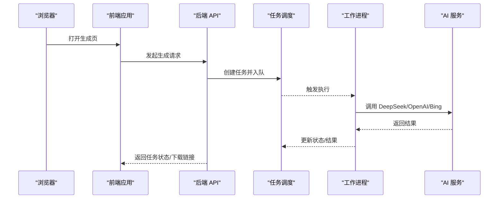
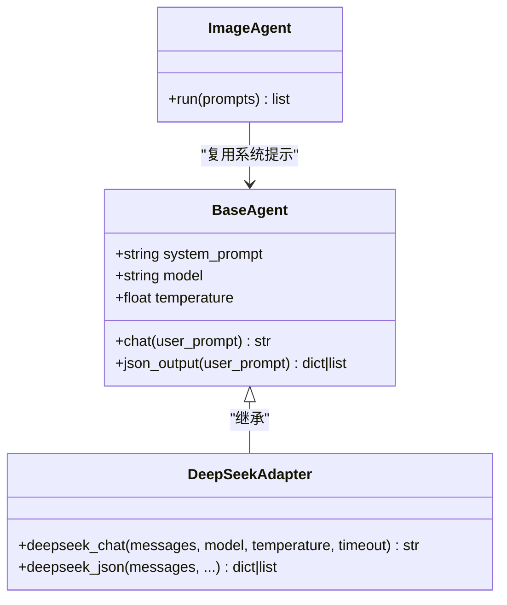
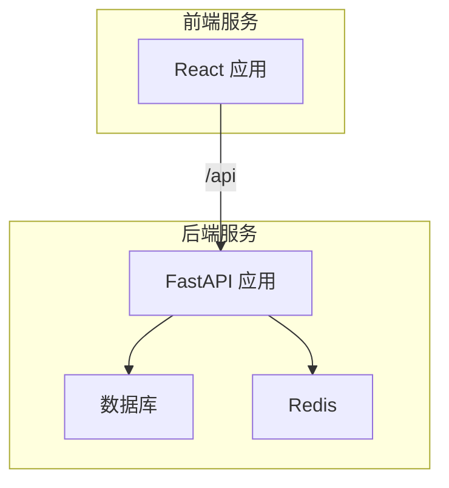
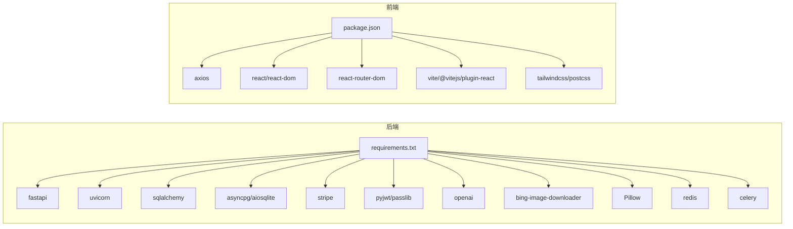

# 技术栈与依赖

<cite>
**本文引用的文件**
- [backend/main.py](file://backend/main.py)
- [backend/requirements.txt](file://backend/requirements.txt)
- [backend/core/config.py](file://backend/core/config.py)
- [backend/core/db.py](file://backend/core/db.py)
- [backend/core/tasks.py](file://backend/core/tasks.py)
- [backend/workers/ppt_worker.py](file://backend/workers/ppt_worker.py)
- [backend/core/deepseek.py](file://backend/core/deepseek.py)
- [backend/agents/base.py](file://backend/agents/base.py)
- [backend/agents/image.py](file://backend/agents/image.py)
- [backend/models/ppt.py](file://backend/models/ppt.py)
- [deployment/docker-compose.yml](file://deployment/docker-compose.yml)
- [backend/Dockerfile](file://backend/Dockerfile)
- [frontend/package.json](file://frontend/package.json)
- [frontend/vite.config.js](file://frontend/vite.config.js)
- [frontend/tailwind.config.js](file://frontend/tailwind.config.js)
- [frontend/src/App.jsx](file://frontend/src/App.jsx)
- [frontend/src/api/client.js](file://frontend/src/api/client.js)
</cite>

## 目录
1. [简介](#简介)
2. [项目结构](#项目结构)
3. [核心组件](#核心组件)
4. [架构总览](#架构总览)
5. [详细组件分析](#详细组件分析)
6. [依赖关系分析](#依赖关系分析)
7. [性能考虑](#性能考虑)
8. [故障排查指南](#故障排查指南)
9. [结论](#结论)
10. [附录](#附录)

## 简介
本文件系统梳理 AI-PPT 项目的整体技术栈与依赖，围绕后端（FastAPI、Python、Celery、Redis）、前端（React、Vite、Tailwind CSS）、AI 服务集成（DeepSeek、OpenAI、Bing 图片搜索）、数据库与缓存、容器化与部署展开，并给出版本兼容性、性能与扩展性方面的设计依据与建议。

## 项目结构
项目采用前后端分离架构：后端使用 Python 异步 Web 框架 FastAPI 提供 API；前端使用 React + Vite 构建单页应用；AI 生成流程通过 Celery + Redis 实现异步任务编排；数据持久化采用 SQLAlchemy 异步 ORM；容器化通过 Docker Compose 编排后端、前端与 Redis。

图表来源
- [backend/main.py:16-40](file://backend/main.py#L16-L40)
- [backend/core/db.py:1-27](file://backend/core/db.py#L1-L27)
- [backend/core/tasks.py:1-33](file://backend/core/tasks.py#L1-L33)
- [backend/workers/ppt_worker.py:1-24](file://backend/workers/ppt_worker.py#L1-L24)
- [deployment/docker-compose.yml:31-39](file://deployment/docker-compose.yml#L31-L39)

章节来源
- [backend/main.py:16-40](file://backend/main.py#L16-L40)
- [frontend/package.json:1-26](file://frontend/package.json#L1-L26)
- [deployment/docker-compose.yml:3-46](file://deployment/docker-compose.yml#L3-L46)

## 核心组件
- 后端框架与运行时：FastAPI + Uvicorn，支持异步路由、自动 OpenAPI 文档与中间件生态。
- 数据访问：SQLAlchemy 2.x 异步引擎，支持 SQLite 与 PostgreSQL（通过连接字符串切换）。
- 任务与缓存：Celery + Redis，用于异步生成任务编排与状态存储。
- 前端框架：React 19 + Vite，Tailwind CSS 提供样式基础。
- AI 服务：DeepSeek 对话接口封装；Bing 图片搜索用于配图；OpenAI 配置预留字段。
- 容器化：Docker 多阶段构建与 Compose 编排，暴露必要端口并挂载持久化目录。

章节来源
- [backend/requirements.txt:1-22](file://backend/requirements.txt#L1-L22)
- [backend/core/config.py:1-34](file://backend/core/config.py#L1-L34)
- [frontend/package.json:11-24](file://frontend/package.json#L11-L24)

## 架构总览
后端以 FastAPI 作为入口，统一注册路由模块；数据库初始化在应用生命周期内完成；任务通过内存字典进行轻量级调度，实际生产可替换为 Redis/Celery；AI 服务通过统一适配层调用外部模型；前端通过 Axios 访问后端 API，路由由 React Router 管理。

图表来源
- [backend/main.py:30-34](file://backend/main.py#L30-L34)
- [backend/core/tasks.py:14-28](file://backend/core/tasks.py#L14-L28)
- [backend/workers/ppt_worker.py:5-24](file://backend/workers/ppt_worker.py#L5-L24)
- [backend/core/deepseek.py:9-33](file://backend/core/deepseek.py#L9-L33)

## 详细组件分析

### 后端技术栈与选择理由
- FastAPI
  - 优点：类型安全、自动生成文档、高性能异步支持；适合构建可扩展的 API。
  - 选择依据：项目需要快速迭代与清晰的接口契约，同时保留异步能力。
- Uvicorn
  - 作为 ASGI 服务器承载 FastAPI 应用，便于容器化与云部署。
- SQLAlchemy 2.x 异步 ORM
  - 支持 SQLite 与 PostgreSQL；通过连接字符串灵活切换数据库类型。
  - 选择依据：异步 I/O 与现代 ORM 特性满足高并发场景。
- Celery + Redis
  - 用于异步任务编排与队列管理；当前示例中使用内存字典模拟任务存储，便于本地开发与演示。
  - 选择依据：解耦生成流程与请求处理，提升吞吐与用户体验。
- 配置与环境变量
  - 使用 pydantic-settings 统一读取 .env 文件，集中管理密钥、数据库、缓存与业务参数。
- CORS 中间件
  - 允许跨域访问，便于前端独立开发与部署。

章节来源
- [backend/main.py:16-40](file://backend/main.py#L16-L40)
- [backend/core/config.py:4-34](file://backend/core/config.py#L4-L34)
- [backend/core/db.py:1-27](file://backend/core/db.py#L1-L27)
- [backend/core/tasks.py:1-33](file://backend/core/tasks.py#L1-L33)
- [backend/requirements.txt:1-22](file://backend/requirements.txt#L1-L22)

### 前端技术栈与组件化思路
- React 19 + Vite
  - 快速热更新与现代化打包工具链；适合迭代频繁的前端应用。
- Tailwind CSS
  - 原子化样式，降低样式维护成本，便于主题与响应式设计。
- 路由与页面
  - React Router 管理多页面路由，App.jsx 统一组织页面组件。
- Axios 客户端
  - 统一拦截器处理鉴权与未授权跳转，简化 API 调用。

章节来源
- [frontend/package.json:11-24](file://frontend/package.json#L11-L24)
- [frontend/vite.config.js:1-9](file://frontend/vite.config.js#L1-L9)
- [frontend/tailwind.config.js:1-7](file://frontend/tailwind.config.js#L1-L7)
- [frontend/src/App.jsx:14-34](file://frontend/src/App.jsx#L14-L34)
- [frontend/src/api/client.js:1-28](file://frontend/src/api/client.js#L1-L28)

### AI 服务集成方案
- DeepSeek 对话接口
  - 封装异步 HTTP 客户端，统一鉴权头与超时设置；提供 JSON 输出解析辅助方法。
  - 适配器基类 BaseAgent 通过 system_prompt 与 chat/json_output 方法抽象 AI 调用。
- Bing 图片搜索
  - ImageAgent 使用 bing-image-downloader 下载图片，按页号组织输出目录，返回文件路径或错误信息。
- OpenAI 集成预留
  - 配置项中包含 openai_api_key 字段，便于后续接入官方 SDK 或 API。

图表来源
- [backend/agents/base.py:5-23](file://backend/agents/base.py#L5-L23)
- [backend/core/deepseek.py:9-39](file://backend/core/deepseek.py#L9-L39)
- [backend/agents/image.py:7-40](file://backend/agents/image.py#L7-L40)

章节来源
- [backend/core/deepseek.py:1-40](file://backend/core/deepseek.py#L1-L40)
- [backend/agents/base.py:1-23](file://backend/agents/base.py#L1-L23)
- [backend/agents/image.py:1-40](file://backend/agents/image.py#L1-L40)
- [backend/core/config.py:8-9](file://backend/core/config.py#L8-L9)

### 数据库与缓存策略
- 数据库
  - 默认使用 SQLite（aiosqlite），适用于开发与小规模生产；可通过连接字符串切换至 PostgreSQL（asyncpg）。
  - 初始化在应用启动时完成，创建用户、PPT 记录、订阅与用量表。
- 缓存
  - 当前未见显式的 Redis 缓存键值逻辑，但已配置 Redis 连接地址；可结合业务热点数据（如模板元数据、用户偏好）进行缓存优化。
- 模型
  - PPTRecord 表记录生成任务的元数据、状态与产物路径，便于回溯与下载。

章节来源
- [backend/core/config.py:11](file://backend/core/config.py#L11)
- [backend/core/db.py:21-27](file://backend/core/db.py#L21-L27)
- [backend/models/ppt.py:1-18](file://backend/models/ppt.py#L1-L18)
- [backend/requirements.txt:9-10](file://backend/requirements.txt#L9-L10)

### 容器化与部署架构
- Dockerfile
  - 基于 Python slim 镜像，安装编译依赖后安装 Python 依赖，暴露 8000 端口并以 Uvicorn 启动。
- docker-compose
  - 编排后端、前端与 Redis；后端映射 8000，前端映射 3000；挂载输出与数据目录；Redis 使用持久化卷。
- 前端代理
  - Vite 代理将 /api 请求转发到后端，便于开发联调。

图表来源
- [deployment/docker-compose.yml:3-46](file://deployment/docker-compose.yml#L3-L46)
- [backend/Dockerfile:1-15](file://backend/Dockerfile#L1-L15)
- [frontend/vite.config.js:6](file://frontend/vite.config.js#L6)

章节来源
- [deployment/docker-compose.yml:1-46](file://deployment/docker-compose.yml#L1-L46)
- [backend/Dockerfile:1-15](file://backend/Dockerfile#L1-L15)
- [frontend/vite.config.js:1-9](file://frontend/vite.config.js#L1-L9)

## 依赖关系分析
- 后端依赖
  - web：fastapi、uvicorn、pydantic、pydantic-settings
  - 数据：sqlalchemy、asyncpg/aiosqlite、alembic
  - 安全：pyjwt、passlib
  - 支付：stripe
  - AI/媒体：openai、bing-image-downloader、Pillow、Jinja2
  - 任务：redis、celery
- 前端依赖
  - 核心：react、react-dom、react-router-dom、axios
  - 构建：vite、@vitejs/plugin-react、tailwindcss、postcss

图表来源
- [backend/requirements.txt:1-22](file://backend/requirements.txt#L1-L22)
- [frontend/package.json:11-24](file://frontend/package.json#L11-L24)

章节来源
- [backend/requirements.txt:1-22](file://backend/requirements.txt#L1-L22)
- [frontend/package.json:1-26](file://frontend/package.json#L1-L26)

## 性能考虑
- 异步优先
  - 使用 SQLAlchemy 异步引擎与 FastAPI 异步路由，减少阻塞，提升并发处理能力。
- 任务解耦
  - 通过 Celery/Redis 异步执行 AI 生成，避免请求长时间占用；当前示例使用内存字典，生产需替换为 Redis。
- 缓存策略
  - 可对模板元数据、热门关键词搜索结果、用户偏好等进行缓存，降低重复计算与外部调用延迟。
- 数据库选择
  - SQLite 适合开发与小规模；生产建议 PostgreSQL 并启用连接池与索引优化。
- 前端性能
  - 使用 Vite 的按需加载与 Tree-shaking；Tailwind 原子类减少样式体积；路由懒加载可进一步优化首屏。

## 故障排查指南
- 健康检查
  - 后端提供 /api/health 接口，返回应用名称与版本，便于容器编排健康探测。
- 配置校验
  - 若缺少 DeepSeek/OpenAI 密钥，相关调用会抛出异常；请检查 .env 文件与配置项。
- 数据库初始化
  - 应用启动时自动创建表；若出现表缺失，请确认数据库连接字符串与权限。
- 任务状态
  - 任务状态保存在内存字典中；重启后会丢失。生产需持久化到 Redis 或数据库。
- 前端鉴权
  - 401 时自动清除本地 token 并跳转登录页，检查后端 JWT 配置与前端拦截器。

章节来源
- [backend/main.py:37-40](file://backend/main.py#L37-L40)
- [backend/core/config.py:8-9](file://backend/core/config.py#L8-L9)
- [backend/core/db.py:21-27](file://backend/core/db.py#L21-L27)
- [backend/core/tasks.py:5-6](file://backend/core/tasks.py#L5-L6)
- [frontend/src/api/client.js:16-25](file://frontend/src/api/client.js#L16-L25)

## 结论
本项目在技术选型上兼顾易用性与扩展性：后端以 FastAPI 为核心，配合 SQLAlchemy 异步 ORM 与 Celery/Redis 实现高并发异步生成；前端采用 React/Vite/Tailwind 构建现代化界面；AI 服务通过适配层抽象，便于替换与扩展。建议在生产环境中完善缓存、持久化任务与数据库迁移策略，并持续关注依赖版本的安全与性能更新。

## 附录
- 版本兼容性要点
  - Python 3.12（Dockerfile 指定）
  - FastAPI 0.115.6、Uvicorn 0.34.0、SQLAlchemy 2.0.36、Celery 5.4.0、Redis 5.2.1
  - React 19、Vite 6、Tailwind CSS 3
- 扩展性建议
  - 引入数据库迁移工具（Alembic）与 CI/CD 流水线
  - 增加监控与日志采集（如 Prometheus/Grafana）
  - 引入限流与熔断机制，保障系统稳定性