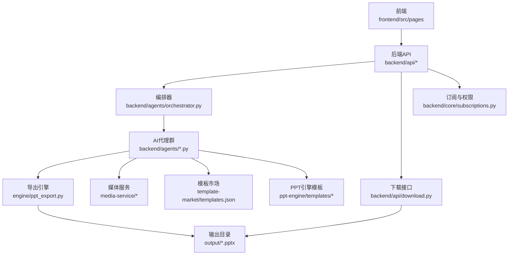
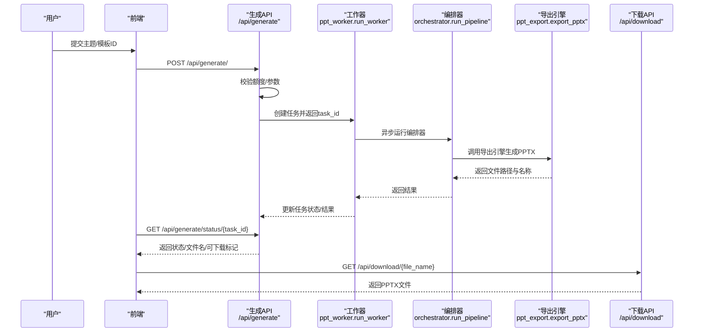
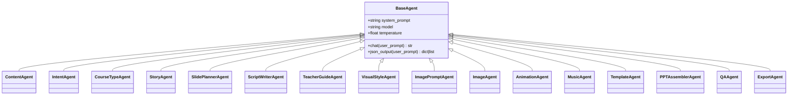
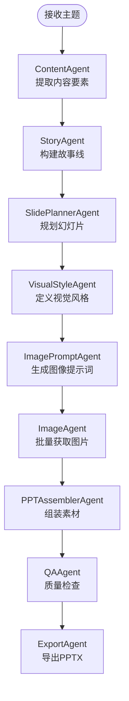
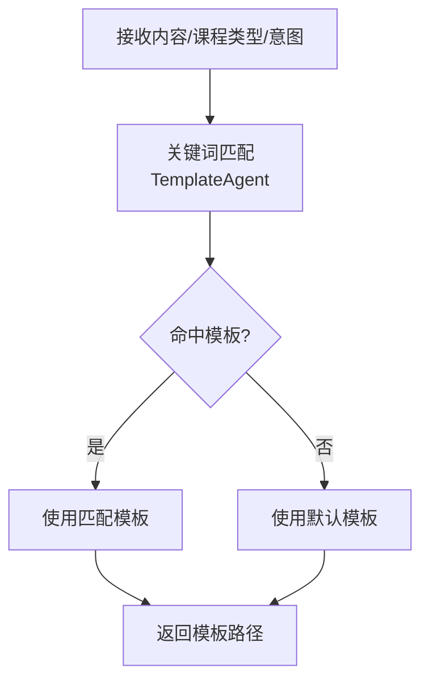
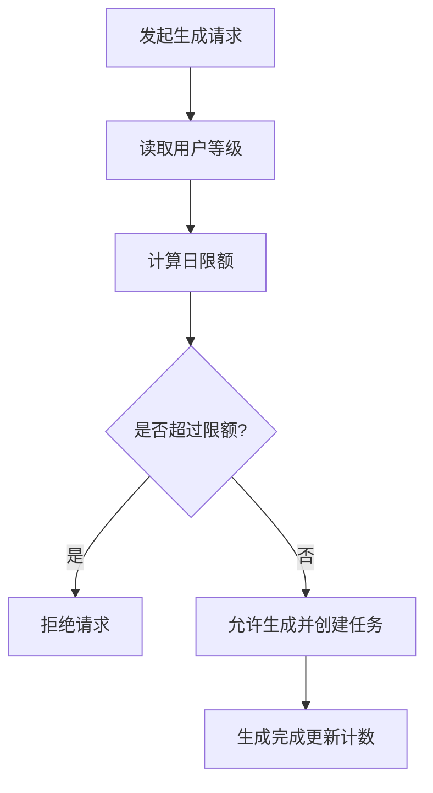
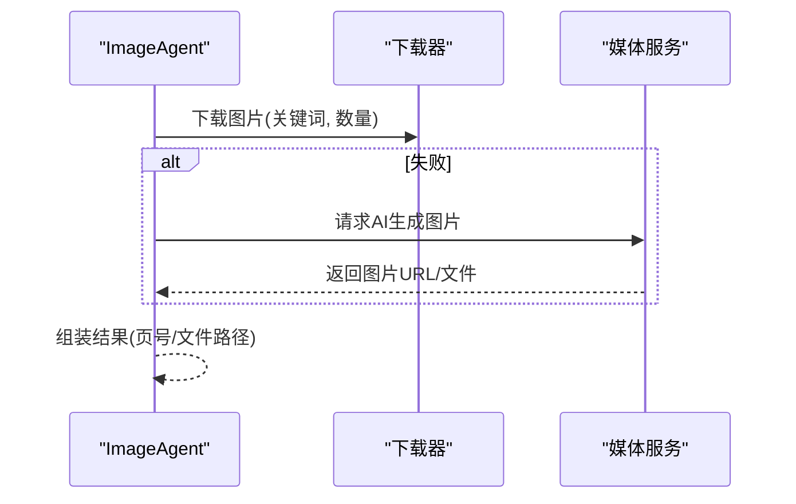
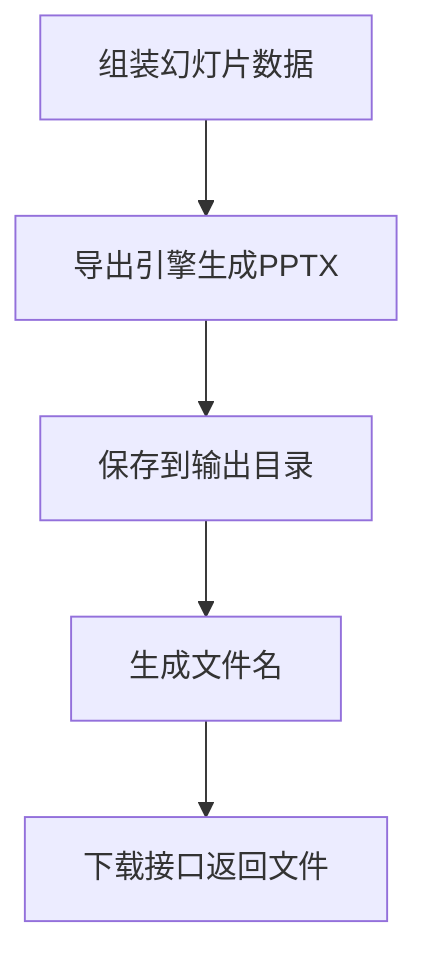
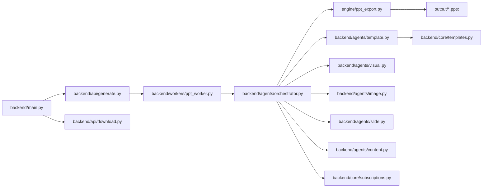

# 核心功能特性

<cite>
**本文引用的文件**
- [backend/main.py](file://backend/main.py)
- [backend/agents/orchestrator.py](file://backend/agents/orchestrator.py)
- [backend/api/generate.py](file://backend/api/generate.py)
- [backend/workers/ppt_worker.py](file://backend/workers/ppt_worker.py)
- [backend/agents/base.py](file://backend/agents/base.py)
- [backend/core/subscriptions.py](file://backend/core/subscriptions.py)
- [backend/api/download.py](file://backend/api/download.py)
- [engine/ppt_export.py](file://engine/ppt_export.py)
- [backend/agents/content.py](file://backend/agents/content.py)
- [backend/agents/template.py](file://backend/agents/template.py)
- [backend/agents/slide.py](file://backend/agents/slide.py)
- [backend/agents/visual.py](file://backend/agents/visual.py)
- [backend/agents/image.py](file://backend/agents/image.py)
- [backend/core/templates.py](file://backend/core/templates.py)
- [backend/models/ppt.py](file://backend/models/ppt.py)
- [media-service/image_gen.py](file://media-service/image_gen.py)
- [media-service/audio_gen.py](file://media-service/audio_gen.py)
</cite>

## 目录
1. [简介](#简介)
2. [项目结构](#项目结构)
3. [核心组件](#核心组件)
4. [架构总览](#架构总览)
5. [详细组件分析](#详细组件分析)
6. [依赖关系分析](#依赖关系分析)
7. [性能与可扩展性](#性能与可扩展性)
8. [故障排查指南](#故障排查指南)
9. [结论](#结论)
10. [附录](#附录)

## 简介
本文件聚焦于AI-PPT项目的核心功能特性，系统阐述从“主题输入”到“PPT导出”的全链路工作流，覆盖内容策划、视觉设计、模板匹配、图像与音频生成、动画与转场、质量检查与最终导出等关键环节。同时，文档详细说明15个AI代理的协同机制与职责分工，解释模板系统的设计理念与多场景适配能力，介绍订阅计费与用户权限管理，并给出媒体服务集成、文件导出与下载的技术实现细节及用户体验考量。

## 项目结构
后端采用FastAPI框架，通过路由模块化组织业务接口；AI代理位于agents目录，负责不同阶段的任务；核心逻辑在orchestrator中编排；导出引擎位于engine目录；媒体服务位于media-service目录；前端位于frontend目录；模板市场位于template-market目录；PPT引擎模板位于ppt-engine/templates目录。

图表来源
- [backend/main.py:16-39](file://backend/main.py#L16-L39)
- [backend/agents/orchestrator.py:19-55](file://backend/agents/orchestrator.py#L19-L55)
- [engine/ppt_export.py:245-256](file://engine/ppt_export.py#L245-L256)
- [backend/api/download.py:9-14](file://backend/api/download.py#L9-L14)

章节来源
- [backend/main.py:16-39](file://backend/main.py#L16-L39)

## 核心组件
- 编排器：统一调度15个AI代理，串联内容策划、故事线构建、幻灯片规划、脚本写作、教师指导、视觉风格、图像提示词、图像生成、动画与转场、音乐、模板选择、装配与质量检查、导出等步骤。
- AI代理群：每个代理专注单一职责，通过统一的BaseAgent封装LLM调用与JSON解析能力，确保一致性与可维护性。
- 导出引擎：负责PPTX生成、图片与音频资源处理、动画与转场映射、Windows平台COM自动化写入。
- 订阅与权限：基于用户等级限制每日生成次数，控制功能开关（如教师讲义、图像生成、动画、音乐等）。
- 媒体服务：提供图像与音频生成的外部服务入口，支持异步任务与错误回退。
- 模板系统：内置模板市场与PPT引擎模板，按主题关键词自动匹配，支持自定义模板ID覆盖。

章节来源
- [backend/agents/orchestrator.py:19-55](file://backend/agents/orchestrator.py#L19-L55)
- [backend/agents/base.py:5-24](file://backend/agents/base.py#L5-L24)
- [engine/ppt_export.py:92-237](file://engine/ppt_export.py#L92-L237)
- [backend/core/subscriptions.py:46-57](file://backend/core/subscriptions.py#L46-L57)
- [backend/core/templates.py:7-19](file://backend/core/templates.py#L7-L19)
- [backend/agents/template.py:7-32](file://backend/agents/template.py#L7-L32)

## 架构总览
下图展示从API请求到PPT导出的关键交互路径，包括任务创建、后台执行、状态查询与文件下载。

图表来源
- [backend/api/generate.py:20-51](file://backend/api/generate.py#L20-L51)
- [backend/workers/ppt_worker.py:5-24](file://backend/workers/ppt_worker.py#L5-L24)
- [backend/agents/orchestrator.py:19-55](file://backend/agents/orchestrator.py#L19-L55)
- [engine/ppt_export.py:245-256](file://engine/ppt_export.py#L245-L256)
- [backend/api/download.py:9-14](file://backend/api/download.py#L9-L14)

## 详细组件分析

### AI代理协同机制与职责分工
- ContentAgent：解析主题，输出课程类型、受众、核心要点、页数预估与情感基调等结构化内容。
- IntentAgent：识别生成目的（如教学、汇报、演讲），影响内容与风格倾向。
- CourseTypeAgent：判定课程类别（如教育、通用、技术、语文等），用于模板与风格选择。
- StoryAgent：将内容拆解为故事线，形成章节与子节。
- SlidePlannerAgent：将故事线转化为幻灯片大纲，确定布局与页码。
- ScriptWriterAgent：为每页生成讲解脚本与要点摘要。
- TeacherGuideAgent：生成教师讲义，辅助课堂或培训场景。
- VisualStyleAgent：定义整套视觉风格（配色、字体、装饰、封面风格等）。
- ImagePromptAgent：结合风格与页面内容生成中文图像提示词。
- ImageAgent：批量拉取图片资源，支持并发与错误回退。
- AnimationAgent：为每页分配入场动画与页面转场。
- MusicAgent：为演示添加背景音乐轨道。
- TemplateAgent：根据主题关键词匹配模板文件路径，支持自定义模板ID。
- PPTAssemblerAgent：整合所有素材（文本、图片、动画、音乐、模板），组装成可导出结构。
- QAAgent：对装配后的PPT进行质量检查与修正。
- ExportAgent：触发导出引擎生成PPTX并返回文件路径与名称。

图表来源
- [backend/agents/base.py:5-24](file://backend/agents/base.py#L5-L24)
- [backend/agents/content.py:4-20](file://backend/agents/content.py#L4-L20)
- [backend/agents/template.py:7-32](file://backend/agents/template.py#L7-L32)
- [backend/agents/slide.py:1-16](file://backend/agents/slide.py#L1-L16)
- [backend/agents/visual.py:5-33](file://backend/agents/visual.py#L5-L33)
- [backend/agents/image.py:7-40](file://backend/agents/image.py#L7-L40)

章节来源
- [backend/agents/orchestrator.py:19-55](file://backend/agents/orchestrator.py#L19-L55)
- [backend/agents/base.py:5-24](file://backend/agents/base.py#L5-L24)
- [backend/agents/content.py:4-20](file://backend/agents/content.py#L4-L20)
- [backend/agents/template.py:7-32](file://backend/agents/template.py#L7-L32)
- [backend/agents/slide.py:1-16](file://backend/agents/slide.py#L1-L16)
- [backend/agents/visual.py:5-33](file://backend/agents/visual.py#L5-L33)
- [backend/agents/image.py:7-40](file://backend/agents/image.py#L7-L40)

### 内容策划与视觉设计
- 内容策划：ContentAgent基于主题抽取课程类型、受众、核心要点、页数预估与情感基调，作为后续故事线与风格设计的基础。
- 视觉设计：VisualStyleAgent输出主题名称、主色/辅色/强调色、标题与正文字体、图片风格、装饰风格、封面风格与情绪板，确保风格一致性。

图表来源
- [backend/agents/content.py:7-20](file://backend/agents/content.py#L7-L20)
- [backend/agents/visual.py:9-33](file://backend/agents/visual.py#L9-L33)
- [backend/agents/orchestrator.py:19-55](file://backend/agents/orchestrator.py#L19-L55)

章节来源
- [backend/agents/content.py:4-20](file://backend/agents/content.py#L4-L20)
- [backend/agents/visual.py:5-33](file://backend/agents/visual.py#L5-L33)

### 模板系统与多场景适配
- 模板匹配：TemplateAgent根据主题关键词映射到特定模板路径（如英语、语文、数学、技术、教育等），默认回退至通用讲座模板。
- 模板市场：core/templates加载template-market中的模板清单，支持前端模板市场浏览与选择。
- 多场景适配：通过关键词规则与课程类型，自动适配不同学科与用途（教学、学术、商务、演讲等）。

图表来源
- [backend/agents/template.py:7-32](file://backend/agents/template.py#L7-L32)
- [backend/core/templates.py:7-19](file://backend/core/templates.py#L7-L19)

章节来源
- [backend/agents/template.py:7-32](file://backend/agents/template.py#L7-L32)
- [backend/core/templates.py:7-19](file://backend/core/templates.py#L7-L19)

### 订阅计费与用户权限
- 配额限制：check_usage_limit依据用户等级返回当日剩余次数，防止超额使用。
- 功能开关：不同等级（free/pro/school）开放不同功能（如教师讲义、图像生成、动画、音乐、语音合成、自定义模板、API访问等）。
- 使用记录：每次成功生成后更新UsageRecord与用户日使用计数。

图表来源
- [backend/core/subscriptions.py:46-57](file://backend/core/subscriptions.py#L46-L57)
- [backend/api/generate.py:26-35](file://backend/api/generate.py#L26-L35)

章节来源
- [backend/core/subscriptions.py:10-57](file://backend/core/subscriptions.py#L10-L57)
- [backend/api/generate.py:20-51](file://backend/api/generate.py#L20-L51)

### 媒体服务集成（图像与音频）
- 图像生成：ImageAgent通过bing_image_downloader批量下载图片，支持并发抓取与错误回退；也可对接media-service/image_gen以实现AI生成。
- 音频生成：导出引擎内置随机下载示例音频；也可对接media-service/audio_gen以生成定制化背景音乐。
- 资源管理：临时目录清理与异常处理确保资源不泄露。

图表来源
- [backend/agents/image.py:10-40](file://backend/agents/image.py#L10-L40)
- [engine/ppt_export.py:40-90](file://engine/ppt_export.py#L40-L90)
- [media-service/image_gen.py](file://media-service/image_gen.py)
- [media-service/audio_gen.py](file://media-service/audio_gen.py)

章节来源
- [backend/agents/image.py:7-40](file://backend/agents/image.py#L7-L40)
- [engine/ppt_export.py:40-90](file://engine/ppt_export.py#L40-L90)

### 文件导出与下载
- 导出流程：导出引擎在Windows平台通过COM自动化创建PPT，填充标题、正文、图片、动画与转场，并保存为PPTX。
- 输出命名：对主题进行安全字符替换，生成唯一文件名。
- 下载接口：FileResponse直接返回PPTX文件，设置正确媒体类型与文件名。

图表来源
- [engine/ppt_export.py:92-237](file://engine/ppt_export.py#L92-L237)
- [engine/ppt_export.py:245-256](file://engine/ppt_export.py#L245-L256)
- [backend/api/download.py:9-14](file://backend/api/download.py#L9-L14)

章节来源
- [engine/ppt_export.py:92-237](file://engine/ppt_export.py#L92-L237)
- [engine/ppt_export.py:245-256](file://engine/ppt_export.py#L245-L256)
- [backend/api/download.py:9-14](file://backend/api/download.py#L9-L14)

## 依赖关系分析
- 控制层：FastAPI应用注册路由，健康检查与CORS配置。
- 业务层：生成API负责参数校验、额度检查、任务创建；下载API负责文件返回。
- 协调层：orchestrator统一编排15个代理；workers异步执行任务。
- 数据层：PPTRecord模型持久化生成记录；UsageRecord记录使用行为。
- 导出层：engine/ppt_export.py封装PPTX生成与资源处理。
- 模板层：core/templates与agents/template共同决定模板选择策略。
- 媒体层：ImageAgent与导出引擎协作处理图片与音频。

图表来源
- [backend/main.py:30-34](file://backend/main.py#L30-L34)
- [backend/api/generate.py:20-51](file://backend/api/generate.py#L20-L51)
- [backend/workers/ppt_worker.py:5-24](file://backend/workers/ppt_worker.py#L5-L24)
- [backend/agents/orchestrator.py:19-55](file://backend/agents/orchestrator.py#L19-L55)
- [engine/ppt_export.py:245-256](file://engine/ppt_export.py#L245-L256)
- [backend/agents/template.py:7-32](file://backend/agents/template.py#L7-L32)
- [backend/agents/visual.py:5-33](file://backend/agents/visual.py#L5-L33)
- [backend/agents/image.py:7-40](file://backend/agents/image.py#L7-L40)
- [backend/agents/slide.py:1-16](file://backend/agents/slide.py#L1-L16)
- [backend/agents/content.py:4-20](file://backend/agents/content.py#L4-L20)
- [backend/core/subscriptions.py:46-57](file://backend/core/subscriptions.py#L46-L57)
- [backend/core/templates.py:7-19](file://backend/core/templates.py#L7-L19)

章节来源
- [backend/main.py:30-34](file://backend/main.py#L30-L34)
- [backend/models/ppt.py:6-17](file://backend/models/ppt.py#L6-L17)

## 性能与可扩展性
- 异步与并发：ImageAgent使用并发抓取提升图片获取效率；导出引擎通过线程分离避免阻塞事件循环。
- 资源复用：图片与音频下载采用临时目录与缓存策略，减少重复请求。
- 可扩展点：新增代理只需遵循BaseAgent协议；模板与媒体服务可通过配置扩展；导出引擎可抽象为多平台适配器。
- 任务队列：当前通过内存TASK_STORE管理任务，建议引入消息队列（如Celery/RabbitMQ）以支持分布式与持久化。

[本节为通用性能讨论，无需列出具体文件来源]

## 故障排查指南
- 生成失败：检查任务状态接口返回的错误字段；确认网络与外部服务可用性（下载器、媒体服务）。
- 图片未返回：核对关键词长度与合法性；查看ImageAgent异常回退逻辑；确认输出目录权限。
- 导出异常：检查Windows COM组件可用性；确认PowerPoint安装与版本兼容；查看临时目录清理是否成功。
- 下载404：确认文件名与输出目录一致；检查静态文件挂载与路径拼接。
- 额度不足：确认用户等级与日限额；检查UsageRecord是否正确写入。

章节来源
- [backend/workers/ppt_worker.py:20-23](file://backend/workers/ppt_worker.py#L20-L23)
- [backend/api/generate.py:40-51](file://backend/api/generate.py#L40-L51)
- [engine/ppt_export.py:229-236](file://engine/ppt_export.py#L229-L236)
- [backend/api/download.py:11-13](file://backend/api/download.py#L11-L13)
- [backend/core/subscriptions.py:53-57](file://backend/core/subscriptions.py#L53-L57)

## 结论
AI-PPT项目通过15个专业化AI代理与统一编排器，实现了从主题输入到PPTX导出的自动化流水线。模板系统与多场景适配确保了跨学科与多用途的灵活性；订阅与权限体系保障了商业化运营的可持续性；媒体服务与导出引擎提供了高质量的视觉与听觉体验。未来可在任务队列、模板生态与多平台导出方面进一步增强可扩展性与稳定性。

[本节为总结性内容，无需列出具体文件来源]

## 附录
- 使用场景举例
  - 教学场景：输入“高中数学函数”，自动匹配教育模板，生成封面、概念讲解、例题演示与练习页，附加教师讲义与课堂互动建议。
  - 商务场景：输入“新产品发布”，自动匹配商务模板，生成产品介绍、市场分析、竞品对比与未来规划，附加动画与背景音乐。
  - 学术场景：输入“人工智能前沿研究”，自动匹配学术模板，生成引言、方法、实验与结论，附加封面与参考文献页。
- 用户体验考虑
  - 参数校验与错误提示：对空主题与非法长度进行即时反馈。
  - 任务状态轮询：提供进度与可下载标记，避免频繁刷新。
  - 文件命名与存储：安全字符替换与唯一命名，便于检索与分享。
  - 权限透明：明确免费与付费功能差异，引导升级路径。

[本节为概念性内容，无需列出具体文件来源]