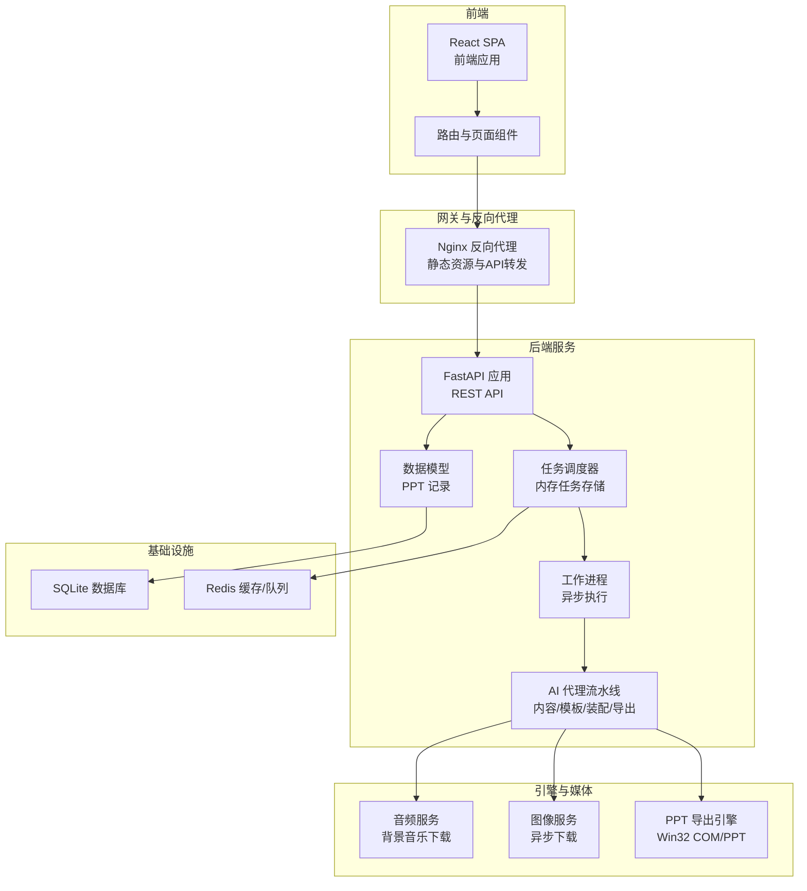
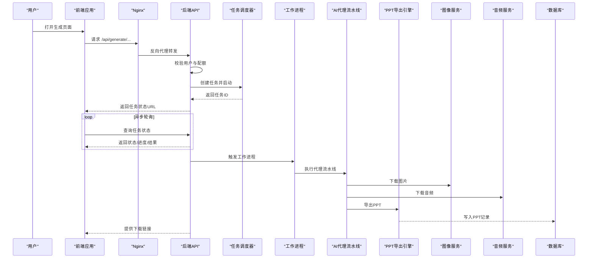
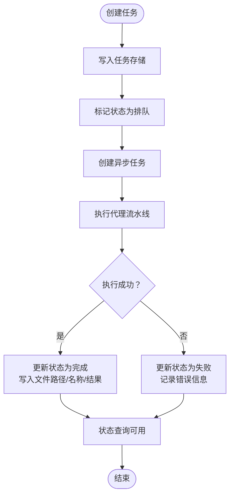
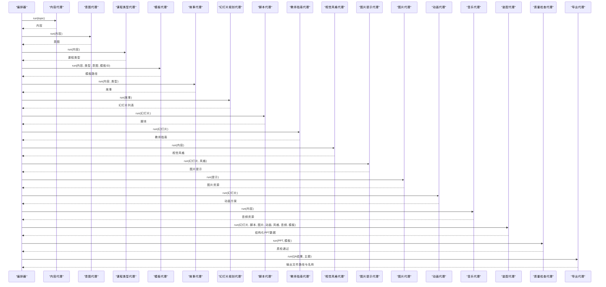
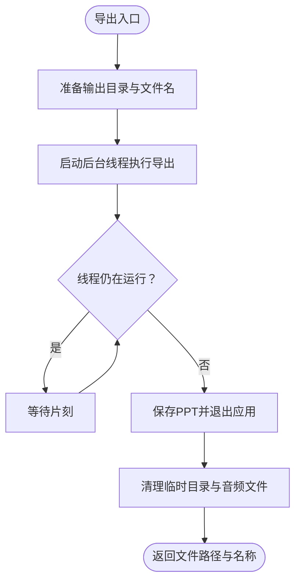
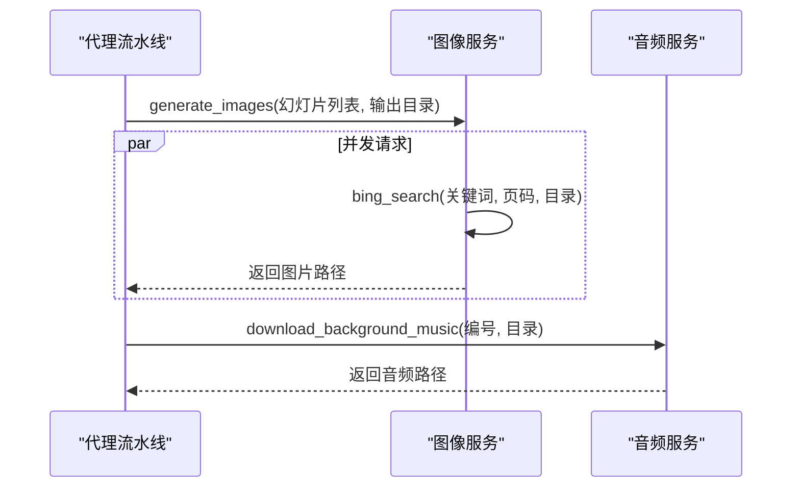
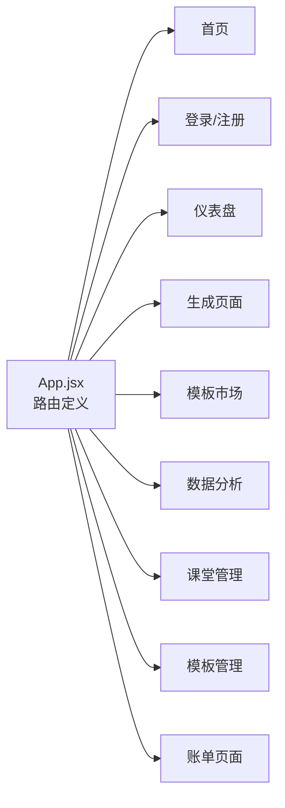
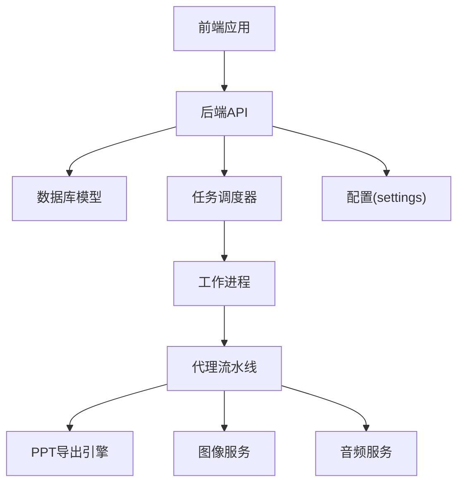

# 系统架构概览

<cite>
**本文档引用的文件**
- [backend/main.py](file://backend/main.py)
- [backend/core/config.py](file://backend/core/config.py)
- [backend/core/tasks.py](file://backend/core/tasks.py)
- [backend/workers/ppt_worker.py](file://backend/workers/ppt_worker.py)
- [backend/agents/orchestrator.py](file://backend/agents/orchestrator.py)
- [backend/api/generate.py](file://backend/api/generate.py)
- [engine/ppt_export.py](file://engine/ppt_export.py)
- [media-service/image_gen.py](file://media-service/image_gen.py)
- [media-service/audio_gen.py](file://media-service/audio_gen.py)
- [deployment/docker-compose.yml](file://deployment/docker-compose.yml)
- [deployment/nginx.conf](file://deployment/nginx.conf)
- [frontend/src/App.jsx](file://frontend/src/App.jsx)
- [backend/models/ppt.py](file://backend/models/ppt.py)
- [backend/Dockerfile](file://backend/Dockerfile)
- [frontend/Dockerfile](file://frontend/Dockerfile)
</cite>

## 目录
1. [引言](#引言)
2. [项目结构](#项目结构)
3. [核心组件](#核心组件)
4. [架构总览](#架构总览)
5. [详细组件分析](#详细组件分析)
6. [依赖关系分析](#依赖关系分析)
7. [性能考量](#性能考量)
8. [故障排查指南](#故障排查指南)
9. [结论](#结论)
10. [附录](#附录)

## 引言
本文件为 AI-PPT 项目的系统架构概览，面向技术与非技术读者，提供高层级的系统设计视图，展示前端应用、后端 API、AI 代理、PPT 引擎、媒体服务、数据库等核心组件之间的关系与交互模式。文档还解释微服务架构的设计原则与模块化组织方式，描述从用户请求到最终输出的完整数据流与处理流程，并阐述异步任务处理机制与容器化部署架构及负载均衡策略。

## 项目结构
AI-PPT 采用前后端分离与模块化服务的组织方式：
- 前端：基于 React 的单页应用（SPA），通过路由管理页面，构建后由 Nginx 提供静态资源服务。
- 后端：FastAPI 应用，提供 REST 接口、任务调度与业务逻辑；内部以“代理”模块实现 AI 驱动的 PPT 生成流水线。
- 引擎层：独立的 PPT 导出模块，负责将结构化数据转换为 PowerPoint 文件。
- 媒体服务：图像与音频生成服务，支持异步下载与缓存。
- 部署：使用 Docker Compose 编排后端、前端与 Redis；Nginx 作为反向代理与静态资源服务器。

图表来源
- [backend/main.py:16-40](file://backend/main.py#L16-L40)
- [backend/core/tasks.py:14-28](file://backend/core/tasks.py#L14-L28)
- [backend/workers/ppt_worker.py:5-23](file://backend/workers/ppt_worker.py#L5-L23)
- [backend/agents/orchestrator.py:19-55](file://backend/agents/orchestrator.py#L19-L55)
- [engine/ppt_export.py:245-256](file://engine/ppt_export.py#L245-L256)
- [media-service/image_gen.py:19-25](file://media-service/image_gen.py#L19-L25)
- [media-service/audio_gen.py:12-33](file://media-service/audio_gen.py#L12-L33)
- [deployment/docker-compose.yml:3-46](file://deployment/docker-compose.yml#L3-L46)
- [deployment/nginx.conf:12-20](file://deployment/nginx.conf#L12-L20)

章节来源
- [backend/main.py:16-40](file://backend/main.py#L16-L40)
- [deployment/docker-compose.yml:3-46](file://deployment/docker-compose.yml#L3-L46)
- [deployment/nginx.conf:12-20](file://deployment/nginx.conf#L12-L20)

## 核心组件
- 前端应用：负责用户界面与交互，通过路由组织页面，构建产物由 Nginx 提供静态服务。
- 后端 API：提供认证、计费、模板、生成与下载接口；集成 CORS 中间件与健康检查端点。
- AI 代理流水线：按顺序调用内容、意图、课程类型、故事、幻灯片规划、脚本、教师指南、视觉风格、图片提示、图片、动画、音乐、装配与 QA、导出等代理，完成 PPT 全流程。
- 异步任务系统：在内存中维护任务状态，创建工作协程异步执行生成流程。
- PPT 导出引擎：将结构化数据导出为 PowerPoint 文件，支持图片与音频资源的下载与嵌入。
- 媒体服务：异步下载图像与背景音乐，支持缓存与并发处理。
- 数据与配置：使用 SQLAlchemy 模型记录 PPT 生成结果；通过 Pydantic 设置加载环境变量与运行参数。
- 容器化与部署：后端与前端分别打包为镜像，使用 Docker Compose 编排；Nginx 负责反向代理与静态资源。

章节来源
- [backend/api/generate.py:20-51](file://backend/api/generate.py#L20-L51)
- [backend/agents/orchestrator.py:19-55](file://backend/agents/orchestrator.py#L19-L55)
- [backend/core/tasks.py:14-28](file://backend/core/tasks.py#L14-L28)
- [engine/ppt_export.py:245-256](file://engine/ppt_export.py#L245-L256)
- [media-service/image_gen.py:19-25](file://media-service/image_gen.py#L19-L25)
- [media-service/audio_gen.py:12-33](file://media-service/audio_gen.py#L12-L33)
- [backend/core/config.py:4-34](file://backend/core/config.py#L4-L34)
- [backend/models/ppt.py:6-17](file://backend/models/ppt.py#L6-L17)

## 架构总览
系统采用“前端 SPA + 后端 API + 异步工作流 + 专用引擎”的分层架构。用户通过前端发起生成请求，后端 API 进行鉴权与配额校验，创建异步任务并返回任务状态查询接口。工作进程异步执行 AI 代理流水线，调用引擎与媒体服务完成资源准备与导出，最终将结果写入数据库并持久化文件。

图表来源
- [backend/api/generate.py:20-51](file://backend/api/generate.py#L20-L51)
- [backend/core/tasks.py:14-28](file://backend/core/tasks.py#L14-L28)
- [backend/workers/ppt_worker.py:5-23](file://backend/workers/ppt_worker.py#L5-L23)
- [backend/agents/orchestrator.py:19-55](file://backend/agents/orchestrator.py#L19-L55)
- [engine/ppt_export.py:245-256](file://engine/ppt_export.py#L245-L256)
- [media-service/image_gen.py:19-25](file://media-service/image_gen.py#L19-L25)
- [media-service/audio_gen.py:12-33](file://media-service/audio_gen.py#L12-L33)
- [backend/models/ppt.py:6-17](file://backend/models/ppt.py#L6-L17)

## 详细组件分析

### 组件A：异步任务与工作流
- 设计要点：内存中的任务存储与事件循环驱动的工作进程，避免引入外部消息队列时的复杂度。
- 关键流程：创建任务 → 标记排队 → 异步运行 → 更新状态/结果或错误 → 支持状态查询。
- 性能与扩展：当前为单实例内存存储，适合开发与小规模场景；生产建议替换为 Redis 或 Celery。

图表来源
- [backend/core/tasks.py:14-28](file://backend/core/tasks.py#L14-L28)
- [backend/workers/ppt_worker.py:5-23](file://backend/workers/ppt_worker.py#L5-L23)

章节来源
- [backend/core/tasks.py:14-28](file://backend/core/tasks.py#L14-L28)
- [backend/workers/ppt_worker.py:5-23](file://backend/workers/ppt_worker.py#L5-L23)

### 组件B：AI 代理流水线
- 设计要点：将 PPT 生成拆分为多个职责明确的代理，按顺序串联，便于扩展与测试。
- 处理流程：内容抽取 → 意图识别 → 课程类型 → 模板选择 → 故事/幻灯片规划 → 脚本/教师指南 → 视觉风格 → 图片提示/图片 → 动画 → 音乐 → 装配 → 质量检查 → 导出。
- 可扩展性：新增代理只需在编排处接入，不影响其他模块。

图表来源
- [backend/agents/orchestrator.py:19-55](file://backend/agents/orchestrator.py#L19-L55)

章节来源
- [backend/agents/orchestrator.py:19-55](file://backend/agents/orchestrator.py#L19-L55)

### 组件C：PPT 导出引擎
- 设计要点：封装 Windows PowerPoint COM 对象进行幻灯片创建、图片插入、动画与转场设置、音频嵌入与保存。
- 并发与线程：导出过程在后台线程执行，通过事件循环轮询等待完成，保证异步接口不阻塞。
- 资源管理：临时目录清理与音频文件回收，确保磁盘空间与资源释放。

图表来源
- [engine/ppt_export.py:245-256](file://engine/ppt_export.py#L245-L256)
- [engine/ppt_export.py:92-237](file://engine/ppt_export.py#L92-L237)

章节来源
- [engine/ppt_export.py:245-256](file://engine/ppt_export.py#L245-L256)
- [engine/ppt_export.py:92-237](file://engine/ppt_export.py#L92-L237)

### 组件D：媒体服务（图像与音频）
- 图像服务：根据每页关键词异步下载图片，支持并发 gather，输出统一命名的资源路径。
- 音频服务：随机或指定编号下载背景音乐，带缓存与超时控制，返回本地路径。

图表来源
- [media-service/image_gen.py:19-25](file://media-service/image_gen.py#L19-L25)
- [media-service/audio_gen.py:12-33](file://media-service/audio_gen.py#L12-L33)

章节来源
- [media-service/image_gen.py:19-25](file://media-service/image_gen.py#L19-L25)
- [media-service/audio_gen.py:12-33](file://media-service/audio_gen.py#L12-L33)

### 组件E：前端应用与路由
- 设计要点：基于 React Router 的单页应用，页面组件按功能划分，Header 统一导航。
- 部署：构建产物由 Nginx 提供静态服务，根路径与 API 路由通过反向代理区分。

图表来源
- [frontend/src/App.jsx:14-33](file://frontend/src/App.jsx#L14-L33)

章节来源
- [frontend/src/App.jsx:14-33](file://frontend/src/App.jsx#L14-L33)

## 依赖关系分析
- 组件耦合：后端 API 依赖任务调度器与数据库模型；任务调度器依赖工作进程；工作进程依赖代理流水线；代理流水线依赖引擎与媒体服务；前端依赖后端 API。
- 外部依赖：FastAPI、SQLAlchemy、Pydantic Settings、Windows PowerPoint COM、第三方图像下载库、HTTP 客户端。
- 配置与环境：通过 settings 加载数据库、Redis、密钥与目录等配置项。

图表来源
- [backend/api/generate.py:20-51](file://backend/api/generate.py#L20-L51)
- [backend/core/tasks.py:14-28](file://backend/core/tasks.py#L14-L28)
- [backend/workers/ppt_worker.py:5-23](file://backend/workers/ppt_worker.py#L5-L23)
- [backend/agents/orchestrator.py:19-55](file://backend/agents/orchestrator.py#L19-L55)
- [engine/ppt_export.py:245-256](file://engine/ppt_export.py#L245-L256)
- [media-service/image_gen.py:19-25](file://media-service/image_gen.py#L19-L25)
- [media-service/audio_gen.py:12-33](file://media-service/audio_gen.py#L12-L33)
- [backend/core/config.py:4-34](file://backend/core/config.py#L4-L34)

章节来源
- [backend/core/config.py:4-34](file://backend/core/config.py#L4-L34)
- [backend/models/ppt.py:6-17](file://backend/models/ppt.py#L6-L17)

## 性能考量
- 异步与并发：前端轮询与后端异步任务结合，避免阻塞；媒体服务使用异步并发下载提升效率。
- I/O 密集优化：PPT 导出在后台线程执行，避免阻塞 API；图像/音频下载使用异步客户端。
- 存储与缓存：媒体资源与导出文件落地磁盘；Redis 可用于任务队列与会话缓存（当前未启用）。
- 可扩展建议：生产环境建议引入 Redis/Celery 实现分布式任务队列；增加水平扩展节点与负载均衡；对热点资源做 CDN 缓存。

## 故障排查指南
- 任务状态异常：检查任务存储是否正确创建与更新；确认工作进程是否被触发；查看代理流水线各阶段日志。
- 导出失败：检查导出引擎的临时目录权限与 PowerPoint COM 是否可用；确认图片/音频下载是否成功。
- 媒体下载失败：检查网络代理与第三方服务可用性；验证关键词与输出目录权限。
- 数据库问题：确认连接字符串与表结构；检查 PPT 记录写入是否成功。

章节来源
- [backend/workers/ppt_worker.py:20-23](file://backend/workers/ppt_worker.py#L20-L23)
- [engine/ppt_export.py:245-256](file://engine/ppt_export.py#L245-L256)
- [media-service/image_gen.py:6-16](file://media-service/image_gen.py#L6-L16)
- [media-service/audio_gen.py:26-33](file://media-service/audio_gen.py#L26-L33)
- [backend/models/ppt.py:6-17](file://backend/models/ppt.py#L6-L17)

## 结论
AI-PPT 采用清晰的模块化与分层架构：前端 SPA、后端 API、异步工作流、专用引擎与媒体服务协同完成 PPT 自动化生成。当前实现简洁易懂，适合快速迭代与演示；生产部署建议引入分布式任务队列、负载均衡与缓存策略，以满足高并发与可扩展性需求。

## 附录
- 部署与容器化：后端与前端分别构建镜像并通过 Docker Compose 编排；Nginx 提供反向代理与静态资源服务。
- 健康检查：后端提供 /api/health 快速检测服务状态。

章节来源
- [backend/Dockerfile:1-15](file://backend/Dockerfile#L1-L15)
- [frontend/Dockerfile:1-13](file://frontend/Dockerfile#L1-L13)
- [deployment/docker-compose.yml:3-46](file://deployment/docker-compose.yml#L3-L46)
- [deployment/nginx.conf:12-20](file://deployment/nginx.conf#L12-L20)
- [backend/main.py:37-40](file://backend/main.py#L37-L40)