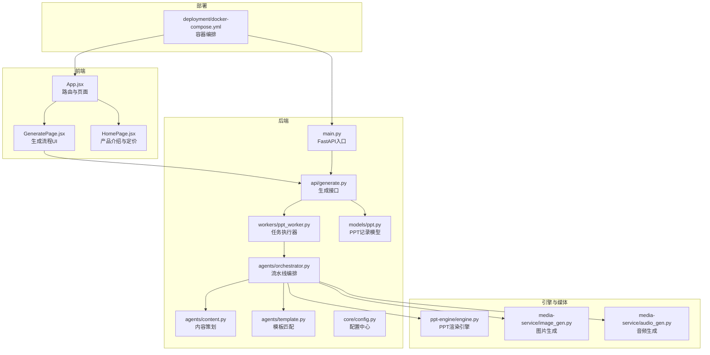
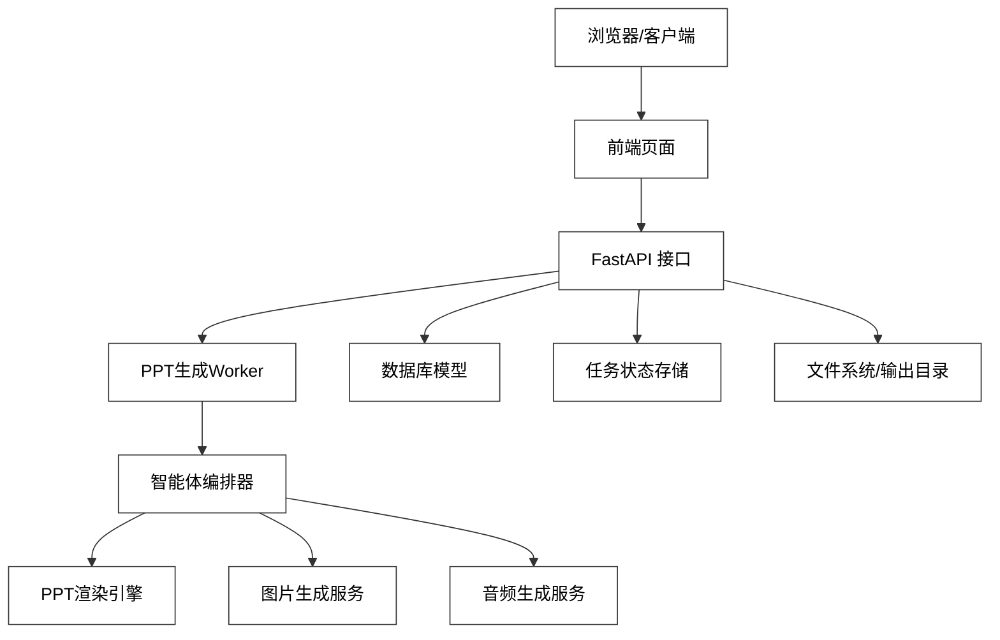
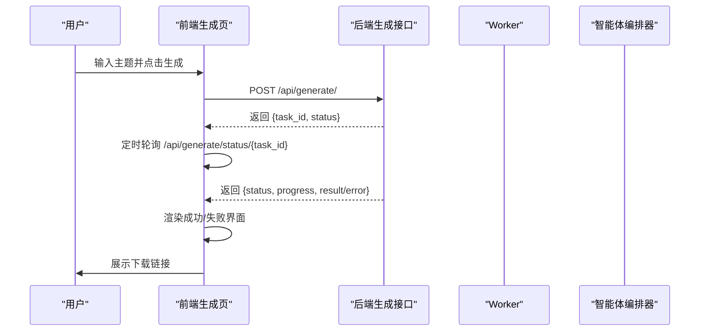
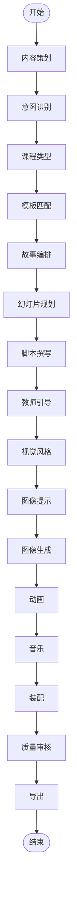
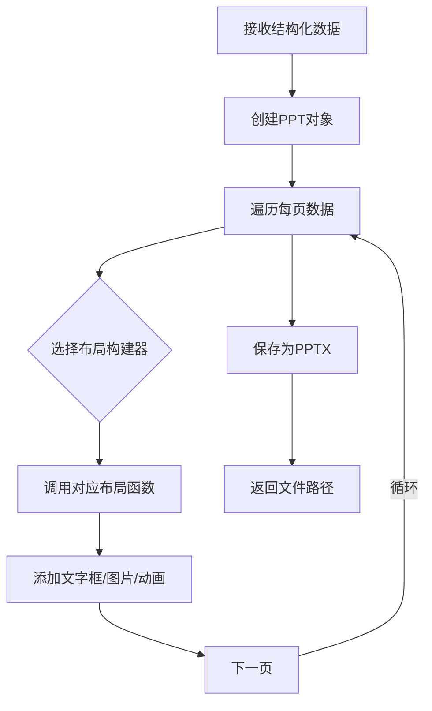
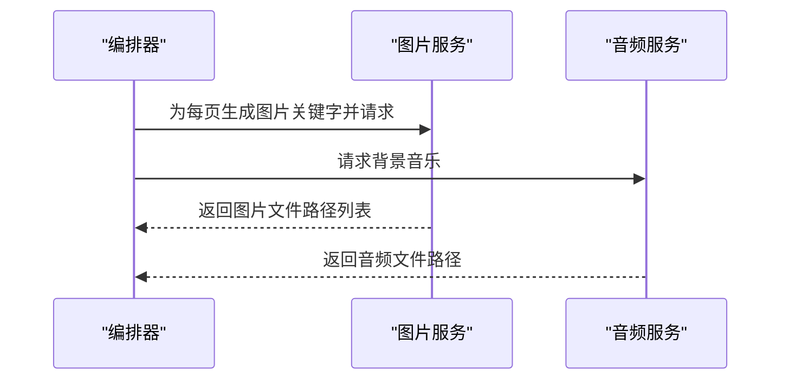
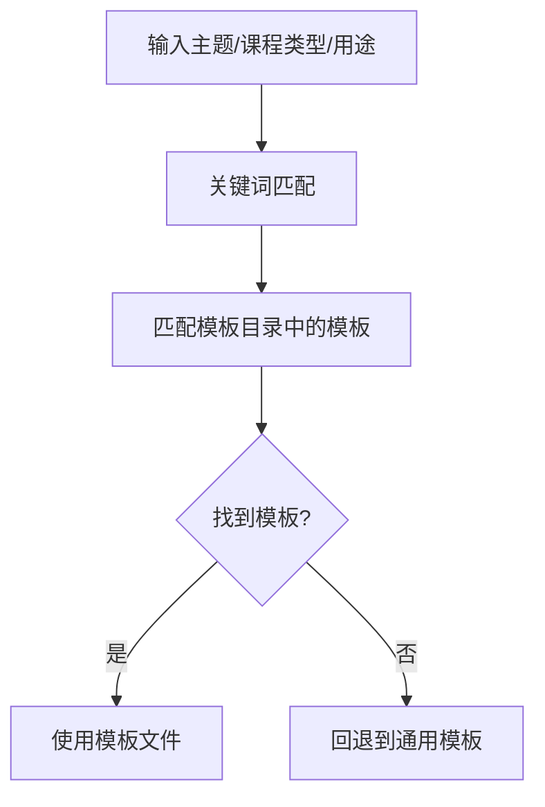
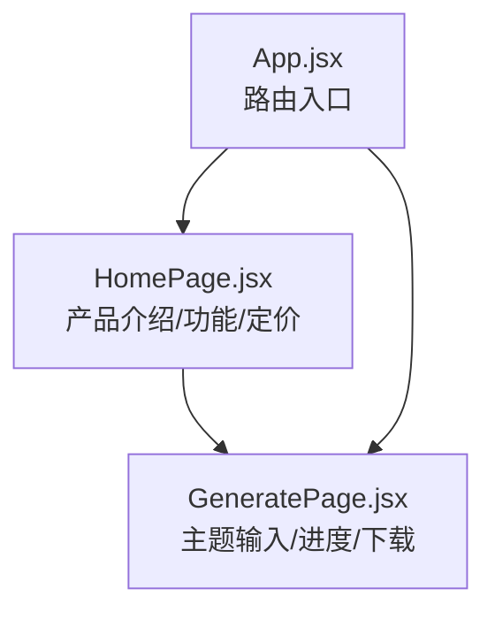
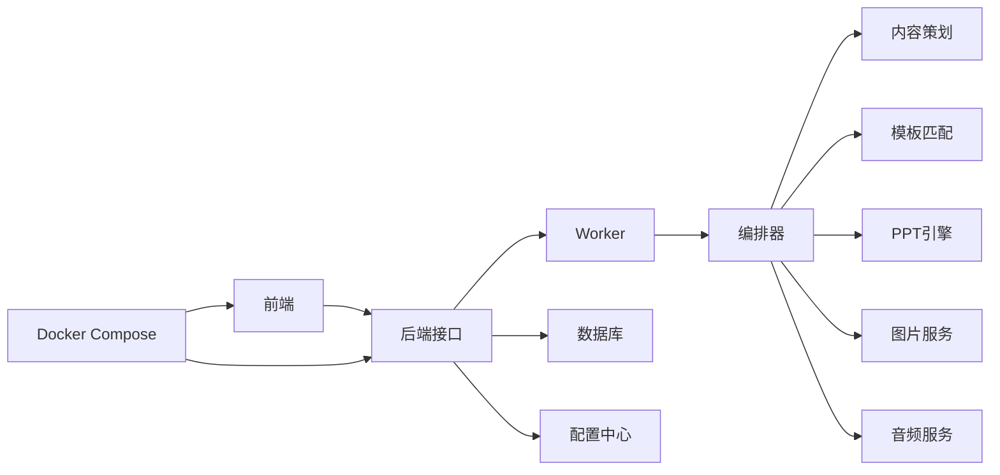

# 项目介绍与愿景

<cite>
**本文引用的文件**
- [backend/main.py](file://backend/main.py)
- [backend/api/generate.py](file://backend/api/generate.py)
- [backend/workers/ppt_worker.py](file://backend/workers/ppt_worker.py)
- [backend/agents/orchestrator.py](file://backend/agents/orchestrator.py)
- [backend/agents/content.py](file://backend/agents/content.py)
- [backend/agents/template.py](file://backend/agents/template.py)
- [ppt-engine/engine.py](file://ppt-engine/engine.py)
- [media-service/image_gen.py](file://media-service/image_gen.py)
- [media-service/audio_gen.py](file://media-service/audio_gen.py)
- [frontend/src/App.jsx](file://frontend/src/App.jsx)
- [frontend/src/pages/GeneratePage.jsx](file://frontend/src/pages/GeneratePage.jsx)
- [frontend/src/pages/HomePage.jsx](file://frontend/src/pages/HomePage.jsx)
- [template-market/templates.json](file://template-market/templates.json)
- [backend/core/config.py](file://backend/core/config.py)
- [deployment/docker-compose.yml](file://deployment/docker-compose.yml)
- [backend/models/ppt.py](file://backend/models/ppt.py)
</cite>

## 目录
1. 引言
2. 项目结构
3. 核心组件
4. 架构总览
5. 详细组件分析
6. 依赖关系分析
7. 性能考量
8. 故障排查指南
9. 结论
10. 附录

## 引言
本项目旨在打造一个“AI驱动的演示文稿自动生成系统”，通过多智能体协作与工程化流水线，实现从主题输入到标准PPT输出的全链路自动化。其核心使命是“让高质量的演示文稿创作变得简单、高效、普惠”；愿景是“以AI赋能教育与商业场景，降低内容创作门槛，释放创意生产力”。  
项目的价值主张体现在：  
- 降低创作门槛：用户只需输入主题，即可获得结构完整、风格统一、具备教师引导语与多媒体元素的课件。  
- 提升效率：17个AI智能体协同工作，平均3分钟内完成一份完整课件，显著缩短准备时间。  
- 增强质量：统一的模板体系、视觉风格、动画与背景音乐，确保成品在视觉与表达上的一致性。  
- 可扩展生态：模板市场、订阅计费、任务队列与导出机制，支撑规模化应用与商业化运营。

目标用户群体包括：  
- 教育工作者：教师、助教、教研员，用于备课、课堂演示与教学资源沉淀。  
- 商务专业人士：销售、培训师、项目经理，用于会议汇报、产品发布与内部培训。  
- 学生与研究者：课程展示、学术汇报、小组作业，快速生成规范的演示材料。  
- 学校与机构：批量生成、模板定制、账号管理与数据分析，满足规模化教学与管理需求。

## 项目结构
后端采用FastAPI框架，提供REST接口与任务调度；前端基于React路由组织页面；AI流水线由多个“智能体”组成，贯穿内容策划、故事编排、视觉设计、媒体生成与装配导出；PPT引擎负责将结构化数据渲染为标准PPTX；媒体服务负责图片与音频素材的异步生成；部署通过Docker Compose实现前后端与Redis的容器化编排。

**图表来源**
- [backend/main.py:16-40](file://backend/main.py#L16-L40)
- [backend/api/generate.py:20-52](file://backend/api/generate.py#L20-L52)
- [backend/workers/ppt_worker.py:5-24](file://backend/workers/ppt_worker.py#L5-L24)
- [backend/agents/orchestrator.py:19-56](file://backend/agents/orchestrator.py#L19-L56)
- [ppt-engine/engine.py:124-166](file://ppt-engine/engine.py#L124-L166)
- [media-service/image_gen.py:19-26](file://media-service/image_gen.py#L19-L26)
- [media-service/audio_gen.py:12-34](file://media-service/audio_gen.py#L12-L34)
- [frontend/src/App.jsx:14-34](file://frontend/src/App.jsx#L14-L34)
- [frontend/src/pages/GeneratePage.jsx:19-68](file://frontend/src/pages/GeneratePage.jsx#L19-L68)
- [deployment/docker-compose.yml:3-46](file://deployment/docker-compose.yml#L3-L46)

**章节来源**
- [backend/main.py:16-40](file://backend/main.py#L16-L40)
- [frontend/src/App.jsx:14-34](file://frontend/src/App.jsx#L14-L34)
- [deployment/docker-compose.yml:3-46](file://deployment/docker-compose.yml#L3-L46)

## 核心组件
- 生成接口与任务系统：提供POST提交生成任务与轮询状态的REST接口，结合内存任务存储实现异步执行与结果回传。  
- 多智能体流水线：由内容策划、意图识别、课程类型、故事编排、幻灯片规划、脚本撰写、教师引导、视觉风格、图像提示、图像生成、动画、音乐、模板匹配、装配与导出等智能体构成，形成完整的“内容-设计-媒体-装配”闭环。  
- PPT渲染引擎：将结构化的幻灯片数据渲染为标准PPTX，支持多种布局构建器、颜色与字体处理、过渡动画注入。  
- 媒体服务：异步抓取图片与下载背景音乐，保障生成过程的非阻塞与高并发。  
- 前端交互：首页展示产品能力与定价策略，生成页提供主题输入、进度反馈与下载链接，路由清晰覆盖主要业务路径。  
- 配置与部署：集中式配置管理API密钥、数据库、缓存、计费参数与输出目录；Docker Compose一键拉起后端、前端与Redis。

**章节来源**
- [backend/api/generate.py:20-52](file://backend/api/generate.py#L20-L52)
- [backend/workers/ppt_worker.py:5-24](file://backend/workers/ppt_worker.py#L5-L24)
- [backend/agents/orchestrator.py:19-56](file://backend/agents/orchestrator.py#L19-L56)
- [ppt-engine/engine.py:124-166](file://ppt-engine/engine.py#L124-L166)
- [media-service/image_gen.py:19-26](file://media-service/image_gen.py#L19-L26)
- [media-service/audio_gen.py:12-34](file://media-service/audio_gen.py#L12-L34)
- [frontend/src/pages/GeneratePage.jsx:19-68](file://frontend/src/pages/GeneratePage.jsx#L19-L68)
- [backend/core/config.py:4-34](file://backend/core/config.py#L4-L34)
- [deployment/docker-compose.yml:3-46](file://deployment/docker-compose.yml#L3-L46)

## 架构总览
系统采用“前后端分离 + 后端服务编排 + 异步任务执行”的分层架构。前端负责用户交互与状态轮询；后端提供API与任务编排；AI流水线在Worker中异步运行；PPT引擎与媒体服务作为外部能力被流水线调用；数据库持久化用户与生成记录；Redis用于任务状态存储与共享。

**图表来源**
- [backend/main.py:30-34](file://backend/main.py#L30-L34)
- [backend/api/generate.py:20-52](file://backend/api/generate.py#L20-L52)
- [backend/workers/ppt_worker.py:5-24](file://backend/workers/ppt_worker.py#L5-L24)
- [backend/agents/orchestrator.py:19-56](file://backend/agents/orchestrator.py#L19-L56)
- [ppt-engine/engine.py:124-166](file://ppt-engine/engine.py#L124-L166)
- [media-service/image_gen.py:19-26](file://media-service/image_gen.py#L19-L26)
- [media-service/audio_gen.py:12-34](file://media-service/audio_gen.py#L12-L34)
- [backend/models/ppt.py:6-18](file://backend/models/ppt.py#L6-L18)

## 详细组件分析

### 生成流程与状态轮询（前端）
- 用户在生成页输入主题，点击“生成”按钮后，前端向后端提交任务请求。  
- 后端返回任务ID与初始状态；前端启动定时轮询，实时更新进度与最终结果。  
- 成功时显示主题、页数、文件名与教师引导语提示，并提供下载链接；失败时展示错误信息。

**图表来源**
- [frontend/src/pages/GeneratePage.jsx:19-68](file://frontend/src/pages/GeneratePage.jsx#L19-L68)
- [backend/api/generate.py:20-52](file://backend/api/generate.py#L20-L52)
- [backend/workers/ppt_worker.py:5-24](file://backend/workers/ppt_worker.py#L5-L24)
- [backend/agents/orchestrator.py:19-56](file://backend/agents/orchestrator.py#L19-L56)

**章节来源**
- [frontend/src/pages/GeneratePage.jsx:19-68](file://frontend/src/pages/GeneratePage.jsx#L19-L68)
- [backend/api/generate.py:20-52](file://backend/api/generate.py#L20-L52)

### 智能体流水线（后端）
- 编排器按顺序调用各智能体：内容策划 → 意图识别 → 课程类型 → 模板匹配 → 故事编排 → 幻灯片规划 → 脚本撰写 → 教师引导 → 视觉风格 → 图像提示 → 图像生成 → 动画 → 音乐 → 装配 → 质量审核 → 导出。  
- 每个智能体专注单一职责，便于扩展与维护；最终输出结构化数据供PPT引擎渲染。

**图表来源**
- [backend/agents/orchestrator.py:19-56](file://backend/agents/orchestrator.py#L19-L56)

**章节来源**
- [backend/agents/orchestrator.py:19-56](file://backend/agents/orchestrator.py#L19-L56)

### PPT渲染引擎（PPT引擎）
- 支持封面、章节、纯文本、图文、左右分割、总结等多种布局；根据样式配置设置背景色、字体与对齐方式。  
- 将结构化数据逐页渲染为PPTX，支持为每页添加过渡动画；提供从JSON加载与直接构建两种模式。

**图表来源**
- [ppt-engine/engine.py:124-166](file://ppt-engine/engine.py#L124-L166)

**章节来源**
- [ppt-engine/engine.py:124-166](file://ppt-engine/engine.py#L124-L166)

### 媒体服务（图片与音频）
- 图片服务：按每页的关键字进行搜索与下载，异步并发生成多页图片，输出到指定目录。  
- 音频服务：随机选择背景音乐曲目，异步下载至本地缓存，避免重复请求。

**图表来源**
- [media-service/image_gen.py:19-26](file://media-service/image_gen.py#L19-L26)
- [media-service/audio_gen.py:12-34](file://media-service/audio_gen.py#L12-L34)

**章节来源**
- [media-service/image_gen.py:19-26](file://media-service/image_gen.py#L19-L26)
- [media-service/audio_gen.py:12-34](file://media-service/audio_gen.py#L12-L34)

### 模板系统与市场
- 模板匹配：根据主题关键词与课程类型自动选择最合适的模板文件。  
- 模板市场：提供多套模板的元数据（名称、分类、价格层级、配色、字体、风格特征），支持免费与付费模板分级。

**图表来源**
- [backend/agents/template.py:7-33](file://backend/agents/template.py#L7-L33)
- [template-market/templates.json:1-55](file://template-market/templates.json#L1-L55)

**章节来源**
- [backend/agents/template.py:7-33](file://backend/agents/template.py#L7-L33)
- [template-market/templates.json:1-55](file://template-market/templates.json#L1-L55)

### 前端页面与用户体验
- 首页：突出“AI生成专业PPT快如闪电”的核心卖点，展示统计数据、功能亮点与三步生成流程，提供免费与付费方案对比。  
- 生成页：简洁的表单输入、实时进度反馈、成功/失败提示与下载引导，适配移动端与桌面端。

**图表来源**
- [frontend/src/pages/HomePage.jsx:17-178](file://frontend/src/pages/HomePage.jsx#L17-L178)
- [frontend/src/pages/GeneratePage.jsx:19-68](file://frontend/src/pages/GeneratePage.jsx#L19-L68)
- [frontend/src/App.jsx:14-34](file://frontend/src/App.jsx#L14-L34)

**章节来源**
- [frontend/src/pages/HomePage.jsx:17-178](file://frontend/src/pages/HomePage.jsx#L17-L178)
- [frontend/src/pages/GeneratePage.jsx:19-68](file://frontend/src/pages/GeneratePage.jsx#L19-L68)
- [frontend/src/App.jsx:14-34](file://frontend/src/App.jsx#L14-L34)

## 依赖关系分析
- 组件耦合：编排器聚合多个智能体，但保持职责单一；PPT引擎与媒体服务作为外部依赖被调用，降低耦合度。  
- 数据流：前端 → 后端接口 → Worker → 编排器 → 各智能体 → 渲染引擎/媒体服务 → 文件系统；数据库持久化生成记录。  
- 外部依赖：图片与音频服务依赖第三方API；配置中心集中管理密钥与路径；Docker Compose统一编排。

**图表来源**
- [backend/api/generate.py:20-52](file://backend/api/generate.py#L20-L52)
- [backend/workers/ppt_worker.py:5-24](file://backend/workers/ppt_worker.py#L5-L24)
- [backend/agents/orchestrator.py:19-56](file://backend/agents/orchestrator.py#L19-L56)
- [ppt-engine/engine.py:124-166](file://ppt-engine/engine.py#L124-L166)
- [media-service/image_gen.py:19-26](file://media-service/image_gen.py#L19-L26)
- [media-service/audio_gen.py:12-34](file://media-service/audio_gen.py#L12-L34)
- [backend/core/config.py:4-34](file://backend/core/config.py#L4-L34)
- [deployment/docker-compose.yml:3-46](file://deployment/docker-compose.yml#L3-L46)

**章节来源**
- [backend/api/generate.py:20-52](file://backend/api/generate.py#L20-L52)
- [backend/workers/ppt_worker.py:5-24](file://backend/workers/ppt_worker.py#L5-L24)
- [backend/agents/orchestrator.py:19-56](file://backend/agents/orchestrator.py#L19-L56)
- [ppt-engine/engine.py:124-166](file://ppt-engine/engine.py#L124-L166)
- [media-service/image_gen.py:19-26](file://media-service/image_gen.py#L19-L26)
- [media-service/audio_gen.py:12-34](file://media-service/audio_gen.py#L12-L34)
- [backend/core/config.py:4-34](file://backend/core/config.py#L4-L34)
- [deployment/docker-compose.yml:3-46](file://deployment/docker-compose.yml#L3-L46)

## 性能考量
- 异步与并发：图片与音频生成采用异步并发，减少整体等待时间；任务状态轮询间隔合理，避免频繁请求。  
- 渲染优化：PPT引擎按布局构建器分发绘制，避免重复计算；仅在需要时注入动画，降低文件体积与播放开销。  
- 存储与缓存：媒体文件与输出文件落盘，避免重复生成；Redis用于任务状态共享，适合横向扩展。  
- 网络与代理：配置支持代理与超时控制，提升跨网络环境的稳定性。  

[本节为通用性能建议，不直接分析具体文件]

## 故障排查指南
- 生成失败：检查后端日志与Worker异常栈；确认任务状态是否变为“failed”，查看错误字段。  
- 任务不存在：确认任务ID正确且未过期；前端轮询URL与后端路由一致。  
- 使用限制：当日生成次数耗尽会触发限流错误，需升级套餐或等待重置。  
- 模板缺失：若模板匹配失败，检查模板目录是否存在以及关键词映射是否覆盖主题。  
- 媒体生成异常：检查图片/音频服务可用性与网络代理配置；确认输出目录权限。  
- 部署问题：核对Docker Compose服务端口映射、卷挂载与环境变量；确保Redis正常运行。

**章节来源**
- [backend/api/generate.py:26-35](file://backend/api/generate.py#L26-L35)
- [backend/workers/ppt_worker.py:20-24](file://backend/workers/ppt_worker.py#L20-L24)
- [frontend/src/pages/GeneratePage.jsx:49-67](file://frontend/src/pages/GeneratePage.jsx#L49-L67)

## 结论
AI-PPT开源项目以“智能体流水线 + 工程化渲染”的方式，实现了从主题到成品的全链路自动化，显著降低了演示文稿创作门槛，提升了效率与一致性。通过模板市场、订阅计费与任务队列，项目具备了可持续的商业化与生态化潜力。未来可在以下方向持续演进：  
- 扩展智能体能力：引入更丰富的内容生成与风格控制模块。  
- 优化渲染性能：针对大体量PPT进行增量渲染与懒加载。  
- 增强模板生态：开放模板上传与交易机制，鼓励社区共建。  
- 提升多模态能力：支持语音合成、视频转PPT、动态图表等。  
- 加强数据分析：提供学情分析、生成统计与个性化推荐。  

[本节为总结性内容，不直接分析具体文件]

## 附录
- 应用场景与使用案例  
  - 教育场景：教师输入课程主题，系统自动生成配套PPT与教师引导语，支持课堂即用与课后复盘。  
  - 商务场景：销售团队输入产品/项目主题，系统生成标准化汇报PPT，支持一键导出与分享。  
  - 学习场景：学生输入课程/课题，系统生成展示型PPT，辅助课堂展示与小组作业。  
- 长期发展规划  
  - 技术层面：引入更强的多模态模型，提升内容理解与创意生成能力；完善PPT转视频与虚拟讲解功能。  
  - 生态层面：建设模板市场与创作者分成机制；提供学校SaaS版本与API开放平台。  
  - 社区层面：开源贡献指南与开发者工具链，鼓励高校与个人贡献高质量模板与智能体。  

[本节为概念性内容，不直接分析具体文件]