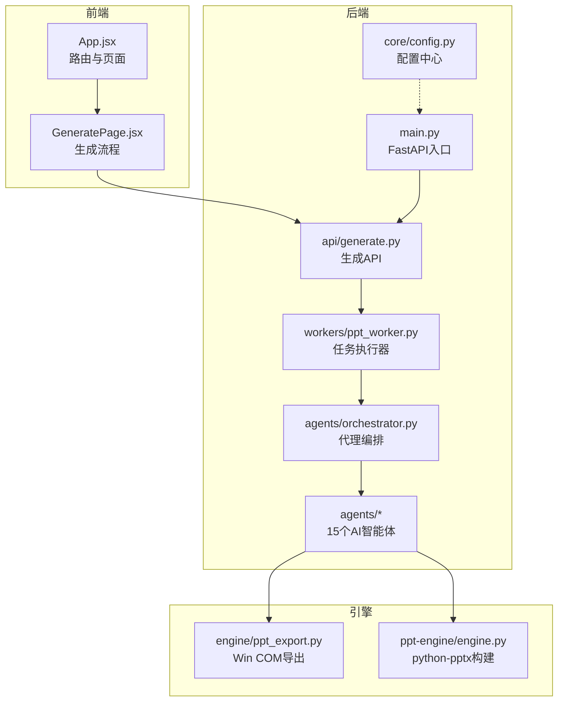
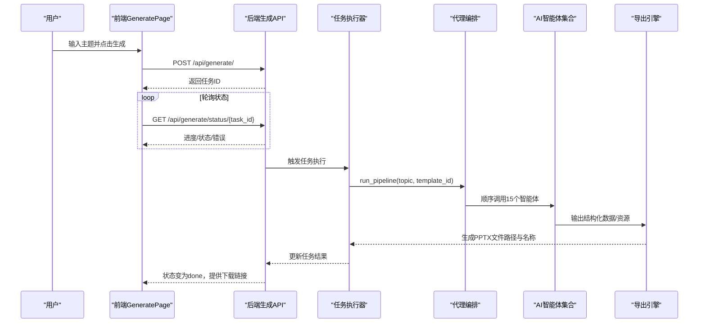
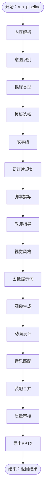
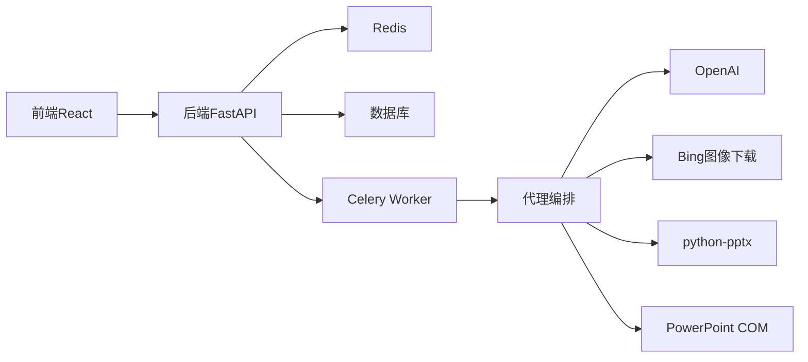

# 项目概述

<cite>
**本文引用的文件**
- [backend/main.py](file://backend/main.py)
- [backend/requirements.txt](file://backend/requirements.txt)
- [backend/core/config.py](file://backend/core/config.py)
- [backend/api/generate.py](file://backend/api/generate.py)
- [backend/workers/ppt_worker.py](file://backend/workers/ppt_worker.py)
- [backend/agents/orchestrator.py](file://backend/agents/orchestrator.py)
- [backend/agents/base.py](file://backend/agents/base.py)
- [backend/agents/content.py](file://backend/agents/content.py)
- [backend/agents/template.py](file://backend/agents/template.py)
- [engine/ppt_export.py](file://engine/ppt_export.py)
- [ppt-engine/engine.py](file://ppt-engine/engine.py)
- [frontend/src/App.jsx](file://frontend/src/App.jsx)
- [frontend/src/pages/GeneratePage.jsx](file://frontend/src/pages/GeneratePage.jsx)
- [frontend/package.json](file://frontend/package.json)
- [deployment/docker-compose.yml](file://deployment/docker-compose.yml)
</cite>

## 目录
1. [引言](#引言)
2. [项目结构](#项目结构)
3. [核心组件](#核心组件)
4. [架构总览](#架构总览)
5. [详细组件分析](#详细组件分析)
6. [依赖分析](#依赖分析)
7. [性能考虑](#性能考虑)
8. [故障排查指南](#故障排查指南)
9. [结论](#结论)
10. [附录](#附录)

## 引言
本项目旨在打造一个“AI驱动的演示文稿自动生成系统”，通过15个AI智能体的协同工作，从用户输入的主题出发，自动完成内容策划、故事编排、视觉设计、配乐配音到质量审核与导出的全流程。系统采用前后端分离架构：后端基于FastAPI提供REST服务与任务编排，前端使用React实现交互式生成流程；核心引擎以Python-pptx与Windows COM接口为基础，结合模板市场与媒体服务，最终生成高质量可播放的PPTX文件。

项目愿景是降低优质课件制作门槛，让教师、学生、职场人士能快速获得结构化、可视化、可讲解的教学或展示材料；应用场景覆盖课堂教学、学术汇报、产品发布、培训课程等多类场景；目标用户包括一线教师、教育机构、企业培训师与个人内容创作者。

## 项目结构
项目采用分层清晰的目录组织方式：
- backend：后端服务与AI代理编排，包含API路由、配置、数据库、任务队列、核心模型与代理模块
- frontend：React单页应用，提供用户认证、仪表盘、生成流程、模板市场、计费等功能页面
- engine：PPT导出引擎（Windows平台），负责图片下载、音频下载与PPTX生成
- ppt-engine：跨平台PPT构建引擎，基于python-pptx进行布局与样式渲染
- media-service：媒体生成服务（图像与音频），作为外部能力补充
- deployment：容器化部署脚本，支持后端、前端、Redis服务的统一编排

图表来源
- [backend/main.py:1-40](file://backend/main.py#L1-L40)
- [backend/api/generate.py:1-52](file://backend/api/generate.py#L1-L52)
- [backend/workers/ppt_worker.py:1-24](file://backend/workers/ppt_worker.py#L1-L24)
- [backend/agents/orchestrator.py:1-56](file://backend/agents/orchestrator.py#L1-L56)
- [engine/ppt_export.py:1-257](file://engine/ppt_export.py#L1-L257)
- [ppt-engine/engine.py:1-166](file://ppt-engine/engine.py#L1-L166)
- [frontend/src/App.jsx:1-34](file://frontend/src/App.jsx#L1-L34)
- [frontend/src/pages/GeneratePage.jsx:1-133](file://frontend/src/pages/GeneratePage.jsx#L1-L133)

章节来源
- [backend/main.py:1-40](file://backend/main.py#L1-L40)
- [frontend/src/App.jsx:1-34](file://frontend/src/App.jsx#L1-L34)
- [deployment/docker-compose.yml:1-46](file://deployment/docker-compose.yml#L1-L46)

## 核心组件
- 后端服务（FastAPI）
  - 应用生命周期管理、CORS中间件、路由注册与健康检查
  - 生成API负责校验参数、鉴权、配额限制与任务创建
- AI代理编排（15个智能体）
  - 内容解析、意图识别、课程类型判断、故事线规划、幻灯片规划、脚本撰写、教师指导、视觉风格、图像提示词、图像生成、动画设计、音乐匹配、模板选择、装配合并、质量审核、导出
- 任务执行器
  - 异步执行生成流水线，维护任务状态与结果
- 导出引擎
  - Windows平台：调用PowerPoint COM接口生成PPTX，并处理图片与音频资源
  - 跨平台：基于python-pptx构建布局、样式与转场效果
- 前端应用（React）
  - 提供登录态校验、生成表单、进度轮询、结果展示与下载

章节来源
- [backend/api/generate.py:1-52](file://backend/api/generate.py#L1-L52)
- [backend/workers/ppt_worker.py:1-24](file://backend/workers/ppt_worker.py#L1-L24)
- [backend/agents/orchestrator.py:1-56](file://backend/agents/orchestrator.py#L1-L56)
- [engine/ppt_export.py:1-257](file://engine/ppt_export.py#L1-L257)
- [ppt-engine/engine.py:1-166](file://ppt-engine/engine.py#L1-L166)
- [frontend/src/pages/GeneratePage.jsx:1-133](file://frontend/src/pages/GeneratePage.jsx#L1-L133)

## 架构总览
系统采用“前端-后端-引擎”三层架构，配合任务队列与模板市场，形成完整的AI生成闭环。用户在前端发起生成请求，后端API创建异步任务并返回任务ID；任务执行器拉取任务并按序调用15个AI智能体完成内容生产；最终由导出引擎生成PPTX文件并提供下载。

图表来源
- [frontend/src/pages/GeneratePage.jsx:19-68](file://frontend/src/pages/GeneratePage.jsx#L19-L68)
- [backend/api/generate.py:20-51](file://backend/api/generate.py#L20-L51)
- [backend/workers/ppt_worker.py:5-24](file://backend/workers/ppt_worker.py#L5-L24)
- [backend/agents/orchestrator.py:19-55](file://backend/agents/orchestrator.py#L19-L55)
- [engine/ppt_export.py:245-256](file://engine/ppt_export.py#L245-L256)

## 详细组件分析

### 后端服务与API
- FastAPI入口负责应用生命周期初始化、CORS配置与路由挂载
- 生成API提供参数校验、用户鉴权、配额检查与任务创建
- 任务状态查询用于前端轮询展示生成进度与结果

章节来源
- [backend/main.py:10-39](file://backend/main.py#L10-L39)
- [backend/api/generate.py:14-51](file://backend/api/generate.py#L14-L51)

### AI代理编排（15个智能体）
- 设计理念
  - 每个智能体专注单一职责，通过顺序流水线串联，确保内容一致性与质量可控
  - 使用统一的BaseAgent封装系统提示词、模型选择与JSON输出规范
- 关键智能体职责
  - 内容解析：提取主题、类型、受众、关键点、页数预估与情感基调
  - 意图识别：明确用途（教学/汇报/发布/总结）
  - 课程类型：区分学科与学段
  - 故事线：构建章节与过渡
  - 幻灯片规划：确定布局与内容分配
  - 脚本撰写：生成逐页讲解文本
  - 教师指导：配套教案与课堂活动建议
  - 视觉风格：色彩与字体方案
  - 图像提示词：为每页生成关键词
  - 图像生成：根据提示词产出素材
  - 动画设计：入场/出场/转场效果
  - 音乐匹配：背景音乐选择
  - 模板选择：依据主题关键字匹配模板
  - 装配合并：整合结构、脚本、资源与模板
  - 质量审核：对成品进行校验
  - 导出：生成PPTX并返回文件名与路径

图表来源
- [backend/agents/orchestrator.py:19-55](file://backend/agents/orchestrator.py#L19-L55)
- [backend/agents/base.py:5-24](file://backend/agents/base.py#L5-L24)
- [backend/agents/content.py:4-20](file://backend/agents/content.py#L4-L20)
- [backend/agents/template.py:7-32](file://backend/agents/template.py#L7-L32)

章节来源
- [backend/agents/orchestrator.py:1-56](file://backend/agents/orchestrator.py#L1-L56)
- [backend/agents/base.py:1-24](file://backend/agents/base.py#L1-L24)
- [backend/agents/content.py:1-21](file://backend/agents/content.py#L1-L21)
- [backend/agents/template.py:1-33](file://backend/agents/template.py#L1-L33)

### 导出引擎
- Windows平台导出
  - 使用win32com调用PowerPoint COM对象，动态创建演示文稿
  - 自动下载图片与音频资源，设置动画与转场效果
  - 将临时资源清理并保存为PPTX文件
- 跨平台构建
  - 基于python-pptx进行布局、样式与转场的程序化构建
  - 支持多种布局构建器与颜色体系

章节来源
- [engine/ppt_export.py:92-237](file://engine/ppt_export.py#L92-L237)
- [engine/ppt_export.py:245-256](file://engine/ppt_export.py#L245-L256)
- [ppt-engine/engine.py:124-147](file://ppt-engine/engine.py#L124-L147)

### 前端组件
- 路由与页面
  - App集中定义页面路由，涵盖首页、认证、仪表盘、生成、市场、分析、课堂、模板与计费
- 生成页面
  - 表单校验与登录态检查
  - 异步提交生成请求并轮询任务状态
  - 展示生成进度、结果与下载链接

章节来源
- [frontend/src/App.jsx:14-33](file://frontend/src/App.jsx#L14-L33)
- [frontend/src/pages/GeneratePage.jsx:6-132](file://frontend/src/pages/GeneratePage.jsx#L6-L132)

## 依赖分析
- 技术栈选择与优势
  - FastAPI：高性能异步框架，自动生成OpenAPI文档，适合构建现代化API
  - React：组件化UI开发，路由与状态管理成熟，便于快速迭代
  - Python-pptx：成熟的PPTX操作库，适合跨平台构建与样式控制
  - win32com：Windows平台自动化强，适合与PowerPoint深度集成
  - Redis/Celery：任务队列与状态存储，便于扩展与解耦
  - SQLAlchemy/Alembic：ORM与迁移工具，保障数据库演进
- 外部依赖
  - OpenAI：用于智能体对话与JSON输出
  - Bing Image Downloader/Pillow：图像下载与处理
  - Stripe：订阅与计费集成

图表来源
- [backend/requirements.txt:1-22](file://backend/requirements.txt#L1-L22)
- [frontend/package.json:11-24](file://frontend/package.json#L11-L24)

章节来源
- [backend/requirements.txt:1-22](file://backend/requirements.txt#L1-L22)
- [frontend/package.json:1-26](file://frontend/package.json#L1-L26)

## 性能考虑
- 异步化与并发
  - FastAPI与异步数据库连接提升I/O吞吐
  - 任务执行器独立运行，避免阻塞API响应
- 资源管理
  - 导出引擎在Windows平台使用COM对象，需注意进程生命周期与资源释放
  - 跨平台构建减少系统依赖，提高可移植性
- 缓存与限流
  - 配额限制与任务状态缓存，防止滥用与资源耗尽
- 模板与媒体
  - 模板选择基于关键字映射，减少不必要的计算
  - 图像与音频下载采用本地临时目录，完成后清理

## 故障排查指南
- 常见问题定位
  - 生成API返回429：当日配额已用完，需升级套餐
  - 任务状态查询返回404：任务ID无效或未创建
  - 生成失败：查看任务错误字段，检查日志与网络代理
- 前端交互
  - 登录态缺失时跳转至认证页，确认本地存储token
  - 轮询间隔建议保持在1~2秒，避免频繁请求
- 后端配置
  - 数据库URL、Redis地址、API密钥需正确配置
  - 输出目录与上传目录权限需可写

章节来源
- [backend/api/generate.py:26-35](file://backend/api/generate.py#L26-L35)
- [backend/api/generate.py:40-51](file://backend/api/generate.py#L40-L51)
- [frontend/src/pages/GeneratePage.jsx:23-26](file://frontend/src/pages/GeneratePage.jsx#L23-L26)
- [backend/core/config.py:11-27](file://backend/core/config.py#L11-L27)

## 结论
本项目通过“15个AI智能体”的流水线式协作，实现了从主题到成品的全链路自动化；后端以FastAPI为核心，前端以React提供流畅体验，导出引擎兼顾Windows平台与跨平台兼容。该架构既满足初学者的概念理解，也为有经验的开发者提供了清晰的扩展点与优化空间。未来可在模板市场、多语言支持、云端渲染与分布式任务调度等方面持续演进。

## 附录
- 容器化部署
  - docker-compose一键启动后端、前端与Redis服务，映射输出与数据卷
- 开发环境
  - 前端使用Vite，后端使用Uvicorn，建议在本地启用调试模式

章节来源
- [deployment/docker-compose.yml:1-46](file://deployment/docker-compose.yml#L1-L46)